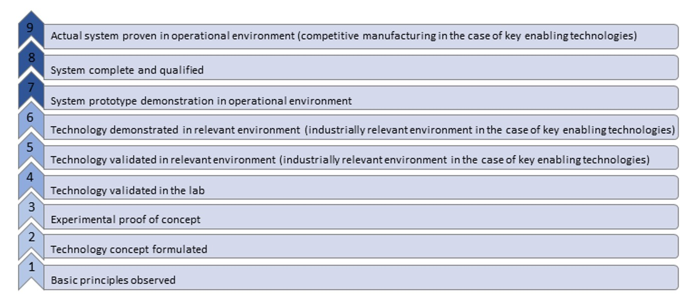
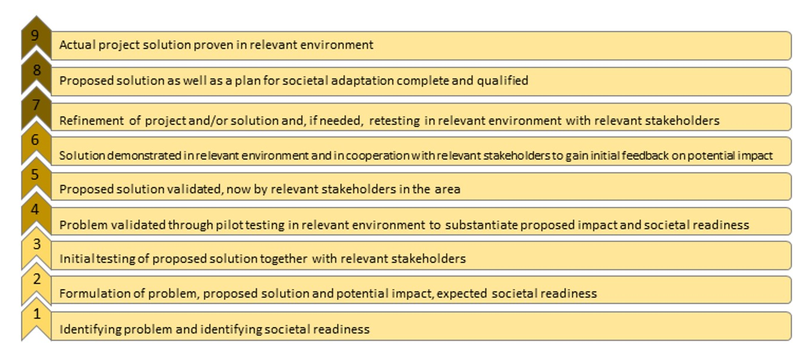

# Introduction {#intro}

This work gathers and defines essential concepts related to automation and digitalisation of transport system together with the description of their impact, both negative and positive on **individual**, **systemic** and **economy level**. This knowledge pool is driven by the fact that automation and digitalisation are progressing quickly, although not uniformly across all areas within transport context. Therefore, to understand spectrum of possibilities that they bring, it is necessary to explain key concepts, demonstrate their level of maturity and current market penetration, and finally assess their impact on different levels. Given this approach, the page of each topic contains the following elements:**definition** of the phenomenon, 
**key stakeholders** who are the main parties responsible for and affected by the given technological development. Then, we include two subsections on **current state of art in research and practice**. The former one summarizes the most recent research in a given topic while the latter explains the current stage of implementation of given technology in the real world. Further, section named **relevant initatives in Austria** covers the leading initiatives within given topic and potential for Austrian actors. Moreover, we provide the summary table of the impacts of the concept on selected **sustainable development goals** (SDGs). Beyond, to provide an objective measure of technology maturity within each topic we include so-called **technology readiness scale** (Willismson & Beasley, 2011) as described below:<br/>

```{r, echo=FALSE, , out.width="90%", fig.cap="Technology readiness scale"}

```

Furthermore, we evaluate the readiness of a given technology to be acceptable in the society and how well it contributes to the public good using **societal readiness scale** (McCulloch, 2019):

```{r, echo=FALSE, , out.width="90%", , fig.cap="Societal readiness scale"}

```

Finally, we provide a list of **outstanding questions** and **links to additional sources** on the topic.

**References** <br/>

- Williamson, R., & Beasley, J. (2011). *Automotive technology and manufacturing readiness levels: a guide to recognised stages of development within the automotive industry*. URN11/672.
- McCulloch, S. (2019). Social Acceptance And Societal Readiness Levels. [online] *DecarboN8*. Available at: <https://decarbon8.org.uk/social-acceptance-and-societal-readiness-levels/#:~:text=Societal%20readiness%20refers%20to%20the,contributes%20to%20the%20public%20good.> [Accessed 21 January 2021].