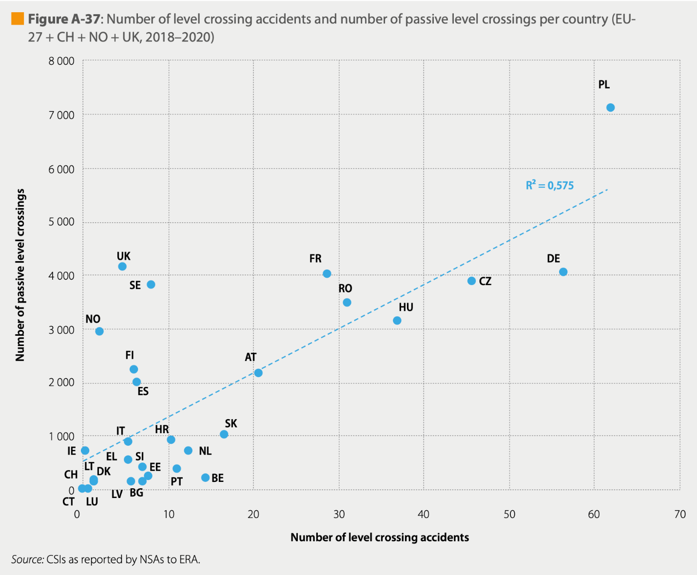

# Physical road infrastructure {#infrastructure}

## Dedicated lanes for connected and automated vehicles (CAV) {#dedicated_lanes}

**Updated: 24th March 2023**

### Synonyms {-}
*AV-dedicated lanes*, *dedicated corridors*

### Definition {-}
Dedicated lane for connected and autonomous vehicles features additional infrastructure or sensors to increase the reliability of [Advanced Driver Assistant Systems (ADAS)](#adas). Only automated driving vehicles are allowed to drive on these lanes. The typical applications include cooperative and adaptive cruise control based on sensors with the infrastructure, lane keeping, fuel use optimization and road pricing possibilities (Broek et al., 2011). The introduction of dedicated lanes for CAV is expected to have direct consequences on the traffic flow on the highways and a nearby road network. In particular, a study conducted in Singapore showed that dedicated lanes on the highways can reduce travel time of CAVs by approximately 25% (if the saturation on the lane is not reached) at the cost of a delay for conventional cars of approximately 7%, due to the reduced capacity (Ivanchev et al., 2017). They were also demonstrated to have a positive effect on fuel consumption. <br/><br/>
Moreover, the throughput, defined as a number of vehicles passing through the road in a given time interval, increased as a result of introduction of dedicated lanes for AVs (Kumar et al., 2020). This effect, however, was associated with a decrease in throughput of smaller roads due to the preference of AVs for highways because of time savings, which in turn can result in time loss for conventional cars. What is more, the benefits from increased capacity of AV-only lanes can be further amplified through setting a higher speed limits for these lanes (Ye & Yamamoto, 2018). With respect to the demand for different road types the study found that the introduction of dedicated CAV lanes will increase the demand of conventional cars for major road (but smaller than highways) and minor roads as a substitution for more congested highways due to the dedicated AV lanes. <br/><br/>
In contrast, study by Chen et al. (2016) showed that the implementation of CAV dedicated lanes has a potential of maximizing traffic capacity on these lanes in a mix-traffic context while having effectively no impact on conventional traffic capacity. Further, in order to use efficiently CAV dedicated lanes, which may be underutilized at the early stage, it is proposed to allow conventional cars to enter the AVs-only lanes after toll payment. This solution stems from currently operational across the world High Occupancy Vehicle (HOV) lanes. This joint approach is claimed to improve the throughput of individual road as well as enhance system-wide flow distribution within the network (Liu & Song, 2019).

### Key stakeholders {-}

- **Affected**: Conventional Cars’ Drivers, Car Manufacturers, Insurers
- **Responsible**: Road Infrastructure Agencies, Local and National Governments

### Current state of art in research {-}
Current research focuses on gathering the evidence of the impact of the introduction of dedicated lanes on traffic flow, driver behaviour adoption, safety and efficiency. Furthermore, it analyses the factors which influence them, by testing different design and operation configurations, road types and utilization policies (Rad et al., 2020). Both, field operational testing and driving simulator studies have been conducted to investigate the influence of different designs of dedicated lanes on drivers in conventional cars and those featuring some degree of automation (Guin et al., 2008, Zhong, 2018). In particular, a number of studies compared distinct access types of dedicated lanes (Zhong, 2018, Yang et al., 2019). They showed that dedicated lanes with limited access performed better in terms of travel time and throughput compared to dedicated lanes with continuous access. Moreover, the probability of vehicles platooning was significantly higher on dedicated lanes with limited access. On the other hand, it was showed that collision rates near the entry or exit of these limited access lanes are higher (Rad et al. 2020). More traffic efficiency while dedicating a lane to CAVs has also been proven to affect the driving behaviour of human drivers due to imitating behaviour of CAV platoons on a DL (Rad et al., 2021).<br/>

Furthermore, the latest article by Fayyaz et al. (2022) considers the impact of AV-dedicated lanes on urban space, mobility and development of sustainable cities. It discusses that the introduction of AVs could decrease overall parking demand in cities, leading to 10% - 27% release of urban space. With respect to traffic space, both the number and width of lanes might be reduced due to reduction in circulating vehicles (more shared AVs), platooning and the implementation of reversible lanes. On the other hand, some authors indicate that AVs have potential to decrease walking and cycling space by 26% and 20%, respectively. Similarly, study by Lee et al. (2022) is concerned with street design strategies to implement AVs in large cities. The developed design allows for separation of AVs and regular vehicles through a connected zones allocated for AV usage. Additionally, dedicated lanes for connected and automated buses (CABs) in urban transportation networks show to substantially increase ridership and total social benefit by allowing limited CAV access to improve overall system performance (Zhang et al., 2022). <br/>

Further, study by Ma et al. (2022) proposes a shared-phase-dedicated-lane (SPDL)-based traffic control model at an isolated intersection with CAV dedicated lanes in the mixed traffic environment. The model aims at optimising the behaviour of vehicles and has been demonstrated to provide advantage in terms of average vehicle delay and intersection capacity. 

### Current state of art in practice {-}
Currently state of Michigan together with several private partners including Ford and Alphabet Inc. are planning to dedicate 65 km of a highway between Detroit and Ann Arbor for the sole movement of autonomous vehicles including buses and shuttles (Krisher & Eggert, 2020).Recent setbacks in the industry show that any transition to autonomous vehicles will be slower and less dramatic than previously expected. Michigan transportation planners should refocus efforts on proven solutions to today’s problems (Dennis, 2022). Similar initiatives are taking place in other countries, for instance, China builds nearly 82 km of 8-lane highway linking Beijing and the Xiongan New Area, of which the last section will be completed in late 2023. The new section utilises advanced technology and full coverage of 5G network providing smart monitoring to reduce accidents, road safety warning lights that turn on and off, making it possible to dedicate lanes to CAVs in the future  (Syncedreview.com, 2020; Wangshu, 2023). In Europe, there is on-going SHOW (SHared automation Operating models for Worldwide adoption, 2020-2023) project which aims to deploy 74 automated vehicles (including all types: buses, taxis, MaaS, cargo vehicles) in 20 European cities. To assess how they can best be integrated vehicles will be used in different settings in mixed traffic and dedicated lanes. However, for safety reasons the driver will be on-board (CORDIS, 2020).

### Relevant initiatives in Austria {-}

- [tugraz.at](https://www.tugraz.at/fileadmin/user_upload/Institute/IHF/Projekte/ENABLE-S3_SummaryofResults_May2019.pdf "tugraz.at") 
- [ait.ac.at](https://www.ait.ac.at/themen/verkehrssicherheit-und-unfallforschung/projects/via-autonom/ "ait.ac.at") 

### Impacts with respect to Sustainable Development Goals (SDGs) {-}

```{r table1, echo=FALSE, results='asis'}
cat('| Impact level| Indicator|Impact direction| Goal description and number|Source|
|:------------:|:-----------:|:------------:|:------------:|:------------:|
|Individual|Fuel consumption reduced|**+**|Environmental sustainability (*7,12,13,15*)|Ivanchev et al., 2017|
|Individual|Travel time reduced|**+**|Sustainable economic development (*8,11*)|Zhong, 2018; Yang et al., 2019|
|Systemic|Collision rate reduced|**+**|Health & Wellbeing (*3*)|Zhang et al., 2020|
|Systemic|Emissions rate reduced|**+**|Environmental sustainability (*7,12,13,15*)|Al Alam at al., 2010|
|Systemic|Stimulating eco-mobility|**+**|Sustainable economic development (*8,11*)|Zhang, 2022|
|Systemic|Congestion|**~**|Sustainable economic development (*8,11*)|Ivanchev et al., 2017; Kumar et al., 2020|
|Systemic|Novel designs tested|**+**|Innovation & Infrastructure (*9*)|Guin et al., 2008; Zhong, 2018; Krisher & Eggert, 2020|
|Systemic|SHOW EU initiative|**+**|Partnership & collaborations (*17*)|CORDIS, 2020|')
```

### Technology and societal readiness level {-}

```{r table2, echo=FALSE, results='asis'}
cat('|TRL| SRL|
|:----:|:----:|
|5-6|1-3|')
```

### Open questions {-}

1. What are the potential benefits of dedicated AV lanes when coupled with smart platooning strategies?
2. How and to what degree will joint concepts by automotive sector, fleet and road
operators will improve traffic management establishing dynamic traffic regulations even across
borders?
3. What are the roles and responsibilities of the different stakeholders of physical infrastructure for connected and automated vehicles? 
4. Should the vehicle cope with any road infrastructure, and if not, what demands can be set to adapt the existing infrastructure? 
5. How to ensure continuity between those different environments?
6. Which tools (e.g. micro- and macroscopic transport modelling, impact assessment) can enable
cities to assess the impact of automated vehicles on their physical road infrastructure and
balance the needs of automated vehicles against the needs of existing modes (conventional
vehicles, public transport, pedestrians and cyclists). (ERTRAC, 2019)
7. Does the implementation of AVs support or hinder the concept of driverless cities?

### Further links {-}

-	[Knowledge base](https://knowledge-base.connectedautomateddriving.eu/wp-content/uploads/2019/12/SMART_2010-0064-study-report-final_V1-2.pdf "knowledge base") 
-	[SHOW project](https://show-project.eu/ "show project") 
- [Automotive world](https://www.automotiveworld.com/articles/autonomous-only-should-avs-have-dedicated-lanes/)

### References {-}

- Al Alam, A., Gattami, A., & Johansson, K. H. (2010, September). An experimental study on the fuel reduction potential of heavy duty vehicle platooning. In 13th International IEEE Conference on Intelligent Transportation Systems (pp. 306-311). IEEE.
- Broek, S. M., van Nunen, E., & Zwijnenberg, H. (2011). Definition of necessary vehicle and infrastructure systems for automated driving. 
- Chen, Z., He, F., Zhang, L., & Yin, Y. (2016). Optimal deployment of autonomous vehicle lanes with endogenous market penetration. Transportation Research Part C: Emerging Technologies, 72, 143-156.
- CORDIS | European Commission. (20 Apr 2020). Available at: https://cordis.europa.eu/project/id/875530 [Accessed: 20. March 2023].
- Dennis, E. P. (2022). A Reality Check on Michigan’s Autonomous Vehicle Future. Citizens Research Council of Michigan. Available at: https://crcmich.org/a-reality-check-on-michigans-autonomous-vehicle-future [Accessed: 20. March 2023]
- ERTRAC Working Group. (2019). Connected Automated Driving Roadmap. version, 8, 2019-08.
- Fayyaz, M., González-González, E., & Nogués, S. (2022). Autonomous Mobility: A Potential Opportunity to Reclaim Public Spaces for People. Sustainability, 14(3), 1568.
- Guin, A., Hunter, M., & Guensler, R. (2008). Analysis of reduction in effective capacities of high-occupancy vehicle lanes related to traffic behavior. Transportation Research Record, 2065(1), 47-53.
- Ivanchev, J., Knoll, A., Zehe, D., Nair, S., & Eckhoff, D. (2017). Potentials and implications of dedicated highway lanes for autonomous vehicles. arXiv preprint arXiv:1709.07658.
- Krisher, T., & Eggert, D. (14 Aug 2020). Michigan plans dedicated road lanes for autonomous vehicles. Available at:  https://abcnews.go.com/Technology/wireStory/michigan-plans-dedicated-road-lanes-autonomous-vehicles-72352758 [Accessed: 12 November 2020].
- Kumar, A., Guhathakurta, S., & Venkatachalam, S. (2020). When and where should there be dedicated lanes under mixed traffic of automated and human-driven vehicles for system-level benefits?. Research in Transportation Business & Management, 100527.
- Lee, S., Jang, K. M., Kang, N., Kim, J., Oh, M., & Kim, Y. (2022). Redesigning urban elements and structures considering autonomous vehicles: Preparing design strategies for wide implementation in cities. Cities, 123, 103595.
- Liu, Z., & Song, Z. (2019). Strategic planning of dedicated autonomous vehicle lanes and autonomous vehicle/toll lanes in transportation networks. Transportation Research Part C: Emerging Technologies, 106, 381-403.
- Ma, W., Li, J., & Yu, C. (2022). Shared-phase-dedicated-lane based intersection control with mixed traffic of human-driven vehicles and connected and automated vehicles. Transportation Research Part C: Emerging Technologies, 135, 103509.
- Rad, S. R., Farah, H., Taale, H., van Arem, B., & Hoogendoorn, S. P. (2020). Design and operation of dedicated lanes for connected and automated vehicles on motorways: A conceptual framework and research agenda. Transportation Research Part C: Emerging Technologies, 117, 102664.
- Rad, S. R., Farah, H., Taale, H., van Arem, B., Hoogendoorn, S. P. (2021). The impact of a dedicated lane for connected and automated vehicles on the behaviour of driver of manual vehicles. Transport Research Part F: Traffic Psychology and Behaviour, 82, 141-153. https://doi.org/10.1016/j.trf.2021.08.010
- Syncedreview.com (31 Aug 2020). Beijing Builds 100km Highway Lanes for Self-Driving Cars with Unmanned Machineries. Available at:  https://syncedreview.com/2020/08/31/beijing-builds-100km-highway-lanes-for-self-driving-cars-with-unmanned-machineries/ [Accessed: 12 November 2020].
Wangshu, L. (2023). Expressway opens from Beijing to Xiong’an. China Daily. Available at: https://www.chinadaily.com.cn/a/202301/05/WS63b62910a31057c47eba7c9d.html [Accessed: 20. March 2023]
- Yang, D., Farah, H., Schoenmakers, M. J., & Alkim, T. (2019). Human drivers behavioural adaptation when driving next to a platoon of automated vehicles on a dedicated lane and implications on traffic flow: a driving simulator and microscopic simulation study in the Netherlands. In 98th Annual Meeting of the Transportation Research Board (pp. 19-00582).
- Ye, L., & Yamamoto, T. (2018). Impact of dedicated lanes for connected and autonomous vehicle on traffic flow throughput. Physica A: Statistical Mechanics and its Applications, 512, 588-597.
- Zhang, J., Wu, K., Cheng, M., Yang, M., Cheng, Y., & Li, S. (2020). Safety Evaluation for Connected and Autonomous Vehicles’ Exclusive Lanes considering Penetrate Ratios and Impact of Trucks Using Surrogate Safety Measures. Journal of advanced transportation, 2020. 
- Zhang, L., Qian, G., Song, Z., Wang, D. (2022). Deploying dedicated lanes for connected and autonomous buses in urban transportation networks. Transportmetrica A: Transport Science, DOI: 10.1080/23249935.2021.2005181
- Zhong, Z. (2018). Assessing the effectiveness of managed lane strategies for the rapid deployment of cooperative adaptive cruise control technology.

## Operational design domains {#ODD}

**Updated: 24th March 2023**

### Synonyms {-}
*ODD*

### Definition {-}
Operational design domain is a system to assess the conditions in which automated driving system (ADS) is designed to work safely based on roadway features or amount of traffic (Czarnecki, 2018). It is a key to the safety of automated vehicles and ODD is in place to define the limitations for driving at different automation level of a vehicle (Eliot, 2019). For example, level 5 automation has an unconstrained ODD which means that it is equivalent of human driver controlling the vehicle. In terms of levels 1-4 the ODD puts constraints with respect to (Czarnecki, 2018):

-	Road environment: including but not limited to urban and rural roads, motorways, roundabouts, tunnels, traffic volumes, construction areas, or different weather or visibility conditions
-	State of the vehicle: for instance, load limits or minimum tire inflation level 
-	Behaviour of the vehicle equipped with ADS: for example, speed limits or constraints on possible manoeuvres 

In general, ODD assesses if the conditions are appropriate for a vehicle to drive autonomously on the chosen route and given automation level. If at some stage ODD finds that conditions are not appropriate for autonomous driving, it will find a spot to stop the vehicle and the driver will be required to take over and start driving by himself. <br/>

The ODD works based on the operational world model (OWM) that consist of *operational road environment model (OREM)*, *the subject vehicle(s) model (SVM)* and *subject ADS*. OREM represents all the relevant assumptions about the road environment in which an ADS will operate, while ignoring the irrelevant ones. SVM represents a vehicle operated by the developed ADS. The OMW may include single subject vehicle or multiple subject vehicles equipped with the same or different ADS. Inclusion of distinct ADSs may be necessary to represent the interaction between different types of vehicles such as buses and passenger vehicles or the same types of vehicles under different ADS development level. Lee et al. (2020) argue, that ODD is still defined loosely that makes it unclear how exactly to formulate the ODD and leaves it up to the ADS developer to determine. <br/>

Further, Koopman and Fratrik (2019) provide list of factors which are found to be relevant for the validation and operation of automated vehicles and consequently for the development of ODD. These include:

-	Operational terrain
-	Weather conditions
-	Operational infrastructure
-	Rules of engagement and interaction with environment and other road other users
-	Considerations for deployment to multiple regions
-	Data availability and recency (e.g. Regarding temporary changes in traffic rules)
-	Expected elements of operational space state (e.g. What should be included in the scope of ODD)

Moreover, Object and Event Detection and Response (OEDR) refers to the operation within the scope of a defined ODD with respect to objects and events. *Object factors* include:

-	Ability to detect and classify relevant objects in the environment
-	Processing and thresholding of sensors data
-	Characterising possible operational parameters of other road users
-	Permanent (Trees, curbs etc.) and temporary (e.g. People, floods) obstacles
-	At risk population
-	All types of other road users including human-driven and autonomous vehicles as well as special purpose vehicles and aircrafts

Moreover, the *Events factors* refer to:

-	Determination of behaviour of other objects
-	‘Normal’ movement of objects 
-	‘Abnormal’ movement of objects
-	Failure to move of other objects
-	Drivers’ interactions before, during and after the autonomous system engagement
-	Human and non-human interactions


### Key stakeholders {-}

- **Affected**: Conventional Cars’ Drivers, Car Manufacturers, Users of AVs
- **Responsible**: Council authorities, Car manufacturers, Insurance providers


### Current state of art in research {-}
Current research focuses on the validation, extension of capabilities and an improvement in accuracy of current ODD systems. For example, Lee et al. (2020) proposes an approach to identify an ODD for the ADS using statistical data and risk tolerance. The identified ODD is based on the geographical mapping of risk level associated with ADS operation that is below the risk threshold predefined for a given environmental conditions. Therefore, this method allows for addressing safety concerns through the provision of geographical and environmental constrains to ADS operation. Further, Farah et al. (2020) looked at understanding of ODD (with respect to lane keeping) by human drivers, where they are expected to control the vehicle in situation outside of ODD specified by the manufacturer. A difference between driver’s understanding of the AV’s capabilities and manufacturers manual can lead to severe safety issues. They conducted a field test using Tesla Model S based on the situation within and beyond ODD specified by the manufacturer. Farah et al. (2020) found a mismatch between manufacturer’s specified ODD and driver’s perception of what ODD includes. In particular, often situation out of scope of the ODD were classified by the human driver as that within ODD domain. This study demonstrated the need for clearer description and specification of ODD to diminish the discrepancy between driver’s awareness and actual vehicle abilities.<br/>

Current literature examines specific operational design domains (ODDs) in different settings that range from Waymo simulated driving behavior in fatal crashes (Scanlon et al., 2021) to improving supply chain collaboration through operational excellence (Cui et al., 2022) or a general system approach to create test scenarios for automated driving systems (Khastgir et al., 2021). Khastgir et al. (2021) claims, that automated vehicles need to be driven for 11 billion miles to prove their safety and that the number of miles is not, by itself, a meaningful metric for judging the safety.

### Current state of art in practice {-}
California is one of the pioneering states that makes attempts at testing of ODD. One of the examples is current Google’s project of [Waymo’s](https://www.losaltoshills.ca.gov/DocumentCenter/View/2315/Waymo_Driverless_Autonomous_Vehicle_Tester_Program) driverless testing car.  It uses a 4th stage of automated driving system and shows the usage of ODD in real life. Waymo’s ODD works on the certain geographic area (part of California) 24 hours a day. Waymo’s ODD allows reach up to 105 km/h, however it does not operate when is snowy or rainy. Otherwise, in the USA there is not any nationwide policy regarding use of ODD because these are highly location-specific. In 2022, Waymo started to operate its fully automated cars as a Taxi-Service in San Francisco (Der Standard, 2022), while at the beginning of 2023, the ministry of transportation in the city of San Francisco prompted the Californian regulatory authority to limit expansion plans of the “Robotaxis” of Waymo and Cruise (Petereit, 2023). Other world regions are working their own regulation with respect to ODDs such as MLIT-Guidline in Japan, Transport Canada in Canada, NHTSA FAVP 3.0 in the USA or EC Guidelines in Europe. Furthermore, the UN Informal Working Group on Functional Requirements for AVs (FRAV) put forward a [report](https://unece.org/fileadmin/DAM/trans/doc/2020/wp29grva/GRVA-05-40e.pdf) to regulate the functional performance requirements for Automated Driving Systems and vehicles equipped with such systems.  

### Relevant initiatives in Austria {-}

-	[AustriaTech](https://austriatech.at/de/das-konzept-der-isad-klassen/)

### Impacts with respect to Sustainable Development Goals (SDGs) {-}

```{r, echo=FALSE, results='asis'}
cat('| Impact level| Indicator|Impact direction| Goal description and number|Source|
|:------------:|:-----------:|:------------:|:------------:|:------------:|
|Systemic|Aim at increasing safety in autonomous cars|**+**|Health & Wellbeing (*3*)|Koopman and Fratrik, 2019|
|Systemic|Developing fully autonomous cars|**+**|Innovation & Infrastructure (*9*)|Waymo, 2019|')
```

### Technology and societal readiness level {-}

```{r, echo=FALSE, results='asis'}
cat('|TRL| SRL|
|:----:|:----:|
|5-6|4-6|')
```

### Open questions {-}

1. How does the development of ODD influence the autonomous cars market toward to the average driver?   

### References {-}
-	Berman, B., 2019. Autonomous vehicle operation design domain is key to safety.  Sae.org. Available at: <https://www.sae.org/news/2019/11/odds-for-av-testing> [Accessed: 2 August 2021].
- Cui, L., Gao, M., Dai, J., Mou, J. (2022). Improving supply chain collaboration through operational excellence approaches: an IoT perspective. Industrial Management & Data Systems, 122, 2, 565-591. https://doi.org/10.1108/IMDS-01-2020-0016
-	Czarnecki, K. (2018). Operational Design Domain for Automated Driving Systems - Taxonomy of Basic Terms. 10.13140/RG.2.2.18037.88803.
- Der Standard. (2022). Waymo startet vollständig fahrerlosen Taxidienst in San Francisco. DerStandard. Available at: https://www.derstandard.at/story/2000134568227/waymo-startet-vollstaendig-fahrerlosen-taxidienst-in-san-francisco [Accessed: 21. March 2023]
-	Eliot, L., 2019. Key To Driverless Cars, Operational Design Domains (ODD), Here’s What They Are, Woes Too.  Medium. Available at: <https://lance-eliot.medium.com/key-to-driverless-cars-operational-design-domains-odd-heres-what-they-are-woes-too-a0f1059e0bdb> [Accessed: 2 August 2021].
-	Farah, H., Bhusari, S., Van Gent, P., Babu, F. A. M., Morsink, P., Happee, R., & van Arem, B. (2020). An empirical analysis to assess the operational design domain of lane keeping system equipped vehicles combining objective and subjective risk measures. IEEE Transactions on Intelligent Transportation Systems, 22(5), 2589-2598.
- Khastgir, S., Brewerton, S., Thomas, J., Jennings, P. (2021). Systems Approach to Creating Test Scenarios for Automated Driving Systems. Reliability Engineering & System Safety, 215, 107610. https://doi.org/10.1016/j.ress.2021.107610
-	Koopman, P. and Fratrik, F., (2019). How Many Operational Design Domains, Objects, and Events?.  Ceur-ws.org. Available at: <http://ceur-ws.org/Vol-2301/paper_6.pdf> [Accessed: 2 August 2021].
-	Law Insider. (2021). Operational design domain Definition | Law Insider.  Available at: <https://www.lawinsider.com/dictionary/operational-design-domain> [Accessed: 2 August 2021].
-	Lee, C., Nayeer, N., Garcia, D., Agrawal, A. and Liu, B., 2020. Identifying the Operational Design Domain for an Automated Driving System through Assessed Risk. 2020 IEEE Intelligent Vehicles Symposium (IV).
- Scanlon, J. M., Kusano, K. D., Daniel, T., Alderson, C., Ogle, A., Victor, T. (2021). Waymo simulated driving behavior in reconstructed fatal crashes within an autonomous vehicle operating domain. Accident Analysis & Prevention, 163, 106454. https://doi.org/10.1016/j.aap.2021.106454
-	Petereit, D. (2023). Problem emit autonomen Taxis: San Francisco will Waymo und Cruise bremsen. t3n – digital pioneers, News, Mobilität. Available at: https://t3n.de/news/robotaxis-san-francisco-waymo-cruise-bremsen-1530949/ [Accessed: 21. March 2023]
-	Waymo. 2019. Waymo.  Available at: <https://waymo.com/> [Accessed: 2 August 2021].

## Rail crossing information system {#rail_crossing_info_system}

**Updated: 19th April 2023**

### Synonyms {-}
*rail level crossings (RLX), raised level crossings (RC), Level Crossing Obstacle Detection (LOD), level crossing (LC)*

### Definition {-}
A persistent problem in surface transportation are the collisions at rail level crossings (RLX). RLX are grade-separated crossings where rail vehicles (and their infrastructure) cross the infrastructure of another mode of transport (usually roads). In most cases, the train has priority and other traffic is stopped until the train has passed. Technically, achieving this unbundling is a simple problem (Salmon et al., 2016). Nevertheless, a number of accidents still happen every year. <br/>

Collisions at level crossings are a safety risk worldwide (European Railway Agency, 2020). Accidents cause human, social and economic costs. In addition, near-collisions have a negative impact on the mental health and well-being of the people involved - car drivers, train drivers and bystanders (Read et al., 2021). The best way to minimise these types of accidents would be to eliminate the level crossings and/or replace them with tunnels or bridges. As these options are very expensive, the cheaper alternative of signage, flashing lights and barriers is used for most level crossings, in the expectation that drivers of road vehicles will obey the rules. However, data from Australia shows that the largest proportion of collisions are at barrier intersections, while the largest proportion of fatal accidents are at flashing light and stop sign intersections (ITSR, 2011). <br/>

Radalj et al. (2011) have demonstrated, through an extensive field study in seven rural LCs, that 90% of the road users disobeyed the speed limits on the signals and that 90% of the crashes at railway level crossings could be attributed to vehicle driver errors, fatigue, speed or risk taking due to low frequency of trains. In Austria, too, there is already data indicating that practically all accidents at level crossings are caused by road users who do not respect red lights, stop signs, barriers and basic traffic rules. Very often, people who live near a railway crossing or cross it regularly are involved in these accidents because they become more careless and overconfident over time (bmvit, 2011).<br/>

According to European Union (2014), level crossings are divided into active and passive:

-	**Passive level crossing** is a level crossing without any form of warning system or protection that is activated when it is unsafe for the user to cross
-	**Active level crossing** is a level crossing where the users of the level crossing are protected or warned against the approaching train. Protection is provided by half or full barriers. The warning is given by the use of visible devices (e.g. lights) and acoustic devices (e.g. bells, horns, sound signals).

Active level crossings are classified as:

-	**Manual**: a level crossing where the user-side protection or warning is activated manually by a railway employee.
-	**Automatic with user-side warning**: a level crossing where the user-side warning is activated by the approaching train.
-	**Automatic with user-side protection**: a level crossing where the user-side protection is activated by the approaching train. This includes a level crossing that has both user-side protection and a warning.
-	**Track-side protection**: a level crossing where a signal or other train protection system allows a train to proceed only if the level crossing is clear of obstructions.

Trackside protection enables obstacle detection at level crossings by one or more detection units, depending on the size of the level crossing. A track side control unit collects the information received from the detection units and generates alarms based on high thresholds (e.g. minimum dimensions of the obstacle). The control unit is able to integrate the level crossing obstacle detection (LOD) into the conventional level crossing protection system with complete barriers and drives and to communicate with the interlocking system via secured interfaces. The systems are characterised by high reliability and high accuracy, even in harsh weather conditions such as rain, snow and fog. Several trials are currently underway with European railways (mermecgroup, n.d.).<br/>

According to Darlington (2017) an ideal obstacle detection system must:

-	provide safety integrity that is no worse and ideally better than a manually operated level crossing
-	cause no or minimal delays to trains due to equipment failures or false detections
- be affordable in terms of life cycle costs
-	operate in all weather conditions and temperatures
-	be practical to use and maintain 

Beyond, separate technology systems must confirm that the level crossing is closed by barriers or gates, and only when the detection system has reconfirmed that the level crossing is clear, the train is allowed to pass. This could be achieved by clearing the protection signals or, on some rail networks, by a direct communication link to the train. Some systems may offer good safety benefits, but only at the cost of significant operational delays. The obstacle detection system must also fit into the existing railway infrastructure and not interfere with rolling stock or operations. <br/>

The following technologies are available for obstacle detection , however, all have advantages and disadvantages (Darlington, 2017):

**Video imaging technology**<br/>
The disadvantage of using video technology is that it is more difficult for the system to detect anything at night or in fog. The level crossing may therefore need the same or higher illuminance than a manual level crossing, although even this would be of little help in foggy conditions. Furthermore, the mass or material properties of an object may not be so easily distinguished. Therefore, a cardboard box or newspaper, for example, could be mistaken for a small child. <br/>

**Thermal imaging**<br/>
Thermal imaging cameras can overcome some of these limitations because they produce a sharp image based on subtle temperature differences and are not affected by environmental conditions such as total darkness, smoke or fog. They do not require any light and cannot be blinded by direct sunlight. However, objects without a heat source could be left at an intersection (for example, an unbraked trailer) and thus not be detected. Thermal imaging, in combination with other detection technologies, can provide a solution.<br/>

**Millimetre wavelength beam interruption**<br/>
Beam interruption is an obstacle detection technique based on microwaves. When an object enters the beam path, the signal to the transceiver is attenuated, indicating its presence. One of the world's first Safety Integrity Level (SIL) 4 systems was installed in Italy. Although the system was safe, it was very sensitive to temperature changes, rain and condensation on the transmitter and receiver sensors. Regular calibration and maintenance had to be carried out. Furthermore, the narrow beam width and limited field of view meant that even more sensors were needed for tall objects.<br/>

**LiDAR**<br/>
LiDAR detects the crossing area with pulses of near-infrared light that are reflected from the surface of an object on the level crossing. The reflected pulses can then be analysed to determine its position, direction and speed. Because light has shorter wavelengths than radio waves, LiDAR has the potential for greater accuracy than radar. Network Rail used LiDAR on its first generation of OD crossings as a complement to radar to improve low-level object detection. However, the improved sensitivity also means it is vulnerable to small objects, such as water vapour droplets that make up fog, although this can be mitigated by software algorithms. Furthermore, light is required for operation and the devices must be housed in a transparent enclosure resulting in increased susceptibility to water, dirt and dust on the glass.<br/>

**Induction loops**<br/>
An induction loop is used to detect metal objects, so is not suitable for pedestrian detection. Unfortunately, there are an increasing number of road vehicles made of composite materials and aluminium, which provide a lower induced current than steel, and problems have been reported in detecting trucks with high axles/ground clearance. Another difficulty is the installation and maintenance of induction loops in the surface of the crossing or road.<br/>

**Strain gauges** <br/>
A strain gauge or piezometer can be used to measure the deformation (strain) of a material (the deformation of the crossing surface when an object crosses the level crossing). A strain gauge should be able to be calibrated for both vehicles and pedestrians, but may not be able to detect small children. Piezometers and strain gauges have the potential to be more reliable than inductive loops, but the placement of the detectors in the crossing pavement makes them just as difficult to maintain.<br/>

**Ultrasonic sensors** <br/>
These emit ultrasonic sound pulses that cannot be detected by the human ear. When the pulse reaches an object, the sound is reflected off the surface. Multiple sensors would be required to avoid black spots, and on electrified lines the devices would be in close proximity to parts of the overhead lines. The devices would be more susceptible to vandalism and damage by the public as they are much more conspicuous at a level crossing than other forms of detection. However, it is reported that successful obstacle detection trials have been carried out in the USA using an array of ultrasonic sensors suspended above a level crossing.<br/>

**Radar** <br/>
This uses radio waves to detect objects. The distance, position and speed of an object can be determined. Reflectors can be installed at the boundaries of the level crossing to provide a reference echo signal and use this to monitor the condition of the area and the sensor itself. Radar-based systems are able to reliably detect objects through rain, fog, snow and hail. OD radar systems with SIL 4 integrity have been developed and systems with a wide beam width so that multiple sensors are not required for high and low obstacles. An advantage of radar over other detection methods is that some low-density material objects, such as an empty paper box, are ignored. As it is a radio-based system, a radar OD system normally requires a radio licence, but this means that the railway infrastructure manager has exclusive use of the frequency and is able to manage any interference. The sensor is capable of operating in all weather conditions and has a predicted Mean Time Between Failures MTBF of more than 10 years. <br/>

An OD system may use one or more of the different detection types, e.g. Network Rail's first-generation OD crossings use both radar and Laser Image Detection and Ranging (LiDAR).

### Key stakeholders {-}

- **Affected**: Drivers, Cyclists, Pedestrians, Train Passengers, Train Operators, Train Drivers
- **Responsible**: National Governments, City Governments, Transport Agencies, Railway companies, Rail Equipment and Infrastructure Producers and Manufacturers

### Current state of art in research {-}
A driving simulation study (Larue et al., 2015) showed that driver behaviour changed with assistive ITS interventions at passive crossings, while no differences were observed at active crossings, even with limited visibility. The audio intervention resulted in higher compliance compared to the visual intervention. The results of road-based ITS technology suggest that this is unlikely to lead to positive safety outcomes at passive level crossings if drivers are still required to stop at the level crossing under all conditions (due to the stop sign at the level crossing). In-vehicle audio intervention is most likely to provide safety benefits because humans are able to hear sound regardless of the direction from which the sound is coming. This makes sound a particularly useful medium for the transmission of safety-critical messages.<br/>

Many authors investigate driver behaviour at railway crossings (Beanland et al., 2017; Hao et al., 2015; Larue et al., 2015; Tey et al., 2013). A systematic study by Read et al. (2021) categorises factors that influence risk at rail level crossings according to 3 issues:<br/>

-	accident rate and severity 
-	unsafe and non-compliant road user behaviour
-	road user risk perceptions, attitudes and beliefs

Most studies focused on unsafe and/or non-compliant road user behaviour.<br/>

Results from Beanland et al. (2017) suggest that while significant slowing at passive RLXs is necessary to give drivers time to visually check for trains, stop signs are not necessary as drivers who stopped rolling and those who stopped fully spent equal amounts of time visually checking for trains and showed similar situational awareness. Similarly, a full stop is problematic for some vehicles (e.g. heavy vehicles that lose momentum and require more time and energy to regain speed). Years ago, some researchers have also argued against the use of stop signs at RLXs, fearing that the high rates of observed non-compliance will generalise this behaviour and lead to non-compliance at stop-controlled highway and road intersections (Austin & Carson, 2002; Raub, 2009). Zhang et al. (2019) investigated raised level crossings (RC) as an alternative to the current form of level crossings to mitigate the severity of accidents at road-rail crossings. Further, Larue et al. (2015) categorized 3 ITS applications for railway crossings:

-	**In-vehicle visual system**: A warning system with GPS (as a smartphone application). In particular, such a system should improve the driver's awareness of the crossing condition while approaching a crossing with limited visibility (curves, gradients, fog or sun glare).
-	**In-vehicle audio warning (radio interference)**: When a train approached the level crossing, the loudspeakers gave a verbal warning while the flashing lights of active level crossings were activated. For passive crossings, the warning was given 20 s before the train arrived.
-	**Roadside flashing ITS beacons**: This road-based ITS used flashing warning beacons on the road. They were activated when a train approached the level crossing. These beacons marked the place where the driver should stop his vehicle, similar to illuminated runways of aeroplanes. This system was intended to increase the visibility of the crossing status at all times of the day, leading drivers to notice the crossing status earlier, even when visibility was limited (no further information could be found, about which systems are still in development and at which status).<br/>

Fayyaz & Johnson (2020) suggest to use deep learning technology in radar and video monitoring systems to better classify objects or locate their exact position in the given frame, as the environment of level crossings is dynamic (growing vegetation and frequently harmless objects). Thus, the technology is not intended to rely on raw pixel values, but rather on the features and actual representation of the object.<br/>

In the past years research focused on improving the method and sensors to send information on the approach of trains and simultaneously reduce delays at level crossings (Maratovic et al., 2022). On the one hand, controlling the trains speed and ITS systems like V2I and V2X technologies were researched and suggested (Maratovic et al., 2022). On the other hand, Boltayev et al. (2022) proposed a methodology based on mathematical expressions (petri net mathematics) to calculate approaching road intersections for trains of different categories based on dynamic indicators. 

### Current state of art in practice {-}
According to the European Railway Agency (2022) safety at level crossings has improved over the last ten years. With 1,721 significant accidents, the lowest number since 2010 was recorded in 2018. The decrease is mainly due to 'external' accidents involving third parties (unauthorised persons and level crossing users). Between 2006 and 2018, rail fatalities decreased by 60% (an average of 4.6% p.a.). Level crossing accidents and fatalities account for more than a quarter of all rail accidents on EU railways. Every year, almost 300 people die in LC accidents (EU-27), with an estimated economic loss of €1 billion. <br/>

There are more than 97000 level crossings in the EU-27 countries. Passive level crossings account for more than 42% of the total all level crossings. These level crossings are usually equipped with a St Andrew's cross but do not provide active warning to road users. Level crossings with user protection (arm barriers and flashing lights) are the most common type of active level crossing (40 %). Level crossings combining full roadside protection with rail protection account for 18 % (17 320) of all level crossings. Passive level crossings and level crossings in general are disappearing at a slow pace. There is a possible relationship between the average number of passive level crossings between 2018 and 2020 among European countries and the average number of level crossing accidents. Figure 1 below illustrates, that in all but a few countries (e.g. Finland, Norway, Sweden and the UK), where further analysis is merited, a higher number of passive level crossings is associated with a higher number of level crossing accidents (European Railway Agency, 2019). 

```{r, echo=FALSE, out.width="60%", fig.cap="Number of level crossing accidents and number of passive level crossings per country (European Railway Agency, 2022)"}

```

As there is no standard for level crossing protective equipment, dozens of types with various combinations of features, exist in Europe. However, a basic classification has been agreed, featuring five main types, characterised by their main functional capacities and risk reduction potential (1-highest protection to 5-lowest protection) (European Railway Agency, 2022):

1.	User-side protection and warning, and rail-side protection
2.	Automatic user-side protection
3.	Automatic user-side warning
4.	Manual
5.	Passive level crossings

To further improve safety at level crossings, obstacle detection systems are used at level crossings. Systems are classified into a safety integrity level (SIL), which has a four-level scale, with SIL 1 being the minimum safety requirement and SIL 4 being the most stringent. These levels are used to specify the safety integrity requirements for the safety functions performed by safety systems (Gabriel et al., 2018).<br/>

Traditional (intrusive) sensors installed on or in the railway tracks (e.g. inductive loops and strain gauges) interfere with the rail tracks during their installation and maintenance, making the system costly and unsuitable for its applicability at level crossings. Non-intrusive sensors (e.g. radar and CCTV) are installed outside the tracks and do not disturb the tracks during installation and maintenance periods. The low cost and long product life cycle of these sensors make radar and CCTV the preferred choice for level crossing applications (Fayyaz & Johnson, 2020).<br/>

The L.B. Foster company in the US already has several LODs in use for red light violation monitoring, number plate recognition, video analysis and data recording. The red light violation camera system has led to thousands of prosecutions for dangerous driving. The requirement to detect a 9-year-old child while lying on the level crossing proved challenging. This meant detecting any object with a size of 115mm height. The technology chosen to meet this specification was a LIDAR detector, which after 3 months of ground testing proved that it was possible to detect an object of this size after modifications. Integrating the system into typical signalling circuits also proved challenging as there were many relay circuits to consider, not only for obstacle detection but for all fault modes etc. (Roberts, 2018).<br/>

In Austria automatic user-side protection got more attention over the past years. A good example is the route between Graz and Spielfeld, where most rail crossings are protected. Still, in most communities, mainly passive rail crossings exist, which is mostly a question of budget. Communities mostly do not have the financial resources and railway companies are not ready to pay if there is no regulation to install active rail crossings (Reinisch, 2022).

### Relevant initiatives in Austria {-}
In 2016, 40 level crossings in Austria were equipped with cameras to film red light offenders and issue penalty notices.

- [Österreich.at](https://www.österreich.at/chronik/oebb-ueberwachen-bahnuebergaenge-mit-kameras/251039735) 
- [Derstandard.at](https://www.derstandard.at/story/2000038658674/im-vorjahr-124-unfaelle-bei-eisenbahnkreuzungen-mit-21-toten) 
- [Bmk.gv.at](https://www.bmk.gv.at/themen/verkehr/eisenbahn/sicherheit/bahnuebergaenge.html) 
- [Tips.at](https://www.tips.at/nachrichten/urfahr-umgebung/land-leute/519686-neuer-bahnschranken-fuer-mehr-sicherheit) 
- [Regulation Austria](https://www.ris.bka.gv.at/GeltendeFassung.wxe?Abfrage=Bundesnormen&Gesetzesnummer=20007888)


### Impacts with respect to Sustainable Development Goals (SDGs) {-}

```{r , echo=FALSE, results='asis'}
cat('| Impact level| Indicator|Impact direction| Goal description and number|Source|
|:------------:|:-----------:|:------------:|:------------:|:------------:|
|Systemic|Fewer accidents, better rail crossing information systems reduce human, social, economic costs |**+**|Health & Wellbeing (*3*)|Read et al., 2021|')
```

### Technology and societal readiness level {-}

```{r , echo=FALSE, results='asis'}
cat('|TRL| SRL|
|:----:|:----:|
|7-9|7-9|')
```

### Open questions {-}

1. Based on the cost-benefits analysis, is it worth to invest in safer level crossings?
2. How much would be the additional costs of the different LODs?
3. At how many level crossings are rail crossing information systems already in use?

### Further links {-}

- [Mobility.siemens.com](https://www.mobility.siemens.com/global/en/portfolio/rail/automation/signaling-on-board-and-crossing-products/crossings-overview/crossings-protection.html)
- [Networkrail.co.uk-1](https://www.networkrail.co.uk/communities/safety-in-the-community/railway-safety-campaigns/)
- [Networkrail.co.uk-2](https://www.networkrail.co.uk/communities/safety-in-the-community/level-crossing-safety/)
- [Ihi.co.jp](https://www.ihi.co.jp/3DLaserRadar/en/products/01.html)
- [Lbfoster.eu](https://lbfoster.eu/en/control-and-display/solutions/remote-condition-monitoring/lidar-level-crossing-obstacle-detection/)
- [Shift2Rail - Current EU project](https://projects.shift2rail.org/s2r_ip_TD_r.aspx?ip=3&td=615ae1da-7add-453e-8b39-0b7b0ce89921)

### References {-}
- Austin, R. D., & Carson, J. L. (2002). An alternative accident prediction model for highway-rail interfaces. Accident Analysis and Prevention, 34(1), 31–42. https://doi.org/10.1016/S0001-4575(00)00100-7
-	Beanland, V., Salmon, P. M., Filtness, A. J., Lenné, M. G., & Stanton, N. A. (2017). To stop or not to stop: Contrasting compliant and non-compliant driver behaviour at rural rail level crossings. Accident Analysis and Prevention, 108, 209–219. https://doi.org/10.1016/j.aap.2017.09.004
-	bmvit. (2011). Sicher Handeln an Eisenbahnkreuzungen. https://www.bmk.gv.at/themen/verkehr/eisenbahn/sicherheit/bahnuebergaenge/sicherhandeln.html
-	Boltayev, S., Valiyev, S. I., Qosimova, A. Q. (2022). Improving the Method of Sending Information about the Approach of Trains to Railway Crossings. IEEE – EIConRus. 558-565. 10.1109/ElConRus54750.2022.9755564
-	Darlington, P. (2017, May 30). Obstacle detection for level crossings. Rail News. https://www.railengineer.co.uk/obstacle-detection-for-level-crossings/
-	European Railway Agency (2022). Railway Safety and Interoperability in the EU. European Union – Agency for Railways. Available at: https://www.era.europa.eu/system/files/2022-10/Report%20on%20Railway%20Safety%20and%20Interoperability%20in%20the%20EU%202022.pdf [Accessed: 29. March 2023]
-	European Union. (2014). Level crossings - European Union common safety indicators ( ref . Directive 2014 / 88 / EU ).
-	Fayyaz, M. A. B., & Johnson, C. (2020). Object detection at level crossing using deep learning. Micromachines, 11(12), 1–16. https://doi.org/10.3390/mi11121055
-	Gabriel, A., Ozansoy, C., & Shi, J. (2018). Developments in SIL determination and calculation. In Reliability Engineering and System Safety (Vol. 177, pp. 148–161). Elsevier Ltd. https://doi.org/10.1016/j.ress.2018.04.028
-	Hao, W., Kamga, C., & Daniel, J. (2015). The effect of age and gender on motor vehicle driver injury severity at highway-rail grade crossings in the United States. Journal of Safety Research, 55, 105–113. https://doi.org/10.1016/j.jsr.2015.08.006
-	ITSR. (2011). Transport safety bulletins: Level crossing accidents in Australia (Issue August).
-	Larue, G. S., Kim, I., Rakotonirainy, A., Haworth, N. L., & Ferreira, L. (2015). Driver’s behavioural changes with new intelligent transport system interventions at railway level crossings - A driving simulator study. Accident Analysis and Prevention, 81, 74–85. https://doi.org/10.1016/j.aap.2015.04.026
- Maratovic, A. M., Mukhamedovic, A. M., Tursunalievich, T. E. (2022). Improvement sensors of system crossing signalization and reduction delays at level crossings. New Science. International Centre for Scientific Partnership. Available at: https://api.scienceweb.uz/storage/publication_files/1151/7962/64119f04b81ee___28.2022.Монография-Tokhirov.pdf [Accessed: 30. March 2023]
-	mermecgroup. (n.d.). Level Crossing Obstacle Detection System. Available at: https://www.mermecgroup.com/protect/level-crossing/1033/level-crossing-obstacle-detection.php [Accessed: 31 May 2021]
-	Network Rail. (2019). Enhancing level crossing safety 2019-2029. 1–35.
-	Radalj, T., Kidd, B., & Sultana, S. (2011). Reduction of Speed Limit at Approaches to Railway Level Crossings in Western Australia. ACRS, September, 1–10. https://acrs.org.au/article/reduction-of-speed-limit-at-approaches-to-railway-level-crossings-in-wa/
-	Raub, R. A. (2009). Examination of Highway–Rail Grade Crossing Collisions Nationally from 1998 to 2007. Transportation Research Record, 2122(1), 63–71. https://doi.org/10.3141/2122-08
-	Read, G. J. M., Cox, J. A., Hulme, A., Naweed, A., & Salmon, P. M. (2021). What factors influence risk at rail level crossings? A systematic review and synthesis of findings using systems thinking. Safety Science, 138, 105207. https://doi.org/10.1016/j.ssci.2021.105207
- Reinisch, K. (2022). Unbeschränkte Bahnübergänge werden sicherer. MeinBezirk.at. Available at: https://www.meinbezirk.at/leibnitz/c-lokales/unbeschrankte-bahnuebergaenge-werden-sicherer_a5153482 [Accessed: 29. March 2023]
-	Roberts, N. (2018, July). Network Rail - Level crossing obstacle detection systems - L.B. Foster. https://lbfoster.eu/en/case-studies/control-and-display/network-rail-level-crossing-obstacle-detection-systems/
-	Salmon, P. M., Lenné, M. G., Read, G. J. M., Mulvihill, C. M., Cornelissen, M., Walker, G. H., Young, K. L., Stevens, N., & Stanton, N. A. (2016). More than meets the eye: Using cognitive work analysis to identify design requirements for future rail level crossing systems. Applied Ergonomics, 53, 312–322. https://doi.org/10.1016/j.apergo.2015.06.021
-	Tey, L. S., Wallis, G., Cloete, S., & Ferreira, L. (2013). Modelling driver behaviour towards innovative warning devices at railway level crossings. Accident Analysis and Prevention, 51, 104–111. https://doi.org/10.1016/j.aap.2012.11.002
-	Zhang, Z., Dhanasekar, M., Ling, L., & Thambiratnam, D. P. (2019). Effectiveness of a raised road: rail crossing for the safety of road vehicle occupants. Engineering Failure Analysis, 97, 258–273. https://doi.org/10.1016/j.engfailanal.2019.01.046


## Electric road system {#ers}

### Synonyms {-}
*ERS*

**Updated: 17th April 2023**

### Definition {-}
Electric Road System (ERS) is a technological solution that is aimed at charging and transferring power from the road to the vehicles driving along that road. It can be considered an alternative for sustainable transport where it supports the use of hybrid and electric vehicles. There are three main types of ERS (Muelaner, 2020):

-	**Catenary Systems** are overhead lines suspended about 5 meters above the road which are typically used for trams and electric vehicles but sometimes can also be used along highways to power heavy commercial vehicles. Overhead lines are cheapest and the most mature form of ERS because of their resemblance with power systems used for railways or trams. They require vehicle to be equipped with pantograph which connects it with the line accommodating lateral and vertical movements. For this reason, catenary systems are the most suitable for large commercial vehicles and the lack of compatibility with small, private cars is considered a major disadvantage. What is more, the overhead lines provide a major hazard in case of road accidents for all road users. Moreover, they negatively impact the visual aspects within the areas in which they are installed, potentially posing issues for public acceptance (Muelaner, 2020). 

-	**Conductive tracks** are metal rails which are embedded on (or into) the road surface and provide power through a contact with a pick-up point underneath the vehicle. For safety reasons tracks are divided into small segments rather than continuous, so that the electrical connection is running only when the vehicle passes over them. In contrast to overhead lines, the conductive tracks can be used for vehicles of different sizes. Their advantage is also clear in terms of lower installation costs. Sweden has been a testing ground for larger scale use of this electric road system (Muelaner, 2020).

-	**Inductive tracks** are conductive coils which are placed below the surface of the road to provide energy by inducing an electric current in the coil placed under the vehicle driving along the track. Their advantage is smaller maintenance requirement as compared to conductive tracks, however, a system failure would require costly work to access underground infrastructure.<br/>

Overall, the wider use of ERS would reduce the need for construction of costly charging station, eliminate waiting time while the vehicle is charging, significantly increase driving range of hybrid and electric vehicles   and facilitate reduction in size of batteries installed in the private cars which directly translates into more efficient performance.


### Key stakeholders {-}

- **Affected**: Private and commercial drivers, Private transportation companies, General public
- **Responsible**: Local councils, National governments, Construction companies, Power and petroleum companies, Road power technology firms, Automotive manufacturers

### Current state of art in research {-}
Current, research focuses on testing of the ERS solutions to enable deployment on a larger scale, extend applicability to a new type of vehicles, increase their efficiency and assess their transport decarbonization potential. <br/>

Since 2008 the South Korean company [OLEV](https://www.kaist.ac.kr/en/html/kaist/01200103.html) (branch of KAIST University) has been working on inductive power transfer and since 2013 two electric buses have been in operation on public roads, inside university campus (Kelion, 2013). Nonetheless, this system is currently outdated and results as a low-speed system within local public transport. In 2016 an initial testing of the overhead lines has been conducted in Germany on Siemens’ 2 km test track in Berlin, at the same time in Sweden a full integration with Scania vehicle has been achieved. More examples include Volvo and Alstom’s cooperation on testing of conductive tracks on the 400 m test side in Hällered, Sweden (Möller, 2017). Similarly, Swedish Transport Administration in collaboration with Elonroad under [EVolution Road](https://www.evolutionroad.se/en/) project constructed a 1 km of demonstration road in Lund to test the performance of an electric bus. <br/>
On the other hand, research on the efficiency of inductive tracks conducted in France and Italy showed that their performance depends on the precision of alignment between the track and the coil in the vehicle (Muelaner, 2020). Finally, a study by Börjesson et al. (2020) showed that use of electric road solution can decrease operational costs for freight operators due to a switch from diesel to electricity. Consequently, the social benefit of this technological solution outweighs its cost. Moreover, it has been concluded that use of ERS offers significant reduction in carbon emissions.<br/>

A study conducted at the Sweden’s Chalmers University of Technology shows that a combination of electric roads on 25% of the busiest national and European roads and home charging would be optimal while batteries (which account for a large part of the costs of an electric car) could become significantly smaller, reaching one-third of the current size (Shoman et al., 2022). Co-author Sten Karlsson said: “We see that it is possible to reduce the required range of batteries by more than two-thirds if you combine charging in this way. This would reduce the need for raw materials for batteries, and an electric car could also become cheaper for the consumer” (N. N., 2023). The fact, that building electric roads is cheaper than many other alternatives (due to a replaced smaller battery for each new vehicle sold) was also analysed by Coban et al. (2022) which state that enough savings can be made to electrify all highways and main roads (in this case in Turkey) after three years.<br/>

To improve the performance of dynamic wireless charging systems, the method of wireless power transfer is used and has long been a common practice with pure electric vehicles. Various authors focus on improving the technology by developing new algorithms and/or models. Mohamed et al. (2022) provide a model with two receiver coils under the vehicle (instead of one), proving effectiveness of this model. While Rajamoorthy et al. (2022) propose a charging scheduling algorithm that integrates Grey Wolf Optimizer (GWO) and Snail Fish Optimization (SFO). Soares and Wang (2022) critically reviewed conductive and wireless charging techniques and state, that wireless charging techniques for eRoad vary in efficiency, power, air gap, and technology readiness level which results in a lack of systematic design and construction of eRoad that enable its function in the most efficient state and life-cycle performance. <br/>


### Current state of art in practice {-}
At the moment, there are multiple companies offering power technologies such as [Elways](https://elways.se/), [Alstom](https://www.alstom.com/) or [Elonroad](https://elonroad.com/), to name a few. The proliferation of such companies enabled active testing and implementation of different ERS solutions around the world. <br/>

Since 2016 overhead lines have been successfully deployed on public roads in Sweden (E16 highway outside Gävle) and the USA (City of Carson). Currently, in Germany three tests sponsored by Federal Ministry for the Environment, Nature Conservation and Nuclear Safety [(BMU)](www.bmu.de) are taking place. In Hesse and Schleswig-Holstein 5 km of motorway was electrified at the beginning of 2020 (Wettengel, 2019) while in Baden-Württemberg, 4 km of a national highway will have an overhead line system in operation at the beginning of 2021. For the moment, these overhead lines provide power to freight vehicles, however  an issue arises among the truck fleets going through Germany from Eastern Europe, because they are lacking modern hybrid trucks equipped with pantographs on the roof. <br/>

Further, between 2016-2017 project [VICTORIA]( https://www.fcirce.es/en/smart-mobility-en-en/victoria-2) led by Spanish energy company Endesa developed first dynamic inductive load systems for a bus line in Malaga, Spain. Similarly, EU project [FABRIC](https://trimis.ec.europa.eu/project/feasibility-analysis-and-development-road-charging-solutions-future-electric-vehicles) has been conducted in Torino, Italy and Satory in France (Tongur & Sundelin, 2016). <br/>

In terms of cost analysis, an example from the UK shows that inductive tracks provide cost advantage, where the installation of 1 mile (1,6 km) of inductive tracks on a two-lane road costs around 1.4 million euros. If these were to be installed in all UK highways the costs would come up to around 13 billion euros. At the same time, the cost of additional electricity capacity required for hydrogen in [FCEV](#FCEV) sums up to 140 billion euros. Additionally, cost-benefit analysis showed that if most vehicles used ERS, the savings resulting from smaller batteries in electric cars would outweigh the costs of ERS construction. Those results were also proven by a nationwide study by the Electric Road Consortium that shows that ERS is likely to be the fastest and most efficient way to decarbonise UK’s freight sector. Compared with a hydrogen-powered HGV, an ERS-powered truck would require three times less energy. (N. N., 2022)<br/>

In Austria, a project funded by the FFG (Austrian Redearch Funding Agency) for on-trip truck-charging started in March 2021 and ended after 19 months (end of September 2022) (FFG, 2022). On 21.09.2022, the final event of the EnergyRoads project took place at the ASFiNAG site in Vienna (Austrian Energy Agency, 2022). Still, ERS has not been particularly popular in Austria, potentially due to presence of well-developed railway network which, thus far, dominated freight. In particular, critics describe the construction of electric highways as *a waste of money*, because it only benefits companies that equip their fleets with the necessary vehicles with overhead line system (Traktuell.at. 2020).

### Relevant initiatives in Austria {-}

- [scania.com](https://www.scania.com/at/de/home/products-and-services/trucks/sustainability/elektro-mobilitaet/oberleitungs-lkw.html)
- [electrive.net](https://www.electrive.net/2019/07/24/auswertung-der-these-zu-lastkraftwagen-an-oberleitungen/)
- [EnergyRoads](https://www.energyagency.at/energyroads)

### Impacts with respect to Sustainable Development Goals (SDGs) {-}

```{r table49, echo=FALSE, results='asis'}
cat('| Impact level| Indicator|Impact direction| Goal description and number|Source|
|:------------:|:-----------:|:------------:|:------------:|:------------:|
|Individual|Potential for lowering purchasing price of electric cars with smaller battery requirement |**+**|Sustainable economic development (*8,11*)|Muelaner, 2020|
|Systemic|Reduction in emissions and use of fossil fuels |**+**|Environmental sustainability (*7,12,13,15*)|Tongur & Sundelin, 2016; Moeller, 2017; Boerjesson et al., 2020|
|Systemic|Cost saving compared to hybrid vehicles; long-term maintenance costs uncertain |**~**|Sustainable economic development (*8,11*)|Muelaner, 2020; Boerjesson et al., 2020|
|Systemic|Novel designs tested|**+**|Innovation & Infrastructure (*9*)|Kelion, 2013|
|Systemic|Increased cross-industrial collaboration|**+**|Partnership & collaborations (*17*)|Kelion, 2013; Wettengel, 2019|')
```

### Technology and societal readiness level {-}

```{r table48, echo=FALSE, results='asis'}
cat('|TRL| SRL|
|:----:|:----:|
|5-9|4-7|')
```

### Open questions {-}

1. What is the potential of the use of ERS beyond freight vehicles?
2. How do stakeholders develop new business models that support ERS deployment?
3. Do public authorities have to own the electric roads?
4. What are the long-term costs associated with the maintenance of ERS?


### Further links {-}

- [fcirce.es](https://www.fcirce.es/en/smart-mobility-en-en/victoria-2)
- [engineering.com](https://www.engineering.com/story/electric-road-systems)
- [bbc.com](https://www.bbc.com/news/technology-23603751)
- [cleanenergywire.org](https://www.cleanenergywire.org/news/germany-opens-first-overhead-electricity-test-track-trucks-autobahn)
- [trimis.ec.europa.eu](https://trimis.ec.europa.eu/project/feasibility-analysis-and-development-road-charging-solutions-future-electric-vehicles)
- [Alstom](https://www.alstom.com/)
- [Elonroad](https://elonroad.com/)
- [KTH report](https://www.diva-portal.org/smash/get/diva2:1127479/FULLTEXT01.pdf)
- [Scania](https://www.scania.com/group/en/home/newsroom/news/2016/scania-tests-fast-wireless-charging-in-urban-traffic.html)
- [insideevs.com](https://insideevs.com/news/373644/electrified-roads-sweden-solaris-elonroad/)
- [a3bau.at](https://a3bau.at/so-funktionieren-elektrifizierte-strassen)
- [Siemens](https://press.siemens.com/global/de/feature/ehighway-loesungen-fuer-den-elektrifizierten-strassengueterverkehr)
-	[traktuell.at](https://traktuell.at/a/ohne-akzeptanz-kein-ehighway-in-deutschland)

### References {-}
-	Austrian Energy Agency (2022). Energy Roads – Der Weg in eine klimaneutrale Zukunft?. AEA - Austrian Energy Agency. Available at: https://www.energyagency.at/energyroads [Accessed: 30 March 2023]
-	Börjesson, M., Johansson, M., & Kågeson, P. (2020). The economics of electric roads.
-	Coban, H. H., Tehman, A., Mohamed, A. (2022). Analyzing the Social Cost of Electric Roads Compared to Batteries and Oil for All Forms of Road Transport. Energies. 15, 5, 1925. https://doi.org/10.3390/en15051925
-	FFG. (2022). Energy Roads – put trucks on a leash: feasibility, meaningfulness, acceptance and implementation of on-trip truck charging in Austria. Available at: https://projekte.ffg.at/projekt/4032443 [Accessed: 30 March 2023]
- Kelion, L., 2013. South Korean road wirelessly recharges OLEV buses.  BBC News. Available at: <https://www.bbc.com/news/technology-23603751> [Accessed: 19 February 2021].
- Möller, C. (2017). Carbon neutral road transportation: an assessment of the potential of electrified road systems.
- Muelaner, J., 2020. Electric Road Systems.  Engineering.com. Available at: <https://www.engineering.com/story/electric-road-systems> [Accessed: 18 February 2021].
-	Mohamed, N., Aymen, F., Alqarni, M., Turky, R. A., Almari, B., Ali, Z. M., Abdel Aleem, S. H. E. (2022). A new wireless charging system for electric vehicles using two receiver coils. Ain Shams Engineering Journal. 13, 2, 101569. https://doi.org/10.1016/j.asej.2021.08.012
-	N. N. 2022. New study shows nationwide Electric Road System likely the lowerst-carbon option for UK freight sector. Costain. Available at: https://www.costain.com/news/news-releases/new-study-shows-nationwide-electric-road-system-likely-the-lowest-carbon-option-for-uk-freight-sector/ [Accessed: 5 April 2023]
-	N. N. 2023. Sweden takes serious look at pros and cons of electric road systems. Mining.com. Available at: https://www.mining.com/sweden-takes-serious-look-at-pros-and-cons-of-electric-road-systems/ [Accessed: 30 March 2023]
-	Rajamoorthy, R., Arunachalam, G., Kasinathan, P., Devendiran, R., Ahmadi, P., Pandiyan, S., Muthusamy, S., Panchal, H., Kasem, H. A., Sharma, P. (2022). A novel intelligent transport system charging scheduling for electric vehicles using Grey Wolf Optimizer and Snail Fish Optimization algorithms. Energy Sources, Part A: Recorvery, Utilization, and Environmental Effects. 44, 2, 3555-3575. https://doi.org/10.1080/15567036.2022.2067268
-	Shoman, W., Karlsson, S., Yeh, S. (2022). Benefits of an Electric Road System for Battery Electric Vehicles. World Electric Vehicle Journal. 13(11), 197. https://doi.org/10.3390/wevj13110197
-	Plötz, P. (2022). Hydrogen technology is unlikely to pay major role in sustainable road transport. Nature Electronics. 5, 8-10. https://doi.org/10.1038/s41928-021-00706-6
- Tongur, S., & Sundelin, H. (2016, October). The electric road system transition from a system to a system-of-systems. In 2016 Asian Conference on Energy, Power and Transportation Electrification (ACEPT) (pp. 1-8). IEEE.
- Traktuell.at. 2020. Ohne Akzeptanz kein eHighway in Deutschland.  Available at: <https://traktuell.at/a/ohne-akzeptanz-kein-ehighway-in-deutschland> [Accessed: 19 February 2021].
- Wettengel, J., 2019. Germany opens first overhead electricity test track for trucks on autobahn.  Clean Energy Wire. Available at: <https://www.cleanenergywire.org/news/germany-opens-first-overhead-electricity-test-track-trucks-autobahn> [Accessed: 19 February 2021].


## High occupancy vehicle and toll lanes {#high_occupancy}

**Updated: 19th April 2023**

### Synonyms {-}
*high-occupancy vehicle (HOV) lane, carpool lane, commuter lane, diamond lane, express lane, transit lane*

### Definition {-}
High-occupancy vehicle (HOV) lanes are special lanes on highways, which are reserved for vehicles with a driver and one or more passengers. They are existing since the late 1960s, mainly in the US and Canada and are usually marked by diamond symbols on the roadway and associated traffic signs. In some cases, also other special vehicles, like motorcycles, transit and charter buses, emergency and law enforcement vehicles, low emission vehicles, hybrid or alternative fuel vehicles, and/or single-occupancy vehicles (SOVs) are allowed on the HOV lanes. These lanes are intended to encourage carpooling (see [ride hailing & ride sharing]( #ride_hailing)) and thus increase vehicle occupancy rates, resulting in greater traffic efficiency and lower emissions at the same time. Using the HOV lanes should result in travel time savings, which serves as an incentive for carpooling (United States Department of Transportation - Federal Highway Administration, 2008). <br/>

However, if too many (or too few) vehicles are allowed to use the HOV lanes at times, problems can arise that eliminate the incentive. Changes to the HOV policies can help to realize throughput gains (United States Department of Transportation - Federal Highway Administration, 2008). One example are the High Occupancy Toll (HOT) Lanes, which allow vehicles not meeting established occupancy requirements for an HOV lane to "buy-into" the lane by paying a toll. Thus, HOT lanes provide a congestion-free, time-saving alternative for travellers and improve utilization of previously underutilized HOV lanes. Using the electronic toll collection, the toll is set variably at the level required to maintain the speed advantage of the lane (United States Department of Transportation - Federal Highway Administration, n.d.). <br/> 

Motorists may see the benefits of reduced rush hour congestion, increased travel time reliability, and funding for congestion-reducing roadway improvement projects. Furthermore, the possibility of avoiding traffic jams when one is in a hurry is offered (United States Department of Transportation - Federal Highway Administration, 2021). <br/>

For taxpayers, HOT lanes offer more choice than traditional taxes, promote accountability by tying drivers' costs directly to their decisions, and reduce tax demand for congestion-reducing initiatives such as roadway expansion. Further, they provide a means to repay toll road bonds more quickly (United States Department of Transportation - Federal Highway Administration, 2021). <br/>

Further, HOT lanes can generate needed funding for transit improvements, park-and-rides, etc., and provide a financial incentive to make transit and carpooling more attractive, as well as improve transit travel time, which primarily benefits transit (public transport) riders and carpoolers (United States Department of Transportation - Federal Highway Administration, 2021). <br/>

Companies can benefit from reduced congestion-related labour and transportation costs, as well as improved quality of life in the region. Since the environment benefits from reduced air pollution caused by cars stuck in traffic jams as well as reduced fuel consumption caused by stop-and-go traffic (United States Department of Transportation - Federal Highway Administration, 2021). 

### Key stakeholders {-}
- **Affected**: Private and shared car drivers and passengers
- **Responsible**: Highway operators, local councils, national governments, software providers, state authorities, technology providers

### Current state of art in research {-}

Cohen et al. (2022) analysed the impact of HOV lanes on commuters’ carpooling behaviour and found that HOV lanes have a positive impact on carpool adoption (especially with a round trip design) while they also have a broader impact by increasing carpooling on non-HOV routes and shifting travel behaviours of non-car-poolers. Further research by Himes et al. (2022) analyses safety prediction methods on HOV lanes to predict total crash frequency and multiple-vehicles crash frequency.<br/>

Nohekhan et al. (2021) investigated the difference in travel time on I-66 Inner Beltway by changing an HOV lane to a HOT lane and found that the change reduced travel time. At the same time, the toll system provides a reliable cash flow that raises essential funds for the transportation sector.  However, Burris et al. (2014) argue that it appears that carpooling is often negatively impacted when an HOV lane is converted to a HOT lane. <br/>

Wang et al. (2020) have been addressing the fact that existing pricing strategies of HOT lanes cannot guarantee that the closed-loop system converges to the optimal state where the capacity of HOT lanes is fully utilized but there is no queue on HOT lanes. A well-functioning estimation and control method is quite challenging and still hard to find. In their paper, they try to fill the gap by (*i*) presenting a simpler formulation of the point queueing model based on the new concept of residual capacity, (*ii*) proposing a simple feedback control theory approach to estimate the average value of time and compute the dynamic price, and (*iii*) proving analytically and numerically that the closed-loop system is stable and guaranteed to converge to the optimal state, either in a Gaussian or exponential manner. Further, Boysen et al. (2021) conducted a case study on how carpooling could be optimized along HOT lanes in the North America region. <br/>

Hosford et al. (2021) looked at the impact of road pricing on transportation and health equity. They identified impacts on car travel, modal shift to public transport, destination accessibility, affordability, prosperity, social interactions, air pollution, traffic accidents and fatalities, acute asthma attacks, and life expectancy. In general, existing evidence suggests that road pricing has largely positive net effects in reducing car trips, air pollution, asthma attacks, and traffic collisions, and increasing life expectancy. However, the frequency and ease of social interactions were negatively affected. The populations that generally fared better in terms of transportation and health were those with higher incomes, men, and people between the ages of 35 and 55. Also, it turned out that there are few evaluations that include non-occupational trips, so there may be missing effects for the unemployed or women who are more likely to make non-occupational trips. They concluded that the limited evidence suggests that tolls are beneficial for a range of transportation and health outcomes, particularly for populations within the catchment area, but that there may be some degree of inequality in the distribution of benefits and burdens. <br/>

A study on HOV lanes conducted for the metropolitan area of Austria concluded, that HOV-lanes prove a practical approach for improving the bad commuting traffic situation on a local level but also have to be seen as one of many measures that would be necessary to create a real sustainable solution for the whole metropolitan area (Berger, 2002).

### Current state of art in practice {-}
HOV lanes as well as HOT lanes are already widespread in North America. Several HOV lanes were also implemented in Europe as early as the 1990s, for example in Leeds, UK, Madrid or Trondheim in Norway. These examples have resulted in reduced travel time and increased occupancy levels (University of Leeds - Institute for Transport Studies, n.d.). HOT lanes, however, have not yet been realized. <br/>

State-of-the-art technology for HOT lanes is the use of sensors that automatically detect the number of occupants in a vehicle. Simultaneously, tolls are calculated dynamically based on the traffic situation and the current prices are displayed in real time via electronic traffic signs (Kapsch TrafficCom, n.d.). In the recent years, Kapsch TrafficCom implemented various new tolling systems in the US ranging from New York to Los Vegas. Those tolling systems include cashless, app-based tolling and cover e.g. four bridges and two tunnels between New York and New Jersey, tolling and managed lane solutions in Texas or the interstate 15 and State Route 91 in the state of California (Kapsch TrafficCom, 2022; Salzburger Nachrichten, 2020).

### Relevant initiatives in Austria {-}
-	[Kapsch.net](https://www.kapsch.net/presse/aussendungen/ktc-20220913-pr-de)
-	[sn.at](https://www.sn.at/wirtschaft/oesterreich/kapsch-trafficcom-stellt-sich-breiter-auf-81617200) 


### Impacts with respect to Sustainable Development Goals (SDGs) {-}

```{r table95, echo=FALSE, results='asis'}
cat('| Impact level| Indicator|Impact direction| Goal description and number|Source|
|:------------:|:-----------:|:------------:|:------------:|:------------:|
|Individual|Reduced travel times using HOVs |**+**|Health & Wellbeing (*3*)|United States Department of Transportation - Federal Highway Administration, 2008; University of Leeds - ITS, n.d.|
|Systemic|Less asthma attacks, reduced traffic collisions & increased life expectancy|**+**|Health & Wellbeing (*3*)|Hosford et al., 2021 |
|Systemic|Additional costs imposed|**-**|Equality (*5,10*) |Hosford et al., 2021 |
|Systemic|Less fuel consumption & air pollution|**+**|Environmental sustainability (*7,12,13,15*)|Hosford et al., 2021 |
|Systemic|Support transportation infrastructure costs| **+**|Sustainable economic development (*8,11*)|Hosford et al., 2021|
|Systemic|Variable pricing through real-time data|**+**|Innovation & Infrastructure (*9*)|Gihub.org, 2020|')
```

### Technology and societal readiness level {-}

```{r table96, echo=FALSE, results='asis'}
cat('|TRL| SRL|
|:----:|:----:|
|7-9|5-7|')
```

### Open questions {-}

1. What long-term health benefits can be achieved through HOT toll collection?
2. How could HOT lanes be introduced in Europe?
3. How can HOT lanes be combined with the Austrian toll system?
4. What social inequalities can HOT lanes create and can they be compensated for?
5. Do HOV and/or HOT lanes influence the safety on highways?

### Further links {-}
- [kapsch.net](https://www.kapsch.net/ktc/Portfolio/IMS/Congestion/Managed-lanes) 
- [ops.fhwa.dot.gov](https://ops.fhwa.dot.gov/congestionpricing/strategies/involving_tolls/hot_lanes.htm) 
- [its.leeds.ac.uk](http://www.its.leeds.ac.uk/projects/konsult/private/level2/instruments/instrument029/l2_029c.htm)
- [fhwa.dot.gov](https://www.fhwa.dot.gov/policy/otps/pricingkit.cfm) 
- [gihub.org](https://www.gihub.org/resources/showcase-projects/dynamic-pricing-for-roadways-and-parking/)

### References {-}
-	Berger, W. J. (2002). The Austrian HOV-lane experiences in implementation and operation. Journal of Civil Engineering and Management. 8, 4, 255-262. DOI: 10.1080/13923730.2002.10531285
- Boysen, N., Briskorn, D., Schwerdfeger, S., & Stephan, K. (2021). Optimizing carpool formation along high-occupancy vehicle lanes. European Journal of Operational Research.
-	Burris, M., Alemazkoor, N., Benz, R., & Wood, N. S. (2014). The impact of HOT lanes on carpools. Research in Transportation Economics, 44, 43-51.
- Cohen, M. C., Jacquillat, A., Ratzon, A., Sasson, R. (2022). The impact of high-occupancy vehicle lanes on carpooling, Transportation Research Part A: Policy and Practice. 165, 186-206. https://doi.org/10.1016/j.tra.2022.08.021
- Gihub.org. (2020). Dynamic Pricing for Roadways and Parking. Available at: <https://www.gihub.org/resources/showcase-projects/dynamic-pricing-for-roadways-and-parking/> [Accessed: 15 April 2021]
-	Himes, S., Bonneson, J. A., Liu, C. (2022). Safety Prediction Method for Freeways Facilities with High-Occupancy Lanes. Transportation Research Record: Journal of the Transportation Research Borad. 2676, 8. https://doi.org/10.1177/03611981221083918
- Hosford, K., Firth, C., Brauer, M., & Winters, M. (2021). The effects of road pricing on transportation and health equity: a scoping review. Transport Reviews, 1-22.
-	Nohekhan, A., Zahedian, S., & Sadabadi, K. F. (2021). Investigating the impacts of I-66 Inner Beltway dynamic tolling system. Transportation Engineering, 4, 100059.
-	Kapsch TrafficCom. (n.d.). Kapsch TrafficCom | Managed lanes. Available at: <https://www.kapsch.net/ktc/Portfolio/IMS/Congestion/Managed-lanes?lang=en-us> [Accessed: 13 April 2021].
- Kapsch TrafficCom. (2022). Kapsch TrafficCom erhätlt volle Systemakzeptanz fü rExpress Lanes Mautsystem auf beliebter kalifornischen Autobahn. Available at: https://www.kapsch.net/presse/aussendungen/ktc-20220913-pr-de [Accessed: 31 March 2023].
-	Salzburger Nachrichten (2020). Kapsch TrafficCom stellt sich breiter auf. Salzburger Nachrichten. Available at: https://www.sn.at/wirtschaft/oesterreich/kapsch-trafficcom-stellt-sich-breiter-auf-81617200 [Accessed: 31 March 2023]
- United States Department of Transportation - Federal Highway Administration. (n.d.). High-Occupancy Toll Lanes (Partial Facility Pricing) - Congestion Pricing - FHWA Office of Operations. Available at: <https://ops.fhwa.dot.gov/congestionpricing/strategies/involving_tolls/hot_lanes.htm> [Accessed: 12 April 2021].
-	United States Department of Transportation - Federal Highway Administration. (2008). HOV Lane Compendium - Introduction - FHWA Office of Operations. Available at: <https://ops.fhwa.dot.gov/publications/fhwahop09029/sec1_introduction.htm> [Accessed: 12 April 2021].
-	United States Department of Transportation - Federal Highway Administration. (2021, April 14). Pricing Kit: HOT Lanes. Available at: <https://www.fhwa.dot.gov/policy/otps/pricingkit.cfm#HOT> [Accessed: 14 April 2021]
-	University of Leeds - Institute for Transport Studies. (n.d.). High Occupancy Vehicle (HOV) Lanes: evidence on performance. Available at: <http://www.its.leeds.ac.uk/projects/konsult/private/level2/instruments/instrument029/l2_029c.htm> [Accessed: 14 April 2021].
-	Wang, X., Jin, W. L., & Yin, Y. (2020). A Control Theoretic Approach to Simultaneously Estimate Average Value of Time and Determine Dynamic Price for High-Occupancy Toll Lanes. IEEE Transactions on Intelligent Transportation Systems.


## Public transport priority systems {#public_trans_priority}

**Updated: 17th April 2023**

### Synonyms {-}
*pre-emption of public transport vehicles, public transport priority (PTP), Transit signal priority (TSP), road-space priority (RSP)*

### Definition {-}
To encourage people to use public transport and thereby travel more sustainably, it is necessary that public transport operates reliably and efficiently. For example, public transport is the most efficient mode of transport at the intersections, where the difference in the number of people who can pass through a junction in a given time is particularly impressive between cars and public transport. The ratio is between 1 to 10 and 1 to 20 (Schwendinger, 2019). In contrast, a bus at full capacity that is stuck in congestion increases the travel time of many more passengers, compared to single cars in a similar position. Time delays due to traffic signals account for up to 25% of the total travel time of buses (Seredynski et al., 2015). Furthermore, energy prices and emissions generated become more relevant for public transport operators, to compete with the motorized private transport (Gassel et al., 2012).<br/>

The implementation of public transport priority measures can help improving time and energy efficiency of public transport service. The delays caused by traffic signals can be reduced by the introduction of Transit Signal Priority (TSP) such as early green, green extension, phase rotation, phase insertion and actuated transit phase, favouring public transport (Seredynski et al., 2015). TSP systems can increase the attractiveness of public transport, reduce the operation cost and reduce tailpipe emissions and energy use. On the other hand, they increase the travel time of general traffic, therefore the acceptance is limited (Seredynski et al., 2015). Other widely used systems are separated bus lanes or independent tracks for trams. These are especially relevant in 30 km/h zones, so the public transport vehicles can be excluded from the regulation. But since space is a limited good, independent lanes or tracks are not always possible to implement (Schwendinger, 2019). <br/>

For Vienna priority of public transport vehicles is of high importance (WIENER STADTWERKE GmbH, 2018). The first measures to shorten the travel time of the bus route 15A at Wienerberg took effect in Autumn 2018. Measures to give priority to public transport are also becoming more important in other cities such as Linz, Graz or Innsbruck. Trams in Graz have priority switching at almost all traffic lights, while there is a further need for bus lines, especially for those from the surrounding area (Schwendinger, 2019). To promote e-mobility, some countries introduced bus lane access to e-vehicles (Figenbaum et al., 2015). Wiener Linien is clearly against this measure, because cars, regardless of their propulsion system, cause delays in the bus lanes and slow down public transport (WIENER STADTWERKE GmbH, 2018).

### Key stakeholders {-}

- **Affected**: Road Users, Public Transport Users, Public Transport Operators
- **Responsible**: State Authorities, Transport Infrastructure Operators, Technology Providers

### Current state of art in research {-}
Current research aims at building on the existing solutions such as TSP and proposes so-called Green Light Optimal Speed Advisory (GLOSA) driver assistance systems. A multi segment GLOSA can take several lights in a sequence on route of a bus into account and allows the driver to adjust the speed, so that the bus can arrive at the intersection when the light is green. By that, the comfort of passengers can be increased and the fuel consumption as well as the tailpipe emissions be decreased, without negatively affecting the general traffic (Seredynski et al., 2014). However, Stahlmann et al. (2018) argue that so far, most GLOSA simulation studies are too optimistic in terms of communication performance and recommend further improvement of GLOSA systems. A framework for urban C-ITS GLOSA developed by Otto et al. (2023) presents how the effectiveness of GLOSA can be evaluated based on the access lanes of signalized intersections and shows at which intersection and under which circumstance GLOSA performs well. With this framework it can be estimated what level of service is achieved for GLOSA while evaluating the possibilities for connected and automated driving. In this case, [V2X](#v2x) communication can be a supporting technology of GLOSA. Chochliouros et al. (2021) researched intelligent intersection applications, in particular GLOSA, and how the combination can help in the realization of an enhanced traffic management in urban areas that contributes to road safety and reduction of fuel consumption. <br/>

Moreover, the Green Light Optimal Dwell Time Advisory (GLODTA) systems look into exploiting additional dwell time at the near-side bus stop (Seredynski et al., 2014). According to Seredynski & Viti (2017) they can support on-route battery charging of electrical buses and also replace existing holding strategies used to regulate punctuality of bus services. <br/>

Due the limited acceptance of TSP systems, more research regarding the efficient use of green time provided to public transport is needed. Therefore, the focus is on the improvement of the bus detection methods. The latest TSP are working with GPS-based Virtual Detectors (VD), which eliminate the need of on-street detection infrastructure, but their disadvantages is low accuracy (Seredynski et al., 2015).<br/>

Haitao et al. (2019) developed an integrated and systematic framework for the optimization of bimodal urban networks using 3D-MFDs, considering the complexities of bimodality to manage traffic more efficiently and provide public transport priority. Results of the evaluation show that the proposed strategy always performs better than existing perimeter control schemes in terms of passenger mobility.  

### Current state of art in practice {-}
A common measure in use is the positioning of stops before intersections, which combines the standing time at the traffic lights with the passenger change and thus leads to travel time reductions (Schwendinger, 2019).<br/>

All around the world [Bus Rapid Transit (BRT)](#brt) systems have gained popularity. Cervero (2013) defines them as “bus-based system that mimics the high-capacity, high-performance characteristics of urban rail systems at a much lower price” that runs either on exclusive transit-ways, dedicated bus lanes or some grade of separation. <br/>

Regarding TSP, the cloud-based systems using GPS locations are standard technology (see Figure 1). However, there are still many outdated systems in use that are based on short-range radio. These systems require that all traffic lights are equipped with receivers. All buses in a fleet need special transmitters and an on-board system for positioning, which makes it an overall expensive system. At the same time, this technology is rather unreliable and maintenance intensive (SWARCO, 2021). 

```{r, echo=FALSE, , out.width="70%", fig.cap="Smart priority for public transport (SWARCO, 2021)"}
knitr::include_graphics("image/pt_priority_system.jpg")
```

In Wallonia, Belgium, Yunex Traffic, in collaboration with the IT services of the transport operator of Wallonia, will implement a digital prioritization system for public transport. The solution is based on the ICTraffic C-ITS framework to ensure continuous real time updates of the position of the approaching bus which ensures that the light automatically switches to green and limiting the impact for other road users. (N. N., 2023)

### Relevant initiatives in Austria {-}

- [digitales.wien.gv.at](https://digitales.wien.gv.at/site/open-data/) 
- [wienerlinien.at](https://www.wienerlinien.at/eportal3/ep/channelView.do/pageTypeId/66528/channelId/-4400661) 
- [kapsch.net-1](https://www.kapsch.net/ktc/Portfolio/IMS/Congestion/Managed-lanes ) 
- [kapsch.net-2](https://www.kapsch.net/ktc/Portfolio/IMS/Smart-Urban-Mobility/Urban-Mobility-Management ) 
- [swarco.com](https://www.swarco.com/de/loesungen/oeffentlicher-nahverkehr/vorrang-fuer-den-oeffentlichen-nahverkehr) 
- [mobility.siemens.com](https://www.mobility.siemens.com/global/de/portfolio/strasse/verkehrsmanagement/auf-der-strasse/smart-detection.html ) 

### Impacts with respect to Sustainable Development Goals (SDGs) {-}

```{r table21, echo=FALSE, results='asis'}
cat('| Impact level| Indicator|Impact direction| Goal description and number|Source|
|:------------:|:-----------:|:------------:|:------------:|:------------:|
|Individual|Higher equality for people who do not drive|**+**|Equality (*5,10*)|Litman, 2017; Cervero, 2013|
|Individual|Less travel time for public transport users, more travel time for car users|**~**|Sustainable economic development (*8,11*)|Seredynski et al., 2015 |
|Systemic|Public transport becomes more competitive compared to other transport modes|**+**|Equality (*5,10*) |Schwendinger, 2019|
|Systemic|Less fuel consumption|**+**|Environmental sustainability (*7,12,13,15*)|Gassel et al., 2012; Seredynski et al., 2015|
|Systemic|Transit is often the most cost-effective mode| **+**|Sustainable economic development (*8,11*)|Litman, 2015 |
|Systemic|More infrastructure for public transport|**+**|Innovation & Infrastructure (*9*)|Cuthill et al., 2019|')
```

### Technology and societal readiness level {-}

```{r table22, echo=FALSE, results='asis'}
cat('|TRL| SRL|
|:----:|:----:|
|4-8|5-8|')
```

### Open questions {-}

1. Who is responsible for the implementation of PTP systems?
2. How will Vehicle-to-Vehicle (V2V), Vehicle-to-Infrastructure (V2I) and in future Vehicle-to-Pedestrian (V2P) change PTP systems? 
3. How could also emergency vehicles be prioritised? 
4. How to deal with mixed fleets - half new, half old? 
5. What are the benefits compared to the costs? 
6. Which standards should be used?


### References {-}
- Cervero, R. (2013). Bus rapid transit (BRT): An efficient and competitive mode of public transport (No. 2013-01). Working Paper.
- Cuthill, N., Cao, M., Liu, Y., Gao, X., & Zhang, Y. (2019). The association between urban public transport infrastructure and social equity and spatial accessibility within the urban environment: An investigation of Tramlink in London. Sustainability, 11(5), 1229.
-	Dhochliouros, I. P., Spiliopoulou, A. S., Lazaridis, P., Zaharis, Z., Kourtis, M.-A., Kuklinski, S., Tomaszewski, L., Arvanitozisis, D., Kostopoulos, A. (2021). V2X Communications for the Support of GLOSA and Intelligent Intersection Applications. Artificial Intelligence Applications and Innovations. 138-152. DOI: 10.1007/978-3-030-79157-5_13 
- Figenbaum, E., Fearnley, N., Pfaffenbichler, P., Hjorthol, R., Kolbenstvedt, M., Jellinek, R., ... & Iversen, L. M. (2015). Increasing the competitiveness of e-vehicles in Europe. European transport research review, 7(3), 1-14.
- Gassel, C., Matschek, T., & Krimmling, J. (2012). Cooperative traffic signals for energy efficient driving in tramway systems. Aspekte der Verkehrstelematik–ausgewählte Veröffentlichungen 2012, 1.
- Haitao, H., Yang, K., Liang, H., Menendez, M., & Guler, S. I. (2019). Providing public transport priority in the perimeter of urban networks: A bimodal strategy. Transportation Research Part C: Emerging Technologies, 107, 171-192.
- Litman, T. (2015). Evaluating public transit benefits and costs. Victoria, BC, Canada: Victoria Transport Policy Institute.
- Litman, T. (2017). Evaluating Transportation Diversity. Victoria Transport Policy Institute.
-	N. N. (2023). Yunex Traffic gives priority to busses and trams in Wallonia, Belgium. Available at: https://www.yunextraffic.com/priority-to-busses-and-trams-in-wallonia-belgium/ [Accessed: 6 April 2023]
-	Otto, T., Klöppel-Gersdorf, M., Partzsch, I. (2022). A Framework for Urban C-ITS GLOSA Evaluation. Conference on Sustainable Urban Mobility: Smart Energy for Smart Transport. 382-392. DOI: 10.1007/978-3-031-23721-8-33
- Schwendinger, M. (2019). Vorrang für Busse und Straßenbahnen in Städten. https://vcoe.at/files/vcoe/uploads/Projekte/Factsheets 2019 Neu/VCÖ-Factsheet ÖV-Bevorrangen.pdf
- Seredynski, M., Khadraoui, D., & Viti, F. (2015, October). Signal phase and timing (SPaT) for cooperative public transport priority measures. In Proc. 22nd ITS World Congress.
- Seredynski, M., Ruiz, P., Szczypiorski, K., & Khadraoui, D. (2014, May). Improving bus ride comfort using GLOSA-based dynamic speed optimisation. In 2014 IEEE International Parallel & Distributed Processing Symposium Workshops (pp. 457-463). IEEE.
- Seredynski, M., & Viti, F. (2017, October). Novel C-ITS support for electric buses with opportunity charging. In 2017 IEEE 20th International Conference on Intelligent Transportation Systems (ITSC) (pp. 1-6). IEEE.
- Stahlmann, R., Möller, M., Brauer, A., German, R., & Eckhoff, D. (2018). Exploring GLOSA systems in the field: Technical evaluation and results. Computer Communications, 120, 112-124.
- SWARCO. (2021). Vorrang für den ÖPNV: Öffentliche Verkehrsmittel attraktiver machen. Available at:  https://www.swarco.com/de/loesungen/oeffentlicher-nahverkehr/vorrang-fuer-den-oeffentlichen-nahverkehr [Accessed: 26 January 2021]
- WIENER STADTWERKE GmbH. (2018). Wiener Linien: Autos auf Busspuren halten Öffis auf. Available at:  https://www.wienerstadtwerke.at/eportal3/ep/contentView.do?pageTypeId=71954&channelId=-51313&programId=72863&contentId=4202309&contentTypeId=1001 [Accessed: 30 September 2021]


## Transformation of public space and digital solutions {#transformation_public_space}

**Updated: 19th April 2023**

### Definition {-}
The digitalisation of public (and urban) spaces has been developing, giving rise to concepts such as smart city, wise city, U-city, intelligent city etc. However, its real acceleration started in 2010s as a result of industrial initiatives focused on the collection, management, processing and near real-time analysis of big data through the wide-spread of sensors connecting urban spaces, known as Internet of Things (IoT) devices. In the recent years, especially since the outbreak of COVID-19 pandemic, the urban digitalisation reached a new level. For example, in China digital systems for mass surveillance based on facial recognition are being deployed and in other parts of the world legal basis (such as General Data Protection Regulation (GDPR)) have been developed to allow for recording of biometric data in public spaces (Languillon-Aussel, 2021). Beyond surveillance, digitalisation of public spaces is used in many different areas such as payments and pricing, participatory tools or law enforcement, where, for example, in 2020 Singapore initiated the satellite-based urban toll system which allows for tracking any vehicle at any time of the day to implement dynamic pricing for road use and zone access (Languillon-Aussel, 2021).<br/>

Current approaches to the digitalisation of public spaces include mobiles apps, high resolution cameras, interactive stands and kiosks providing services and information, but also IoT devices such as sensors and beacons that automatically collect the data. These devices bring potential to improve the quality and coverage of service in public spaces, lower provision and delivery costs, increase safety and security. Nonetheless, they are not without challenges. Potential issues arise due to privacy and security concerns especially when private sector plays a key role (Warbis, 2018), potential technical difficulties such as unreliable Internet connection or unstable electricity supply (Haldrup, 2018) as well as low trust among society members and so-called *digital exclusion* of certain social groups (Durand & Zijlstra, 2020).<br/>

Additionally, in the context of future smart cities, the concept of Urban Digital Twin (UDT) plays a key role to understand the complex systems in a city and illustrate it digitally to increase the smartness of a city. A digital twin is a digitized copy of a smart city, a completely virtual scale model. It was first used in the construction of buildings and other infrastructures with BIM programs, which enable all the components of a building to be monitored. The aim of this system was to anticipate any potential faults in the material. It soon extended to other services, e.g. sewage system, energy, roads, education. The digital twin is like a SimCity (the video game) with a virtual city identical to the physical city. (N. N., 2021; Rado, 2021)

### Key stakeholders {-}

- **Affected**: Citizens
- **Responsible**: Local and national governments, Private technology companies, Citizens

### Current state of art in research {-}
The research shows that as a result of higher digitalisation of public spaces and, in particular, increased digitalisation of transport, some groups may become *digitally excluded*. The factors that are linked to vulnerability in terms of access to digitally-based services and transport are:

-	**Age**: The elderly and underaged are particularly disadvantaged due to their lower engagement with technology. In the case of elderly population, the reduction in cognitive abilities and a decline in psychological mechanisms mean that in general, coping with new technologies can be difficult (Harvey et al., 2019; Pangbourne et al., 2010; Durand & Zijlstra, 2020). On the other hand, children frequently do not have access to digitals forms of payment or cannot use all available modes of transport alone (Durand & Zijlstra, 2020).
-	**Income and educational level**: People with lower income and education levels are more vulnerable to digital exclusion where, for example, a Dutch report shows that the transition from the offline to the online purchase of a yearly public transport subscription causes issues for people with lower income levels (Durand & Zijlstra, 2020).
-	**Ethnicity**: The individuals from minorities tend to be more disadvantaged, however, this is frequently linked to other contributing factors such as cultural preferences or economic deprivation (Durand & Zijlstra, 2020).

Moss et al. (2021) researched digitalisation in smart cities and revealed that digital platforms and apps are creating new ways of seeing and experiencing nature in the city, but often cling to conventional, anthropocentric notions of urban nature, with sometimes has detrimental effects. More broadly, it suggests that exploring practices of digitalization beyond the remit of conventional smart city policy can enrich scholarship on digitally mediated human-nature relations in the city.<br/>

A specific geospatial platform for UDT models, that can be built in and visualized was proposed by Lee et al. (2021). Nevertheless, the concept and definition of UDT is not clear and its implications to improve urban planning and management to create secure and sustainable cities are not sufficiently tested. Bigorra et al. (2022) state, that the present capability to act on the physical twin is limited and standardization is needed to achieve interoperability between.


### Current state of art in practice {-}
At the beginning the digitalization of cities and public spaces strongly relied on the hidden, underground network of cables, sensors, connectors and masts which did not play significant role in the everyday life of an average citizen. Nowadays, the digitalization of public spaces incorporates the concept of smart city into the day-to-day life to a much larger extent. There are many ways in which digitalization materializes in public spaces. <br/>

One of them is improved **connectivity** in the form of Wi-Fi hotspots and zones. For example, in New York [LinkNYC](https://www.link.nyc/) created connectivity corridors across five districts where more than 1700 links has allowed approximately 5 million users to connect for free to the country’s fastest, most robust public fibre network. Through this service, *LinkNYC* has supported people in accessing charities, using council services, and even applying for jobs (Warbis, 2018).  Moreover, [Calvium](https://calvium.com/) uses the improved connectivity to build a sense-of-place through digital-physical journeys of history and heritage, such as in [Battersea Power Station]( https://calvium.com/projects/battersea-power-station-redevelopment/) in London (Warbis, 2018). <br/>

Then, digitalisation brings the **transformation of public services** where non-personal data collected from public spaces is used to better understand the users of public spaces and their needs to improve the cities’ spaces, infrastructure and provision of public services. For instance, looking at the type of devices connected to WiFi spots or engaging in digital place-making scheme might indicate socio-economic profiles and support councils in delivering the right services to the right people. <br/>

Two of such examples are (*1*) [Borough Data Explorer](https://lbbd.emu-analytics.net/main/(view/950db2c7-1a3b-448d-9b21-444a0ec7b5e0//rightBar:appinfo)?basemapDetail=1&zoom=5.0&lng=-0.36613&lat=54.04187) that gathers data for the indicators that either contribute to borough’s so-called *Borough Manifesto targets* or feature within borough’s *social progress index* (Lbbd.emu-analytics.net, 2021). (*2*) The Australian city of Joondalup partnered with [Telstra]( https://www.lakesidejoondalup.com.au/store-directory/telstra-shop/) to test IoT technologies to better monitor environmental factors like temperature, humidity, pollution, light and noise levels in real time (Barns, 2017).<br/>

Next, a **public-private partnership** is crucial for the strong and reliable digital public domain, where technology companies need to understand policy and strategy of local government to identify areas that may be supported through digital deployment. On the other hand, it is important for local government to understand the features of the technology for deployment. This tight cooperation enables the public sector to direct the digitisation of places in ways that work for public good, retaining the publicness of space and place, regardless of who owns, oversees or manages technologies being deployed (Warbis, 2018). The examples of such initiatives are [ÖBB360 wegfinder](https://wegfinder.at/presse/2021/mit-wegfinder-ist-mobility-as-a-service-in-oesterreich-angekommen(1)/), [Living Labs](https://austriatech.at/en/insight-into-the-work-of-the-urban-mobility-laboratories/) and [Seestadt Wien]( https://www.aspern-seestadt.at/en). Additionally, mobility hubs, which offer various means of transport in sharing mode, from e-car to e-scooter to cargo bike, can combine initiatives and offer a better user experience (N. N., 2021).<br/>

Within transport network the digitalisation brings benefits of improved customisation, efficiency and comfort. The examples of such efforts are real-time information on parking spaces availability such as [eParkomat](https://www.eparkomat.com/) in Czech Republic, digital ticketing and scheduling, for instance, [DV Ticketing]( https://www.dv-ticketing.com/)  or [Trainline](https://www.thetrainline.com/) in the UK, electronic system for car and bike sharing fleets such as [Share-now]( https://www.share-now.com/at/en/) or [Nextbike](https://www.nextbike.at/de/niederoesterreich/) etc. For more information on bike and car sharing see sections on [bicycle and e-bicycle hire](#bike_sharing) and [car sharing]( #car_sharing) in this work.

Finally, public spaces are claimed to be political in nature. In Europe they support and condition the expression of the life in the city and play a role in participatory planning (Languillon-Aussel, 2021; Parkinson, 2012). For example, in 2013 Austrian railways ÖBB aimed at building a [new freight centre](https://www.partizipation.at/gueterzentrum_sued.html) in Vienna that would move freight traffic away from the roads and onto the railways. The new freight centre was meant to replace the one at north-west station (Nordwestbahnhof). From the beginning, the project was intended to actively involve the general public, and the stakeholders were also strongly integrated into the planning. Therefore, before the start of the project, the ÖBB held an information event, which was accompanied by great protests (from the public) against the project. ÖBB tried, probably for this very reason, to involve the stakeholders so intensively in the entire planning process and as a result successfully completed the project.<br/>

Therefore, the digitalisation of urban spaces can influence the innovation in participatory tools where it allows the citizens to express opinion and provide feedback to actively contribute to infrastructure planning process and decision-making. This trend gave rise to so-called digital participatory planning (DPP) (Bouzguenda et al., 2020). Some examples of such initiatives include [Map your city](https://mapyour.city/) app, ideas generation platform [Decide Madrid](https://www.involve.org.uk/resources/case-studies/decide-madrid), [Open Source City](https://oscity.nl/) in the Netherlands, UK feedback platforms [Involve](https://www.involve.org.uk/resources/knowledge-base/what/public-participation) and [Changify](http://www.changify.org/) or arguments visualisation platform called [vTaiwan](https://www.nesta.org.uk/feature/six-pioneers-digital-democracy/vtaiwan/). <br/>


### Relevant initiatives in Austria {-}

-	[ÖBB360 wegfinder](https://wegfinder.at/presse/2021/mit-wegfinder-ist-mobility-as-a-service-in-oesterreich-angekommen(1)/)
-	[Living Labs](https://austriatech.at/en/insight-into-the-work-of-the-urban-mobility-laboratories/)
-	[Seestadt Wien](https://www.aspern-seestadt.at/en)
-	[House of digitalisation]( https://ec.europa.eu/regional_policy/en/projects/Austria/support-for-digital-transformation-in-lower-austria)
- [Mo.Hub](https://urbaninnovation.at/projekte/mo-hub/)


### Impacts with respect to Sustainable Development Goals (SDGs) {-}

```{r table93, echo=FALSE, results='asis'}
cat('| Impact level| Indicator|Impact direction| Goal description and number|Source|
|:------------:|:-----------:|:------------:|:------------:|:------------:|
|Individual|Diminished access to digitally based transport services for certain groups |**-**|Equality (*5,10*)|Durand & Zijlstra, 2020|
|Systemic|Reduced risk for transport-related social exclusion|**+**|Equality (*5,10*) |Harvey et al., 2019; Pangbourne et al., 2010|
|Systemic|More informed planning and decision-making based on real-time data from IoT|**+**|Innovation & Infrastructure (*9*)|Barns, 2017, Bouzguenda et al., 2020|
|Systemic|Increased collaboration between public and private sector|**+**|Partnership & collaborations (*17*)|Warbis, 2018;|')
```

### Technology and societal readiness level {-}

```{r table94, echo=FALSE, results='asis'}
cat('|TRL| SRL|
|:----:|:----:|
|5-9|5-8|')
```

### Open questions {-}

1.	To what extent does the increasingly important deployment of digital devices in public spaces impact their political dimensions?
2.	Are digital technologies transforming citizen practices in public spaces and/or do they allow the emergence of new practices? 
3.	By allowing new forms of expression, as well as political and democratic participation online, the virtual space tends to become a new forum. Is digital technology capturing the political functions of public spaces, which have therefore become unnecessary? 
4.	What impacts do the short life cycles of technologies and the changes of technological generations have on the development of public spaces?
5.	Is digital transforming the designs, shapes, dimensions, and spatiality of public spaces? 
6.	In what ways is the emergence of new tools and skills changing the way public spaces are planned and developed? 
7.	What role do digital technologies play in the representation, imagination, and perception of public spaces? 
8.	For which type(s) of recipient(s) (such as citizen, consumer, user, and inhabitant) are digital technologies deployed in the public space? 
9.	What impacts do they have on the populations frequenting public spaces? 
10.	Do digital technologies promote social exchanges, or on the contrary, do they physically replicate the segregation of digital bubbles?
11.	What roles has digital played in adapting public spaces to the health crisis of COVID-19? 
(Languillon-Aussel, 2021)
12. What about data safety in digital urban spaces?


### Further links {-}
- [Agile city](https://agile-city.com/agile-city-research/digital-tools-for-participatory-led-design/)
-	[An article on city of bits]( https://theconversation.com/surprise-digital-space-isnt-replacing-public-space-and-might-even-help-make-it-better-87173)
-	[Parking management systems](https://archer-soft.com/blog/how-build-real-time-parking-availability-system)
-	[Internet of Things and Privacy in Public](https://jsis.washington.edu/news/internet-of-things-and-privacy-in-public/)

### References {-}

-	Barns, S. (2017) Surprise! Digital space isn’t replacing public space, and might even help make it better. Available at: <https://theconversation.com/surprise-digital-space-isnt-replacing-public-space-and-might-even-help-make-it-better-87173> [Accessed: 12 April 2021].
- Bigorra, J. F., Casals, M., Gangolells, M. (2022). The adoption of urban digital twins. Cities. 131, 103905. https://doi.org/10.1016/j.cities.2022.103905
- Bouzguenda, I., Alalouch, C., & Fava, N. (2020). Examining digital participatory planning: maturity assessment in a small Dutch city. Journal of Cleaner Production, 264, 121706.
-	Durand, A. & Zijlstra, T. (2020). The impact of digitalisation on the access to transport services: a literature review. 10.13140/RG.2.2.22686.97600.
-	Haldrup, S.,V. (2018). Digitising public service delivery: opportunities and limitations. Available at: <https://www.opml.co.uk/blog/digitising-public-service-delivery-opportunities-and-limitations> [Accessed: 12 April 2021].
-	Harvey, J., Guo, W., & Edwards, S. (2019). Increasing mobility for older travellers through engagement with technology. Transportation Research Part F: Traffic Psychology and Behaviour, 60, 172-184. doi:10.1016/j.trf.2018.10.019
-	Languillon-Aussel, R. (2021). Digitalisation of public spaces: the great urban change? Available at: <https://journals.openedition.org/articulo/4518> . [Accessed: 9 April 2021]
-	Lbbd.emu-analytics.net. (2021). Borough Data Explorer.  Available at: <https://lbbd.emu-analytics.net/main/(view/950db2c7-1a3b-448d-9b21-444a0ec7b5e0//rightBar:appinfo)?basemapDetail=1&zoom=4.7&lng=3.34490&lat=54.11363> [Accessed: 12 April 2021].
- Lee, A., Lee, K.-W., Kim, K.-H., Shin, S.-W. (2022). A Geospatial Platform to Manage Large-Scale Individual Mobility for an Urban Digital Twin Platform. Remote Sensing. 14(3), 723. https://doi.org/10.3390/rs14030723
-	Moss, T., Voigt, F., Becker, S. (2021). Digital urban nature – Probing a void in the smart city discourse. City – Analysis of Urban Change, Theory, Action. 25, 3-4, 255-276. https://doi.org/10.1080/13604813.2021.1935513
-	N. N. (2021). Mobility Hubs – The Multimodal Stations Centre of Everything. Intertraffic. Available at: https://www.intertraffic.com/news/infrastructure/mobility-hubs-multimodal-stations-at-the-centre-of-everything/ [Accessed: 6 April 2023]
-	N. N. (2021). What is a digital twin?. Tomorrow City. Available at: https://tomorrow.city/a/what-is-a-digital-twin [Accessed: 6 April 2023]
-	Pangbourne, K. (2018). Mobility and Ageing: A Review of Interactions Between Transport and Technology from the Perspective of Older People In A. Curl & C. Musselwhite (Eds.), Geographies of Transport and Ageing (pp. 51-71). Cham: Springer International Publishing.
-	Parkinson J., 2012, Democracy and Public Space: The Physical Sites of Democratic Performance, Oxford: Oxford University Press, 262 p.
- Rado, N. (2021). Urban digital twins will shape the future of smart cities. InnovationsLab – Central European University. Available at: https://www.ilab.ceu.edu/blog-posts/urban-digital-twins-will-shape-the-future-of-smart-cities [Accessed: 6 April 2023]
-	Warbis, M. (2018). Making the Spaces of Cities Smarter: Why cities (and their citizens) should embrace the digital public realm. <Available at: https://medium.com/@warbismichelle/making-the-spaces-of-cities-smarter-why-cities-should-embrace-the-digital-public-realm-c12afc810aaa>. [Accessed: 12 April 2021]

