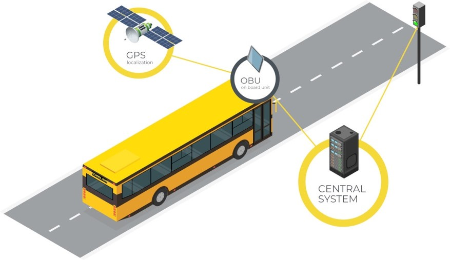

# Physical road infrastructure {#infrastructure}

## Dedicated lanes for connected and automated vehicles (CAV) {#dedicated_lanes}

### Synonyms {-}
*AV-dedicated lanes*, *dedicated corridors*

### Definition {-}
Dedicated lane for connected and autonomous vehicles features additional infrastructure or sensors to increase the reliability of Advanced Driver Assistant Systems (ADAS). Only automated driving vehicles are allowed to drive on these lanes. The typical applications include cooperative and adaptive cruise control based on sensors with the infrastructure, lane keeping, fuel use optimization and road pricing possibilities (Broek et al., 2011). The introduction of dedicated lanes for CAV is expected to have direct consequences on the traffic flow on the highways and a nearby road network. In particular, a study conducted in Singapore showed that dedicated lanes on the highways can reduce travel time of CAVs by approximately 25% (if the saturation on the lane is not reached) at the cost of a delay for conventional cars of approximately 7%, due to the reduced capacity (Ivanchev et al., 2017). They were also demonstrated to have a positive effect on fuel consumption. <br/><br/>
Moreover, the throughput, defined as a number of vehicles passing through the road in a given time interval, increased as a result of introduction of dedicated lanes for AVs (Kumar et al., 2020). This effect, however, was associated with a decrease in throughput of smaller roads due to the preference of AVs for highways because of time savings, which in turn can result in time loss for conventional cars. What is more, the benefits from increased capacity of AV-only lanes can be further amplified through setting a higher speed limits for these lanes (Ye & Yamamoto, 2018). With respect to the demand for different road types the study found that the introduction of dedicated CAV lanes will increase the demand of conventional cars for major road (but smaller than highways) and minor roads as a substitution for more congested highways due to the dedicated AV lanes. <br/><br/>
In contrast, study by Chen et al. (2016) showed that the implementation of CAV dedicated lanes has a potential of maximizing traffic capacity on these lanes in a mix-traffic context while having effectively no impact on conventional traffic capacity. Further, in order to use efficiently CAV dedicated lanes, which may be underutilized at the early stage, it is proposed to allow conventional cars to enter the AVs-only lanes after toll payment. This solution stems from currently operational across the world High Occupancy Vehicle (HOV) lanes. This joint approach is claimed to improve the throughput of individual road as well as enhance system-wide flow distribution within the network (Liu & Song, 2019).

### Key stakeholders {-}

- **Affected**: Conventional Cars’ Drivers, Car Manufacturers, Insurers
- **Responsible**: Road Infrastructure Agencies, Local and National Governments

### Current state of art in research {-}
Current research focuses on gathering the evidence of the impact of the introduction of dedicated lanes on traffic flow, driver behavior adoption, safety and efficiency. Furthermore, it analyses the factors which influence them, by testing different design and operation configurations, road types and utilization policies (Rad et al., 2020). Both, field operational testing and driving simulator studies have been conducted to investigate the influence of different designs of dedicated lanes on drivers in conventional cars and those featuring some degree of automation (Guin et al., 2008, Zhong, 2018). In particular, a number of studies compared distinct access types of dedicated lanes (Zhong, 2018, Yang et al., 2019). They showed that dedicated lanes with limited access performed better in terms of travel time and throughput compared to dedicated lanes with continuous access. Moreover, the probability of vehicles platooning was significantly higher on dedicated lanes with limited access. On the other hand, it was showed that collision rates near the entry or exit of these limited access lanes are higher (Rad et al. 2020).

### Current state of art in practice {-}
Currently state of Michigan together with several private partners including Ford and Alphabet Inc. are planning to dedicate 65 km of a highway between Detroit and Ann Arbor for the sole movement of autonomous vehicles including buses and shuttles (Krisher & Eggert, 2020). Similar initiatives are taking place in other countries, for instance, China set out to build nearly 100 km of 8-lane highway linking Beijing and the Xiongan New Area, from which 2 lanes will be allocated for the automated traffic. The completion of the construction phase is predicted by the end of 2020, while its opening is for traffic is expected in June 2021 (Syncedreview.com, 2020). In Europe, there is on-going SHOW (SHared automation Operating models for Worldwide adoption) project which aims to deploy about seventy automated vehicles in 21 European cities. To assess how they can best be integrated vehicles will be used in different settings in mixed traffic and dedicated lanes. However, for safety reasons the driver will be on-board (CORDIS, 2020). 

### Relevant initiatives in Austria {-}

- [tugraz.at](https://www.tugraz.at/fileadmin/user_upload/Institute/IHF/Projekte/ENABLE-S3_SummaryofResults_May2019.pdf "tugraz.at") 
- [ait.ac.at](https://www.ait.ac.at/themen/verkehrssicherheit-und-unfallforschung/projects/via-autonom/ "ait.ac.at") 

### Impacts with respect to Sustainable Development Goals (SDGs) {-}

```{r table1, echo=FALSE, results='asis'}
cat('| Impact level| Indicator|Impact direction| Goal description and number|Source|
|:------------:|:-----------:|:------------:|:------------:|:------------:|
|Individual|Fuel consumption reduced|**+**|Environmental sustainability (*7,12,13,15*)|Ivanchev et al., 2017|
|Individual|Travel time reduced|**+**|Sustainable economic development (*8,11*)|Zhong, 2018; Yang et al., 2019|
|Systemic|Collision rate reduced|**+**|Health & Wellbeing (*3*)|Zhang et al., 2020|
|Systemic|Emissions rate reduced|**+**|Environmental sustainability (*7,12,13,15*)|Al Alam at al., 2010|
|Systemic|Congestion|**~**|Sustainable economic development (*8,11*)|Ivanchev et al., 2017; Kumar et al., 2020|
|Systemic|Novel designs tested|**+**|Innovation & Infrastructure (*9*)|Guin et al., 2008; Zhong, 2018; Krisher & Eggert, 2020|
|Systemic|SHOW EU initiative|**+**|Partnership & collaborations (*17*)|CORDIS, 2020|')
```

### Technology and societal readiness level {-}

```{r table2, echo=FALSE, results='asis'}
cat('|TRL| SRL|
|:----:|:----:|
|5-6|1-3|')
```

### Open questions {-}

1. What are the potential benefits of dedicated AV lanes when coupled with smart platooning strategies?
2. How and to what degree will joint concepts by automotive sector, fleet and road
operators will improve traffic management establishing dynamic traffic regulations even across
borders?
3. What are the roles and responsibilities of the different stakeholders of physical infrastructure for connected and automated vehicles? 
4. Should the vehicle cope with any road infrastructure, and if not, what demands can be set to adapt the existing infrastructure? 
5. How to ensure continuity between those different environments?
6. Which tools (e.g. micro- and macroscopic transport modelling, impact assessment) can enable
cities to assess the impact of automated vehicles on their physical road infrastructure and
balance the needs of automated vehicles against the needs of existing modes (conventional
vehicles, public transport, pedestrians and cyclists). (ERTRAC, 2019)

### Further links {-}

-	[knowledge base](https://knowledge-base.connectedautomateddriving.eu/wp-content/uploads/2019/12/SMART_2010-0064-study-report-final_V1-2.pdf "knowledge base") 
-	[show project](https://show-project.eu/ "show project") 

### References {-}

- Al Alam, A., Gattami, A., & Johansson, K. H. (2010, September). An experimental study on the fuel reduction potential of heavy duty vehicle platooning. In 13th International IEEE Conference on Intelligent Transportation Systems (pp. 306-311). IEEE.
Broek, S. M., van Nunen, E., & Zwijnenberg, H. (2011). Definition of necessary vehicle and infrastructure systems for automated driving. Retrieved January, 3, 2017.
- Chen, Z., He, F., Zhang, L., & Yin, Y. (2016). Optimal deployment of autonomous vehicle lanes with endogenous market penetration. Transportation Research Part C: Emerging Technologies, 72, 143-156.
- CORDIS | European Commission. (20 Apr 2020). Retrieved 13 November 2020, from https://cordis.europa.eu/project/id/875530
- ERTRAC Working Group. (2019). Connected Automated Driving Roadmap. version, 8, 2019-08.
- Guin, A., Hunter, M., & Guensler, R. (2008). Analysis of reduction in effective capacities of high-occupancy vehicle lanes related to traffic behavior. Transportation Research Record, 2065(1), 47-53.
- Ivanchev, J., Knoll, A., Zehe, D., Nair, S., & Eckhoff, D. (2017). Potentials and implications of dedicated highway lanes for autonomous vehicles. arXiv preprint arXiv:1709.07658.
- Krisher, T., & Eggert, D. (14 Aug 2020). Michigan plans dedicated road lanes for autonomous vehicles. Retrieved 12 November 2020, from https://abcnews.go.com/Technology/wireStory/michigan-plans-dedicated-road-lanes-autonomous-vehicles-72352758
- Kumar, A., Guhathakurta, S., & Venkatachalam, S. (2020). When and where should there be dedicated lanes under mixed traffic of automated and human-driven vehicles for system-level benefits?. Research in Transportation Business & Management, 100527.
- Liu, Z., & Song, Z. (2019). Strategic planning of dedicated autonomous vehicle lanes and autonomous vehicle/toll lanes in transportation networks. Transportation Research Part C: Emerging Technologies, 106, 381-403.
- Rad, S. R., Farah, H., Taale, H., van Arem, B., & Hoogendoorn, S. P. (2020). Design and operation of dedicated lanes for connected and automated vehicles on motorways: A conceptual framework and research agenda. Transportation Research Part C: Emerging Technologies, 117, 102664.
- Syncedreview.com (31 Aug 2020). Beijing Builds 100km Highway Lanes for Self-Driving Cars with Unmanned Machineries. Retrieved 12 November 2020, from https://syncedreview.com/2020/08/31/beijing-builds-100km-highway-lanes-for-self-driving-cars-with-unmanned-machineries/
- Yang, D., Farah, H., Schoenmakers, M. J., & Alkim, T. (2019). Human drivers behavioural adaptation when driving next to a platoon of automated vehicles on a dedicated lane and implications on traffic flow: a driving simulator and microscopic simulation study in the Netherlands. In 98th Annual Meeting of the Transportation Research Board (pp. 19-00582).
- Ye, L., & Yamamoto, T. (2018). Impact of dedicated lanes for connected and autonomous vehicle on traffic flow throughput. Physica A: Statistical Mechanics and its Applications, 512, 588-597.
- Zhang, J., Wu, K., Cheng, M., Yang, M., Cheng, Y., & Li, S. (2020). Safety Evaluation for Connected and Autonomous Vehicles’ Exclusive Lanes considering Penetrate Ratios and Impact of Trucks Using Surrogate Safety Measures. Journal of advanced transportation, 2020. 
- Zhong, Z. (2018). Assessing the effectiveness of managed lane strategies for the rapid deployment of cooperative adaptive cruise control technology.

## Operational design domains {#ODD}

## Rail crossing information system {#rail_crossing_info_system}

## Electric road system {#ers}

### Synonyms {-}
*ERS*

### Definition {-}
Electric Road System (ERS) is a technological solution that is aimed at charging and transferring power from the road to the vehicles driving along that road. It can be considered an alternative for sustainable transport where it ssupports the use of hybrid and electric vehicles. There are three main types of ERS (Muelaner, 2020):

-	**Catenary Systems** are overhead lines suspended about 5 meters above the road which are typically used for trams and electric vehicles but sometimes can also be used along highways to power heavy commercial vehicles. Overhead lines are cheapest and the most mature form of ERS because of their resemblance with power systems used for railways or trams. They require vehicle to be equipped with pantograph which connects it with the line accommodating lateral and vertical movements. For this reason, catenary systems are the most suitable for large commercial vehicles and the lack of compatibility with small, private cars is considered a major disadvantage. What is more, the overhead lines provide a major hazard in case of road accidents for all road users. Moreover, they negatively impact the visual aspects within the areas in which they are installed, potentially posing issues for public acceptance (Muelaner, 2020). 

-	**Conductive tracks** are metal rails which are embedded on (or into) the road surface and provide power through a contact with a pick-up point underneath the vehicle. For safety reasons tracks are divided into small segments rather than continuous, so that the electrical connection is running only when the vehicle passes over them. In contrast to overhead lines, the conductive tracks can be used for vehicles of different sizes. Their advantage is also clear in terms of lower installation costs. Sweden has been a testing ground for larger scale use of this electric road system (Muelaner, 2020).

-	**Inductive tracks** are conductive coils which are placed below the surface of the road to provide energy by inducing an electric current in the coil placed under the vehicle driving along the track. Their advantage is smaller maintenance requirement as compared to conductive tracks, however, a system failure would require costly work to access underground infrastructure.<br/>

Overall, the wider use of ERS would reduce the need for construction of costly charging station, eliminate waiting time while the vehicle is charging, significantly increase driving range of hybrid and electric vehicles   and facilitate reduction in size of batteries installed in the private cars which directly translates into more efficient performance.


### Key stakeholders {-}

- **Affected**: Private and commercial drivers, Private transportation companies, General public
- **Responsible**: Local councils, National governments, Construction comapnies, Power and petroleum companies, Road power technology firms, Automotive manufacturers

### Current state of art in research {-}
Current, research focuses on testing of the ERS solutions to enable deployment on a larger scale, extend applicability to a new type of vehicles, increase their efficiency and assess their transport decarbonization potential. <br/>

Since 2008 the South Korean company [OLEV](https://www.kaist.ac.kr/en/html/kaist/01200103.html) (branch of KAIST University) has been working on inductive power transfer and since 2013 two electric buses have been in operation on public roads, inside university campus (Kelion, 2013). Nonetheless, this system is currently outdated and results as a low-speed system within local public transport. In 2016 an initial testing of the overhead lines has been conducted in Germany on Siemens’ 2 km test track in Berlin, at the same time in Sweden a full integration with Scania vehicle has been achieved. More example include Volvo and Alstom’s cooparation on testing of conductive tracks on the 400 m test side in Hällered, Sweden (Möller, 2017). Similarly, Swedish Transport Administration in collaboration with Elonroad under [EVolution Road](https://www.evolutionroad.se/en/) project constructed a 1 km of demonstration road in Lund to test the performance of an electric bus. <br/>
On the other hand, research on the efficiency of inductive tracks conducted in France and Italy showed that their performance depends on the precision of alignment between the track and the coil in the vehicle (Muelaner, 2020). Finally, a study by Börjesson et al. (2020) showed that use of electric road solution can decrease operational costs for freight operators due to a switch from diesel to electricity. Consequently, the social benefit of this technological solution outweighs its cost. Moreover, it has been concluded that use of ERS offers significant reduction in carbon emissions.


### Current state of art in practice {-}
At the moment, there are multiple companies offering power technologies such as [Elways](https://elways.se/), [Alstom](https://www.alstom.com/) or [Elonroad](https://elonroad.com/), to name a few. The proliferation of such companies enabled active testing and implementation of different ERS solutions around the world. <br/>

Since 2016 overhead lines have been successfully deployed on public roads in Sweden (E16 highway outside Gävle) and the USA (City of Carson). Currently, in Germany three tests sponsored by Federal Ministry for the Environment, Nature Conservation and Nuclear Safety [(BMU)](www.bmu.de) are taking place. In Hesse and Schleswig-Holstein 5 km of motorway was electrified at the beginning of 2020 (Wettengel, 2019) while in Baden-Württemberg, 4 km of a national highway will have an overhead line system in operation at the beginning of 2021. For the moment, these overhead lines provide power to freight vehicles, however  an issue arises among the truck fleets going through Germany from Eastern Europe, because they are lacking modern hybrid trucks equipped with pantographs on the roof. <br/>

Further, between 2016-2017 project [VICTORIA]( https://www.fcirce.es/en/smart-mobility-en-en/victoria-2) led by Spanish energy company Endesa developed first dynamic inductive load systems for a bus line in Malaga, Spain. Similarly, EU project [FABRIC](https://trimis.ec.europa.eu/project/feasibility-analysis-and-development-road-charging-solutions-future-electric-vehicles) has been conducted in Torino, Italy and Satory in France (Tongur & Sundelin, 2016). <br/>

In terms of cost analysis, an example from the UK shows that inductive tracks provide cost advantage, where the installation of 1 mile (1,6 km) of inductive tracks on a two-lane road costs around 1.4 million euros. If these were to be installed in all UK highways the costs would come up to around 13 billion euros. At the same time, the cost of additional electricity capacity required for hydrogen in [FCEV](#FCEV) sums up to 140 billion euros. Additionally, cost-benefit analysis showed that if most vehicles used ERS, the savings resulting from smaller batteries in electric cars would outweigh the costs of ERS construction. <br/>

Interestingly, ERS has not been particularly popular in Austria, potentially due to presence of well-developed railway network which, thus far, dominated freight. In particular, critics describe the construction of electric highways as *a waste of money*, because it only benefits companies that equip their fleets with the necessary vehicles with overhead line system (Traktuell.at. 2020).

### Relevant initiatives in Austria {-}

- [scania.com](https://www.scania.com/at/de/home/products-and-services/trucks/sustainability/elektro-mobilitaet/oberleitungs-lkw.html)
- [electrive.net](https://www.electrive.net/2019/07/24/auswertung-der-these-zu-lastkraftwagen-an-oberleitungen/)

### Impacts with respect to Sustainable Development Goals (SDGs) {-}

```{r table49, echo=FALSE, results='asis'}
cat('| Impact level| Indicator|Impact direction| Goal description and number|Source|
|:------------:|:-----------:|:------------:|:------------:|:------------:|
|Individual|Potential for lowering purchasing price of electric cars with smaller battery requirement |**+**|Sustainable economic development (*8,11*)|Muelaner, 2020|
|Systemic|Reduction in emissions and use of fossil fuels |**+**|Environmental sustainability (*7,12,13,15*)|Tongur & Sundelin, 2016; Moeller, 2017; Boerjesson et al., 2020|
|Systemic|Cost saving compared to hybrid vehicles; long-term maintenance costs uncertain |**~**|Sustainable economic development (*8,11*)|Muelaner, 2020; Boerjesson et al., 2020|
|Systemic|Novel designs tested|**+**|Innovation & Infrastructure (*9*)|Kelion, 2013|
|Systemic|Increased cross-industrial collaboration|**+**|Partnership & collaborations (*17*)|Kelion, 2013; Wettengel, 2019|')
```

### Technology and societal readiness level {-}

```{r table48, echo=FALSE, results='asis'}
cat('|TRL| SRL|
|:----:|:----:|
|5-9|4-7|')
```

### Open questions {-}

1. What is the potential of the use of ERS beyond freight vehicles?
2. How do stakeholders develop new business models that support ERS deployment?
3. Do public authorities have to own the electric roads?
4. What are the long-term costs associated with the maintenance of ERS?


### Further links {-}

- [fcirce.es](https://www.fcirce.es/en/smart-mobility-en-en/victoria-2)
- [engineering.com](https://www.engineering.com/story/electric-road-systems)
- [bbc.com](https://www.bbc.com/news/technology-23603751)
- [cleanenergywire.org](https://www.cleanenergywire.org/news/germany-opens-first-overhead-electricity-test-track-trucks-autobahn)
- [trimis.ec.europa.eu](https://trimis.ec.europa.eu/project/feasibility-analysis-and-development-road-charging-solutions-future-electric-vehicles)
- [Alstom](https://www.alstom.com/)
- [Elonroad](https://elonroad.com/)
- [KTH report](https://www.diva-portal.org/smash/get/diva2:1127479/FULLTEXT01.pdf)
- [Scania](https://www.scania.com/group/en/home/newsroom/news/2016/scania-tests-fast-wireless-charging-in-urban-traffic.html)
- [insideevs.com](https://insideevs.com/news/373644/electrified-roads-sweden-solaris-elonroad/)
- [a3bau.at](https://a3bau.at/so-funktionieren-elektrifizierte-strassen)
- [Siemens](https://press.siemens.com/global/de/feature/ehighway-loesungen-fuer-den-elektrifizierten-strassengueterverkehr)
-	[traktuell.at](https://traktuell.at/a/ohne-akzeptanz-kein-ehighway-in-deutschland)

### References {-}
- Börjesson, M., Johansson, M., & Kågeson, P. (2020). The economics of electric roads.
- Kelion, L., 2013. South Korean road wirelessly recharges OLEV buses. [online] BBC News. Available at: <https://www.bbc.com/news/technology-23603751> [Accessed 19 February 2021].
- Möller, C. (2017). Carbon neutral road transportation: an assessment of the potential of electrified road systems.
- Muelaner, J., 2020. Electric Road Systems. [online] Engineering.com. Available at: <https://www.engineering.com/story/electric-road-systems> [Accessed 18 February 2021].
- Tongur, S., & Sundelin, H. (2016, October). The electric road system transition from a system to a system-of-systems. In 2016 Asian Conference on Energy, Power and Transportation Electrification (ACEPT) (pp. 1-8). IEEE.
- Traktuell.at. 2020. Ohne Akzeptanz kein eHighway in Deutschland. [online] Available at: <https://traktuell.at/a/ohne-akzeptanz-kein-ehighway-in-deutschland> [Accessed 19 February 2021].
- Wettengel, J., 2019. Germany opens first overhead electricity test track for trucks on autobahn. [online] Clean Energy Wire. Available at: <https://www.cleanenergywire.org/news/germany-opens-first-overhead-electricity-test-track-trucks-autobahn> [Accessed 19 February 2021].


## High occupancy vehicle and toll lanes {#high_occupancy}

### Synonyms {-}
*high-occupancy vehicle (HOV) lane, carpool lane, commuter lane, diamond lane, express lane, transit lane*

### Definition {-}
High-occupancy vehicle (HOV) lanes are special lanes on highways, which are reserved for vehicles with a driver and one or more passengers. They are existing since the late 1960s, mainly in the US and Canada and are usually marked by diamond symbols on the roadway and associated traffic signs. In some cases, also other special vehicles, like motorcycles, transit and charter buses, emergency and law enforcement vehicles, low emission vehicles, hybrid or alternative fuel vehicles, and/or single-occupancy vehicles (SOVs) are allowed on the HOV lanes. These lanes are intended to encourage carpooling (see [ride hailing & ride sharing]( #ride_hailing)) and thus increase vehicle occupancy rates, resulting in greater traffic efficiency and lower emissions at the same time. Using the HOV lanes should result in travel time savings, which serves as an incentive for carpooling (United States Department of Transportation - Federal Highway Administration, 2008). <br/>

However, if too many (or too few) vehicles are allowed to use the HOV lanes at times, problems can arise that eliminate the incentive. Changes to the HOV policies can help to realize throughput gains (United States Department of Transportation - Federal Highway Administration, 2008). One example are the High Occupancy Toll (HOT) Lanes, which allow vehicles not meeting established occupancy requirements for an HOV lane to "buy-into" the lane by paying a toll. Thus, HOT lanes provide a congestion-free, time-saving alternative for travellers and improve utilization of previously underutilized HOV lanes. Using the electronic toll collection, the toll is set variably at the level required to maintain the speed advantage of the lane (United States Department of Transportation - Federal Highway Administration, n.d.). <br/> 

Motorists may see the benefits of reduced rush hour congestion, increased travel time reliability, and funding for congestion-reducing roadway improvement projects. Furthermore, the possibility of avoiding traffic jams when one is in a hurry is offered (United States Department of Transportation - Federal Highway Administration, 2021). <br/>

For taxpayers, HOT lanes offer more choice than traditional taxes, promote accountability by tying drivers' costs directly to their decisions, and reduce tax demand for congestion-reducing initiatives such as roadway expansion. Further, they provide a means to repay toll road bonds more quickly (United States Department of Transportation - Federal Highway Administration, 2021). <br/>

Further, HOT lanes can generate needed funding for transit improvements, park-and-rides, etc., and provide a financial incentive to make transit and carpooling more attractive, as well as improve transit travel time, which primarily benefits transit riders and carpoolers (United States Department of Transportation - Federal Highway Administration, 2021). <br/>

Companies can benefit from reduced congestion-related labour and transportation costs, as well as improved quality of life in the region. Since the environment benefits from reduced air pollution caused by cars stuck in traffic jams as well as reduced fuel consumption caused by stop-and-go traffic (United States Department of Transportation - Federal Highway Administration, 2021). 

### Key stakeholders {-}
- **Affected**: Private and shared car drivers and passengers
- **Responsible**: Highway operators, local councils, national governments, software providers, state authorities, technology providers

### Current state of art in research {-}
Nohekhan et al. (2021) investigated the difference in travel time on I-66 Inner Beltway by changing an HOV lane to a HOT lane and found that the change reduced travel time. At the same time, the toll system provides a reliable cash flow that raises essential funds for the transportation sector.  However, Burris et al. (2014) argue that it appears that carpooling is often negatively impacted when an HOV lane is converted to a HOT lane. <br/>

Wang et al. (2020) have been addressing the fact that existing pricing strategies of HOT lanes cannot guarantee that the closed-loop system converges to the optimal state where the capacity of HOT lanes is fully utilized but there is no queue on HOT lanes. A well-functioning estimation and control method is quite challenging and still hard to find. In their paper, they try to fill the gap by (*i*) presenting a simpler formulation of the point queueing model based on the new concept of residual capacity, (*ii*) proposing a simple feedback control theory approach to estimate the average value of time and compute the dynamic price, and (*iii*) proving analytically and numerically that the closed-loop system is stable and guaranteed to converge to the optimal state, either in a Gaussian or exponential manner. Further, Boysen et al. (2021) conducted a case study on how carpooling could be optimized along HOT lanes in the North America region. <br/>

Hosford et al. (2021) looked at the impact of road pricing on transportation and health equity. They identified impacts on car travel, modal shift to public transport, destination accessibility, affordability, prosperity, social interactions, air pollution, traffic accidents and fatalities, acute asthma attacks, and life expectancy. In general, existing evidence suggests that road pricing has largely positive net effects in reducing car trips, air pollution, asthma attacks, and traffic collisions, and increasing life expectancy. However, the frequency and ease of social interactions were negatively affected. The populations that generally fared better in terms of transportation and health were those with higher incomes, men, and people between the ages of 35 and 55. Also, it turned out that there are few evaluations that include non-occupational trips, so there may be missing effects for the unemployed or women who are more likely to make non-occupational trips. They concluded that the limited evidence suggests that tolls are beneficial for a range of transportation and health outcomes, particularly for populations within the catchment area, but that there may be some degree of inequality in the distribution of benefits and burdens. 

### Current state of art in practice {-}
HOV lanes as well as HOT lanes are already widespread in North America. Several HOV lanes were also implemented in Europe as early as the 1990s, for example in Leeds, UK, Madrid or Trondheim in Norway. These examples have resulted in reduced travel time and increased occupancy levels (University of Leeds - Institute for Transport Studies, n.d.). HOT lanes, however, have not yet been realized. <br/>

State-of-the-art technology for HOT lanes is the use of sensors that automatically detect the number of occupants in a vehicle. Simultaneously, tolls are calculated dynamically based on the traffic situation and the current prices are displayed in real time via electronic traffic signs (Kapsch TrafficCom, n.d.).  

### Relevant initiatives in Austria {-}
-	[Kapsch.net](https://www.kapsch.net/ktc/Portfolio/IMS/Congestion/Managed-lanes)
-	[sn.at](https://www.sn.at/wirtschaft/oesterreich/kapsch-trafficcom-stellt-sich-breiter-auf-81617200) 


### Impacts with respect to Sustainable Development Goals (SDGs) {-}

```{r table95, echo=FALSE, results='asis'}
cat('| Impact level| Indicator|Impact direction| Goal description and number|Source|
|:------------:|:-----------:|:------------:|:------------:|:------------:|
|Individual|Reduced travel times using HOVs |**+**|Health & Wellbeing (*3*)|United States Department of Transportation - Federal Highway Administration, 2008; University of Leeds - ITS, n.d.|
|Systemic|Less asthma attacks, reduced traffic collisions & increased life expectancy|**+**|Health & Wellbeing (*3*)|Hosford et al., 2021 |
|Systemic|Additional costs imposed|**-**|Equality (*5,10*) |Hosford et al., 2021 |
|Systemic|Less fuel consumption & airpollution|**+**|Environmental sustainability (*7,12,13,15*)|Hosford et al., 2021 |
|Systemic|Support transportation infrastructure costs| **+**|Sustainable economic development (*8,11*)|Hosford et al., 2021|
|Systemic|Variable pricing through real-time data|**+**|Innovation & Infrastructure (*9*)|Gihub.org, 2020|')
```

### Technology and societal readiness level {-}

```{r table96, echo=FALSE, results='asis'}
cat('|TRL| SRL|
|:----:|:----:|
|7-9|5-7|')
```

### Open questions {-}

1. What long-term health benefits can be achieved through HOT toll collection?
2. How could HOT lanes be introduced in Europe?
3. How can HOT lanes be combined with the Austrian toll system?
4. What social inequalities can HOT lanes create and can they be compensated for?


### Further links {-}
- [kapsch.net](https://www.kapsch.net/ktc/Portfolio/IMS/Congestion/Managed-lanes) 
- [ops.fhwa.dot.gov](https://ops.fhwa.dot.gov/congestionpricing/strategies/involving_tolls/hot_lanes.htm) 
- [its.leeds.ac.uk](http://www.its.leeds.ac.uk/projects/konsult/private/level2/instruments/instrument029/l2_029c.htm)
- [fhwa.dot.gov](https://www.fhwa.dot.gov/policy/otps/pricingkit.cfm) 
- [gihub.org](https://www.gihub.org/resources/showcase-projects/dynamic-pricing-for-roadways-and-parking/)

### References {-}
-	Boysen, N., Briskorn, D., Schwerdfeger, S., & Stephan, K. (2021). Optimizing carpool formation along high-occupancy vehicle lanes. European Journal of Operational Research.
-	Burris, M., Alemazkoor, N., Benz, R., & Wood, N. S. (2014). The impact of HOT lanes on carpools. Research in Transportation Economics, 44, 43-51.
- Gihub.org. (2020). Dynamic Pricing for Roadways and Parking. Available at: < https://www.gihub.org/resources/showcase-projects/dynamic-pricing-for-roadways-and-parking/> [Accessed: 15 April 2021]
-	Hosford, K., Firth, C., Brauer, M., & Winters, M. (2021). The effects of road pricing on transportation and health equity: a scoping review. Transport Reviews, 1-22.
-	Nohekhan, A., Zahedian, S., & Sadabadi, K. F. (2021). Investigating the impacts of I-66 Inner Beltway dynamic tolling system. Transportation Engineering, 4, 100059.
-	Kapsch TrafficCom. (n.d.). Kapsch TrafficCom | Managed lanes. . Retrieved April 13, 2021, from https://www.kapsch.net/ktc/Portfolio/IMS/Congestion/Managed-lanes?lang=en-us 
-	United States Department of Transportation - Federal Highway Administration. (n.d.). High-Occupancy Toll Lanes (Partial Facility Pricing) - Congestion Pricing - FHWA Office of Operations. Retrieved April 12, 2021, from https://ops.fhwa.dot.gov/congestionpricing/strategies/involving_tolls/hot_lanes.htm 
-	United States Department of Transportation - Federal Highway Administration. (2008). HOV Lane Compendium - Introduction - FHWA Office of Operations. https://ops.fhwa.dot.gov/publications/fhwahop09029/sec1_introduction.htm
-	United States Department of Transportation - Federal Highway Administration. (2021, April 14). Pricing Kit: HOT Lanes. https://www.fhwa.dot.gov/policy/otps/pricingkit.cfm#HOT
-	University of Leeds - Institute for Transport Studies. (n.d.). High Occupancy Vehicle (HOV) Lanes: evidence on performance. Retrieved April 14, 2021, from http://www.its.leeds.ac.uk/projects/konsult/private/level2/instruments/instrument029/l2_029c.htm
-	Wang, X., Jin, W. L., & Yin, Y. (2020). A Control Theoretic Approach to Simultaneously Estimate Average Value of Time and Determine Dynamic Price for High-Occupancy Toll Lanes. IEEE Transactions on Intelligent Transportation Systems.


## Public transport priority systems {#public_trans_priority}

### Synonyms {-}
*pre-emption of public transport vehicles, public transport priority (PTP), Transit signal priority (TSP), road-space priority (RSP)*

### Definition {-}
To encourage people to use public transport and thereby travel more sustainably, it is necessary that public transport operates reliably and efficiently. For example, public transport is the most efficient mode of transport at the intersections, where the difference in the number of people who can pass through a junction in a given time is particularly impressive between cars and public transport. The ratio is between 1 to 10 and 1 to 20 (Schwendinger, 2019). In contrast, a bus at full capacity that is stuck in congestion increases the travel time of many more passengers, compared to single cars in a similar position. Time delays due to traffic signals account for up to 25% of the total travel time of buses (Seredynski et al., 2015). Furthermore, energy prices and emissions generated become more relevant for public transport operators, to compete with the motorized private transport (Gassel et al., 2012).<br/><br/>
The implementation of public transport priority measures can help improving time and energy efficiency of public transport service. The delays caused by traffic signals can be reduced by the introduction of Transit Signal Priority (TSP) such as early green, green extension, phase rotation, phase insertion and actuated transit phase, favouring public transport (Seredynski et al., 2015). TSP systems can increase the attractiveness of public transport, reduce the operation cost and reduce tailpipe emissions and energy use. On the other hand, they increase the travel time of general traffic, therefore the acceptance is limited (Seredynski et al., 2015). Another widely used systems are separated bus lanes or independent tracks for trams. These are especially relevant in 30 km/h zones, so the public transport vehicles can be excluded from the regulation. But since space is a limited good, independent lanes or tracks are not always possible to implement (Schwendinger, 2019). <br/><br/>
For Vienna priority of public transport vehicles is of high importance (WIENER STADTWERKE GmbH, 2018). The first measures to shorten the travel time of the bus route 15A at Wienerberg took effect in Autumn 2018. Measures to give priority to public transport are also becoming more important in other cities such as Linz, Graz or Innsbruck. Trams in Graz have priority switching at almost all traffic lights, while there is a further need for bus lines, especially for those from the surrounding area (Schwendinger, 2019).To promote e-mobility, some countries introduced bus lane access to e-vehicles (Figenbaum et al., 2015). Wiener Linien is clearly against this measure, because cars, regardless of their propulsion system, cause delays in the bus lanes and slow down public transport (WIENER STADTWERKE GmbH, 2018).

### Key stakeholders {-}

- **Affected**: Road Users, Public Transport Users, Public Transport Operators
- **Responsible**: State Authorities, Transport Infrastructure Operators, Technology Providers

### Current state of art in research {-}
Current research aims at building on the existing solutions such as TSP and proposes so-called Green Light Optimal Speed Advisory (GLOSA) driver assistance systems. A multi segment GLOSA can take several lights in a sequence on route of a bus into account and allows the driver to adjust the speed, so that the bus can arrive at the intersection when the light is green. By that, the comfort of passengers can be increased and the fuel consumption as well as the tailpipe emissions be decreased, without negatively affecting the general traffic (Seredynski et al., 2014). However, Stahlmann et al. (2018) argue that so far, most GLOSA simulation studies are too optimistic in terms of communication performance and recommend further improvement of GLOSA systems. <br/><br/>
Moreover, the Green Light Optimal Dwell Time Advisory (GLODTA) systems look into exploiting additional dwell time at the near-side bus stop (Seredynski et al., 2014). According to Seredynski & Viti (2017) they can support on-route battery charging of electrical buses and also replace existing holding strategies used to regulate punctuality of bus services. <br/><br/>
Due the limited acceptance of TSP systems, more research regarding the efficient use of green time provided to public transport is needed. Therefore, the focus is on the improvement of the bus detection methods. The latest TSP are working with GPS-based Virtual Detectors (VD), which eliminate the need of on-street detection infrastructure, but their disadvantages is low accuracy (Seredynski et al., 2015).<br/><br/>
Haitao et al. (2019) developed an integrated and systematic framework for the optimization of bimodal urban networks using 3D-MFDs, considering the complexities of bimodality to manage traffic more efficiently and provide public transport priority. Results of the evaluation show that the proposed strategy always performs better than existing perimeter control schemes in terms of passenger mobility.  


### Current state of art in practice {-}
A common measure in use is the positioning of stops before intersections, which combines the standing time at the traffic lights with the passenger change and thus leads to travel time reductions (Schwendinger, 2019).<br/><br/>
All around the world Bus Rapid Transit (BRT) systems have gained popularity. Cervero (2013) defines them as “bus-based system that mimics the high-capacity, high-performance characteristics of urban rail systems at a much lower price” that runs either on exclusive transit-ways, dedicated bus lanes or some grade of separation. <br/><br/>
Regarding TPS, the cloud-based systems using GPS locations are standard technology (see Figure 1). However, there are still many outdated systems in use that are based on short-range radio. These systems require that all traffic lights are equipped with receivers. All buses in a fleet need special transmitters and an onboard system for positioning, which makes it an overall expensive system. At the same time, this technology is rather unreliable and maintenance intensive (SWARCO, 2021). 

```{r, echo=FALSE, , out.width="70%", fig.cap="Smart priority for public transport (SWARCO, 2021)"}

```

### Relevant initiatives in Austria {-}

- [digitales.wien.gv.at](https://digitales.wien.gv.at/site/open-data/) 
- [wienerlinien.at](https://www.wienerlinien.at/eportal3/ep/channelView.do/pageTypeId/66528/channelId/-4400661) 
- [kapsch.net-1](https://www.kapsch.net/ktc/Portfolio/IMS/Congestion/Managed-lanes ) 
- [kapsch.net-2](https://www.kapsch.net/ktc/Portfolio/IMS/Smart-Urban-Mobility/Urban-Mobility-Management ) 
- [swarco.com](https://www.swarco.com/de/loesungen/oeffentlicher-nahverkehr/vorrang-fuer-den-oeffentlichen-nahverkehr) 
- [mobility.siemens.com](https://www.mobility.siemens.com/global/de/portfolio/strasse/verkehrsmanagement/auf-der-strasse/smart-detection.html ) 

### Impacts with respect to Sustainable Development Goals (SDGs) {-}

```{r table21, echo=FALSE, results='asis'}
cat('| Impact level| Indicator|Impact direction| Goal description and number|Source|
|:------------:|:-----------:|:------------:|:------------:|:------------:|
|Individual|Higher equality for people who do not drive|**+**|Equality (*5,10*)|Litman, 2017; Cervero, 2013|
|Individual|Less travel time for public transport users, more travel time for car users|**~**|Sustainable economic development (*8,11*)|Seredynski et al., 2015 |
|Systemic|Public transport becomes more competitive compared to other transport modes|**+**|Equality (*5,10*) |Schwendinger, 2019|
|Systemic|Less fuel consumption|**+**|Environmental sustainability (*7,12,13,15*)|Gassel et al., 2012; Seredynski et al., 2015|
|Systemic|Transit is often the most cost-effective mode| **+**|Sustainable economic development (*8,11*)|Litman, 2015 |
|Systemic|More infrastructre for public transport|**+**|Innovation & Infrastructure (*9*)|Cuthill et al., 2019|')
```

### Technology and societal readiness level {-}

```{r table22, echo=FALSE, results='asis'}
cat('|TRL| SRL|
|:----:|:----:|
|4-8|5-8|')
```

### Open questions {-}

1. Who is responsible for the implementation of PTP systems?
2. How will Vehicle-to-Vehicle (V2V), Vehicle-to-Infrastructure (V2I) and in future Vehicle-to-Pedestrian (V2P) change PTP systems? 
3. How could also emergency vehicles be prioritised? 
4. How to deal with mixed fleets - half new, half old? 
5. What are the benefits compared to the costs? 
6. Which standards should be used?


### References {-}
- Cervero, R. (2013). Bus rapid transit (BRT): An efficient and competitive mode of public transport (No. 2013-01). Working Paper.
- Cuthill, N., Cao, M., Liu, Y., Gao, X., & Zhang, Y. (2019). The association between urban public transport infrastructure and social equity and spatial accessibility within the urban environment: An investigation of Tramlink in London. Sustainability, 11(5), 1229.
- Figenbaum, E., Fearnley, N., Pfaffenbichler, P., Hjorthol, R., Kolbenstvedt, M., Jellinek, R., ... & Iversen, L. M. (2015). Increasing the competitiveness of e-vehicles in Europe. European transport research review, 7(3), 1-14.
- Gassel, C., Matschek, T., & Krimmling, J. (2012). Cooperative traffic signals for energy efficient driving in tramway systems. Aspekte der Verkehrstelematik–ausgewählte Veröffentlichungen 2012, 1.
- Haitao, H., Yang, K., Liang, H., Menendez, M., & Guler, S. I. (2019). Providing public transport priority in the perimeter of urban networks: A bimodal strategy. Transportation Research Part C: Emerging Technologies, 107, 171-192.
- Litman, T. (2015). Evaluating public transit benefits and costs. Victoria, BC, Canada: Victoria Transport Policy Institute.
- Litman, T. (2017). Evaluating Transportation Diversity. Victoria Transport Policy Institute.
- Schwendinger, M. (2019). Vorrang für Busse und Straßenbahnen in Städten. https://vcoe.at/files/vcoe/uploads/Projekte/Factsheets 2019 Neu/VCÖ-Factsheet ÖV-Bevorrangen.pdf
- Seredynski, M., Khadraoui, D., & Viti, F. (2015, October). Signal phase and timing (SPaT) for cooperative public transport priority measures. In Proc. 22nd ITS World Congress.
- Seredynski, M., Ruiz, P., Szczypiorski, K., & Khadraoui, D. (2014, May). Improving bus ride comfort using GLOSA-based dynamic speed optimisation. In 2014 IEEE International Parallel & Distributed Processing Symposium Workshops (pp. 457-463). IEEE.
- Seredynski, M., & Viti, F. (2017, October). Novel C-ITS support for electric buses with opportunity charging. In 2017 IEEE 20th International Conference on Intelligent Transportation Systems (ITSC) (pp. 1-6). IEEE.
- Stahlmann, R., Möller, M., Brauer, A., German, R., & Eckhoff, D. (2018). Exploring GLOSA systems in the field: Technical evaluation and results. Computer Communications, 120, 112-124.
- SWARCO. (2021). Vorrang für den ÖPNV: Öffentliche Verkehrsmittel attraktiver machen. Retrieved 26th January 2021, from https://www.swarco.com/de/loesungen/oeffentlicher-nahverkehr/vorrang-fuer-den-oeffentlichen-nahverkehr 
- WIENER STADTWERKE GmbH. (2018). Wiener Linien: Autos auf Busspuren halten Öffis auf. https://www.wienerstadtwerke.at/eportal3/ep/contentView.do?pageTypeId=71954&channelId=-51313&programId=72863&contentId=4202309&contentTypeId=1001 


## Transformation of public space and digital solutions {#transformation_public_space}

### Definition {-}
The digitalisation of public (and urban) spaces has been developing, giving rise to concepts such as smart city, wise city, U-city, intelligent city etc. However, its real acceleration started in 2010s as a result of industrial initiatives focused on the collection, management, processing and near real-time analysis of big data through the wide-spread of sensors connecting urban spaces, known as Internet of Things (IoT) devices. In the recent years, especially since the outbreak of COVID-19 pandemic, the urban digitalisation reached a new level. For example, in China digital systems for mass surveillance based on facial recognition are being deployed and in other parts of the world legal basis (such as General Data Protection Regulation (GDPR)) have been developed to allow for recording of biometric data in public spaces (Languillon-Aussel, 2021). Beyond surveillance, digitalisation of public spaces is used in many different areas such as payments and pricing, participatory tools or law enforcement, where, for example, in 2020 Singapore initiated the satellite-based urban toll system which allows for tracking any vehicle at any time of the day to implement dynamic pricing for road use and zone access (Languillon-Aussel, 2021).

Current approaches to the digitalisation of public spaces include mobiles apps, high resolution cameras, interactive stands and kiosks providing services and information, but also IoT devices such as sensors and beacons that automatically collect the data. These devices bring potential to improve the quality and coverage of service in public spaces, lower provision and delivery costs, increase safety and security. Nonetheless, they are not without challenges. Potential issues arise due to privacy and security concerns especially when private sector plays a key role (Warbis, 2018), potential technical difficulties such as unreliable Internet connection or unstable electricity supply (Haldrup, 2018) as well as low trust among society members and so called *digital exclusion* of certain social groups (Durand & Zijlstra, 2020).

### Key stakeholders {-}

- **Affected**: Citizens
- **Responsible**: Local and national governments, Private technology companies, Citizens

### Current state of art in research {-}
The research shows that as a result of higher digitalisation of public spaces and, in particular, increased digitalisation of transport, some groups may become *digitally excluded*. The factors that are linked to vulnerability in terms of access to digitally-based services and transport are:

-	**Age**: The elderly and underaged are particularly disadvantaged due to their lower engagement with technology. In the case of elderly population, the reduction in cognitive abilities and a decline in psychological mechanisms mean that in general, coping with new technologies can be difficult (Harvey et al., 2019; Pangbourne et al., 2010; Durand & Zijlstra, 2020). On the other hand, children frequently do not have access to digitals forms of payment or cannot use all available modes of transport alone (Durand & Zijlstra, 2020).
-	**Income and educational level**: People with lower income and education levels are more vulnerable to digital exclusion where, for example, a Dutch report shows that the transition from the offline to the online purchase of a yearly public transport subscription causes issues for people with lower income levels (Durand & Zijlstra, 2020).
-	**Ethnicity**: The individuals from minorities tend to be more disadvantaged, however, this is frequently linked to other contributing factors such as cultural preferences or economic deprivation (Durand & Zijlstra, 2020).

### Current state of art in practice {-}
At the beginning the digitalization of cities and public spaces strongly relied on the hidden, underground network of cables, sensors, connectors and masts which did not play significant role in the everyday life of an average citizen. Nowadays, the digitalization of public spaces incorporates the concept of smart city into the day-to-day life to a much larger extent. There are many ways in which digitalization materializes in public spaces. <br/>

One of them is improved **connectivity** in the form of Wi-Fi hotspots and zones. For example, in New York [LinkNYC](https://www.link.nyc/) created connectivity corridors across five districts where more than 1700 links has allowed approximately 5 million users to connect for free to the country’s fastest, most robust public fibre network. Through this service, *LinkNYC* has supported people in accessing charities, using council services, and even applying for jobs (Warbis, 2018).  Moreover, [Calvium](https://calvium.com/) uses the improved connectivity to build a sense-of-place through digital-physical journeys of history and heritage, such as in [Battersea Power Station]( https://calvium.com/projects/battersea-power-station-redevelopment/) in London (Warbis, 2018). <br/>

Then, digitalisation brings the **transformation of public services** where non-personal data collected from public spaces is used to better understand the users of public spaces and their needs to improve the cities’ spaces, infrastructure and provision of public services. For instance, looking at the type of devices connected to WiFi spots or engaging in digital place-making scheme might indicate socio-economic profiles and support councils in delivering the right services to the right people. <br/>

Two of such examples are (*1*) [Borough Data Explorer](https://lbbd.emu-analytics.net/main/(view/950db2c7-1a3b-448d-9b21-444a0ec7b5e0//rightBar:appinfo)?basemapDetail=1&zoom=5.0&lng=-0.36613&lat=54.04187) that gathers data for the indicators that either contribute to borough’s so-called *Borough Manifesto targets* or feature within borough’s *social progress index* (Lbbd.emu-analytics.net, 2021). (*2*) The Australian city of Joondalup partnered with [Telstra]( https://www.lakesidejoondalup.com.au/store-directory/telstra-shop/) to test IoT technologies to better monitor environmental factors like temperature, humidity, pollution, light and noise levels in real time (Barns, 2017).<br/>

Next, a **public-private partnership** is crucial for the strong and reliable digital public domain, where technology companies need to understand policy and strategy of local government to identify areas that may be supported through digital deployment. On the other hand, it is important for local government to understand the features of the technology for deployment. This tight cooperation enables the public sector to direct the digitisation of places in ways that work for public good, retaining the publicness of space and place, regardless of who owns, oversees or manages technologies being deployed (Warbis, 2018). The examples of such initatives are [ÖBB360 wegfinder](https://wegfinder.at/presse/2021/mit-wegfinder-ist-mobility-as-a-service-in-oesterreich-angekommen(1)/), [Living Labs](https://austriatech.at/en/insight-into-the-work-of-the-urban-mobility-laboratories/) and [Seestadt Wien]( https://www.aspern-seestadt.at/en).<br/>

Within transport network the digitalisation brings benefits of improved customisation, efficiency and comfort. The examples of such efforts are real-time information on parking spaces availability such as [eParkomat](https://www.eparkomat.com/) in Czech Republic, digital ticketing and scheduling, for instance, [DV Ticketing]( https://www.dv-ticketing.com/)  or [Trainline](https://www.thetrainline.com/) in the UK, electronic system for car and bike sharing fleets such as [Share-now]( https://www.share-now.com/at/en/) or [Nextbike](https://www.nextbike.at/de/niederoesterreich/) etc. For more information on bike and car sharing see sections on [bicycle and e-bicycle hire](#bike_sharing) and [car shring]( #car_sharing) in this work.

Finally, public spaces are claimed to be political in nature. In Europe they support and condition the expression of the life in the city and play a role in participatory planning (Languillon-Aussel, 2021; Parkinson, 2012). For example, in 2013 Austrian railways ÖBB aimed at building a [new freight centre](https://www.partizipation.at/gueterzentrum_sued.html) in Vienna that would move freight traffic away from the roads and onto the railways. The new freight centre was meant to replace the one at north-west station (Nordwestbahnhof). From the beginning, the project was intended to actively involve the general public, and the stakeholders were also strongly integrated into the planning. Therefore, before the start of the project, the ÖBB held an information event, which was accompanied by great protests (from the public) against the project. ÖBB tried, probably for this very reason, to involve the stakeholders so intensively in the entire planning process and as a result successfully completed the project.<br/>

Therefore, the digitalisation of urban spaces can influence the innovation in participatory tools where it allows the citizens to express opinion and provide feedback to actively contribute to infrastructure planning process and decision-making. This trend gave rise to so-called digital participatory planning (DPP) (Bouzguenda et al., 2020). Some examples of such initiatives include [Map your city](https://mapyour.city/) app, ideas generation platform [Decide Madrid](https://www.involve.org.uk/resources/case-studies/decide-madrid), [Open Source City](https://oscity.nl/) in the Netherlands, UK feedback platforms [Involve](https://www.involve.org.uk/resources/knowledge-base/what/public-participation) and [Changify](http://www.changify.org/) or arguments visualisation platform called [vTaiwan](https://www.nesta.org.uk/feature/six-pioneers-digital-democracy/vtaiwan/). <br/>


### Relevant initiatives in Austria {-}

-	[ÖBB360 wegfinder](https://wegfinder.at/presse/2021/mit-wegfinder-ist-mobility-as-a-service-in-oesterreich-angekommen(1)/)
-	[Living Labs](https://austriatech.at/en/insight-into-the-work-of-the-urban-mobility-laboratories/)
-	[Seestadt Wien](https://www.aspern-seestadt.at/en)
-	[House of digitalisation]( https://ec.europa.eu/regional_policy/en/projects/Austria/support-for-digital-transformation-in-lower-austria)


### Impacts with respect to Sustainable Development Goals (SDGs) {-}

```{r table93, echo=FALSE, results='asis'}
cat('| Impact level| Indicator|Impact direction| Goal description and number|Source|
|:------------:|:-----------:|:------------:|:------------:|:------------:|
|Individual|Diminished access to digitally based transport services for certain groups |**-**|Equality (*5,10*)|Durand & Zijlstra, 2020|
|Systemic|Reduced risk for transport-related social exclusion|**+**|Equality (*5,10*) |Harvey et al., 2019; Pangbourne et al., 2010|
|Systemic|More informed planning and decision-making based on real-time data from IoT|**+**|Innovation & Infrastructure (*9*)|Barns, 2017, Bouzguenda et al., 2020|
|Systemic|Increased collaboration between public and private sector|**+**|Partnership & collaborations (*17*)|Warbis, 2018;|')
```

### Technology and societal readiness level {-}

```{r table94, echo=FALSE, results='asis'}
cat('|TRL| SRL|
|:----:|:----:|
|5-9|5-8|')
```

### Open questions {-}

1.	To what extent does the increasingly important deployment of digital devices in public spaces impact their political dimensions?
2.	Are digital technologies transforming citizen practices in public spaces and/or do they allow the emergence of new practices? 
3.	By allowing new forms of expression, as well as political and democratic participation online, the virtual space tends to become a new forum. Is digital technology capturing the political functions of public spaces, which have therefore become unnecessary? 
4.	What impacts do the short life cycles of technologies and the changes of technological generations have on the development of public spaces?
5.	Is digital transforming the designs, shapes, dimensions, and spatiality of public spaces? 
6.	In what ways is the emergence of new tools and skills changing the way public spaces are planned and developed? 
7.	What role do digital technologies play in the representation, imagination, and perception of public spaces? 
8.	For which type(s) of recipient(s) (such as citizen, consumer, user, and inhabitant) are digital technologies deployed in the public space? 
9.	What impacts do they have on the populations frequenting public spaces? 
10.	Do digital technologies promote social exchanges, or on the contrary, do they physically replicate the segregation of digital bubbles?
11.	What roles has digital played in adapting public spaces to the health crisis of COVID-19? 
(Languillon-Aussel, 2021)


### Further links {-}
- [Agile city](https://agile-city.com/agile-city-research/digital-tools-for-participatory-led-design/)
-	[An article on city of bits]( https://theconversation.com/surprise-digital-space-isnt-replacing-public-space-and-might-even-help-make-it-better-87173)
-	[Parking management systems](https://archer-soft.com/blog/how-build-real-time-parking-availability-system)
-	[Internet of Things and Privacy in Public](https://jsis.washington.edu/news/internet-of-things-and-privacy-in-public/)

### References {-}

-	Barns, S. (2017) Surprise! Digital space isn’t replacing public space, and might even help make it better. Available at: <https://theconversation.com/surprise-digital-space-isnt-replacing-public-space-and-might-even-help-make-it-better-87173> [Accessed 12 April 2021].
- Bouzguenda, I., Alalouch, C., & Fava, N. (2020). Examining digital participatory planning: maturity assessment in a small Dutch city. Journal of Cleaner Production, 264, 121706.
-	Durand, A. & Zijlstra, T. (2020). The impact of digitalisation on the access to transport services: a literature review. 10.13140/RG.2.2.22686.97600.
-	Haldrup, S.,V. (2018). Digitising public service delivery: opportunities and limitations. Available at: <https://www.opml.co.uk/blog/digitising-public-service-delivery-opportunities-and-limitations> [Accessed 12 April 2021].
-	Harvey, J., Guo, W., & Edwards, S. (2019). Increasing mobility for older travellers through engagement with technology. Transportation Research Part F: Trafc Psychology and Behaviour, 60, 172-184. doi:10.1016/j.trf.2018.10.019
-	Languillon-Aussel, R. (2021). Digitalisation of public spaces: the great urban change? Available at: <https://journals.openedition.org/articulo/4518> . [Accessed: 9 April 2021]
-	Lbbd.emu-analytics.net. (2021). Borough Data Explorer. [online] Available at: <https://lbbd.emu-analytics.net/main/(view/950db2c7-1a3b-448d-9b21-444a0ec7b5e0//rightBar:appinfo)?basemapDetail=1&zoom=4.7&lng=3.34490&lat=54.11363> [Accessed 12 April 2021].
-	Pangbourne, K. (2018). Mobility and Ageing: A Review of Interactions Between Transport and Technology from the Perspective of Older People In A. Curl & C. Musselwhite (Eds.), Geographies of Transport and Ageing (pp. 51-71). Cham: Springer International Publishing.
-	Parkinson J., 2012, Democracy and Public Space: The Physical Sites of Democratic Performance, Oxford: Oxford University Press, 262 p.
-	Warbis, M. (2018). Making the Spaces of Cities Smarter: Why cities (and their citizens) should embrace the digital public realm. <Available at: https://medium.com/@warbismichelle/making-the-spaces-of-cities-smarter-why-cities-should-embrace-the-digital-public-realm-c12afc810aaa>. [Accessed: 12 April 2021]

