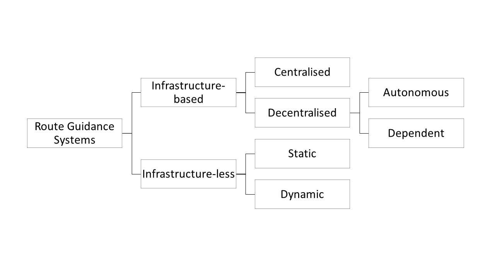

# Traffic management {#traffic}

## Congestion charging {#congestion_charging}

**Updated: 9th January 2023**

### Synonyms {-}
*Congestion charging scheme, CCS*

### Definition {-}
The congestion charging is an example of (urban) road pricing system aimed at reducing congestion and pollution in zones where it applies. The regulations and prices of congestion charges can vary based on spatial, temporal or modal basis (Santos, 2005). Congestion charges are used to influence the traffic demand and discourage the use of roads at congested times (Valletta, 2015). The major congestion charge zone in Europe was introduced in London in 2003 and it imposed a fee for all the vehicles that drove into or through the designated area in the city centre between 7:00 and 18:00 (Mon-Fri) (Munford, 2017). It included a 90% discount for residents, nevertheless, at the time it was considered the most radical transport policy to have been implemented in the recent decades (Banister, 2003). Nearly 20 years later, congestion charges are an effective measure to protect city centres, used in several cities around the world such as London, Singapore, New York, Stockholm, Milan, Bergen or Gothenburg, even though they are still rather unpopular within the society. The research findings with respect of the effectiveness of this transport policy in several aspects are summarized in the *research section*, below.

### Key stakeholders {-}
- **Affected**: Local residents, car and truck drivers, motor bikers, cyclists, pedestrians
- **Responsible**: Local and national governments, transport authorities

### Current state of art in research {-} 
Given that congestion charging has been used for some time now, the existing research focuses mainly on the effects of the introduction of congestion charges on different areas that may be affected, such as air quality, housing prices, traffic improvements, travel behaviour and road safety, economic aspects and social acceptability. <br/>

Starting with public attitude towards congestion charging schemes, it is fair to say that public opinion is divided and there are several factors which influence the outlook on this transport policy. For example, study by Grisolía et al. (2015) showed the differences in acceptance levels between drivers and non-drivers, where the latter ones are more favourable to congestion charging systems. Moreover, Hamilton (2011) came to a similar conclusion where he found that higher frequency of car use was associated with lower acceptance of congestion charges. Further, the study showed that public acceptance of congestion charging is likely to increase with more experience with the charging system but also among individuals with high value of time and pro-environmental interests as well as those who are in favour of high degree of government intervention.<br/>

What is more, several studies showed that congestion charging has led to a significant improvement in traffic conditions where travel times decreased by 19% on average. Beyond, 14.5% decrease of the private vehicles’ presence in the affected area was observed and the use of public transport increased by up to 18% (What Works Centre for Local Economic Growth, 2020; Gibson & Carnovale, 2015; Amelsfort & Swedish, 2015; Tang, 2021).

With respect to road safety the results are ambiguous depending on the location and the period of evaluation. For example, the road safety improved in London, while crash reduction, when observed in the policy removal of Western Extension of LCC, was observed only one year after removal (Ding et al., 2021). Road safety also improved in Milan, however in Rome it deteriorated following the switch from cars to motorcycles leading to a higher accident rate (Amelsfort & Swedish, 2015).<br/>

Next, various studies demonstrated the positive impact of congestion charges on air pollution within the targeted zones, where the levels of CO~2~ decreased by 19.5% on average and NO~x~ (nitrogen oxides) decreased by 10.5% (Amelsfort & Swedish, 2015).<br/>

In terms of economic effects, it has been showed that implementation of congestion charges can increase house values within the zone (potentially due to additional exemptions for residents). For example, following the introduction of congestion charge in London residential property values rose by 5%. At the same time, congestion charging can lead to a reduction in retail property values. In Singapore after the implementation of road pricing scheme the retail real estate prices decreased in the targeted zone (Amelsfort & Swedish, 2015; Agarwal, 2015). Further, study by Percoco (2014) found that the introduction of road pricing system reduced house prices in the affected zone. In conclusion, literature shows a mixed effect of congestion charges on property values, depending on specific location and additional regulation and exceptions that are in place.<br/>

Baranzini et al. (2021) proposed to design an effective and acceptable road pricing scheme (cordon/zone-based charge) for Geneva, Switzerland. It shows a clear trade-off between efficiency and acceptability, which can be closed by information provision. Several designs, for a congestionGeneva, have been identified to reach the support for most of the preferences of commuters.

### Current state of art in practice {-}
Nowadays there are different functioning models of congestion charging schemes around the world. One broadly used model is the *zone/cordon-based charges* which is based on the idea of geographic boundary so that charges are implemented when entering or leaving the zone (or both). Henceforth, travellers within the zone do not incur the cost. This contrasts with so-called *area charging* where the fees apply to all the drivers travelling or parking within the designated area. The first one may be thought of as a ‘per passage charge’ and the latter ‘once per 24h charge’ when the fees are charged daily. Cordon-based charging is currently used in multiple Norwegian cities (e.g. Bergen and Oslo), Milan or Durham while area charging systems is present in London. <br/>

What is more, initially a number of exemptions were available for low emission and alternative fuel vehicles such as all-electric cars and plug-in hybrids however local authorities gradually moved away from these discounts (Chris, 2016). For example, in Vienna there are several regulations for the entry of company vehicles with different levels of emissions into the city centre. These were first introduced in 2014 and they require all the business vehicles to have an environmental badge known as ‘Umwelt Pickerl’ to access the city. Moreover, there is an 'Emergency Scheme' in Vienna which becomes effective as soon as the certain pollution limits are exceeded. As a result, and depending on the severity of the event, either a recommendation to switch to public transport is announced or vehicles with internal combustion engines can be banned from driving (Sadler Consultants Ltd, 2021).<br/>

New York State is currently establishing a congestion tolling program for NYC, Manhattan. The plan is the first of its kind in the United States and while lawmakers gave the permission to develop and run the program in 2019, fees are expected to go into effect in late 2023 (New York Times, 2022).

### Relevant initiatives in Austria {-}

- [urbanaccessregulations.eu](https://urbanaccessregulations.eu/countries-mainmenu-147/austria-mainmenu-78/wien-vienna)
- [environmentalbadge.com](https://www.environmentalbadge.com/environmental-zone-vienna/)

### Impacts with respect to Sustainable Development Goals (SDGs) {-}

```{r table27, echo=FALSE, results='asis'}
cat('| Impact level| Indicator|Impact direction| Goal description and number|Source|
|:------------:|:-----------:|:------------:|:------------:|:------------:|
|Individual|Social contacts within zone reduced & air quality improved|**~**|Health & Wellbeing (*3*)|Munford, 2017; Beevers & Carslaw, 2005|
|Individual|Increased costs of car use|**-**|Equality (*5,10*)|Amelsfort & Swedish, 2015|
|Individual|Ambiguous effect on housing value|**~**|Sustainable economic development (*8,11*)|Tang, 2021|
|Systemic|Reduced emissions & increased use of public transport within the affected zone|**+**|Environmental sustainability (*7,12-13,15*)|Beevers & Carslaw, 2005; Gibson & Carnovale, 2015|
|Systemic|Increased revenues from charges & increased use of public transport|**+**|Sustainable economic development (*8,11*)|Amelsfort & Swedish, 2015|')
```

### Technology and societal readiness level {-}

```{r table28, echo=FALSE, results='asis'}
cat('|TRL| SRL|
|:----:|:----:|
|7-9|5-7|')
```

### Open questions {-}
1. What are the implications of congestion charges on overall welfare in the affected zone?
2. What are the effects of different congestion charge designs such as exemptions of different nature?
3. What effect the implementation of congestion charge zone will have on the traffic in neighbouring areas (due to e.g. re-routing)?
4. What is the potential for expansion of more sustainable transport mode within the targeted zone?
      - What is the actual modal split?
      - What is the proportion of road space occupied by different modes?
      - What is the potential of future investment in public transport?
      - To what extent road capacity is used for parking (formally and informally)? (Van Amelsfort & Swedish, 2015)

### Further links {-}
- [whatworksgrowth.org](https://whatworksgrowth.org/policy-reviews/transport/congestion-charging)
- [adb.org](https://www.adb.org/sites/default/files/publication/159940/introduction-congestion-charging.pdf)
- [epomm.eu](http://www.epomm.eu/newsletter/v2/content/2015/0415/doc/eupdate_en.pdf)


### References {-}
- Agarwal, Sumit, Koo, Kang Mo, & Sing, Tien Foo. (2015). “Impact of electronic road pricing on real estate prices in Singapore.” Journal of Urban Economics, 90, 50–59.
- Banister, D. (2003). Critical pragmatism and congestion charging in London. International Social Science Journal, 55(176), 249-264.
- Beevers, S. D., & Carslaw, D. C. (2005). The impact of congestion charging on vehicle emissions in London. Atmospheric Environment, 39(1), 1-5.
Lilly, Chris (2016). Congestion charge sunset period ends today. Next Green Car. Available at:
https://www.nextgreencar.com/news/7701/congestion-charge-sunset-period-ends-today/  [Accessed: 3 February 2021]
- Baranzini, A., Carattini, S., Tesauro, L. (2021). Designing Effective and Acceptable Road Pricing Schemes: Evidence from the Geneva Congestion Charge. Environmental and Resource Economics, 79, 417-482. https://doi.org/10.1007/s10640-021-00564-y
-	Ding, H., Sze, N.N., Li, H., Guo, Y. (2021). Affected area and residual period of London Congestion Charging scheme on road safety. Transport policy, 100, 120-128. https://doi.org/10.1016/j.tranpol.2020.10.012
- Gibson, M., and Carnovale, M. (2015). “The effects of road pricing on driver behaviour and air pollution” Journal of Urban Economics, 89, pp. 62-73.
- Grisolía, J. M., López, F., & de Dios Ortúzar, J. (2015). Increasing the acceptability of a congestion charging scheme. Transport Policy, 39, 37-47.
- Hamilton, C. J. (2011). Popular Acceptance of Congestion Charging.
- Ley, A. (2022). Why drivers could soon pay $23 to reach Manhattan. New York Times. Available at: https://www.nytimes.com/2022/08/18/nyregion/nyc-congestion-pricing-manhattan.html [Accessed: 22 November 2022]
- Munford, L. A. (2017). The impact of congestion charging on social capital. Transportation Research Part A: Policy and Practice, 97, 192-208.
- Percoco, M. (2014). “The impact of road pricing on housing prices: Preliminary evidence from Milan” Transportation Research Part A Policy and Practice, 67, pp. 188-194.
- Sadler Consultants Ltd (2021). Wien (Vienna).  Urbanaccessregulations.eu. Available at: <https://urbanaccessregulations.eu/countries-mainmenu-147/austria-mainmenu-78/wien-vienna> [Accessed: 3 February 2021].
- Santos, G. (2005). Urban congestion charging: a comparison between London and Singapore. Transport Reviews, 25(5), 511-534.
- Tang, C. K. (2021). The Cost of Traffic: Evidence from the London Congestion Charge. Journal of Urban Economics, 121, 103302. https://doi.org/10.1016/j.jue.2020.103302
- What Works Centre for Local Economic Growth (2020). Evidence Review: Congestion charging.  Available at: <https://whatworksgrowth.org/public/files/Evidence_reviewed_examples/Congestion_charging_-_Evidence_review.pdf> [Accessed: 2 February 2021].
- Van Amelsfort, D., & Swedish, V. (2015). Introduction to congestion charging: A guide for practitioners in developing cities.
- Valletta, M. (2015) Congestion charging in Europe.

## Platooning {#platooning}

**Updated: 9th January 2023**

### Synonyms {-}
*Platoon Leader (PL), Platoon Member (PM), Truck Platooning*

### Definition {-}
Trucks form a platoon on motorways by lining up in one lane. The trucks that line up behind the first truck in the platoon can save fuel because their air resistance is reduced. The energy efficiency of a vehicle is influenced by factors such as engine, road friction and air resistance, which  accounts for more than 40 % of the total energy consumption of a vehicle (Song et al., 2021). In a truck platoon, various technologies such as the ACC (Adaptive Cruise Control) system and the V2V (Vehicle-to-Vehicle) communication protocol are used to effectively control the trucks in the platoon. The camera sensors measure the distance between contiguous trucks in the platoon and these sensor measurements rely on the ACC system. Based on these sensor measurements, the ACC system controls the truck speed via in-vehicle network protocols such as the Controller Area Network (Ghosal et al., 2021).


### Key stakeholders {-}
- **Affected**: Truck drivers, Other road users
- **Responsible**: National Governments, City government, Private Companies, Truck manufacturers

### Current state of art in research {-} 
A considerable amount of research has actively addressed the technical aspects of platooning, such as maintenance between platoon vehicles and safe driving techniques for platoons (Amoozadeh et al., 2015). One focus in research is the security of this innovation. According to Ghosal et al. (2021), the data transmitted between vehicles is not encrypted and this makes the V2V communication protocol vulnerable to cyber-attacks that can disable the radio channels between the trucks in the train. <br/><br/>
Furthermore, the research investigates the efficiency of vehicles platooning, where the results of a Dutch study showed that a three-truck platooning with a vehicle spacing of 6.7 metres and an overall length of 69.75 metres has a positive impact on traffic flow near junction and passing areas on Dutch motorways with large-scale truck platooning. But as platoon intensity increased, traffic efficiency and safety decreased (Yang et al., 2019).<br/><br/>
As an innovation in platooning, a lateral offset of the vehicles was proposed which refers to change in the lateral driving position of the subsequent trucks to reduce the abrasion of the road surface. The side shifting of the vehicles results in a use of a wider area of the roadway but extends the life of the pavement. A value between 100 mm and 150 mm was proposed as the lateral offset, resulting in an average fuel saving of 8% and a reduction in damage of over 30% (Song et al., 2021).<br/><br/>
In terms of public opinion, the results of a survey in Germany and California showed that the majority of respondents were convinced of the usefulness of truck platooning, but had concerns about driving on the highway at the same time as truck platoons. In fact, safety issues and problems with surrounding traffic were seen as the biggest concerns. The risk of hacking, job loss and legal liability issues were seen as less important. Therefore, it is crucial to increase public awareness on platooning technology and related safety concerns. It is particularly vital because general traffic vehicles cut-ins can significantly affect the efficiency of truck platooning. Therefore, further research should focus on the main factors that influence the cut-in behaviour and finding appropriate countermeasures or communication strategies to further investigate and address the intention to cut-in between platoon vehicles (Castritius et al., 2020).<br/>

Marazano et al. (2022) researched impacts of truck platooning on the multimodal freight transport market in Italy. They found that truck platooning can be highly competitive to rail transport for medium to large distances, while the size of truck platoons influences the appreciably, but only with a manned leader truck and unmanned followers. Based on the results, track platooning should be considered as a new freight transport mode.

### Current state of art in practice {-}
Comprehensive and transnational demonstrations were carried out as part of the *European Truck Platooning Challenge*, which was initiated in the Netherlands in 2016 and involved trucks from different manufacturers. Truck platoons were on the public roads in five European countries (Belgium, Denmark, Germany, Netherlands, Sweden) to get one step closer to practical implementation. One focus of the demonstration drives was the analysis of the risk, especially in relation to the length of the formation, the distance as well as the communication between the vehicles. The tests were also observed from the air to observe the interaction with other road users. Potential problems identified were: 

- disruption of traffic flow, 
- road and bridge wear, 
- restrictions in complex traffic situations, 
- untrained truck drivers and system failures in certain situations such as tunnels.

In Germany, truck platoons have been tested in regular operation since 2018 as part of a cooperation between logistics group DB Schenker and vehicle manufacturer MAN. The truck convoys are in use on the A9 motorway between the DB Schenker branches in Munich and Nuremberg. The truck convoys consist of a maximum of two vehicles and each vehicle is marked as a test vehicle. The key questions addressed by this project are: *when to form a truck convoy* and *how to best join and break up depending on the situation*. Furthermore, the acceptance of the new technology in the professional group of drivers will be investigated within the framework of this project. In an accompanying study, the experiences of the participating truck drivers will be systematically evaluated and recordings from the test drives on the interaction with other road users will be analysed. The data will also provide information on what other activities the driver in the rear truck can perform during the phases of autonomous driving.<br/><br/>
The *Sweden4Platooning* project, which run until 2020, aimed at harmonising the systems of different manufacturers in DB Schenker's operations. Further, in the UK, platoons with vehicles from the manufacturer DAF also have been tested on public roads since 2018. Equally noteworthy is the current *ENSEMBLE* (Enabling SafE Multi-Brand pLatooning for Europe) project, which aims at demonstrating truck platoons with vehicles from six manufacturers by 2021. The main goal of the *ENSEMBLE* project is to form safe truck convoys with vehicles from different manufacturers and presented their final impact results in March 2022. At motorway entrances, exits and junctions, the distances between the vehicles in the convoy will automatically adjust to make room for other road users. Moreover, the goal was to facilitate the approval requirements for a cross-border demonstration (Danzl et al., 2019):

-	Road authorities benefit from platooning due to digitalization of vehicles and logistics
-	About 15% of all trucks can already benefit from platooning without any changes 
-	Potential benefits are mostly on a societal level due to increase in traffic safety, driver comfort and road capacity
-	Positive effect of truck platooning increases when truck percentage is around 20%
-	Negative impacts on road capacity were found in merging areas (lower speed)
-	PSF does not show an improvement in fuel consumption and emissions. 


### Relevant initiatives in Austria {-}

The technology of truck platooning has many potentials: savings in fuel consumption and emissions and it can partly prevent the everyday problem of traffic congestion. Above all, however, it has the potential to lead to more safety on Austria’s roads and to come a step closer to the Vision Zero. The flagship project [Connecting Austria](https://trimis.ec.europa.eu/project/connecting-austria-linking-efficient-and-automated-freight-traffic-motorway-city) was launched in Austria at the beginning of 2018 and was completed in 2020. To be able to test truck platooning under real conditions on Austrian roads, amendments to the StVO - e.g. § 18 Abs 1 StVO defines the safety distance when driving behind each other. Then, the Automated Driving Ordinance (AutomatFahrV) has been required, in the sense that every driver must be able to stop his vehicle in case of sudden braking of the vehicle in front. As a general rule, a two-second distance, corresponding to 2 times of the reaction distance, must be maintained for trucks. However, not only the StVO, but also the AutomatFahrV (RIS, 2022) must be modified after the StVO has been amended to enable the testing of truck platoons. In April 2022, the enactment added §7b, which states the use case of self-driving freight vehicles. Nevertheless, testing truck platooning on roads with public traffic in Austria is currently not possible from a legal point of view (vgl. §18 Abs 1 StVO), in contrast to the legal situation in Germany (Danzl et al., 2019, Kaiser et al., 2022)

### Impacts with respect to Sustainable Development Goals (SDGs) {-}

```{r table60, echo=FALSE, results='asis'}
cat('| Impact level| Indicator|Impact direction| Goal description and number|Source|
|:------------:|:-----------:|:------------:|:------------:|:------------:|
|Systemic|Reduced emission|**+**|Environmental sustainability (*7,12-13,15*)|Song et al., 2021|
|Systemic|Fuel savings|**+**|Sustainable economic development (*8,11*)|Ghosal et al., 2021|
|Systemic|Transnational platooning demonstrations|**+**|Partnership & collaborations *(17)*|Danzl et al., 2019|')
```

### Technology and societal readiness level {-}

```{r table61, echo=FALSE, results='asis'}
cat('|TRL| SRL|
|:----:|:----:|
|7-9|5-8|')
```

### Open questions {-}
1. What are the digital infrastructure needs of platooning beyond on-board sensors and how can they be addressed?
2. What are the possible solutions for platoon merging issues?
3. How can lane changing cut-ins be minimised?
4. How platooning will influence the role of the drivers in the engaged trucks?

### Further links {-}

- [acea.be](https://www.acea.be/uploads/publications/Platooning_roadmap.pdf)
- [mantruckandbus.com](https://www.mantruckandbus.com/en/innovation/why-platooning-is-the-future-of-delivery-traffic.html)
- [cohdawireless.com](https://cohdawireless.com/platooning/)

### References {-}
-	Amoozadeh, M., Deng, H., Chuah, C. N., Zhang, H. M., & Ghosal, D. (2015). Platoon management with cooperative adaptive cruise control enabled by VANET. Vehicular Communications, 2(2), 110–123. https://doi.org/10.1016/j.vehcom.2015.03.004
- CAD (2022). Platooning becomes a reality in Europe. Available at: https://www.connectedautomateddriving.eu/blog/platooning-becomes-a-reality-in-europe/ [Accessed: 24 November 2022]
-	Castritius, S. M., Lu, X. Y., Bernhard, C., Liebherr, M., Schubert, P., & Hecht, H. (2020). Public acceptance of semi-automated truck platoon driving. A comparison between Germany and California. Transportation Research Part F: Traffic Psychology and Behaviour, 74, 361–374. https://doi.org/10.1016/j.trf.2020.08.013
-	Danzl, K., Huber, C., Kathrein, G., Pürstl, G., Blass, P., Kaiser, S., & Romaniewicz-wenk, M. (2019). VERKEHRSRECHT.
-	Ghosal, A., Sagong, S. U., Halder, S., Sahabandu, K., Conti, M., Poovendran, R., & Bushnell, L. (2021). Truck platoon security: State-of-the-art and road ahead. Computer Networks, 185(April 2020), 107658. https://doi.org/10.1016/j.comnet.2020.107658
- Kaiser, S., Winkelbauer, M., Wannenmacher, E., Blass, P., Atasayar, H. (2022). Road Safety Issues Related to Truck Platooning Deployment. Energy-Efficient and Semi-automated Truck Platooning, 175-186. https://link.springer.com/chapter/10.1007/978-3-030-88682-0_13
-	Marzano, V., Tinesssa, F., Fiori, C., Tocchi, D., Papola, A., Aponte, D., Cascetta, E., Simonelli, F. (2022). Impacts of truck platooning on the multimodal freight transport market: An exploratory assessment on a case study in Italy. Transport Research Part A: Policy and Practice, 163, 100-125. https://doi.org/10.1016/j.tra.2022.07.001
-	RIS (2022). Gesamte Rechtsvorschrift für Automatisiertes Fahren Verordnung Available at: https://www.ris.bka.gv.at/GeltendeFassung.wxe?Abfrage=Bundesnormen&Gesetzesnummer=20009740 [Accessed: 24 November 2022]
-	Song, M., Chen, F., & Ma, X. (2021). Organization of autonomous truck platoon considering energy saving and pavement fatigue. Transportation Research Part D: Transport and Environment, 90, 102667. https://doi.org/https://doi.org/10.1016/j.trd.2020.102667
-	Yang, D., Kuijpers, A., Dane, G., & Der Sande, T. Van. (2019). Impacts of large-scale truck platooning on Dutch highways. Transportation Research Procedia, 37(September 2018), 425–432. https://doi.org/10.1016/j.trpro.2018.12.212

## Real-time traffic information and monitoring {#traffic_info_monitoring}

**Updated: 9th January 2023**

### Synonyms {-}
*Intelligent Transport Systems (ITS)*

### Definition {-}
More than half of the population now lives in cities which gives rise to growing emissions and congestion problems. To tackle them and to improve safety Intelligent Transport Systems (ITS) are essential. They can make transport safer, more efficient and more sustainable by applying various information and communication technologies to all types of passenger as well as freight transport. Real-time traffic information and monitoring play an essential role. These enable traffic to be monitored and managed on an event-driven basis. They also form the basis for intelligent traffic management and road maintenance, as well as the use of technologies such as [dynamic route guidance](#dynamic_route), [variable speed limits and dynamic signage system](#variable_speed), [smart traffic signal control](#adaptive_traffic_control) and [urban access management](#urban_access).

In the early 1990s, the need to exchange information between the European traffic centres of freeway operators initiated the development of DATEX I - an electronic language for the exchange of traffic information and traffic data. Soon the need arose to open this information to service providers as well, for which DATEX I was somewhat too limited and used outdated technical concepts. Therefore, DATEX II was developed in the first years of this millennium. It distributes traffic information and traffic management information independent of language and presentation format. Thus, there is no room for misunderstanding and/or translation errors by the recipient. The recipient can choose whether he wants spoken text, an image on a map or integration into a navigation calculation. New digitalization requirements due to self-driving cars as well as the increasing scope of ITS services, require an increased use of standards and thus also challenge the DATEX II community accordingly (DATEX II, nd. b).

The age of [Big Data](#bd_tool_maping) offers new opportunities in traffic management. The use of big data makes it possible to analyse not only traffic, but also overall mobility behaviour. One important task area is the collection of data and the provision of information by networked vehicles. The [vehicle to everything](#v2x) principle is driving the growth of data-driven business models enormously (Kapsch Aktiengesellschaft, nd. b).


### Key stakeholders {-}

- **Affected**: All traffic users
- **Responsible**: Road maintenance, state authorities, industry, traffic consultants, traffic centres

### Current state of art in research {-}
Ye et al. (2020) argue that conventional approaches to traffic monitoring are inefficient due to their high energy consumption and high cost. Therefore, they propose a new approach to obtain traffic information by processing raw roadway vibration data. By using a vibration-based road monitoring system, a large amount of raw data was collected, which was subsequently processed with an efficient algorithm to obtain monitoring of vehicle speed, axle distance, driving direction, vehicle location, and traffic volume. Reasonable accuracy was confirmed by means of verification. For example, the algorithm was able to identify vehicles with abnormal weight which is useful for law enforcement agencies to determine an overweight penalty.<br/>

Nguyen et al. (2016) argue that social media has become a valuable source of real-time information. In collaboration with the Transport Management Centre (TMC) of the Australian state of New South Wales, they developed TrafficWatch. This is a system that uses Twitter as a channel for monitoring the traffic network and managing incidents and events. Using advanced web technologies and advanced machine learning algorithms, the crawled tweets are first filtered to show incidents in Australia, and then classified into different groups through online clustering algorithms. The results of the study showed that the system has great potential to report incidents earlier than other data sources and also identify unreported incidents. The TrafficWatch system also shows its advantages in improving TMC's network monitoring capabilities.<br/>

Latest research focuses on specific technologies, algorithms, and systems, like Internet of Vehicles (IoV), that produces a considerable amount of real-time traffic data. Video segmentation for real-time traffic monitoring IoV has been researched by Wan et al. (2022) in which edge computing could play an important role, especially in complex street scenes, to eliminate redundant frames. Further research has been conducted by Hu et al. (2021) researching 5G-Enabled IoV in which traffic data constitutes a kind of digital twin that connects the physical vehicles and their virtual representation via 5G communication. Through analyzing the digital twin traffic data, traffic administrators can optimize traffic scheduling and alleviate traffic jams. However, the exceptions of IoV sensors inevitably raise an issue of traffic data sparsity and consequently influence scientific traffic scheduling decisions

### Current state of art in practice {-}

Semertzidis et al. (2010) presented a flexible, scalable, real-time vision system for automatic traffic monitoring based on a network of autonomous tracking units (ATUs) that captures and processes images from one or more pre-calibrated cameras. It is suitable for a wide range of applications, such as traffic monitoring of tunnels on highways and aircraft parking lots at the airports. In the course of their work, they tested and evaluated various image processing and data fusion techniques to achieve the best results. The output is a set of information for each moving object in the image capture, such as target ID, position, speed, and classification. These are transmitted to a remote traffic control centre with remarkably low bandwidth requirements. There they are analysed and used to provide real-time outputs (e.g., alerts, electronic traffic signs, ramp meters, etc.) as well as extract useful statistical information (traffic load, lane changes, average speed etc.).<br/>

Further, *Kapsch TrafficCom* is working on intelligent traffic management solutions based on a standardized, cloud-based technology platform, addressing three different areas: 

- traffic optimization (schedule analysis and optimization, based on data analytics)
- decision intelligence (traffic analytics, decision support through traffic simulations and predictions)
- mobility (open data hub, coordinated accident management of different authorities as-a-service traffic management systems) (Kapsch Aktiengesellschaft, nd. b) 

In Panama City, for example, they have implemented Urban Mobility Management, which uses EcoTrafiX™ as an integrated platform for traffic management and includes incident management, multi-agency collaboration, mobility information publishing, travel time management, and traffic modelling and simulation. In Buenos Aires, among other things, also data from multimodal transit was integrated and a web portal for travel information was implemented (Kapsch Aktiengesellschaft, nd. a).<br/>

Among other cities, Colorado, Kansas City and Toronto use TrafficVision software. It transforms traffic surveillance cameras into intelligent sensors. Designed specifically for intelligent transportation systems (ITS), TrafficVision monitors digitally encoded video streams from traffic cameras on highways to continuously collect real-time traffic data and immediately detect incidents. It does so using existing camera infrastructure. This helps organizations better leverage their ITS investments and make traffic safer and more efficient for the public (Omnibond Systems, nd.). 


### Relevant initiatives in Austria {-}
In Austria, ASFINAG collects all traffic data from the entire Austrian freeway network by means of the Traffic Management and Information System (VMIS) and provides various services. In order to collect real-time information, traffic sensors and induction loops installed in the carriageway are used on the one hand, and overhead sensors using radar, infra-red and ultrasonic signals on the other. VMIS delivers all measured values from the sensors to the central processing unit (Central Processing System) where the data is analysed and processed for various purposes. In addition, operators at traffic management centres can react to the processed data and make quick decisions. They can switch all variable message displays in time to ensure optimal traffic flows. The information is also available to the public. Currently, around 2500 weather sensors, 2000 sensors in the field and 200 sensors in the tunnel area are used. In addition, the ASFINAG traffic camera system includes 6,100 stationary cameras that are managed and operated using the ASFINAG wide operational monitoring system (BüS). 1,267 of the cameras are designated as "webcams" and are publicly accessible via the corresponding DATA_ITEM (ASFINAG, nd.). Currently, VMIS 2.0 is being developed and was successfully implemented in the first region in Vienna beginning of 2022 (Twitter, 2022), which, analogous to the existing system, consists of several regional traffic management centres as well as a superordinate traffic computer centre and provides the following additional functions (EBP, 2018):

-	Monitoring, control, configuration and parameterization of TLS external systems (technical delivery conditions for line stations)
-	Largely automated system control based on a new control model
-	Data source for various customers within (VMIS 2.0 central data management and reporting) and outside (e.g. traffic information services) the VMIS 2.0 context
-	Provision of interfaces for external systems, in particular to open up system control to external systems (e.g. cooperative services) and for direct communication between sub-centres and tunnel systems
-	System-wide cross-sectional functionalities such as message management, user and rights management, geo-manager
-	Traffic engineer workstation for processing and optimizing traffic engineering configuration and parameterization

Links to other initiatives:

- [Asfinag](https://www.asfinag.at/verkehr-sicherheit/verkehrsmanagement/)
- [Trafficon](https://www.trafficon.eu) 
- [Prisma-solutions](https://www.prisma-solutions.com)

### Impacts with respect to Sustainable Development Goals (SDGs) {-}

```{r  echo=FALSE, results='asis'}
cat('| Impact level| Indicator|Impact direction| Goal description and number|Source|
|:------------:|:-----------:|:------------:|:------------:|:------------:|
|Individual|Decrease in travel time|**+**|Health & Wellbeing (*3*)|Omnibond Systems (nd.)|
|Systemic|Decrease in incident response time|**+**|Health & Wellbeing (*3*)|Omnibond Systems (nd.)|
|Systemic|Cooperation of several authorities|**+**|Partnership & collaborations (*17*)|Kapsch Aktiengesellschaft (nd. a)|')
```

### Technology and societal readiness level {-}

```{r  echo=FALSE, results='asis'}
cat('|TRL| SRL|
|:----:|:----:|
|5-9|7-8|')
```

### Open questions {-}
1.	What are the potential solutions that can be jointly used by traditional and automated vehicles (e.g. during transition period when both types of vehicles will still be present)?

### Further links {-}

- [Citilog.fr](https://www.citilog.fr) 
- [Iteris.com](https://www.iteris.com) 
- [Tomtom.com](https://www.tomtom.com/products/real-time-traffic/) 
- [Flightaware.com](https://de.flightaware.com/live/) 
- [Marinetraffic.com](https://www.marinetraffic.com/en/ais/home/centerx:12.3/centery:45.7/zoom:5) 
- [Velocidata.com](https://velocidata.com/technical-summary/) 

### References {-}
-	ASFINAG. (nd.). ASFINAG Services: ASFINAG Verkehrsdaten. Abgerufen 9. Juni 2021, von http://services.asfinag.at/web/trafficdata/asfinag-content
-	DATEX II. (nd.). About | DATEX II. Abgerufen 24. Juni 2021, von https://www.datex2.eu/datex2/about
-	EBP. (2018). Im Auftrag der ASFINAG wird das neue Kernsystem für das Verkehrsmanagement des hochrangigen Straßenverkehrsnetzes in Österreich (VMIS 2.0) errichtet. | EBP | Deutschland. https://www.ebp.de/de/projekte/im-auftrag-der-asfinag-wird-das-neue-kernsystem-fuer-das-verkehrsmanagement-des
- Hu, C., Fan, W., Zeng, E., Hang, Z., Wang, F., Qi, L., Bhuiyan, M. Z. A. (2021). Digital Twin-Assisted Real-Time Traffic Data Prediction Method for 5G-Enabled Internet of Vehicles. IEEE Transactions on Industrial Informatics, 18 (4), 2811-2819. doi: 10.1109/TII.2021.3083596.
-	Nguyen, H., Liu, W., Rivera, P., & Chen, F. (2016, April). Trafficwatch: real-time traffic incident detection and monitoring using social media. In Pacific-asia conference on knowledge discovery and data mining (pp. 540-551). Springer, Cham.
-	Kapsch Aktiengesellschaft. (nd. a). Verkehrsmanagement | Kapsch TrafficCom. Abgerufen 9. Juni 2021, von https://www.kapsch.net/ktc/loesungen/traffic-management
-	Kapsch Aktiengesellschaft. (nd. b). Verkehrsmanagement | Kapsch TrafficCom. Abgerufen 9. Juni 2021, von https://www.kapsch.net/ktc/loesungen/traffic-management
-	Omnibond Systems. (nd.). Case Studies — TrafficVision. Abgerufen 23. Juni 2021, von http://www.trafficvision.com/case-studies
-	Semertzidis, T., Dimitropoulos, K., Koutsia, A., & Grammalidis, N. (2010). Video sensor network for real-time traffic monitoring and surveillance. IET intelligent transport systems, 4(2), 103-112.
- Wan, S., Ding, S., Chen, C. (2022). Edge computing enabled video segmentation for real-time traffic monitoring in internet of vehicles. Pattern Recognition, 121, 10146. https://doi.org/10.1016/j.patcog.2021.108146
-	Twitter (2022). Twitter @ASFINAG am 17.02.2022. Available at: https://twitter.com/ASFINAG/status/1494265441748987905 [Accessed: 29.11.2022]
-	Ye, Z., Xiong, H., & Wang, L. (2020). Collecting comprehensive traffic information using pavement vibration monitoring data. Computer‐Aided Civil and Infrastructure Engineering, 35(2), 134-149.


## Cooperative - intelligent transport system {#cits}

**Updated: 9th January 2023**

### Synonyms {-}
*C-ITS*

### Definition {-}
Through Intelligent Transportation Systems (ITS), various Connected Vehicle (CV) technologies have been developed in recent years. Two main types of communication have been proposed: vehicle-to-vehicle (V2V) and vehicle-to-infrastructure (V2I) communication (Outay et al., 2019). 
[C2X/V2X](#v2x) is the new technology that enables both communication between vehicles (car-to-car) and information exchange with infrastructure (car-to-infrastructure) (ADAC, 2021).<br/>

Cooperative Intelligent Transport Systems (C-ITS) are intended to improve road safety and comfort by exchanging safety-related information between vehicles and the transport infrastructure via wireless communication channels (AustriaTech, 2018). It will be an integral part in the future development of smart cities. The concept behind C-ITS is the ubiquitous connectivity of vehicles to provide them with a good knowledge of traffic conditions on the road. Centralised Traffic Command Centres (TCCs) should help manage traffic at the city level, ensure efficient emergency alerts and analyse traffic-related data for efficient route evaluation. Moreover, they should support vehicles with important information for congestion control and help in the selection of safety algorithms (Javed et al., 2019). The technologies used largely involve [wireless communication]( #wireless_com) in the high-frequency range (5.9 GHz) and are standardised within the ITS-G5 standard (AustriaTech, 2018).<br/>

Within this communication between infrastructure and vehicles, there are several distinctions - depending on the direction in which the data exchange takes place (Erhart, 2019):

- Infrastructure-to-Vehicle (I2V)

This communication between infrastructure roadside units (RSU) and vehicles works like a radio signal (The RSU sends out information and each vehicle can receive the information without a direct connection between receiver and sender. As a result, the infrastructure does not store any data of the receiving vehicles. The reception remains completely anonymous). 

- Vehicle-to-Infrastructure (V2I)

The information is sent from vehicles to infrastructure RSUs. In this case, however, registration and certificates must ensure that the Data Protection Regulation (DSGVO) is complied with and that it is not possible to draw conclusions about personal data.

- Vehicle-to-Vehicle (V2V)

Vehicles exchange important information with each other. However, anyone who wants to send C-ITS information must register and each message sent contains a certificate from the sender. This is to ensure that you always know who is sending the information and that you can trust the content of the messages.<br/>

A distinction is made between static and dynamic traffic data. In cooperative systems and C-ITS services, dynamic data is particularly important due to its safety relevance. Here, up-to-date information on road status, such as accident reports or congestion information, is transmitted to drivers in real time. Static road data, on the other hand, contains information that does not change frequently and cannot provide real-time information (AustriaTech, 2018).<br/>

Another concept, that enables a vehicle-based communication network, featuring organised computing, communication and sensing is known as vehicle ad hoc network (VANET). It is considered as a special type of mobile ad hoc network (MANET) that uses vehicles as nodes and infrastructure elements as complementary devices to increase coverage and communication capabilities (Contreras-Castillo et al., 2016).<br/>

At the core of C-ITS is a database known as the Local Dynamic Map (LDM). This map is central to the operation of C-ITS applications as it provides an updated view of traffic movements and information about road conditions. LDM is embedded in each C-ITS unit to accept input from various sources such as vehicles, RSUs and TCC (Javed et al., 2019).


### Key stakeholders {-}

- **Affected**: Drivers
- **Responsible**: Motorway Infrastructure Agencies, National Governments, Transport Agencies, Vehicle manufacturers, Road infrastructure providers

### Current state of art in research {-}
Javed et al. (2019) investigated potential future use cases of data analysis in C-ITS. Three concrete examples were mentioned:

- Traffic management in smart cities

A data analytics module in TCC could use variables such as vehicle density, road conditions, weather, departure time and more to make an intelligent routing decision. Instead of optimising the route for just one vehicle, a complex data analytics function can make decisions to reduce the overall traffic load on the road. Deep learning is a promising machine learning technique that can be used to identify features and structures in a large data set.

-	Increasing vehicle safety through network security analysis

As C-ITS applications affect vehicle safety, it is important to ensure the safety of vehicles so that they can make correct driving decisions. Network security also plays an important role in C-ITS by ensuring that no intruder can inject false messages. 

-	Data outlier detection

Detecting data outliers due to faulty sensors is important for data analysis. Any error caused by the malfunctioning of such sensors could prove fatal in the context of C-ITS. Therefore, efficient data outlier detection techniques are needed to analyse real-time data and detect faulty or corrupted data as it is injected into the data stream.<br/>

Aramrattana et al., (2019) investigated a connected C-ITS simulation framework using existing simulators to evaluate the variety of technologies in current and future transport systems (driving, network, traffic and vehicle simulators). The initial results showed that the simulation framework could create feasible scenarios with high fidelity for testing and evaluating C-ITS. The framework allows testing of complex vehicle functions (such as autonomy) and traffic situations (e.g. overtaking with limited line of sight) without compromising the fidelity of the various simulation options. There are other numerous ways to further test and use the C-ITS simulator.<br/>

Latest research shows, that cities and researchers around the world propose methods and frameworks encouraging and supporting a smooth implementation of intelligent transport systems, while others improve existing technologies and methods based on individual circumstances and areas. Choosakun et al. (2021), propose a prospective approach for the development of a cooperative intelligent transport system in Thailand by exploring evidence-based cases of ITS development from six areas around the world (Singapore, South Korea, Japan, China, the EU, and the USA) to understand success parameters, while Chen et al. (2022) proposed constructing a deep learning approach in C-ITS for travel time prediction on a Highway in Taiwan by using data pre-processing of Google Maps API and floating car data and basing it on nine different algorithms.

### Current state of art in practice {-}

Currently in operation are C-ITS Day-1 services, defined as services to be tested and implemented first in pilot projects. These are mainly security-relevant services such as:

-	weather warnings
-	road works information
-	traffic jam reports
-	approaching emergency vehicles
-	slow or stationary vehicles
-	Speed display in the vehicle
-	optimal speed for green wave

Their aim is to warn drivers in real time of upcoming dangers (AustriaTech, 2018). <br/>

At the European level, a community of road operators, vehicle and agricultural machinery manufacturers, cities, industrial and telecom companies have come together to form an interest group called the "C-ITS Deployment Group". The members of this group are committed to a coordinated C-ITS deployment in Europe meaning that C-ITS services should be identical across Europe and understood by all vehicles (Erhart, 2019).<br/>

The [Cooperative ITS Corridor project](https://www.itsinternational.com/its7/feature/tri-nation-cooperation-c-its-corridor) focuses on [vehicle and infrastructure networking](#v2x) systems and applications. The main objectives are to develop a European standard for V2X communication, to establish a system that can be extended to other cooperative services in the future and to provide a cross-border frequency range for V2X applications. The corridor extends from the Netherlands via Germany to Austria (Rotterdam - Frankfurt/Main - Vienna). On the part of the vehicle manufacturers, vehicles and telematic infrastructure are to be brought to market that enable cooperative services. In a first step, two cooperative applications will be used:

-	Work site warning: vehicles approaching a mobile work site will be warned in good time via the vehicle's own display systems
-	Traffic situation detection: the integration of vehicle data into traffic management could contribute to avoiding congestion by optimising routes and network control, and to improving incident management

In principle, the aspect of [automated driving](#connected) is only partly the focus of the project. Nevertheless, important aspects for the future use of the technologies employed can be derived from the applications (Heinrich, 2019). Since 2016, roads across Europe have been equipped with smart infrastructure. Starting with hotspots along motorways and cities, road sections have been equipped with ITS-G5 units for a total length of 20,000 km, while around 100,000 km are covered with mobile/long-range technologies. The technology has already been tested for 3,000 hours in extensive trials of vehicles and services across Europe (Schüller, 2021).<br/>

In October 2022 members of the Austrian Traffic Telematics Cluster (ATTC) showed the current state of the art in practice in Kaisermühlen (22nd district of Vienna). Worldwide, ASFINAG, the road maintenance and infrastructure public limited company service in Austria, demonstrates the use of the C-ITS technology (Car2X/V2X) that makes it possible that infrastructure/the road communicates with equipped cars (ASFINAG, 2022).

### Relevant initiatives in Austria {-}
- [Bmk.gv.at](https://www.bmk.gv.at/dam/jcr:805487b2-3563-4bd0-8fc6-e392970a42ec/citsstategy.pdf)
- [Ots.at](https://www.ots.at/presseaussendung/OTS_20201020_OTS0067/asfinag-startet-als-erster-autobahnbetreiber-europas-vernetzung-von-strasse-und-fahrzeug-bild) 
- [Mobility.siemens.at](https://www.mobility.siemens.com/at/de/unternehmen/newsroom/pressemitteilungen/basis-fur-autonomes-fahren-auf-osterreichs-autobahnen.html)
- [AustriaTech](https://www.austriatech.at/assets/Uploads/Publikationen/PDF-Dateien/0e86f5e8a0/C-ITS-kurz-erklaert-2018.pdf)

### Impacts with respect to Sustainable Development Goals (SDGs) {-}

```{r  echo=FALSE, results='asis'}
cat('| Impact level| Indicator|Impact direction| Goal description and number|Source|
|:------------:|:-----------:|:------------:|:------------:|:------------:|
|Systemic|Increased safety |**+**|Health & Wellbeing (*3*)|Outay et al., 2019|
|Systemic|Reduced carbon dioxide emissions|**+**|Environmental sustainability (*7,12-13,15*)|Outay et al., 2019|
|Systemic|Fatal collisions reduced|**+**|Innovation & Infrastructure  (*9*)|Erhart, 2019; Schuller, 2021|
|Systemic|Collaborations between European states|**+**|Partnership & collaborations (*17*)|Erhart, 2019|')
```

### Technology and societal readiness level {-}

```{r  echo=FALSE, results='asis'}
cat('|TRL| SRL|
|:----:|:----:|
|7-9|7-9|')
```

### Open questions {-}
1.	How can creation of common overall system architecture for independent C-ITS applications and projects be supported and enhanced?
2. Are there other traffic groups/vulnerable road users (e.g. pedestrians, cyclists) that need more consideration in the debate around establishing an integral C-ITS system for all?

### Further links {-}


- [C-its-deployment-group.eu](https://c-its-deployment-group.eu/knowledge-base/publications/)
- [C-roads.eu](https://www.c-roads.eu/platform/documents.html)
- [Ec.europa.eu](https://ec.europa.eu/transport/themes/its/c-its_en)
- [Ec.europa.eu-report](https://ec.europa.eu/transport/sites/default/files/2016-c-its-deployment-study-final-report.pdf)


### References {-}

-	ADAC. (2021). Welche Hersteller bieten bereits C2X an? Datenquelle Original-Rückmeldungen.
- ASFINAG (2022). ATTC-Mitglieder zeigten C-ITS Verkehrslösungen in der Autobahnmeisterei Kaisermühlen. Available at: https://www.ots.at/presseaussendung/OTS_20221019_OTS0094/attc-mitglieder-zeigen-c-its-verkehrsloesungen-in-der-autobahnmeisterei-kaisermuehlen [Accessed: 02.12.2022]
-	Aramrattana, M., Andersson, A., Reichenberg, F., Mellegård, N., & Burden, H. (2019). Testing cooperative intelligent transport systems in distributed simulators. Transportation Research Part F: Traffic Psychology and Behaviour, 65, 206–216. https://doi.org/10.1016/j.trf.2019.07.020
-	AustriaTech. (2018). C-ITS und kooperative Systeme.
- Chen. M.-Y., Chiang, H.-S., Yang, K.-J. (2022). Constructing Cooperative Intelligent Transport Systems for Travel Time Prediction With Deep Learning Approaches. IEEE transactions on Intelligent Transportation Systems, 23 (9), 16590-16599. doi: 10.1109/TITS.2022.3148269
-	Choosakun, A., Chaiittipornwong, Y., Yeom, C. (2021). Development of the Cooperative Intelligent Transport System in Thailand: A Prospective Approach. Infrastructures, 6(3), 36. https://doi.org/10.3390/infrastructures6030036

-	Contreras-Castillo, J., Zeadally, S., & Ibañez, J. A. G. (2016). Solving vehicular ad hoc network challenges with big data solutions. IET Networks, 5(4), 81–84. https://doi.org/10.1049/iet-net.2016.0001
-	Erhart, J. (2019, November 28). Vernetzte Autos, intelligenter Verkehr: Was C-ITS ist, was es kann und wem es nutzt. https://blog.asfinag.at/technik-innovation/c-its-vernetzte-autos-intelligenter-verkehr/
-	Heinrich, T. (2019). Infrastrukturbedarf automatisierten Fahrens – Grundlagenprojekt.
-	Javed, M. A., Zeadally, S., & Hamida, E. Ben. (2019). Data analytics for Cooperative Intelligent Transport Systems. Vehicular Communications, 15, 63–72. https://doi.org/10.1016/j.vehcom.2018.10.004
-	Outay, F., Kamoun, F., Kaisser, F., Alterri, D., & Yasar, A. (2019). V2V and V2I communications for traffic safety and CO~2~ emission reduction: A performance evaluation. Procedia Computer Science, 151(2018), 353–360. https://doi.org/10.1016/j.procs.2019.04.049
-	Schüller, K. (2021, June 7). AustriaTech: Mehr Sicherheit auf Europas Straßen durch C-ITS | AustriaTech - Gesellschaft des Bundes für technologiepolitische Maßnahmen GmbH, 07.06.2021. https://www.ots.at/presseaussendung/OTS_20210607_OTS0022/austriatech-mehr-sicherheit-auf-europas-strassen-durch-c-its


## Dynamic route guidance {#dynamic_route}

**Updated: 9th January 2023**

### Synonyms {-}
*Dynamic routing*, *Dynamic guidance system*, *Cooperative Vehicle-Infrastructure Systems (CVIS)*

### Definition {-}
Dynamic Route Guidance (DRG) is a system which offers route planning and guidance to the driver based on current road and traffic conditions (Dynamic Route Guidance - Car Terms | SEAT, 2021). It presents the most appropriate route for the driver in the exact moment considering estimated road traffic (Chatterjee and McDonald, 1999). DRG can typically divided into infrastructure-based and Infrastructure-less, as seen in Figure 4.1. 
```{r, echo=FALSE, , out.width="55%", fig.cap="Classification of route guidance systems (Khanjary and Hashemi, 2012)"}

```
**Infrastructure-based architecture** <br/>
In both *centralised-infrastructure based systems* and *decentralised-infrastructure based systems* the data is, firstly, detected by traffic detection systems and then, collected and extracted by Traffic Message Channel (TMC). The difference is that, in *centralised system* the optimal route information is calculated for the whole traffic network. On the other hand, in *dependent decentralised system* the optimal route is calculated for each vehicle depending on its current location and destination. Further, in *autonomous decentralised system* the data is collected by street nodes deployed over traffic network which then extract useful information for all surrounding streets and exchange the traffic information between one another. This allows each node to calculate the optimal routes for different destinations. The information about optimal routes can be received by vehicles, mobile phones or variable message signs (Khanjary and Hashemi, 2012).

**Infrastructure-less architecture**<br/>
*Infrastructure-less decentralised static system* is one of the earliest developments. The database with traffic network map is available on mobile phone or as an in-vehicle unit where the optimal route is calculated based on a static information such as the shortest path. Further, in *decentralised dynamic system*, vehicles (or mobile phones) are used to detect traffic data. They exchange the information with one another via infrastructure-less protocol such as the inter-vehicle communication or peer to peer. This results in vehicles having a real-time traffic information about the whole traffic network which enables them to calculate the optimal route based on a destination and current position of the vehicle. Importantly, the accuracy of the dynamic system depends on the volume of vehicles (or mobile devices) that serve as a traffic data sensors. The more vehicles are present, more information can be exchanged and the data is more reliable (Khanjary and Hashemi, 2012). 

### Key stakeholders {-}
- **Affected**: Drivers
- **Responsible**: Local governments, Local or national road infrastructure provides, car manufacturers

### Current state of art in research {-} 
DRG is already a mature technology, hence most of the research focuses on the improvement of different aspects or its application in novel contexts. For example, a study conducted by Liang and Wakahara (2014) presents urban traffic predictions models in order to create a centralized proactive Route Guidance System. Results showed that models decreased the prediction error and reduced the travel time. Moreover, Wang and Niu (2019) in their research proposed simulation-based Distributed Dynamic Route Guidance System (DDRGS) based on the usage of data collection and communication techniques in Cooperative Vehicle-Infrastructure Systems (CVIS) and they stated that created DDRGS might be used in the CVIS. Lastly, Deflorio (2003) assessed the performance of strategy, which controls DRG systems during experiments in condition of quick growth of traffic. Eventually, Deflorio (2003) stated, among other conclusions, that the average travel time of DRG users was shorter than non-user ones in every examined case.  Furthermore, a large body of research focuses on the use of DRG in the context of automated vehicles. For example, a study by Lazar et al. (2019) employs deep reinforcement learning approach to decrease the congestion in mixed autonomous traffic. Furthermore, Kaminski et al. (2020) investigates the effect of change in penetration level of smart cars on system characteristics including travel time in the environment where smart cars as well as human driven cars are both present. Importantly, smart cars are assumed to respond to changes in currently observed traffic by rerouting while traditional cars rely on historical information only. The results show that smart car rerouting algorithm reduced the total travel time by up to 30 %. Additionally, DRG, can also play an important role if it comes to emergency and/or evacuation. He et al. (2021) researched an efficient dynamic route optimization for urban flooding evacuation based on Cellular Automata, while Gai and Deng (2022) propose models and applications for dynamic emergency route planning for major chemical accidents. In both cases, optimization algorithms can largely improve the effectiveness of evacuation and emergency incidents.


### Current state of art in practice {-}
Nowadays, drivers of different brands of cars are using the Dynamic Route Guidance System already within the dynamic navigation in the car setup. Seat (2012) provides this function within the Navi satellite navigation software. Seat states in its manual for cars’ owners that dynamic route guide is based on the TMC report and broadcasting channels are responsible for this feature (Media System Plus/ Navi System Owner’s manual, 2012). Similar technology is used by Volkswagen (Volkswagen, 2021). Nonetheless, one of the most popular route guiding tools is Google Maps, which provides dynamic mapping, using real-time data from diverse channels to keep maps as updated as possible (Custom Maps  |  Google Maps Platform  |  Google Cloud, 2021). The range of features offered by Google Maps grows continuously. Recently, a 'Finding a parking space' functionality was introduced, beyond plain dynamic route guidance (Vielmeier, 2019). Moreover, dynamic route planning plays an important role in commercial transport and urban deliveries (PTVGroup.com, 2021)


### Relevant initiatives in Austria {-}

- [Volkswagen](https://www.volkswagen.at/technik-lexikon/navigationssystem)
- [PTVGroup](https://blog.ptvgroup.com/de/stadt-und-mobilitaet/routing-engine-hyperpath/)
- [Capterra.at](https://www.capterra.at/directory/30944/route-planning/software)


### Impacts with respect to Sustainable Development Goals (SDGs) {-}

```{r, echo=FALSE, results='asis'}
cat('| Impact level| Indicator|Impact direction| Goal description and number|Source|
|:------------:|:-----------:|:------------:|:------------:|:------------:|
|Individual|Reduced travel time|**+**|Sustainable economic development (*8,11*)|Deflorio, 2003|
|Systemic|Reduced accident risk due to route switching|**+**|Health & Wellbeing (*3*)|Chatterjee and McDonald, 1999|')
```

### Technology and societal readiness level {-}

```{r, echo=FALSE, results='asis'}
cat('|TRL| SRL|
|:----:|:----:|
|7-9|8-9|')
```

### Open questions {-}

1. How to increase time accuracy and generally, to improve performance of Dynamic Route Guidance through Traffic Message Channels? 
2. Does and if yes, then to what degree Dynamic Route Guidance has an impact on the safety of drivers’? 
3. What are the limitations and what risks could be possibly done through Dynamic Route Guidance? 
4. What is the applicability of DRG for automated vehicles?

### Further links {-}

- [Verizonconnect.com](https://www.verizonconnect.com/at/industrie/vertriebsroutenplaner/)


### References {-}
-	Chatterjee, K. and McDonald, M., (1999). THE NETWORK SAFETY EFFECTS OF DYNAMIC ROUTE GUIDANCE. ITS Journal - Intelligent Transportation Systems Journal, 4(3-4), pp.258-260.
-	Blischke, F., & Hessing, B. (1998). Dynamic Route Guidance - Different Approaches to the System Concepts. SAE Transactions, 107, 1107-1111. Available at: http://www.jstor.org/stable/44741041 [Accessed: 22 July 2021]
-	Deflorio, F., (2003). Evaluation of a reactive dynamic route guidance strategy. Transportation Research Part C: Emerging Technologies, 11(5), pp.375-388.
-	European Commission. (2021). Traveller Information - Mobility and Transport - European Commission.  Available at: <https://ec.europa.eu/transport/themes/its/road/application_areas/traveller_information_es> [Accessed: 23 July 2021].
-	Fan, Y., Lu, D., Li, Y. and Jiang, F., (2010). Design scheme of Distributed Dynamic Route Guidance System. 2010 2nd International Conference on Education Technology and Computer.
- Gai, W., Deng, Y. (2022). Dynamic Emergency Route Planning for Major Chemical Accidents: Models and Application. Emergency Guidance Methods and Strategies for Major Chemical Accidents, 73-103. DOI: 10.1007/978-981-19-4128-3_4
-	Google Cloud. (2021). Custom Maps  |  Google Maps Platform  |  Google Cloud.  Available at: <https://cloud.google.com/maps-platform/maps> [Accessed: 23 July 2021].
- He, M., Chen, C., Zheng, F., Chen, Qy, Zhang, J., Yan, H., Lin, Y. (2021). An efficient dynamic route optimization for urban flooding evacuation based on Cellular Automata. Computers, Environment and Urban Systems, 87, 101622. https://doi.org/10.1016/j.compenvurbsys.2021.101622
-	Kamiński, B., Kraiński, Ł., Mashatan, A., Prałat, P., & Szufel, P. (2020). Multiagent Routing Simulation with Partial Smart Vehicles Penetration. Journal of Advanced Transportation, 2020.
- Khanjary, M., & Hashemi, S. M. (2012, May). Route guidance systems: Review and classification. In 2012 6th Euro American Conference on Telematics and Information Systems (EATIS) (pp. 1-7). IEEE.
-	Lazar, D. A., Bıyık, E., Sadigh, D., & Pedarsani, R. (2021). Learning how to dynamically route autonomous vehicles on shared roads. Transportation Research Part C: Emerging Technologies, 130, 103258.
-	Liang, Z. and Wakahara, Y., (2014). Real-time urban traffic amount prediction models for dynamic route guidance systems. EURASIP Journal on Wireless Communications and Networking, 2014(1).
-	Media System Plus.  (2012). Media System Plus/ Navi System Owner’s manual.  Available at: <https://www.firstforseatcars.com/downloads/multimedia/media-system-plus-navi-system-owners-manual.pdf> [Accessed: 22 July 2021].
-	Mobility and transport. (2021). Intelligent transport systems Traveller Information.  Available at: <https://ec.europa.eu/transport/themes/its/road/application_areas/traveller_information_es> [Accessed: 22 July 2021].
-	Park, D., Kim, H., Lee, C. and Lee, K., (2009). Location-based dynamic route guidance system of Korea: System design, algorithms and initial results. KSCE Journal of Civil Engineering, 14(1), pp.51-59.
- PTVGroup.com (2021). PTV Map&Guide - der weltweit führende Lkw Routenplaner mit Transportkosten- und Mautrechner. Available at: https://www.ptvgroup.com/de/loesungen/produkte/ptv-mapandguide/ [Accessed: 28 JUly 2021]
-	Seat.com. (2021). Dynamic Route Guidance - Car Terms | SEAT.  Available at: <https://www.seat.com/car-terms/d/dynaminc-route-guidance.html> [Accessed: 23 July 2021].
-	Wang, J. and Niu, H., (2019). A distributed dynamic route guidance approach based on short-term forecasts in cooperative infrastructure-vehicle systems. Transportation Research Part D: Transport and Environment, 66, pp.23-34.
- Vielmeier J. (2019). Google Maps als Navi verwenden: Das müsst ihr beachten. Available at: https://trendblog.euronics.de/mobile-web/google-maps-als-navi-verwenden-das-muesst-ihr-beachten-61614/. [Accessed: 28 July 2021]
- Volkswagen.at (2021) Navigation. Volkswagen Technik-Highlights. Available at: https://www.volkswagen.at/technik-lexikon/navigationssystem [Accessed: 28 July 2021].

## Variable speed limits and dynamic signage system {#variable_speed}

**Updated: 9th January 2023**

### Synonyms {-}
*Variable speed limits (VSL), dynamic speed limits (DSL), Verkehrsbeeinflussungsanlagen (VBA), Changeable Message Signs (CMS), Dynamic Signage System*

### Definition {-}
Speed limits are based on safety, mobility and environmental considerations. While fixed speed limits represent the appropriate speed for average conditions, variable or dynamic speed limits (DSL) take account of the real time traffic, or the road and weather conditions. Therefore, the latter reflect the safe speed better (Mobility and Transport, 2020). The road users are typically informed of the current speed limit by electronic signs above or beside the lanes (De Pauw et al., 2018), as shown in figure 1. These can be supplemented with warning signs (dynamic signage system). For example, if the usual speed limit is 100 km/h, the DSL could change to 80 km/h and further to 60 km/h, to limit rear-end collisions, if there is e.g., a traffic jam ahead or weather conditions are difficult. 

```{r, echo=FALSE, , out.width="90%", fig.cap="Dynamic signage system in Austria (ASFiNAG, 2019b)"}
knitr::include_graphics("image/dynamic_signage.png")
```
With respect to the impact on the societal level, a Belgian study, by E. De Pauw et al. showed a significant decrease (-18 %) in the number of injury crashes after the introduction of a DSL system (De Pauw et al., 2018). F.G. Habtemichael and L. de Picado Santos (2013) found that a DSL system has the highest safety benefit during highly congested traffic conditions. The operational benefit in turn was the highest during lightly congested traffic conditions. However, the success of DSL is highly dependent on the level of driver compliance (Habtemichael & de Picado Santos, 2013). Besides the safety aspects, the goal of DSL is to harmonize the traffic flow. Heavy traffic can cause shock waves, which result in longer travel times and large variations in the speeds of the vehicles. The latter again may lead to unsafe situations. By using DSL this phenomenon could be reduced (Hegyi et al., 2005). Traffic flow efficiency can be improved more, when DSL is combined with coordinated ramp metering (Carlson, 2010). Speed limits can also be temporary lowered, due to high emission values. If the emission values combined with the amount of traffic, reach a specific level, the DSL-System responds automatically and lowers the speed limit for a certain time. How high that level is, depends on the local policies (ASFiNAG, 2022). 

### Key stakeholders {-}

- **Affected**: Motorways users, Drivers
- **Responsible**: Motorway Infrastructure Agencies, Technology Providers, Policymakers, State authorities

### Current state of art in research {-}
Studies show, that in retrospect most DSL implementations in Europe were efficient traffic safety and flow improvement. In the United States the increase in safety was significant as well, but the flow improvement was controversial (Lu & Shladover, 2014). Hassan et al. (2012) discovered that during bad weather conditions the combination of Changeable Message Signs (CMS) and DSL was the best way to improve safety. Current research shows that the benefits of DSL systems could be improved by integrating it in a fully connected vehicles (CV) environment (Wu et al., 2020). Currently, research focuses on the integration of C-ITS, to connect the infrastructure to the vehicles. European standards should be developed during the next years (Erhart, 2019).A study conducted in Slovakia analysed and compared fixed and actuated control at a chosen intersection and pointed out the importance of actuated control and its benefits on traffic flow, delay time and emissions (Kalasova et al., 2022). Additionally, Li et al. (2022) proposes dynamic speed limit strategies for mixed traffic flows to reduce freeway collision risks. Results of those simulations show, that tested DSL strategies (3) based on CAVs can significantly reduce collision risks when CAVs reach certain proportion. 

### Current state of art in practice {-}
DSL systems are implemented and used around the world. The used algorithms differ, however. DSL integrated with C-ITS has been implemented in a test environment (Erhart, 2019). 
Austrian motorways are managed by the ASFiNAG - currently they have 17 DSL systems in use. That means that about 19 % of the Austrian Motorway-System are currently equipped by an DSL system (ASFiNAG, 2022). So, there is potential for expansion. One global player in traffic management is the Austrian company Kapsch TrafficCom. Worldwide they have implemented their systems on more than 3.500 km of motorway (Kapsch TrefficCom). Kapsch TrafficCom's approximately 5,000 employees generated revenues of EUR 738 million in the fiscal year 2018/19. A proposed legislative update to EU rules on ITS, will make speed limit data available for use by in-vehicle safety systems, to ensure more accurate information. In a first step, speed limit data will be made available on roads on the Trans-European Transport Network (TEN-T) and primary roads until December 2025. In a second step, the entire public road network of EU should be covered by December 2028 at the latest. (UKROEd, 2022)

### Relevant initiatives in Austria {-}

- [Asfinag](https://www.asfinag.at) 
- [Asifinag blog](https://blog.asfinag.at/technik-innovation/c-its-vernetzte-autos-intelligenter-verkehr/)
- [kapsch.net](https://www.kapsch.net/einsatzbereiche/autobahn)
- [strabag-iss.com](https://www.strabag-iss.com/databases/internet/_public/content30.nsf/web30?Openagent&id=DE-STRABAGISS-DE_verkehrstechnik.html&men1=3&men2=5&sid=351)
- [pke.at](https://www.pke.at/index.php?id=17#c117)
- [aigner-stahlbau.at](http://www.aigner-stahlbau.at/leistungen/verkehrstechnik/ )

### Impacts with respect to Sustainable Development Goals (SDGs) {-}

```{r table3, echo=FALSE, results='asis'}
cat('| Impact level| Indicator|Impact direction| Goal description and number|Source|
|:------------:|:-----------:|:------------:|:------------:|:------------:|
|Individual|Fatal collisions reduced|**+**|Health & Wellbeing (*3*)|Hegyi et al., 2005|
|Individual|Travel time reduced|**+**|Sustainable economic development (*8,11*)|Habtemichael & de Picado Santos, 2013|
|Systemic|Fatal collisions reduced|**+**|Health & Wellbeing (*3*)|Hegyi et al., 2005|
|Systemic| Annual greenhouse gas emissions decrease|**+**|Environmental sustainability (*7,12-13,15*)|Schimany, 2011|')
```

### Technology and societal readiness level {-}

```{r table4, echo=FALSE, results='asis'}
cat('|TRL| SRL|
|:----:|:----:|
|7-9|8-9|')
```

### Open questions {-}
1.	Which algorithms for DSL are the most efficient ones?
2.	How can DSL be further developed? 
3.	How can fail-safe operation be improved?
4.	How can DSL be combined with C-ITS? 

### References {-}
- ASFiNAG. (2022). Handlungsfelder. Available at: http://verkehrssicherheit.asfinag.at/aktionsprogramme/handlungsfelder/ [Accessed: 4 December 2022].
- ASFiNAG. (2019a). Handlungsfelder. Available at: http://verkehrssicherheit.asfinag.at/aktionsprogramme/handlungsfelder/ [Accessed: 17 December 2020].
- ASFiNAG. (2019b). Verkehrsbeeinflussungsanlagen – Für mehr Sicherheit: Arten von Verkehrsbeeinflussungsanlagen. Available at: https://asfinag.azureedge.net/media/1607/vba-fotomontage.jpg [Accessed: 11 December 2020].
- Carlson, R. C., Papamichail, I., Papageorgiou, M., & Messmer, A. (2010). Optimal motorway traffic flow control involving variable speed limits and ramp metering. Transportation Science, 44(2), 238-253.
- De Pauw, E., Daniels, S., Franckx, L., & Mayeres, I. (2018). Safety effects of dynamic speed limits on motorways. Accident Analysis & Prevention, 114, 83-89.
- Erhart, Jaqueline. (2019). Vernetzte Autos, intelligenter Verkehr: Was C-ITS ist, was es kann und wem es nutzt. Available at: https://blog.asfinag.at/technik-innovation/c-its-vernetzte-autos-intelligenter-verkehr/ [Accessed: 17 December 2020].
- Habtemichael, F. G., & de Picado Santos, L. (2013). Safety and Operational Benefits of Variable Speed Limits under Different Traffic Conditions and Driver Compliance Levels. Transportation Research Record, 2386(1), 7–15. https://doi.org/10.3141/2386-02
- Hassan, H. M., Abdel-Aty, M. A., Choi, K., & Algadhi, S. A. (2012). Driver behavior and preferences for changeable message signs and variable speed limits in reduced visibility conditions. Journal of Intelligent Transportation Systems, 16(3), 132-146.
- Hegyi, A., De Schutter, B., & Hellendoorn, J. (2005). Optimal coordination of variable speed limits to suppress shock waves. IEEE Transactions on intelligent transportation systems, 6(1), 102-112.
- Kalasova, A., Hajnik, A., Kubalak, S., Benus, J., Haratova, V. (2022). The impact of actuated control on the environment and the traffic flow. Journal of Applied Engineering Science, 20 (2), 305-314. https://doi.org/10.5937/jaes0-33043
- Kapsch TrefficCom. Verkehrsmanagement auf Autobahnen. Available at: https://www.kapsch.net/ktc/Portfolio/IMS/Congestion/Highway-Traffic-Management
- Li, Y., Pan, B., Xing, L., Yang, M., Dai, J. (2022). Developing dynamic speed limit strategies for mixed traffic flow to reduce collision risks at freeway bottlenecks. Accident Analysis & Prevention, 175, 106781. https://doi.org/10.1016/j.aap.2022.106781
- Lu, X.-Y., & Shladover, S. E. (2014). Review of Variable Speed Limits and Advisories: Theory, Algorithms, and Practice. Transportation Research Record, 2423(1), 15–23. https://doi.org/10.3141/2423-03 [Accessed: 8 January 2021]
- Mobility and Transport | European Commission. (2020). Dynamic speed limits. Available at:  2nd December 2020, from https://ec.europa.eu/transport/road_safety/specialist/knowledge/speed/new_technologies_new_opportunities/dynamic_speed_limits_en [Accessed: 2 December 2020].
- Schimany, H. K. (2011). Blue Globe Foresight.
- UKROEd (2022). New legislation to boost digital speed limit information. UK Road Offender Education. Available at: https://www.ukroed.org.uk/new-legislation-to-boost-digital-speed-limit-information/ [Accessed: 4 December 2022]
- Wu, Y., Abdel-Aty, M., Wang, L., & Rahman, M. S. (2020). Combined connected vehicles and variable speed limit strategies to reduce rear-end crash risk under fog conditions. Journal of Intelligent Transportation Systems, 24(5), 494-513.

## Smart traffic signal control {#adaptive_traffic_control}

**Updated: 9th January 2023**

### Synonyms {-}
*Smart Traffic Lights, Adaptive Traffic Signal Control (ATSC), Traffic Signal Timing (TST), Traffic Signal Control (TSC)*

### Definition {-}
In the recent years, the increasing population and the urgent need for efficient transport have led to severe traffic problems, especially in urban areas. Congestion mitigation solutions such as optimising the road network and improving basic urban management facilities have been proposed to cope with the pressure caused by the large traffic flow during peak hours. Among all possible methods, the adaptive traffic signal control (ATSC) which combine the intelligence into traffic light control systems has proven to be both, economical and efficient in relieving traffic pressure at congested intersections. With the development of deep learning techniques, ATSC strategies have shown great potential in integrating state-of-the-art intelligent methods (Wang et al., 2021). <br/><br/>
Existing traffic light control systems either employ fixed programs without incorporating real-time traffic or take little account of traffic (Casas, 2017). They either set the traffic lights to the same duration every cycle or vary the duration depending on historical information. Some of them take input information from the underground sensors, such as inductive loop detectors, to detect vehicles near the traffic lights. However, such data is processed very crudely to determine the duration of green and red traffic lights. Consequently, they work in some cases (with low efficiency); however, during events such as sports, festivals, weather conditions or a typical high traffic volume scenario, the existing control systems tend to be paralysed. <br/><br/>
The recent research paper by  Liang et al., 2019 reports that an experienced police officer can efficiently and directly control the intersection by waving signals. Especially, in high traffic volume scenarios, a human operator observes the real-time traffic condition at the intersecting streets and adjusts the duration of the passage time accordingly. The aim of the adaptive traffic signal control is to provide flexibility and efficiency in traffic management comparable to that provided by a human operator through the employment of V2X and Deep Reinforcement learning (Wang et al., 2021).


### Key stakeholders {-}
- **Affected**: Road drivers, cyclists, pedestrians
- **Responsible**: Local governments, Local or national road infrastructure provides, car manufacturers

### Current state of art in research {-} 
Existing ATSC methods focus on varying the duration of green or red cycles based on real-time information. Nevertheless, this approach is not optimal because it neglects the impact of the current green and red lights durations on the upcoming traffic. Therefore, ATSC performs better than the fixed duration system but worse than more flexible methods because the optimal phase duration in the last cycles does not perform better in the future considering updated information about complex traffic conditions. <br/><br/>

With Deep Learning (DL) methods (which serve as input to the intersection controls), the optimal design of the basic control indices such as green phase duration and phase sequence of the traffic light at an intersection can be considered as an optimal decision-making procedure. Next, the reinforcement learning (RL) is applied to signal control to obtain the best control procedure for a signalised intersection. However, in order to achieve instantaneous data acquisition and transmission with low latency, Cooperative Vehicle Infrastructure System (CVIS) is needed to support inter-vehicle communication and vehicles with roadside infrastructure communication (see [V2X section](#v2x)). Compared to traditional sensor detectors, V2X can collect more accurate traffic data to provide comprehensive information for traffic control, resulting in better RL decision-making (Wang et al., 2021). <br/><br/>
Moreover, the analysis of the recent literature for the optimisation of TSC systems, which have been published from January 2015 to January 2020 revealed that only two papers deal with signalised roundabouts. Roundabouts have different traffic dynamics compared to regular intersections. With an increasing use of signalised roundabouts, especially in urban areas, it is believed that TSC for signalised roundabouts is a particular research gap in this area. Although there are studies conducted using real data and real-time control, there are scarce results and/or methods applied or adapted in real life. One of the main challenges for researchers in this field would be to bring these methods to decision makers and implementers. <br/><br/>
Moreover, a vast majority of work found on this topic deals with the timing of traffic signals and their impact on average delay and/or emissions. An important part of busy intersections, especially in metropolitan areas, is pedestrian traffic. Apart from Vilarinho et al., (2017) and Yu et al., (2017), pedestrians and the effects of their behaviour are not modelled in the studies. The same applies for drivers’ behaviour. An important research direction would be to analyse the effects of pedestrian and driver behaviour on the models. In recent years, more and more researchers try also to map digitalisation within active mobility, especially ITS for cycling (Interreg, 2022). <br/><br/>
Furthermore, the number of studies dealing with autonomous vehicles and technologies is growing rapidly. The most recent studies address the general area of how autonomous vehicles can be introduced safely and/or efficiently and/or environmentally friendly into the traffic flow
(Qadri et al., 2020a). <br/><br/>
While learning from trial and error is the key idea in RL, the learning cost of RL for complicated problems might be unacceptable. Therefore, how to learn efficiently (e.g. from limited data samples, efficient exploration, transfer of learned knowledge) is a critical issue for the application of RL in traffic signal control (Wei et al., 2019). A recent study conducted by Maadi et al. (2022) developed a real-time RL-based adaptive traffic signal control that optimises a signal plan to minimise the total queue length while allowing the CAV’s to adjust their speed based on fixed timing strategy to decrease total stop delays. The study combines a speed guidance system with a reinforcement learning based traffic signal control and shows that it outperforms a fixed timing plan.


### Current state of art in practice {-}
A number of stakeholders are focusing on the development of adaptive traffic control systems that support a range of smart city traffic applications, such as public transport signal priority (see [PTSP section]( #public_trans_priority) for further details), eco-driving support, messaging, intelligent traffic signal control (STSC) and emergency vehicle signal pre-emption (EVSP). Due to these factors and steady advances in sensors, artificial intelligence (AI) and machine learning, the global market for adaptive traffic control systems is forecasted to reach the market value of US$21.9 billion by the end of 2030.
Governments and city administrations in different regions of the world are looking for new ways to respond to the increasing number of traffic accidents and managing road congestion, which is why adaptive traffic control systems have attracted a lot of interest in recent years as a viable alternative to address the existing challenges (The Sentinel Newspaper, 2021).
There are many options already existing and more are still under development. Currently available adaptive signal control technologies include:

- Split Cycle Offset Optimisation Technique (SCOOT);
- Sydney Coordinated Adaptive Traffic System (SCATS),
- Real Time Hierarchical Optimised Distributed Effective System (RHODES);
- Optimised Policies for Adaptive Control (OPAC) *Virtual Fixed Cycle*
- ACS Lite

Real-time control of traffic systems has proven performance record, yet these systems have been deployed in less than 1% of existing traffic signals in America. The Federal Highway Administration is now working to roll out these technologies to the rest of the country (Curtis, 2017).[Surtrac Rapid Flow](https://www.rapidflowtech.com/surtrac) is one of the technologies deployed in the US that uses an AI/robotic system as a single machine scheduling problem. Further, for example, in Germany the adaptive signal control system has been installed on a 6 km long arterial in Muenster, where it was demonstrated to have positive effect on traffic quality and improve the bus transit by 30% based on the adopted performance index (Brilon & Wietholt, 2013).<br/>

The city of Vienna is making their traffic light more and more flexible and intelligent. Additionally, around 10.000 weather and environment sensors are built into Vienna's traffic lights to generate up-do-date measurements of conditions. Certain data can then also be available for navigation devices and smartphones (Stadt Wien, 2020). Since 2020 Vienna is working on equipping traffic lights with sensors like pedestrian recognition. The latest updates are traffic lights in the second district that recognise pedestrians and thereby adjust waiting times  (Klemm, 2022).


### Relevant initiatives in Austria {-}

- [ATC](https://www.atc.or.at/smart-cities/smart-mobility/urban-traffic-management-solutions/ )
- [Kapsch](https://www.kapsch.net)

### Impacts with respect to Sustainable Development Goals (SDGs) {-}

```{r table72, echo=FALSE, results='asis'}
cat('| Impact level| Indicator|Impact direction| Goal description and number|Source|
|:------------:|:-----------:|:------------:|:------------:|:------------:|
|Systemic|Scarcity of studies that include the effects of pedestrians behaviour |**-**|Equality (*5,10*)|Qadri et al., 2020b|
|Systemic|Decrease in congestion at the intersections|**+**|Sustainable economic development (*8,11*)|Wang et al., 2021|
|Systemic|Progress in the use of RL algorithms and V2X technologies|**+**|Innovation & Infrastructure (*9*)|Wang et al., 2021|')
```

### Technology and societal readiness level {-}

```{r table73, echo=FALSE, results='asis'}
cat('|TRL| SRL|
|:----:|:----:|
|7-9|7-8|')
```

### Open questions {-}

1. How can ATSC for signalised roundabouts be designed, developed and implemented?
2. How can pedestrian and cyclist movement be included to a larger extent into the algorithms of ATSC?
3. How can reinforcement learning algorithms learn efficiently from limited data samples for the purpose traffic signal control?


### Further links {-}
- [rapidflowtech.com](https://www.rapidflowtech.com/surtrac)
- [fhwa.dot.gov](https://www.fhwa.dot.gov/innovation/everydaycounts/edc-1/asct.cfm)
- [swarco](https://www.swarco.com/sites/default/files/public/downloads/2019-02/SWARCO_folder_signalgeber_DE_screen_0.pdf)

### References {-}
-	Brilon, W., & Wietholt, T. (2013). Experiences with adaptive signal control in Germany. Transportation research record, 2356(1), 9-16.
-	Casas, N. (2017). Deep deterministic policy gradient for urban traffic light control. ArXiv, 1–12.
-	Curtis, E. (2017, September 8). EDC-1: Adaptive Signal Control Technology | Federal Highway Administration. https://www.fhwa.dot.gov/innovation/everydaycounts/edc-1/asct.cfm
- Interreg (2022). Interreg North Sea Region B-ITS Website. Available at: https://northsearegion.eu/bits/ [Accessed: 7 December 2022]
-	Klemm, K. (2021). Erstmals intelligente Ampeln in der Leopoldstadt. Available at: https://www.meinbezirk.at/leopoldstadt/c-lokales/erstmals-intelligente-ampeln-in-der-leopoldstadt_a4841737 [Accessed: 8 December 2022]
-	Liang, X., Du, X., Wang, G., & Han, Z. (2019). A Deep Reinforcement Learning Network for Traffic Light Cycle Control. IEEE Transactions on Vehicular Technology, 68(2), 1243–1253. https://doi.org/10.1109/TVT.2018.2890726
- Maadi, S., Stein, S., Hong, J., Murray-Smith, R. (2022). Real-Time Adaptive Traffic Signal Control in a Connected and Automated Vehicle Environment: Optimisation of Signal Planning with Reinforcement Learning under Vehicle Speed Guidance. Sensors, 22, 7501. https://doi.org/10.3390/s22197501
-	Qadri, S. S. S. M., Gökçe, M. A., & Öner, E. (2020a). State-of-art review of traffic signal control methods: challenges and opportunities. European Transport Research Review, 12(1), 55. https://doi.org/10.1186/s12544-020-00439-1
-	Qadri, S. S. S. M., Gökçe, M. A., & Öner, E. (2020b). State-of-art review of traffic signal control methods: challenges and opportunities. European Transport Research Review, 12(1), 1–23. https://doi.org/10.1186/s12544-020-00439-1
- Stadt Wien (2020). Ampeln, die mitdenken. Smart City. Available at: https://smartcity.wien.gv.at/ampeln-die-mitdenken/ [Accessed: 9 December 2022]
-	The Sentinel Newspaper. (2021, March 3). Adaptive Traffic Control System Market to reach US$ 21.9 Bn by 2030 – KSU | The Sentinel Newspaper. https://ksusentinel.com/2021/03/03/adaptive-traffic-control-system-market-to-reach-us-21-9-bn-by-2030/
-	Vilarinho, C., Tavares, J. P., & Rossetti, R. J. F. (2017). Intelligent Traffic Lights: Green Time Period Negotiaton. Transportation Research Procedia, 22, 325–334. https://doi.org/https://doi.org/10.1016/j.trpro.2017.03.039
-	Wang, T., Cao, J., & Hussain, A. (2021). Adaptive Traffic Signal Control for large-scale scenario with Cooperative Group-based Multi-agent reinforcement learning. Transportation Research Part C: Emerging Technologies, 125(February), 103046. https://doi.org/10.1016/j.trc.2021.103046
-	Wei, H., Zheng, G., Gayah, V., & Li, Z. (2019). A survey on traffic signal control methods. ArXiv, 1(1).
-	Yu, C., Ma, W., Han, K., & Yang, X. (2017). Optimization of vehicle and pedestrian signals at isolated intersections. Transportation Research Part B: Methodological, 98, 135–153. https://doi.org/https://doi.org/10.1016/j.trb.2016.12.015


## Passengers and goods fleet management {#p_g_fleet_management}

### Definition {-}
According to Mixtelematics.com (2021) *“Fleet management refers to the overall actions that take place to keep a fleet running efficiently, on time, and within budget. It can be defined as the processes used by fleet managers to monitor fleet activities and make decisions from asset management, dispatch, scheduling, routing, vehicle acquisition and disposal. It helps companies ensure compliance, improve efficiency, and reduce costs.”* It is claimed to apply to organisations and firms that use more than five vehicles. The main responsibilities of fleet managers are reducing costs, vehicle tracking and safety, driver's safety and retention, vehicle acquisition and electronic Logging Device (ELD) compliance (in case of the USA). On the other hand, the benefits of fleet management include the automation of manual tasks, increase in profitability, an improvement in fleet safety and customer service. Further, the major challenges that fleet managers face are fuel management, vehicle acquisition, optimisation of Vehicle performance, meeting compliance requirements, control of costs and health and safety (Mixtelematics.com, 2021).

Fleet management is present in a range of industries including public transport, emergency services, transport and distribution or rental and leasing of vehicles. <br/>

**Public transport**<br/>
Fleet management with respect to public transport focuses on the monitoring and management of drivers and vehicles to help public transport operators to improve performance and system capabilities. It can be achieved by real-time tracking of vehicles location and robust data collection. The passenger fleet management features include (Nec.com,2021):

- Real time passenger information system, where the key is an estimated arrival time (ETA) based on day, time, route type, schedule type, dwell time, travel time, etc (For more information see [Multimodal information and route planning](#info_and_route_planning))
- In-vehicle visual and audio passenger announcement system is defined for each route and stop providing real time information about the progress of the vehicle, any route disruptions and deviations
- Real time data analysis and management monitors transit services including on route adherence and schedule monitoring as well as wait time monitoring
- Routing and trip assignment schedules trips but it also allows for a dynamic trip assignment 

**Transport and distribution**<br/>
In transportation industry implementation of fleet management through an on-board mobile technology can help in route optimisation, improved communication with drivers, management of fuel consumption and more efficient jobs assignment and scheduling. Furthermore, a special case of fleet management involves future fleets of AVs as described by Hyland & Mahmassani (2017) who provide a comprehensive taxonomy for shared autonomous vehicle fleet management. 

### Key stakeholders {-}

- **Affected**: Commercial drivers, public transport drivers and managers, public transport passengers
- **Responsible**: Public transport operators, Transportation companies, Vehicles manufacturers

### Current state of art in research {-}
Research with respect to fleet management focuses on development and implementation of modern and holistic solutions using, for example, the Internet of Things (IoT). For instance, Killeen et al. (2019) proposed the use of data produced by the IoT in fleet management context to improve predictive maintenance of fleets. Further, Nuhic et al. (2018) developed a new battery health monitoring algorithm to increase the accuracy of battery degradation prediction. Next, Stancel & Surugiu (2017) developed a system that monitors truck platoon in a real-time and provides information about the length of the route, travel time and fuel consumption. The system allows for computation of optimal routes with respect to fuel consumption.

### Current state of art in practice {-}
 Currently, multiple technology-focused companies offer fleet management software all over the world such as [Fleetio](https://www.fleetio.com/), [Sesmara](https://www.samsara.com/at/), [GSMtasks](https://gsmtasks.com/) or [Avrios](https://www.avrios.com/?utm_source=capterra&utm_medium=cpc&utm_campaign=software-comparison). There are also companies such as [Urbantz](https://www.urbantz.com/) or [OnFleet](https://onfleet.com/) that specialise in particular cases of the management of local, last mile green deliveries. Further, [Go Urban](https://gourban.co/) offers technological solution for shared mobility fleets. <br/>
 
Moreover, between 2001 and 2004 the EU project F-MAN took place in several countries (Portugal, Spain, France, Italy, Austria, Czech Republic, Slovakia, Hungary, Slovenia and Romania) that aimed at exploration of advantages of the development of innovative tools that would allow taking a new approach to management of internationally operated fleets of freight wagons. The developed system consisted of three components (Cosulich et al., 2006):

- Tracking System Module (TSM), consists of on-board terminals which are located in the wagons and in the ground station
- Data Processing Module (DPM), is a software app responsible for data exchange and maintenance
- Asset Management Module (AMM), links the remaining modules, processes orders, selects and books wagons, organises trips and logs data   for asset management purposes 
 
The field tests showed that compared to other management systems, current system is between 40% and 80% more efficient.

The previous European projects were, among others, [CHINO](https://ec.europa.eu/research/participants/documents/downloadPublic?documentIds=080166e5a7b1dc79&appId=PPGMS) (2006-2009) that looked at the containers handling in intermodal nodes, [SAIL](https://cordis.europa.eu/project/id/251589/reporting) (2011-2014) which explored ICT tools for logistics and business operations in the port and dry port areas or [MIT](http://www.mitproject.eu/) (2004-2009) that was concerned with fully automated system for the distributed intermodal transport (Harris et al., 2006).

Finally, a technology company [Nec.com](https://www.nec.com/en/global/solutions/transportation/task/fms_pis.html) provides smart fleet management system for 1700 buses in Hong-Kong as well as bus fleets in Singapore and India showing that these system can be applied in dense and complex urban networks and offer smart solutions that improve the performance of public transport.

### Relevant initiatives in Austria {-}
- [AIT](https://www.ait.ac.at/en/solutions/plan)
- [Sesmara](https://www.samsara.com/at/)
- [Frotcom](https://www.frotcom.com/de)

### Impacts with respect to Sustainable Development Goals (SDGs) {-}

```{r, echo=FALSE, results='asis'}
cat('| Impact level| Indicator|Impact direction| Goal description and number|Source|
|:------------:|:-----------:|:------------:|:------------:|:------------:|
|Individual|Drivers safety increases|**+**|Health & Wellbeing (*3*)| Salazar-Cabrera et al., 2019|
|          Systemic|Optimised fuel consumption|          **+**|Sustainable economic development (*8,11*)|Stancel & Surugiu, 2017|
|          Systemic|Continuous development of technologies for fleet management|          **+**|Innovation & Infrastructure (*9*)|Xu et al., 2019|')
```

### Technology and societal readiness level {-}

```{r, echo=FALSE, results='asis'}
cat('|TRL| SRL|
|:----:|:----:|
|7-9|7-9|')
```

### Open questions {-}
1. How new technologies can alleviate the problem of managing geographically dispersed team?
2. How can an integration of fleet data into existing software systems be conducted smoothly?

### Further links {-}

- [Nec.com](https://www.nec.com/en/global/solutions/transportation/task/fms_pis.html)
- [Fleet.randmcnally.com](https://fleet.randmcnally.com/field-service/passenger-transit)

### References {-}
- Cosulich, G., Derito, A., Giannettoni, M., & Savio, S. (2006). RESULTS OF THE EVALUATION OF F-MAN–AN INNOVATIVE SOLUTION FOR THE MANAGEMENT OF RAILWAY CARGO FLEETS. IFAC Proceedings Volumes, 39(12), 331-336.
- Harris, I., Wang, Y., & Wang, H. (2015). ICT in multimodal transport and technological trends: Unleashing potential for the future. International Journal of Production Economics, 159, 88-103.
- Hyland, M. F., & Mahmassani, H. S. (2017). Taxonomy of shared autonomous vehicle fleet management problems to inform future transportation mobility. Transportation Research Record, 2653(1), 26-34.
- Killeen, P., Ding, B., Kiringa, I., & Yeap, T. (2019). IoT-based predictive maintenance for fleet management. Procedia Computer Science, 151, 607-613.
- Mixtelematics.com (2021). What Is Fleet Management? Available at: https://www.mixtelematics.com/resources/what-is-fleet-management [Accessed: 05/08/2021]
- Nec.com (2021). What are Fleet Management Systems? Available at: https://www.nec.com/en/global/solutions/transportation/task/fms_pis.html [Accessed: 09/08/2021]
- Nuhic, A., Bergdolt, J., Spier, B., Buchholz, M., & Dietmayer, K. (2018). Battery health monitoring and degradation prognosis in fleet management systems. World Electric Vehicle Journal, 9(3), 39.
- Salazar-Cabrera, R., De La Cruz, Á. P., & Molina, J. M. M. (2019, March). Fleet management and control system from intelligent transportation systems perspective. In 2019 2nd Latin American Conference on Intelligent Transportation Systems (ITS LATAM) (pp. 1-7). IEEE.
- Stancel, I. N., & Surugiu, M. C. (2017). Fleet Management System for Truck Platoons-Generating an Optimum Route in Terms of Fuel Consumption. Procedia Engineering, 181, 861-867.
- Xu, G., Li, M., Luo, L., Chen, C. H., & Huang, G. Q. (2019). Cloud-based fleet management for prefabrication transportation. Enterprise Information Systems, 13(1), 87-106.

## Urban access management {#urban_access}

### Synonyms {-}
*Access Regulation Schemes (ARS), Urban Vehicle Access Regulations (UVARs), Low Emission Zones (LEZ), Access Restrictions, Traffic Restrictions, Limited Traffic Zones, Permit Schemes*

### Definition {-}
Urban Access Management can be seen as regulations, restrictions or bans, for traffic entering cities. Factors like congestion, air pollution, traffic noise or damage to historic buildings are influencing the liveability of cities negatively. Therefore, many cities have been introducing Access Regulation Schemes (ARS) with the goal of less vehicles entering the particular city or area. Implementing a pedestrian zone, is the simplest type of ARS and can improve the attractiveness of tourist attractions or shopping streets significantly (Sadler Consultants Europe GmbH, n.d. c). ARS can be differentiated by vehicle type, vehicle weight, by type of trip (e.g. delivery), by driver (e.g. residents or access), or applies to all vehicles (Sadler Consultants Europe GmbH, n.d. c). Furthermore, ARS can be static or dynamic, depending, for example, on the time of the day or air pollution levels. A list below provides examples of current measures used in the urban areas: 

-	Low Emission Zones (LEZ)
-	Limited Access Zones 
-	Urban Toll Schemes / Congestion Charging (CS)
-	Emergency Air Pollution Schemes
-	Zero Emission Zones (ZEZ)
-	Other Access Regulations (like Limited Traffic Zones, Through traffic bans, `Superblocks´ etc.)
-	Smaller Regulations / Restrictions (like school streets or shared spaces) (Sandler Consultants Europe GmbH, n.d. d). 

Solutions for ARS can be enforced by physical barriers or cameras, based on automatic number plate recognition (ANPR) systems and/or dedicated short-range communication (DSRC) technology, using on-board units (OBUs) (Kapsch TrafficCom., n.d. b) or by police or local authority officers (Sadler Consultants Europe GmbH, n.d. c). <br/>

The impact of Urban Vehicle Access Regulations differs according the implemented schemes, but several common goals are addressed:

-	Air quality improvement
-	Traffic congestion reduction
-	Urban landscape preservation (historical town centres)
-	Climate change mitigation
-	Quality of life
-  Noise mitigation
-	Road safety
-	Raising revenues (Sandler Consultants Europe GmbH, n.d. d). 

In Austria, several cities and regions have implemented Low Emission Zones (LEZ) for lorries. For example, the city of Salzburg has Access Regulations (AR) for the city centre in place, so only vehicles with a specific reason (delivery or police) are allowed to enter. On the other hand, Tirol introduces occasionally traffic bans during the summer months (Sandler Consultants Europe GmbH, n.d. a). While, the city of Vienna aims at implementing a traffic-calmed city centre by 2022 (Stadt Wien, 2020).


### Key stakeholders {-}

- **Affected**: Car Users – especially users of old or high polluting cars, Truck drivers, Shippers/producers, Wholesalers, Logistics providers, Retailers, Consumers, Citizens, Authorities
- **Responsible**: Municipalities, Road Operators, Urban Traffic Management, Authorities

### Current state of art in research {-}
Current research addresses the evaluation of UVAR implementations and identifies their positive and negative effects. For example, Lopez (2018) found that Urban Consolidation Centres (UCCs), Cargo Bikes (CBs) and Off-hour Deliveries (OHDs) are the three preferred types of solutions to assist in mitigating unwanted side-effects of UVARs on the logistic sector. Further, current research focuses on the sustainable urban planning in cites affected by mass tourism (García Hernández, 2019; Nolasco‐Cirugeda, 2020). Additionally, most recent area of research deals with geofencing that aims at creating digital zones defined on a map, with specific rules, that can be transmitted to the vehicles (Arnesen et al., 2020).

### Current state of art in practice {-}
According to Lopez (2018) there are the two preferred UVAR schemes: Low Emission Zones (LEZ) and Congestion Charging (CC). The implementation of these schemes is widely spread within Europe but follows different approaches. Lopez (2018) identified two dominant LEZ enforcement models, first visual surveillance using windscreen stickers and second, cameras with ANPR technology. Furthermore it is argued that *“It is very important to consider that the degree of impact of each measure not only varies from city to city but also depends on the presence of a mix of access regulations“* (Lopez, 2018). 

### Relevant initiatives in Austria {-}

- [ris.bka.gv.at](https://www.ris.bka.gv.at/GeltendeFassung.wxe?Abfrage=LrW&Gesetzesnummer=20000270) 
- [wien.gv.at](https://www.wien.gv.at/ma22-lgb/luftgi.htm) 
- [kapsch.net](https://www.kapsch.net/ktc/its-solutions/urban-access-management/access-restriction/) 

### Impacts with respect to Sustainable Development Goals (SDGs) {-}

```{r table25, echo=FALSE, results='asis'}
cat('| Impact level| Indicator|Impact direction| Goal description and number|Source|
|:------------:|:-----------:|:------------:|:------------:|:------------:|
|Individual|Noise & pollution reduced|**+**|Health & Wellbeing (*3*)|Sandler Consultants Europe GmbH, n.d. b|
|Individual|Travel time & congestion reduced|          **+**|Sustainable economic development (*8,11*)|Sandler Consultants Europe GmbH, n.d. b|
|          Systemic|         Road safety increased|          **+**|Health & Wellbeing (*3*)|Sandler Consultants Europe GmbH, n.d. b|
|          Systemic|         Space for sustainable transport users increased|          **+**|Equality (*5,10*)|Sandler Consultants Europe GmbH, n.d. d|
|          Systemic|        Air quality improved|         **+**|Environmental sustainability (*7,12,13,15*)|Sandler Consultants Europe GmbH, n.d. d|
|          Systemic|         Congestion reduced, revenues increased|          **+**|Sustainable economic development (*8,11*)|Sandler Consultants Europe GmbH, n.d. b|
|          Systemic|         Urban landscape preservation|          **+**|Innovation & Infrastructure (*9*)|Sandler Consultants Europe GmbH, n.d. b|')
```

### Technology and societal readiness level {-}

```{r table26, echo=FALSE, results='asis'}
cat('|TRL| SRL|
|:----:|:----:|
|7-9|7-9|')
```

### Open questions {-}

1. What effect will autonomous vehicles have on Urban Access Management?
2. How can geofencing be implemented on a wider scale and what are the barriers? 
3. What standards would be useful to aggregate, to support affected stakeholders? 
4. How can Urban Access Management engage with the Internet of Things (IoT)?


### Further links {-}

-	[urbanaccessregulations.eu-1](https://urbanaccessregulations.eu/urban-access-regulations/what-are-urban-access-regulations) 
-	[urbanaccessregulations.eu-2](https://urbanaccessregulations.eu/countries-mainmenu-147/austria-mainmenu-78/wien-vienna-emergency-scheme ) 

### References {-}
- Arnesen, P., Seter, H., Foss, T., Dahl, E., Lillestøl, P. J., & Jenssen, G. (2020). Geofencing for smart urban mobility. Summarizing the main findings of work package 2: Pilot Design and work package 3: Piloting.
- García Hernández, M., Ivars-Baidal, J., & Mendoza de Miguel, S. (2019). Overtourism in urban destinations: the myth of smart solutions.
- Kapsch TrafficCom. (n.d. a). Access management | Kapsch. Available at: https://www.kapsch.net/ktc/Portfolio/IMS/Smart-Urban-Mobility/Access-Management [Accessed: 27 January 2021]
- Kapsch TrafficCom. (n.d. b). Limited Access Zone | Kapsch. Available at: https://www.kapsch.net/ktc/its-solutions/urban-access-management/access-restriction/ [Accessed: 27 January 2021]
- Lopez, O. N. (2018). Urban vehicle access regulations. In Sustainable Freight Transport (pp. 139-163). Springer, Cham.
- Nolasco‐Cirugeda, A., Martí, P., & Ponce, G. (2020). Keeping mass tourism destinations sustainable via urban design: The case of Benidorm. Sustainable Development, 28(5), 1289-1303.
- Sandler Consultants Europe GmbH. (n.d. a). Austria. Available at: https://urbanaccessregulations.eu/countries-mainmenu-147/austria-mainmenu-78 [Accessed: 1 February 2021]
- Sandler Consultants Europe GmbH. (n.d. b). Overview of website. Available at: https://urbanaccessregulations.eu/userhome/general-overview#Why%20Access%20%20Regulations  [Accessed: 1 February 2021]
- Sadler Consultants Europe GmbH. (n.d. c). Urban Access Regulations in Europe. Available at: https://urbanaccessregulations.eu/about-us [Accessed: 26 January 2021]
- Sandler Consultants Europe GmbH. (n.d. d). What are Access Regulations? Available at: https://urbanaccessregulations.eu/userhome/what-are-access-regulations-uvars-or-urban-vehicle-access-regulations [Accessed: 1 February 2021]
- Stadt Wien. (2020). Smarte Mobilität - Die Fortschrittskoalition für Wien. Available at: https://www.wien.gv.at/regierungsabkommen2020/smart-city-wien/smarte-mobilitat/ [Accessed: 1 February 2021]

