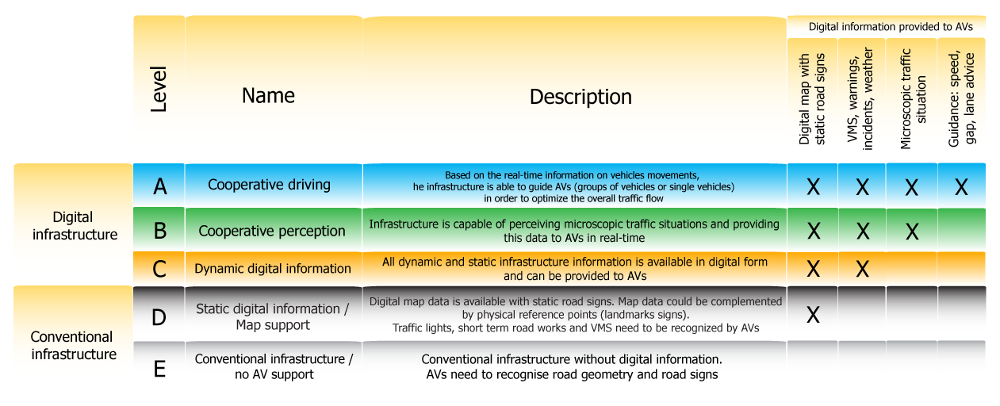

# Digital road infrastructure and connectivity {#digital}

## Vehicle to everything communication {#v2x}

**Updated: 24th March 2023**

### Synonyms {-}
*Connected Vehicle (CV), Connected Vehicle technologies (CVT), Vehicle-to-x (car and infrastructure) (C2x/V2x), Cooperative Intelligent Transport Systems (C-ITS), Cellular-V2X technology (C-V2X)*

### Definition {-}
Through Intelligent Transportation Systems (ITS), various Connected Vehicle (CV) technologies have been developed in recent years to contribute to safer roads through cooperative situational awareness and hazard avoidance. Two main types of communication have been proposed: vehicle-to-vehicle (V2V) and vehicle-to-infrastructure (V2I) communication (Outay et al., 2019). 
C2X (car to everything) or more broadly V2X (vehicle to everything) is the new technology that enables both communication between vehicles (car-to-car) and information exchange with infrastructure (car-to-infrastructure) (ADAC, 2021). <br/><br/>
V2V offers benefits in terms of increased safety, as it can prevent accidents by allowing a vehicle to exchange real-time information about speed, location and direction with other vehicles in the surrounding area. In addition to their safety applications, V2V and V2I communications can potentially help reduce fuel consumption and emissions due to the fact that excessive pollutant emissions are often associated with heavy braking, changing traveling speeds and acceleration/deceleration, especially at signalised intersections. In the context of smart cities, many researchers are exploring the potential use of connected vehicles to support eco-friendly driving by reducing CO~2~ emissions. This is often achieved through vehicle-to-vehicle (V2V) and vehicle-to-roadside unit RSU (V2I) inter-connectivity to harmonise vehicle speeds by maintaining traffic flow and reducing unnecessary stops and starts (Outay et al., 2019).<br/><br/>
In terms of the communication technology used for V2X, according to Dey et al. (2016) Dedicated Short Range Communication (DSRC) was considered the primary option for CVT security applications in 2016. However, the use of other radio technologies such as Wi-Fi, LTE or WiMAX enables communication with greater range and provides higher throughput requirements that could not be supported by DSRC alone. In addition, the use of other radio technologies potentially reduces the need for costly DSRC infrastructure.


### Key stakeholders {-}

- **Affected**: Car drivers, Insurers
- **Responsible**: National Governments, Private Companies, Car Manufacturers, Infrastructure operators

### Current state of art in research {-}
Many research papers focus on the technical performance of this technology, the comparison of V2V with V2I and the mixing of V2V vehicles with non-V2V equipped vehicles. As in 2019, the idea of combining V2V and V2I communications into a hybrid V2X alert system has already became reality (Outay et al., 2019).<br/><br/>
Moreover, research is conducted on the comparison of available communication technology to ensure the fastest, most efficient and error-free solution. Currently, there are two possibilities under discussion for Car2X communication. Firstly, the IEEE 802.11p Dedicated Short Range Communication (DSRC) and secondly, the Cellular-V2X technology (C-V2X). The former is based on the IEEE 802.11 WiFi standard, while C-V2X is based on 4G LTE, with a roadmap towards 5G C-V-to-X. While China and USA primarily rely on C-V2X, Europe is still undecided as to whether car networking should take place via pWLAN or via C-V2X. This creates an international confusion of languages. As a result, vehicles may not be able to communicate without errors because they use different languages (Köllner, 2020).<br/>

IEEE 802.11p is technically very advanced and operates with minimal latencies. But the advantage of 5GAA technology is that 5G is to be introduced globally on a massive scale in the near future and the fast-mobile radio standard will be in the car anyway, if only to transmit the huge amounts of data generated by autonomous driving. Moreover, in a dense 5G network, far fewer of the 5.9 GHz units needed for direct communication have to be integrated into the infrastructure than with the 802.11p solution. Some of the tasks of these units will then be taken over by the 5G network (Knecht, 2018).<br/>

An often cited paper since the release of the Third Generation Partnership Project (3GPP Release 16), which includes the first V2X standard based on 5G New Radio (NR), introduces an in-depth treatment of the key aspects of 5G NR V2X. These include the physical layer, the resource allocation, the quality of service management, the enhancements introduced to the user interface and the mobility management for V2N (Vehicle to Network) communications, as well as the co-existence mechanisms between 5G NR V2X and LTE V2X (Casteneda Garcia et al., 2021). While 5G is still in its early adaption, 6G for V2X is already in its starting pit in which machine learning (ML) and artificial intelligence (AI) play an important role in advanced vehicular communication and networking (Noor-A-Rahim et al., 2022; Namatherdhala et al., 2022). Non-orthogonal multiple access (NOMA) and backscatter communications are considered to be promising technologies for beyond the fifth-generation (5G) due to their applications in large-scale IoT networks (Ullah Kahn, 2022).

### Current state of art in practice {-}
So far, C2X is only available from some manufacturers: all Audi models (except R8, Q2, TT), BMW (all vehicles since 2018), Ford models since September 2019, Volkswagen Golf 8, all Volvo models and and Porsche (except 718) always have C2X on board as a standard. This is desirable from the point of view of consumer protection, because the more cars are equipped with C2X, the more accurate this system is in preventing accidents. Only Golf and Volvo models have C2X free of charge after purchase. All other manufacturers charge money for C2X after one to three years. Moreover, C2X is never available on its own, but only in a package with other Connect services that do not necessarily have anything to do with road safety (ADAC, 2021).<br/><br/>
Several important technical specificities should be considered for V2V communication:

-	The time it takes for a warning to reach another car. This varies greatly between manufacturers, ranging from 0.1 seconds to 2 minutes - with the latter value being far too slow for many situations (e.g. the end of a traffic jam behind a bend). 
-	Various transmission techniques currently prevent cars from all manufacturers from warning each other.
-	With many manufacturers, warnings cannot be passed on if the car is in a cellular network dead zone.
-	The number of dangerous situations that are warned about varies from manufacturer to manufacturer.

In the table below, we compare how the warnings specification differ between three car manufactures: 

```{r table46, echo=FALSE, results='asis'}
cat('|Audi|Ford|Mercedes|
|:----:|:----:|:----:|
|broken-down vehicles|broken-down vehicles|breakdown|
|accidents|general traffic warning|accident|
|end of traffic jam|end of traffic jam|-|
|fog, black ice|dangerous road conditions (icy, heavy rain, oil, etc.) |heavy rain, fog, crosswind and icy roads|
|online traffic sign information|-|hazard warning lights switched on|
|-|-|additional hazard manually reported by the driver through the navigation menu|
|display of the probability of free parking spaces along roads incl. additional information such as prices|-|-|
|speed recommendation to reach the next traffic light in a green phase|-|-|
|-|road works|-|
|-|objects, animas, people on the road|-|
|-|wrong-way drivers|-|')
```

Moreover, the ADAC's recommendations to the manufacturers are the following (ADAC, 2021):

-	The manufacturers should quickly agree on a transmission technology
-	C2X should quickly become standard equipment
-	Safety-relevant C2X functions should not cause any follow-up costs

A basis for cooperative systems is currently being established in Europe. The procedures for testing under real traffic conditions are being defined and coordinated among the partners involved. A large part of the technical solutions for data communication is standardised. The non-technical aspects (e.g. organisational structures, safety concept) are currently being worked out in preparation for the market launch in a public-private partnership.<br/><br/>
On this basis, German, Dutch and Austrian road operators, together with partners from industry, are starting the step-by-step introduction of cooperative systems in Europe within the framework of the C-ITS corridor from Rotterdam to Frankfurt am Main and Vienna
(Cooperative ITS Corridor, n.d.). <br/><br/>
In Austria, with the award of a comprehensive framework contract, ASFINAG has now become the first infrastructure provider in Europe to reach a further milestone in networking vehicles and roads. The total volume of the framework contract is 14.5 million euros. This will make it possible to equip the entire motorway network in Austria with C-ITS in the coming years. The equipment, which will be installed step by step along the motorways starting in November 2020, includes up to 525 so-called road units (“WLAN-Boxen) as well as a control centre and is expected to be ready in 2023 (ORF, 2021). The C-ITS service is supposed to improve hazard warning and support automated driving and network traffic management. The C-ITS equipment is part of the digitalisation of the road infrastructure and is funded by the Climate and Energy Fund and the EU (Močnik, 2020). Additionally, a C-Roads platform has been established in Europe (including 18 European states), coordinated by Austria, to strategically coordinate the implementation of C-ITS in Europe (AustriaTech, 2023).<br/>

Initiatives that promote the implementation of V2X for active and eco-mobility is a project in Salzburg on Bike2CAV. It focuses on the implementation of technologies and V2X communication to avoid collisions of cyclists (Salzburg, 2023). Also, the report of the “Bundesanstalt für Straßenwesen” in Germany (Federal Highway Research Insitute) recommends V2X communication standards IEEE 802.11p for public transport by providing a roadmap and ways for gradual upgrade to V2X-based PT prioritisation (Gay et al., 2022).

### Relevant initiatives in Austria {-}

- [infothek.bmk.gv.at](https://infothek.bmk.gv.at/fahrer-assistenzsysteme-verkehrssicherheit-vernetzung/) 
- [c-its-korridor.de](https://c-its-korridor.de/?menuId=1&sp=en) 
- [asfinag.at](https://www.asfinag.at/ueber-uns/newsroom/pressemeldungen/2020/wlan-ausbau-cooperative-intelligent-transport-systems/) 
- [kununu.com](https://www.kununu.com/de/automotive-safety-technologies/news/car2x-projekt-in-oesterreich-praesentiert) 
- [hitech.at](https://www.hitech.at/mobilitaet/wohin-geht-die-fahrt) 
- [Bike2CAV](https://www.bike2cav.at/)

### Impacts with respect to Sustainable Development Goals (SDGs) {-}

```{r table44, echo=FALSE, results='asis'}
cat('| Impact level| Indicator|Impact direction| Goal description and number|Source|
|:------------:|:-----------:|:------------:|:------------:|:------------:|
|Individual|Improvement of road safety|**+**|Health & Wellbeing (*3*)|Filippi et al., 2016|
|Individual|V2X communications will come at no cost to the end user|**+**|Sustainable economic development (*8,11*)|Hainen et al., 2019|
|Systemic|Emissions reduced|**+**|Environmental sustainability (*7,12,13,15*)|Outay et al., 2019|
|Systemic|Increased efficiency of transport systems|**+**|Sustainable economic development (*8,11*)|Filippi et al., 2016|')
```

### Technology and societal readiness level {-}

```{r table45, echo=FALSE, results='asis'}
cat('|TRL| SRL|
|:----:|:----:|
|6-8|5-7|')
```

### Open questions {-}
1. Which combination of the different communication options is the best?
2. Which communication technology is the most suitable for Europe?
3. Are infrastructure operators already taking care of making data internationally compatible so that cars can communicate with it?


### Further links {-}

- [c-its-korridor.de](https://c-its-korridor.de/?menuId=1&sp=en) 
-	[nhtsa.gov](https://www.nhtsa.gov/technology-innovation/vehicle-vehicle-communication) 

### References {-}
-	ADAC. (2021). Welche Hersteller bieten bereits C2X an? Datenquelle Original-Rückmeldungen.Available at: https://assets.adac.de/image/upload/v1595919606/ADAC-eV/KOR/Text/PDF/Umfrage_Hersteller_Car2X_dl45xm.pdf [Accessed: 15. March 2023]
-	AustriaTech (2023). C-Roads Austria 2. Coninutation of the roll-out of C-ITS in urban areas and coordination of international cooperation. Available at: https://www.austriatech.at/en/projects//showprojekt/37/C-Roads%20Austria%202 [Accessed: 17. March 2023]
-	Casteneda Garcia, M. H., Molina-Galan, A. Boban, M., Gozalvez, J., Coll-Perales, B., Sahin, T., Kousardas, A. (2021). A Tutorial on 5G NR V2X Communications. IEEE Communications Surveys & Tutorials, 23, 3, 1972-2026. 10.1109/COMST.2021.3057017.
-	Cooperative ITS Corridor. (n.d.). Cooperative ITS Corridor. Available at: https://c-its-korridor.de/?menuId=1&sp=de [Accessed: 18 February 2021]
-	Dey, K. C., Rayamajhi, A., Chowdhury, M., Bhavsar, P., & Martin, J. (2016). Vehicle-to-vehicle (V2V) and vehicle-to-infrastructure (V2I) communication in a heterogeneous wireless network - Performance evaluation. Transportation Research Part C: Emerging Technologies, 68, 168–184. https://doi.org/10.1016/j.trc.2016.03.008
-	Filippi, A., Moerman, K., Daalderop, G., Alexander, P. D., Schober, F., & Pfliegl, W. (2016). Ready to roll: Why 802.11p beats LTE and 5G for V2x. 1–14.Available at:  https://www.siemens.com/content/dam/webassetpool/mam/tag-siemens-com/smdb/mobility/road/connected-mobility-solutions/documents/its-g5-ready-to-roll-en.pdf [Accessed: 30 September 2021]
- Gay, M., Grimm, J., Otto, T., Partzsch, I., Gersdorf, D., Gierisch, F., Löwe, S., Schütze, M. (2022). Nutzung der C2X-basierten ÖV-Priorisierung an signalisierten Knotenpunkten (Applicability of V2X for transit signal priority). BAST: Bundesanstalt für Straßenwesen. Available at: https://bast.opus.hbz-nrw.de/opus45-bast/frontdoor/deliver/index/docId/2595/file/V353+BF+Gesamtversion.pdf [Accessed: 17. March 2023]
-	Hainen, A., Mulligan, B., Deetlefs, J., Mulligan, I., & Ashley, P. (2019). Co-Deployment of DSRC Radio and Cellular Connected Vehicle Technology in Tuscaloosa, AL and Northport, AL. 1–9.
-	Knecht, J. (2018). C-V2X Europapremiere: Wie Autos sprechen – mit wem auch immer | AUTO MOTOR UND SPORT. https://www.auto-motor-und-sport.de/technik/vernetzung-cv2x-car-to-car-europapremiere/
-	Köllner, C. (2020, March 24). Car-to-X | Fahrzeugvernetzung per C-V2X oder pWLAN? | springerprofessional.de. https://www.springerprofessional.de/car-to-x/automatisiertes-fahren/fahrzeugvernetzung-per-c-v2x-oder-pwlan-/17822610
-	Močnik, W. (2020, October 20). ASFINAG startet als erster Autobahnbetreiber Europas Vernetzung von Straße und Fahrzeug.Available at:  https://www.asfinag.at/ueber-uns/newsroom/pressemeldungen/2020/wlan-ausbau-cooperative-intelligent-transport-systems/ [Accessed: 20 Nov 2020].
- Namatherdhala, B., Mazher, N., Krishna Sriram, G. (2022). Uses of Artificial Intelligence in Autonomous Driving and V2X Communication. IRJ ETS: International Research Journal of Modernization in Engineering Technology and Science, 4, 7. Available at: https://www.researchgate.net/profile/Gopala-Sriram/publication/362053482_USES_OF_ARTIFICIAL_INTELLIGENCE_IN_AUTONOMOUS_DRIVING_AND_V2X_COMMUNICATION/links/62d3437dfd347a451bc46ff6/USES-OF-ARTIFICIAL-INTELLIGENCE-IN-AUTONOMOUS-DRIVING-AND-V2X-COMMUNICATION.pdf [Accessed: 17 March 2023]
-	Noor-A-Rahim, Md., Liu, Z., Lee, H., Omar, M. (2022). 6G for Vehicle-to-Everything (V2X) Communications: Enabling Technologies, Challenges, and Opportunities. Proceedings of the IEEE, 110, 6, 712-734. 10.1109/JPROC.2022.3173031
-	ORF. (2021). ASFINAG-Projekt: WLAN auf Autobahnen. Available at: https://salzburg.orf.at/stories/3084849/ [Accessed: 17. March 2023]
-	Outay, F., Kamoun, F., Kaisser, F., Alterri, D., & Yasar, A. (2019). V2V and V2I communications for traffic safety and CO~2~ emission reduction: A performance evaluation. Procedia Computer Science, 151(2018), 353–360. https://doi.org/10.1016/j.procs.2019.04.049
-	Salzburg. (20232). Bike2CAV – Vermeidung von Kollisionen mit Radfahrer/-innen durch Fahrzueg-zu-X-Kommunikation. Salzburg Research. Available at: https://www.bike2cav.at/wp-content/uploads/2021/06/Factsheet_Bike2CAV_6_21_final.pdf [Accessed: 27. January 2023]
-	Ullah Kahn, W., Jameel, F., Kumar, N., Jäntti, R., Guizani, M. (2022). Backscatter-Enabled Efficient V2X Communication With Non-Orthogonal Multiple Access. IEEE Transactions on Vehicular Technology, 70, 2, 1724-1735. 10.1109/TVT.2021.3056220.


## Infrastructure support levels for automated driving {#infrast_support_level}

**Updated: 24th March 2023**

### Synonyms {-}
*Connected Vehicle (CV), Connected Vehicle technologies (CVT), Vehicle-to-x (car and infrastructure) (C2x/V2x), Cooperative Intelligent Transport Systems (C-ITS), Cellular-V2X technology (C-V2X), ISAD*

### Definition {-}
Automated driving means that the control of a vehicle gradually transitions from human to computer systems, including perception of the environment. Automated driving requires certain prerequisites, which can be grouped into the following domains (Erhart et al., 2020):

-	the domain of driver-machine interaction,
-	the domain of vehicle capability,
-	the domain of the road operator, 
-	the domain of laws and regulations.

These domains have been described in more detail in recent years (Erhart et al., 2020):

-	the [SAE](https://www.sae.org/) levels [SAE J3016_201806], describe the degree of automation and the associated division of decision-making and control responsibility between human and machine. 
-	the Operational Design Domains (ODDs), deal with the environmental conditions under which the machine functions operate 
-	the ISAD classification describes the ability of the road infrastructure to provide additional sensor information to vehicles (Carreras et al., 2018).<br/>

The following two figures give an overview of the definition of the classifications of the ISAD levels and the SEA automations levels.

```{r, echo=FALSE, , out.width="70%", fig.cap="Levels of the Infrastructure Support for Automated Driving (ISAD) (Inframix, n.d.)"}

```

```{r, echo=FALSE, , out.width="70%", fig.cap="SAE Levels of Driving Automation (SAE International, 2021)"}
knitr::include_graphics("image/SAE_2021.png")
```
Depending on the degree of automated driving, it will be possible to further reduce the number of accidents, because human error is the cause of as many as 90 percent of all road accidents. However, this process will be lengthy because conventional and automated vehicles will continue to drive in mixed traffic for many years to come. It must be prevented that the technical systems fail or simply misjudge traffic situations (Rudschies & Kroher, 2021).

### Key stakeholders {-}

- **Affected**: "Drivers" of Automated Vehicle
- **Responsible**: National Governments, Private Companies, Car Manufacturers, Infrastructure operators

### Current state of art in research {-}

*Signs readability*<br/>
There is a need for research on the machine readability of traffic signs and road markings. It is not yet clear how such signs should be designed, where they can be placed and under which boundary conditions (weather, speed) they can be recognised. Furthermore, there is a need for additional research on delineators with regard to the problem of locating the automated vehicle through modified delineators, e.g. in the case of invisible lane markings. <br/>

*Digital maps*<br/>
Further research is needed on the implementation of a digital map with consistent, correct and reliable map data. A uniform process must be developed to ensure the quality of the content of a digital map for use in automated driving. In particular, the necessary interfaces and standards of a digital map, its costs, operator models, etc. are currently completely open. When implementing a highly accurate, layered digital reference map, special attention should be paid to its functional reliability, as it is used in the safety-relevant area of automated vehicle control and is thus an integral part of the functional reliability of the automated driving vehicle. <br/>

Furthermore, it should be investigated to what extent, if any, the information from the sensors of automated vehicles can be used for this purpose and whether it can be made usable for the road authorities. There is also a need for research into the implementation of regular roadside inspections. Because how these roadside checks can be carried out and which data can be reliably collected and automatically evaluated has not yet been researched (Heinrich, 2019).<br/>

There are several research projects on specific use cases with some assumptions on infrastructure. They aim to define infrastructure requirements and impacts for different types of CAVs (Ulrich et al., 2020). <br/>

For example, the Austrian research project *"via-AUTONOM"* aims to create a road infrastructure that meets the requirements of autonomous vehicles and all other road users in terms of safety, efficiency and comfort. In other words, the transition period where both, automated vehicles and non-automated road users are present on the roads, will be investigated. Furthermore, it will be determined where these measures need to be implemented. To this end, via-AUTONOM is developing a risk model that identifies critical locations and road sections (e.g. intersections, construction zones, curves with limited visibility) for future penetration of automated vehicles. Based on this, the effectiveness of a predefined set of infrastructure measures and the effects of varying availability and quality of different data sources are investigated using simulation methods. In this way, traffic safety and traffic flow can be evaluated. The project focuses primarily on non-urban roads, i.e. motorways, main roads and rural roads. The results of via-AUTONOM include a set of recommendations for infrastructure measures to support automated driving, a procedure to identify critical road sections in the Austrian road network and a conceptual architecture for the efficient use of data from vehicles, infrastructure and digital maps (Saleh, n.d.).<br/>

The infrastructure has the potential to support automated driving at selected points or in special situations, but the implementation of some measures is very complex. At the level of technical design-related infrastructure measures, one fundamental measure is the early announcement of special traffic situations, which gives the automated driving vehicle a greater reaction time. For scenarios that occur at short notice (e.g. sudden obstacle on the road), however, design-related measures cannot provide any support. <br/>

Traffic and information technology measures can be attributed a certain degree of flexibility in relation to dynamic initial situations. For the commuter driver, only information technology measures such as [V2V](#v2x) or V2I communication are suitable. On the one hand, this would allow short- to medium-term changes in the traffic situation to be transmitted to the vehicle, and on the other hand, it could create redundancy in the transmission of information. For the motorway driver, additional measures at the level of the traffic infrastructure are possible using existing technology (e.g. route control systems, camera detection). 

### Current state of art in practice {-}
All current traffic regulations have been designed according to the requirements of human road users and are therefore oriented towards the possibilities of a human-controlled vehicle. Deviating infrastructure requirements due to automated driving have hardly been considered so far. Adapting the infrastructure to automated driving can bring some advantages. The integration of automated driving into the existing mobility system can only be successful if the existing road infrastructure is further developed and does not take too long or cost too much. Furthermore, it is important to introduce a European or global standard so that the compatibility of the C-ITS also functions across countries. This is already being strived for, at least in Europe (Heinrich, 2019). Fundamentally possible or conceivable measures can be differentiated with the following classification (Heinrich, 2019):

-	Technical design infrastructure
    -	line management
    -	structural elements
  
-	Traffic management infrastructure
    -	ground markings
    -	signage
    -	traffic control systems
    -	traffic signal systems
  
-	Information technology infrastructure
    -	digital maps
    -	vehicle-to-X communication


(Heinrich, 2019) has compiled a list of scenarios and their infrastructure-related measures. The scenarios mentioned are:

-	Infrastructure measures for the Highway
    -	Obstacle in own lane
    -	Missing hard shoulder
    -	Temporary hard shoulder clearance
    -	Work site on directional lane
  
-	Infrastructure measures for the commuter driver
    -	Driving on a one-lane rural road with missing or obscured lane markings
    -	Mixed traffic with high speed differences
    -	Overtaking on a one-lane road
    -	Workplace on one-lane road


Moreover, a highly accurate, layered digital reference map has emerged as a central and promising measure that can support automated driving in most scenarios. [Digital maps](#digital_maps) are the foundation of all navigation and the location of all conceivable traffic-related facilities. Although a geodetic reference system, the World Geodetic System 1984 (WGS 84), has been available for some time as a uniform basis for position information on the earth, a uniform map standard based on it is not yet available. This is mainly the result of the various requirements and applications on the part of road construction authorities or the automotive industry. The NDS standard should provide a solution here in the future. 
By means of an accurate map, both long-term situations and medium- and short-term changes in the traffic situation can be mapped. The basic prerequisite for such a reference map is the availability, topicality and quality of the temporary information. This means, on the one hand, that the events can be localised on the map immediately after they occur and, on the other hand, that an automated vehicle can receive and process this information without delay (Heinrich, 2019).

### Relevant initiatives in Austria {-}
The government programme 2017-2022 in Austria has set the goal of becoming a pioneering country and thus also a research, development and production location for automated driving in close cooperation with the automotive industry and research. In particular, the ministry will continue to promote test tracks and related research projects which will also be ongoing in 2023.

- [Bmk.at](https://www.bmk.gv.at/themen/mobilitaet/alternative_verkehrskonzepte/automatisiertesFahren/aktionsplan.html)

Since the beginning of 2018, ASFINAG has been able to transmit standardised, harmonised C-ITS Day 1 messages on the test route. In May 2019, selected Day 2 messages for automated driving were sent for the first time. These messages aimed to assist vehicles in specific traffic situations by providing speed, lane and vehicle gap recommendations as well as cooperative perception.

- [ISAD](https://www.researchgate.net/publication/339339109_Infrastructure_support_for_automated_driving_Further_enhancements_on_the_ISAD_classes_in_Austria)

Austrian road operator ASFINAG is testing mixed traffic scenarios to cope with the development of automated driving. On the A2 motorway near the city of Graz a twenty-kilometre test site called "ALP.Lab" was set up. The aim of this test site is to provide a complete package of physical and digital infrastructure for the validation of automated driving functions and to test new traffic management strategies for cooperative and networked automated vehicles.  

- [C-ITS](https://www.researchgate.net/publication/339353309_Road_infrastructure_support_levels_for_automated_driving)

ASFINAG was the first motorway operator in Europe to launch the networking of road and vehicle. This includes the installation of 525 WLAN road units (RSU) and a control centre.

- [Asfinag.at](https://www.asfinag.at/ueber-uns/newsroom/pressemeldungen/2020/wlan-ausbau-cooperative-intelligent-transport-systems/)

### Impacts with respect to Sustainable Development Goals (SDGs) {-}

```{r , echo=FALSE, results='asis'}
cat('| Impact level| Indicator|Impact direction| Goal description and number|Source|
|:------------:|:-----------:|:------------:|:------------:|:------------:|
|Systemic|Potential to increase road safety|**+**|Health & Wellbeing (*3*)|Rudschies & Kroher, 2021|
|Systemic|Continuous technological development|**+**|Innovation & Infrastructure  (*9*)|Saleh, P. (n.d.)|
|Systemic|Goals to standardise compatibility of systems on international level|**+**|Partnership & collaborations (*17*)|Heinrich, 2019|')
```

### Technology and societal readiness level {-}

```{r, echo=FALSE, results='asis'}
cat('|TRL| SRL|
|:----:|:----:|
|6-7|4-6|')
```

### Open questions {-}
1. How should traffic signs and road markings be designed  to be recognised as well as possible by an automated car?
2. How to tackle the recognition of certain lane markings or traffic signs that are worn out or have been covered with graffiti or dirt and are therefore no longer readable by an automated car?

### References {-}

-	Carreras, A., Daura, X., Erhart, J., & Ruehrup, S. (2018). Road infrastructure support levels for automated driving.
-	Erhart, J., Harrer, M., Rührup, S., Seebacher, S., & Wimmer, Y. (2020). Infrastructure support for automated driving: Further enhancements on the ISAD classes in Austria. Proceedings of 8th Transport Research Arena TRA 2020, 43(0). https://www.researchgate.net/publication/339339109
-	Heinrich, T. (2019). Infrastrukturbedarf automatisierten Fahrens – Grundlagenprojekt.
-	Inframix. (n.d.). Infrastructure Categorization – Inframix EU Project. Available at: https://www.inframix.eu/infrastructure-categorization/ [Accessed: 21 June 2021]
-	Rudschies, W., & Kroher, T. (2021, May 21). Autonomes Fahren: Der aktuelle Stand der Technik | ADAC. https://www.adac.de/rund-ums-fahrzeug/ausstattung-technik-zubehoer/autonomes-fahren/technik-vernetzung/aktuelle-technik/
-	Saleh, P. (n.d.). via-AUTONOM Verkehrsinfrastruktur und Anforderungen für autonome Fahrzeuge - AIT Austrian Institute Of Technology. Available at: https://www.ait.ac.at/themen/verkehrssicherheit-und-unfallforschung/projects/via-autonom [Accessed: 21 June 2021]
- SAE International. (2021). SAE Levels of Driving Automation Refined for Clarity and International Audience. SAE Blog. Available at: https://www.sae.org/blog/sae-j3016-update [Accessed: 20 March 2023]
-	Ulrich, S., Kulmala, R., Appel, K., Aiger, W., Tenttinen, M., Laitinen, J., & Deliverable, D. (2020). MANTRA: Making full use of Automation for National Transport and Road Authorities - NRA Core Business. D4.2 Consequences of automation functions to infrastructure.

