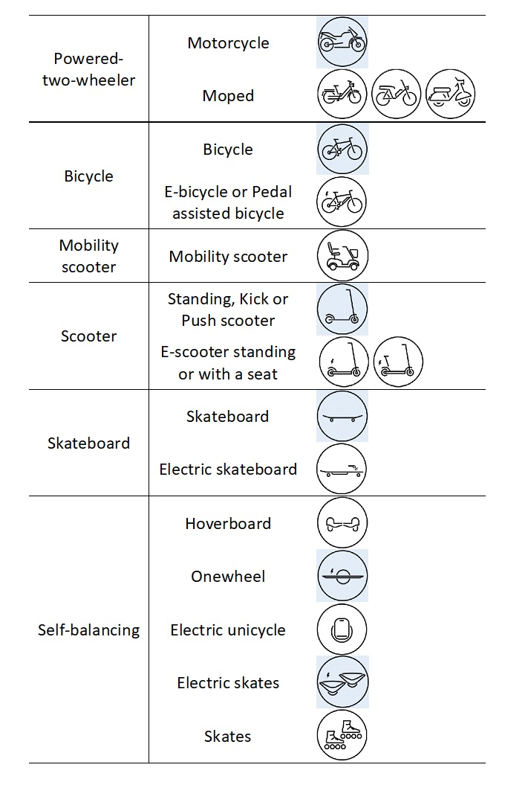
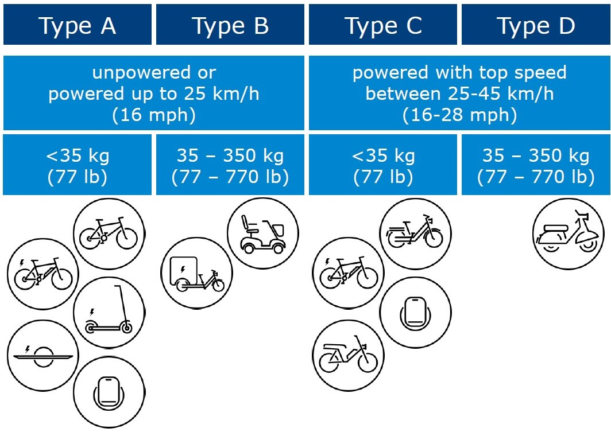
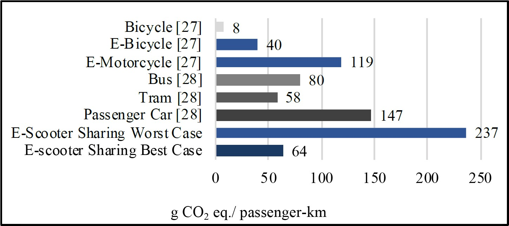

# Multimodal integrated system {#multimodal}

## First-last mile solutions {#flms}

### Synonyms
*first/last/only mile (F/L/O mile), first-last mile (FLM)*

### Definition {-}
The ever-increasing demand for freight and passenger transport in recent years has exacerbated the negative impacts of mobility (congestion, traffic accidents, air pollution, noise and climate change costs). Urban settlements are particularly affected due to higher population density. The term "first-last mile" (FLM) refers to the first and last stages of any transport movement, both passenger and freight which have the most negative effects and highest costs. However, from a planning perspective, the simple identification of the FLM is not easy, as it is not easy to understand where the FLM physically begins and where it ends. The FLM problem originated in the field of telecommunications, defined as the first-last stage to the consumer. For example, in the 1970s and 1980s, cable TV companies had to connect and wire each household individually when the technology was introduced in North America and Europe (Nocera et al., 2020).<br/>

In the transport literature, there are different definitions for such a construct. Arvidsson et al. (2016) defines the FLM in the context of freight transport as the first-last part of the transport chain where goods are transported from a professional party to the customer's location, be it a house, a retail shop, a drop-off point or a factory. In the context of passenger transport, it is defined as the first-last stage of a journey by public transport and often the journey from a transport hub to home.<br/>

In the context of passenger transport, air quality and traffic congestion have been the catalysts for new thinking in urban design. Terms like "liveable", " pedestrianisation" and "green streets" represent the transformation that many European cities are undergoing. Some of the measures being taken are investments in cycling infrastructure, more pedestrian zones, new green spaces and street furniture, and restrictions on the use of private vehicles. Many cities are formalising their plans for more sustainable urban transport systems - as shown by the number of cities across Europe implementing a Sustainable Urban Mobility Plan (SUMP). The *City Database | Eltis* (2021) now contains details of over 1,000 cities involved in ongoing or completed urban mobility projects and initiatives. Micromobility has emerged as a possible solution to some of the problems cities face. It is a mode of transport advocated by the younger generation, who have different travel habits than older generations (Twisse, 2020). <br/>

These new FLM solutions also aim to help improve accessibility to public transport. As public transport is an affordable and sustainable mobility option, improving it through a wide range of transport-based options helps to promote a more equitable society. People who lack mobility to reach places such as jobs, education and childcare are at a transport disadvantage. Access to public transport at both ends of a transit trip has been identified as one of the biggest barriers to improving accessibility to public transport. Minimising the deficit at the first and last mile can make communities more inclusive by increasing the supply of accessible options (Zuo et al., 2020a). The speed advantage of cycling over walking can mitigate the first and last mile problem and provides better point-to-point transit mobility (Zuo et al., 2018). However, heavy car traffic and consequently high congestion make roads less attractive and unsuitable for cyclists (Winters et al., 2011) and lead to fragmented cycling routes (Furth et al., 2016). Meanwhile, the poorly connected cycling network makes cycling less accessible and hinders the accessibility of cycling as a mode of transport (Zuo et al., 2020a).<br/>

Traditional F/L/O mile options are walking and cycling. However, with the development of new technologies, new F/L/O-mile options for personal transport have become available and they are becoming more convenient to use. The new technologies also allow a better integration of different transport modes and tariffs. The merging of different means of transport into a service that meets the mobility needs of individual customers is now an established business model called [Mobility-as-a-Service](#maas) (EEA, 2019).<br/>

Micromobility is the term used to describe the new, exponentially growing trend in urban mobility to improve F/L/O options. The term includes all human-powered micro-vehicles such as bicycles and scooters, but also new micro-vehicles such as e-scooters, e-bikes and some other small, electrically powered vehicles (Oeschger et al., 2020). In the ITF report “Safe Micromobility” (OECD/ITF, 2020), micromobility is defined as: *“[…] the use of micro-vehicles: vehicles with a mass of no more than 350 kg (771 lb) and a design speed no higher than 45 km/h. This definition limits the vehicle’s kinetic energy to 27 kJ, which is one hundred times less than the kinetic energy reached by a compact car at top speed.”* <br/>

The ITF report differentiates between several different micromobility alternatives (OECD/ITF, 2020):

-	Powered two-wheeler
    -	Motorcycle (Powered street vehicle, with two to three wheels and a seat, designed to reach speeds greater than 45 km/h.)
    -	Moped (Powered road vehicle, with two to three wheels and a seat, sometimes equipped with pedals. The maximum speed of the vehicle depends on national regulations, but is usually limited to 45 km/h.)
-	Bicycle
    -	Bicycle (A vehicle with two or more wheels that is generally propelled by the muscular power of the persons on that vehicle, through a pedal system, lever or handle.)
    -	Pedal assisted bicycle or E-Bike (Pedelec <25 km/h, Speed-pedelec >25 km/h)
-	Mobility scooter (specifically designed for people with restricted mobility, mostly elderly or disabled) 
-	Scooter
    -	Standing scooter, Kick scooter or push scooter (A vehicle with a handlebar, deck and wheels that is propelled by pushing off the ground. There are models with two, three or four wheels. Stand-up scooters differ from skateboards in the presence of a central steering column and a set of handlebars.)
    -	E-scooter and standing or with a seat (A standing or sitting scooter that can be propelled by the electric motor itself.) 
-	Skateboard
    -	Skateboard (Board with four wheels on two axles, propelled by the user kicking against the ground.) 
    -	Electric skateboard (Skateboard with electric battery, motor, and wireless remote controller.) 
-	Self-balancing
    -	Hoverboard (Self-balancing micro-vehicle consisting of two motorised wheels connected to a pair of articulated pads on which the rider places his feet. The rider controls the speed by leaning forward or backward and the direction of travel by twisting the pads.)
    -	Onewheel (Self-balancing electric wheel with a platform on which the user stands. The feet are at a 90° angle to the direction of travel.)
    -	Electric unicycle (Self-balancing, single-axle, personal transport device operated with the feet in the direction of travel with a single wheel or with two wheels. The rider controls the speed by leaning forward or backward and steers by turning the device with the feet).
    -	Electric skates (Skates with electric battery and motor, controlled by the user leaning forward or backward or using a remote controller.) 
    -	Skates (Pair of boots with a set of wheels fixed to the bottom.)

```{r, echo=FALSE, out.width="50%", fig.cap="Micromobility (adapted from OECD/ITF (2020)."}

```

Definitions, classifications and regulatory frameworks for micromobility vary around the world. Bicycles are the smallest vehicle in most countries' classifications. Consequently, a number of micro-vehicles - such as standing e-scooters, e-skateboards and self-balancing vehicles - are excluded from classifications. In some cases, they are classified as toys and are therefore not allowed on public roads. As a temporary solution, Korea has classified these devices as cars. The authorities in Singapore decided to create a new vehicle category called "Personal Mobility Device" (PMD). Given the obvious international importance of micro-vehicles and the difficulty in defining and categorising them, it might be useful to develop an internationally recognised classification system for them (OECD/ITF, 2020).<br/>

In the [European Union Regulation No. 168/2013](https://unece.org/resolutions), micromobility vehicles are in class L (UNECE, 2017). Class L vehicles are motorised two-, three- and four-wheeled vehicles. The category uses power, energy source, speed, length, width and height as classification criteria. However, only "powered electric bicycles with a maximum speed of 25 km/h and a net power of between 250 watts and 1 000 watts" and "any two-wheeled vehicle with a maximum design speed of more than 25 km/h and up to 45 km/h and a net power of up to 4 000 watts" can be classified in the L1e category of "light two-wheeled motor vehicles". Other micro-vehicles do not fit into any category. OECD/ITF (2020) proposes to classify micromobility as follows:

```{r, echo=FALSE, out.width="50%", fig.cap="Proposed classification of micro-mobility devices (OECD/ITF (2020)."}

```

In terms of freight transport, [intermodal freight](#intermodal_freight) transport is crucial as a feeder to cities to reduce emissions. In the city centre (see [urban deliveries](#urban_delivery)) there are two main areas that could provide practical and relevant solutions to address the challenges and efficiency of last mile freight transport: (1) freight demand management (FDM) measures and (2) improving parking and charging infrastructure. One FDM measure would be to push for out-of-hours deliveries in order to change the delivery activities of freight forwarders and shippers. Furthermore, receiver prices as well as incentives could play an important role in reducing freight transport. (Holguín-Veras & Sánchez-Díaz, 2016). In European cities (especially in France), a significant proportion of double-parked delivery vehicles (delivery vehicles parked on the street parallel to parked cars) is observed (Patier et al., 2014). In this context, [Smart delivery space booking](#space_book) could reduce the effects. [Passenger drones](#passenger_drones) and [Electric vehicle delivery fleets](#electric_delivery_fleets) could also reduce some of the externalities of freight transport in cities, but they might also create some new negative externalities. 

### Key stakeholders {-}
- **Affected**: All citizens
- **Responsible**: Transport service providers and public transport operators, MaaS operators and integrators, city councils, local, regional and national authorities 

### Current state of art in research {-}
EEA (2019) concludes that better F/L/O-mile connectivity in cities can significantly improve environmental and health outcomes. However, realising this potential requires a deep understanding of the different options, their strengths and weaknesses and their impacts on the mobility system as a whole. This is not always easy, as the environmental and health impacts of F/L/O mileage options depend on how they are used and what they replace. This highlights the fact that the increasing availability of e-scooters and digital ride-sharing platforms is changing mobility behaviour in cities, but does not always favour the more climate-friendly choice. A simple example would be a short trip with an e-scooter. If this trip replaces a motorbike or car ride, the environmental and health effects are positive. If it replaces a trip on foot or by bicycle, the situation worsens. More transport options can also lead to people making additional or longer trips, which in turn could worsen the situation. Furthermore, public transport will remain an essential part of any sustainable urban transport system. Good F/L/O-mile options can make public transport more attractive and increase its use, but not replace it completely  (EEA, 2019). Laa & Leth (2020) also notes that e-scooter trips mostly replace trips that would otherwise have been made by a more sustainable mode of transport. <br/>

In terms of Environmental sustainability Severengiz et al. (2020) compares the g CO~2~ eq/passenger km (pkm) of different modes of transport (Figure 7.3). Whereby Moreau et al. (2020) compared dockless and private e-scooter and calculated 131g CO~2~ eq/pkm for the shared vehicle and 67g CO~2~ eq/pkm for the private vehicle.

```{r, echo=FALSE, out.width="50%", fig.cap="Comparison of the CO~2~  equivalent emissions per passenger-km of different modes of transport (Severengiz et al., 2020)"}

```

Accessibility is an indicator of the ability to reach frequently visited places efficiently. This is gaining increasing attention as a complement to the more traditional mobility-based performance measures in transport planning, such as 'average delays' and 'level of service'. Assessing performance from an accessibility perspective provides a balanced, more holistic approach to transport analysis and planning. In particular, it considers alternative strategies to reduce congestion and mitigate environmental problems, such as promoting efficient, resource-efficient land use policies. Accessibility is a product of mobility and proximity, improved either by increasing the speed of getting between point A and point B (mobility), or by bringing points A and B closer together (proximity), or by a combination of these. In this sense, an accessibility-based approach lends legitimacy to land use initiatives and urban management tools (Cervero, 2005).
However, accessibility is defined differently in the literature. Shin et al., 2007) measured accessibility using proximity indices (distance and walking time to the nearest metro station). Martínez & Viegas, 2009) defined accessibility by proximity to public transport nodes and the road network. In gravity-like measures, the accessibility of a zone is determined by the destinations that can be reached from that zone, negatively weighted by the travel time, distance or cost between these two zones (Grengs et al., 2010). In the isochronous approach, accessibility is measured as the number of destinations that can be reached within a given travel time (Cervero, 2005). Fan et al., 2012) examined the impact of introducing light rail on transport equity using the cumulative 30-minute accessibility of jobs by public transport. The first and last mile is an important component of a transit trip and determines whether the transit service is accessible or not. Cycling (or other FLM options) reduce transport inequality by increasing the catchment area of public transport so that people can reach more jobs by public transport (Zuo et al., 2020). <br/> 

However, accessibility is defined differently in the literature. Shin et al. (2007) measured accessibility using proximity indices (distance and walking time to the nearest metro station). Martínez & Viegas (2009) defined accessibility by proximity to public transport nodes and the road network. In gravity-like measures, the accessibility of a zone is determined by the destinations that can be reached from that zone, negatively weighted by the travel time, distance or cost between these two zones (Grengs et al., 2010). In the isochronous approach, accessibility is measured as the number of destinations that can be reached within a given travel time (Cervero, 2005). Fan et al. (2012) examined the impact of introducing light rail on transport equity using the cumulative 30-minute accessibility of jobs by public transport. The first and last mile is an important component of a transit trip and determines whether the transit service is accessible or not. Cycling (or other FLM options) reduce transport inequality by increasing the catchment area of public transport so that people can reach more jobs by public transport (Zuo et al., 2020). <br/>

EEA (2019) summarises the lessons learned for systemic change through the use of First/Last/L only mileage options as follows:

-	Make the impacts of mobility choices clear and offer alternatives
    -	Confront road users with the costs incurred by their mobility choices (internalise the external costs of each mode of transport)
    -	Offer sufficient and convenient alternatives
-	Promote active transport as the first/last/only option for the mile
-	Align technology with sustainable mobility goals

Bruzzone et al. (2021) and Nocera et al. (2020) explore the combination of passenger and freight flows with a focus on the last mile. Such a model is an integrated system in which passengers and goods share vehicles, infrastructure, urban space or more than one of these simultaneously. For example, Fatnassi et al. (2015) show the potential sustainability gains of sharing goods and passengers in a network with a focus on improving service time and energy waste.<br/>

In terms of safety [OECD/ITF](https://www.itf-oecd.org/safe-micromobility) 2020 find out that a trip by car or motorbike in a dense urban area is much more likely to cause fatalities of road users than a trip by a type A micro vehicle. A modal shift from motor vehicles to Type A micro-vehicles can, therefore, make a city safer. A shift from pedestrians to Type A micro-vehicles would have the opposite effect. The safety of e-scooters is likely to improve over the next few years as users learn to navigate urban traffic and drivers get used to the new forms of mobility. Safety will also improve as governments introduce safe cycling infrastructure and targeted safety regulations for micro-vehicles and shared mobility services. There are significant regulatory challenges due to the rapid pace of innovation in micro-vehicle development. They suggest the following measures to improve the safety of micromobility:

-	Provide protected space for micromobility and keep pedestrians safe (Where pedestrians do not feel safe on pavements, the number of people walking will decrease).
-	Low speeds of e-scooters and e-bikes should be regulated as bicycles, higher speeds of micromobiles as mopeds
-	Collect data on micro-vehicle trips and accidents (in order to proactively manage the safety performance of road networks)
-	Incorporate micromobility into road user education
-	Combat drunk driving and speeding for all types of vehicles
-	Remove incentives for micromobile drivers to speed (Minute-by-minute rental can be an incentive to speed or ignore traffic rules. Alternatives include a fixed driving fee, a distance-based fee or a membership fee).
-	Improve micro-vehicle design (Micro-vehicle manufacturers should try to improve stability and road grip. Solutions could be found in pneumatic tyres, larger wheels and frame geometry, but also in areas that still need to be explored).
-	Reduce general risks associated with micromobility sharing (minimise vehicle kilometres driven by escort vehicles for moving or charging micromobility devices, use removable or higher capacity batteries and plug-in docks, allocate space for on-street parking of micro-vehicles).

### Current state of art in practice {-}

To combat the traffic collapse threatening cities - the so-called last mile is proving to be particularly problematic, discouraging many from leaving their cars at home. To change this, Haas, 2018) identifies four challenges that need to be addressed.<br/>

**Challenge 1: Accessibility** <br/>
It happens quite often that no sharing transport can be offered in the vicinity. *"On average, our customers are willing to walk 300 metres to a car."* says Olivier Reppert, (head of the car-sharing market leader Car2go). *"If that doesn't work several times, they jump off."* The company is, therefore , working hard to bring the vehicles as close as possible to the customers. *"We know very precisely where which car should be at which time."* says Reppert. This can be determined precisely through anonymous data collection. But: *"Today, we are not yet in a position to always target exactly these points."* Reppert has high expectations for the future use of autonomous vehicles that move themselves to carsharing hotspots: *"Then we would only need 50 per cent of the current fleet to serve the same demand."* he says.<br/>

**Challenge two: The combination**<br/>
To enable the perfect combination of the different offers, an app is needed that includes all options and coordinates them with each other. So far, there are only a few such apps with as many means of transport as possible in the cities. This could improve if the cities, which should have the best overview of the available means in their area, take the lead themselves.<br/>

**Challenge three: The legal situation**<br/>
*"If various small vehicles simply share the footpaths, cycle paths or roads, this will lead to more accidents"* says Markus Friedrich (professor of traffic planning and traffic control technology at the University of Stuttgart). However, there is not enough space to offer a separate lane for each type. He, therefore, sees the solution in a change to the current speed limits in the road traffic regulations: *"With a standard speed of 30km/h, vehicles can share the road space better."* says the professor. *"And as soon as many vehicles have electric drives, a limit of 20km/h is conceivable in the current 30km/h speed zones."* On main urban roads, higher speeds could still be allowed.<br/>

**Challenge four: The public transport upgrade**<br/>
The numerous additional services could not only complement but replace bus and rail. Demand could increase significantly if the advantages of the gained efficiency unfold - from higher availability to cheaper prices. Therefore, public transport must be made faster so that it offers a travel time advantage. What is needed, Friedrich says, are express buses and express trains that are given their own routes and do not stop as often as before. Many cities would need a much denser frequency or additional express trains. <br/>

A new coalition, Micromobility for Europe (MMfE), has come together in Europe in 2021. Eight e-scooter operators (Bird, Bolt, Dott, FreeNow, Lime, TIER, Voi and Wind) want to contribute to the development of a coherent policy framework in Europe through this coalition (Intelligent Transport, 2021).<br/>

Research and Markets (2021) names bike sharing, kick scooter sharing and scooter sharing as the dominant micromobility sharing modes. By 2020, the global fleet is estimated to be around 20.5 million vehicles. Globally, bike sharing is currently estimated to account for almost 98% of the fleet size of the micromobility market. The most important factor cited is the advancement of technologies. Innovations mentioned are infrastructure solutions (e.g. smart docking stations, solar-powered charging stations and mobility hubs), hardware solutions (e.g. smart locks and sensors) and high-end software solutions (e.g. mapping and navigation, fleet security, real-time fleet data and analytics, and smart fleet management), driven by AI engines and IoT sensors. It also mentions that micro-mobility business models are evolving. For example, there are already public-private partnerships, private bike-sharing schemes and non-profit programmes. It is expected that micromobility systems will continue to be embedded in municipal transport and become an integral part of the emerging Mobility-as-a-Service (MaaS) ecosystem.<br/> 

In 2018, the first full year after the launch of e-scooter sharing, Americans have already taken 38.5 million trips on shared e-scooters (compared to station-based bike sharing with 36.5 million trips, which has been on the market for almost ten years). However, the existing demand for other micro-mobility has not decreased. Which indicates that it makes sense to support different models/vehicles. Considering the high demand and rapid adoption of micromobility options, the expected global market potential is over $500 billion by 2030 (Eliasen, 2021). In comparison, the micromobility market in Europe is estimated to be worth over 100 billion euros in 2030 (Twisse, 2020).
Most new micromobility platform startups (mainly e-scooters) were initially unprofitable because the operational costs of running e-scooters (charging, repair/maintenance, insurance and payment fees) were so high that the payback period for the initial scooter purchase was shorter than the lifetime of the scooter, resulting in a negative return on investment per scooter. According to Travis VanderZanden, CEO of Bird, the profitability of the units has improved significantly in recent years due to improvements in the durability of the scooters and price increases for customers (Eliasen, 2021).

### Relevant initiatives in Austria {-}

**Passenger FLM**

- E-scooters
    - [Autorevue.at](https://autorevue.at/ratgeber/e-scooter-wien-vergleich)
    - [Stadt-wien.at](https://www.stadt-wien.at/wien/news/e-scooter-sharing-system-in-wien.html)
    - [Wien.gv.at](https://www.wien.gv.at/verkehr/scooter-roller/index.html)
    - [Öamtc.at](https://www.oeamtc.at/thema/fahrrad/e-kleintretroller-e-scooter-in-oesterreich-31721872)
    - [Österreich.gv.at](https://www.oesterreich.gv.at/themen/freizeit_und_strassenverkehr/Elektro-Scooter,-Quads-und-Co/Seite.610110.html)


- Bicycle and E-Bicycle hire
    - [Firmenradl.at](https://firmenradl.at/cms/)
    - [Citybikewien](https://www.citybikewien.at/de)
    - [Citybikesalzburg](http://www.citybikesalzburg.at/)
    - [Nextbike](https://www.nextbike.at/de/niederoesterreich/)
    - [Tpis.at](https://www.tips.at/nachrichten/linz/land-leute/523512-linzer-radverleih-startet-im-fruehjahr-an-40-standorten)


- Car sharing
    - [VCÖ](https://www.vcoe.at/presse/presseaussendungen/detail/carsharing-haushalte-potential-2018)
    - [ÖBB](https://www.carsharing-wien.com/anbieter/oebb-rail-and-drive)


- Ride-hailing & Ride-sharing
    - [Ots.at](https://www.ots.at/presseaussendung/OTS_20210113_OTS0026/free-now-will-als-erste-mobilitaetsplattform-in-europa-bis-2030-null-emissionen-erreichen)
    - [Umweltberatung.at](https://www.umweltberatung.at/carsharing-mitfahrboersen)
    - [Greendrive.at](https://greendrive.at/premium/#benefits)
    - [Carployee.com](https://www.carployee.com/#start-section)
    - [Ummadum.com](https://ummadum.com/)


- Mobility-as-a-Service
    - [Blog.railcargo.com](https://blog.railcargo.com/en/artikel/smart-cargo-erstmontage)
    - [Statistik.at](https://www.statistik.at/web_de/statistiken/energie_umwelt_innovation_mobilitaet/verkehr/schiene/gueterverkehr/index.html)
    - [Railcargo.com](https://www.railcargo.com/de/unternehmen/international/oesterreich)

- Passenger drones
    - [Derbrutkasten.com](https://brutkasten.com/autonome-lufttaxis-linz-ag-facc-ehang/)
    - [Derstandard.at-1](https://www.derstandard.at/consent/tcf/story/2000103120464/erste-teststrecke-fuer-e-lufttaxis-2020-in-linz)
    - [Derstandard.at-2](https://www.derstandard.at/consent/tcf/story/2000122402408/flugtaxis-wann-kommt-der-tesla-der-luefte)


- Demand responsive transit
    - [Bedarfsverkehr.at](https://www.bedarfsverkehr.at/content/Literatur)
    - [Repositum.tuwien.at](https://repositum.tuwien.at/handle/20.500.12708/1312)
    - [Projekte.ffg.at](https://projekte.ffg.at/projekt/2929323)


- Mobility hubs
    - [Wienmobil-stationen](https://www.wienerlinien.at/web/wiener-linien/wienmobil-stationen)
    - [Tim-oesterreich](https://www.tim-oesterreich.at/)
    - [Wien.gv.at](https://www.wien.gv.at/stadtentwicklung/studien/pdf/b008521.pdf)


**Freight FLM**

- Urban Deliveries
    - [Logistik2030.at-1](https://www.logistik2030.at/?page_id=268)
    - [Infothek.bmk.gv.at](https://infothek.bmk.gv.at/gruene-stadtlogistik-post-testet-city-hubs-in-wien/)
    - [Logistik2030.at-2](https://www.logistik2030.at/?page_id=63)
    - [Remihub.at](https://www.remihub.at/)
    - [Logpoint.at](https://logpoint.at/ueber-uns/gruene-logistikwelt-und-standorte/)
    - [Wu.ac.at](https://www.wu.ac.at/scm/projekte/)
    - [Post.at](https://www.post.at/p/c/vorzimmer-zustellung)


- Smart delivery space booking
    - [Ots.at](https://www.ots.at/presseaussendung/OTS_20150123_OTS0044/simple-stressfreie-ladezonensuche-wk-wien-praesentiert-neue-app)
    - [WKO1](https://www.wko.at/service/verkehr-betriebsstandort/Ladezonen-Nutzung.html)
    - [WKO2](https://www.wko.at/service/w/verkehr-betriebsstandort/ladezone-wien-app.html)
    - [FFG](https://www2.ffg.at/verkehr/projekte.php?id=805&lang=de&browse=programm)

- Delivery drones
    - [Öamtc.at](https://www.oeamtc.at/thema/drohnen/drohnen-info-app-26853120)

- Freight hubs
    - [Infrastruktur.oebb.at](https://infrastruktur.oebb.at/en/partners/terminals/locations/terminal-wien-sued)
    - [DHL-freight-connections.com](https://dhl-freight-connections.com/de/unternehmen/dhl-eroffnet-hochmodernes-logistikdrehkreuz-am-flughafen-wien/)
    - [Logistik2030.at](https://www.logistik2030.at/?page_id=63)
    - [Thinkportvienna.at](https://www.thinkportvienna.at/ueber-uns/projekte/)
    - [Hafen-wien.com](https://www.hafen-wien.com/de/home)


### Impacts with respect to Sustainable Development Goals (SDGs) {-}

```{r , echo=FALSE, results='asis'}
cat('| Impact level| Indicator|Impact direction| Goal description and number|Source|
|:------------:|:-----------:|:------------:|:------------:|:------------:|
|Systemic|Reduction in transit service inequality|          **+**|Equality (*5,10*)|Zuo et al., 2020b|
|Systemic|Reduction in negative externalities but substitution of more environmentally friendly modes eg. walking|         **~**|Environmental sustainability (*7,12,13,15*)|Twisse, 2020|
|Systemic|Profits from growth in micromobility sector (F/L/O options)|          **+**|Sustainable economic development (*8,11*)|Goessling, 2020|
|Systemic|Improvement in technology of micro-mobility equipment |**+**|Innovation & Infrastructure (*9*)|Eliasen, 2021|
')
```

### Technology and societal readiness level {-}

```{r , echo=FALSE, results='asis'}
cat('|TRL| SRL|
|:----:|:----:|
|7-9|6-7|')
```

### Further links {-}

- [UNECE.org](https://unece.org/resolutions)
- [ELTIS.org](https://www.eltis.org/resources/case-studies/rise-micromobility)


### References {-}

-	Arvidsson, N., Givoni, M., & Woxenius, J. (2016). Exploring last mile synergies in passenger and freight transport. Built Environment, 42(4), 523–538. https://doi.org/10.2148/benv.42.4.523
-	Bruzzone, F., Cavallaro, F., & Nocera, S. (2021). The integration of passenger and freight transport for first-last mile operations. Transport Policy, 100, 31–48. https://doi.org/10.1016/j.tranpol.2020.10.009
-	Cervero, R. (2005). Accessible Cities and Regions: A Framework for Sustainable Transport and Urbanism in the 21st Century. https://doi.org/10.11436/mssj.15.250
-	City database | Eltis. (2021, July 19). https://www.eltis.org/mobility-plans/city-database
-	EEA, E. E. A. (2019). The first and last mile — the key to sustainable urban transport (Issue 18).
-	Eliasen, J. (2021, January 15). The Future of Micromobility. How VCs and E-Scooters kicked off the… | by Jason Eliasen | The Startup | Medium. https://medium.com/swlh/the-future-of-micromobility-2d4d96d4e2dd
-	Fan, Y., Guthrie, A., & Levinson, D. (2012). Impact of light-rail implementation on labor market accessibility. Journal of Transport and Land Use, 5(3), 28–39.
-	Fatnassi, E., Chaouachi, J., & Klibi, W. (2015). Planning and operating a shared goods and passengers on-demand rapid transit system for sustainable city-logistics. Transportation Research Part B: Methodological, 81, 440–460. https://doi.org/10.1016/j.trb.2015.07.016
-	Furth, P. G., Mekuria, M. C., & Nixon, H. (2016). Network Connectivity for Low-Stress Bicycling. Transportation Research Record, 2587(1), 41–49. https://doi.org/10.3141/2587-06
-	Gössling, S. (2020). Integrating e-scooters in urban transportation: Problems, policies, and the prospect of system change. Transportation Research Part D: Transport and Environment, 79(January), 102230. https://doi.org/10.1016/j.trd.2020.102230
-	Grengs, J., Levine, J., Shen, Q., & Shen, Q. (2010). Intermetropolitan Comparison of Transportation Accessibility: Sorting Out Mobility and Proximity in San Francisco and Washington, D.C. Journal of Planning Education and Research, 29(4), 427–443. https://doi.org/10.1177/0739456X10363278
-	Haas, C. (2018, November 13). Nahverkehr: So lässt sich die letzte Meile nach Hause bequem zurücklegen - WELT. https://www.welt.de/wirtschaft/article183688842/Nahverkehr-So-laesst-sich-die-letzte-Meile-nach-Hause-bequem-zuruecklegen.html
-	Holguín-Veras, J., & Sánchez-Díaz, I. (2016). Freight Demand Management and the Potential of Receiver-Led Consolidation programs. Transportation Research Part A: Policy and Practice, 84, 109–130. https://doi.org/10.1016/j.tra.2015.06.013
-	Intelligent Transport. (2021, February 2). Big names across micromobility sector form European coalition. https://www.intelligenttransport.com/transport-news/116405/micromobility-for-europe/
-	Laa, B., & Leth, U. (2020). Survey of E-scooter users in Vienna: Who they are and how they ride. Journal of Transport Geography, 89(October), 102874. https://doi.org/10.1016/j.jtrangeo.2020.102874
-	Martínez, L. M., & Viegas, J. M. (2009). Effects of Transportation Accessibility on Residential Property Values: Hedonic Price Model in the Lisbon, Portugal, Metropolitan Area. Transportation Research Record, 2115(1), 127–137. https://doi.org/10.3141/2115-16
-	Moreau, H., de Meux, L. J., Zeller, V., D’Ans, P., Ruwet, C., & Achten, W. M. J. (2020). Dockless e-scooter: A green solution for mobility? Comparative case study between dockless e-scooters, displaced transport, and personal e-scooters. Sustainability (Switzerland), 12(5). https://doi.org/10.3390/su12051803
-	Nocera, S., Pungillo, G., & Bruzzone, F. (2020). How to evaluate and plan the freight-passengers first-last mile. Transport Policy. https://doi.org/10.1016/j.tranpol.2020.01.007
-	OECD/ITF. (2020). Safe Micromobility. 98.
-	Oeschger, G., Carroll, P., & Caulfield, B. (2020). Micromobility and public transport integration: The current state of knowledge. Transportation Research Part D: Transport and Environment, 89, 102628. https://doi.org/10.1016/j.trd.2020.102628
-	Patier, D., David, B., Chalon, R., & Deslandres, V. (2014). A New Concept for Urban Logistics Delivery Area Booking. Procedia - Social and Behavioral Sciences, 125, 99–110. https://doi.org/10.1016/j.sbspro.2014.01.1459
-	Research and Markets. (2021, June 15). Global Micromobility (Bikes, Scooters, Kick-scooters) Markets Report 2021-2025 - Future Growth Potential Enhanced by Opportunities Due to Government Push, Regulatory Reforms and Advancement in Technologies. https://www.prnewswire.com/news-releases/global-micromobility-bikes-scooters-kick-scooters-markets-report-2021-2025---future-growth-potential-enhanced-by-opportunities-due-to-government-push-regulatory-reforms-and-advancement-in-technologies-301312406.html
-	Severengiz, S., Finke, S., Schelte, N., & Wendt, N. (2020). Life Cycle Assessment on the Mobility Service E-Scooter Sharing. 2020 IEEE European Technology and Engineering Management Summit, E-TEMS 2020, September. https://doi.org/10.1109/E-TEMS46250.2020.9111817
-	Shin, K., Washington, S., & Choi, K. (2007). Effects of Transportation Accessibility on Residential Property Values: Application of Spatial Hedonic Price Model in Seoul, South Korea, Metropolitan Area. Transportation Research Record, 1994(1), 66–73. https://doi.org/10.3141/1994-09
-	Twisse, F. (2020, August 12). The rise of micromobility | Eltis. https://www.eltis.org/resources/case-studies/rise-micromobility
-	UNECE. (2017). ECE R78 - Consolidated Resolution on the Construction of Vehicles. United Nations Economic and Social Council, July. Available at: https://unece.org/resolutions (Accessed: 22/07/2021)
-	Winters, M., Davidson, G., Kao, D., & Teschke, K. (2011). Motivators and deterrents of bicycling: Comparing influences on decisions to ride. Transportation, 38(1), 153–168. https://doi.org/10.1007/s11116-010-9284-y
-	Zuo, T., Wei, H., Chen, N., & Zhang, C. (2020a). First-and-last mile solution via bicycling to improving transit accessibility and advancing transportation equity. Cities, 99, 102614. https://doi.org/10.1016/j.cities.2020.102614
-	Zuo, T., Wei, H., Chen, N., & Zhang, C. (2020b). First-and-last mile solution via bicycling to improving transit accessibility and advancing transportation equity. Cities, 99, 102614. https://doi.org/10.1016/j.cities.2020.102614
-	Zuo, T., Wei, H., & Rohne, A. (2018). Determining transit service coverage by non-motorized accessibility to transit: Case study of applying GPS data in Cincinnati metropolitan area. Journal of Transport Geography, 67, 1–11. https://doi.org/10.1016/j.jtrangeo.2018.01.002


## Distance or time-based fares {#dist_time_fares}

## Mobility as a service (Maas) {#maas}

### Definition {-}
In line with the principle of "*using instead of owning*", one goal of MaaS is to make mobility available as a service anytime and anywhere with a click on one or more online platforms or apps. These digital MaaS platforms or apps should link information, booking and payment of mobility offers from different service providers and thus enable the offer of integrated mobility packages. Users should have the freedom to choose between different physical forms of mobility (Neumann & Rauch, 2021):

-	public transport such as train, bus, rapid transit, tram and metro
-	private services such as taxis
-	services for car, ride, (e-)bike, (e-)scooter sharing or fixed route taxis
-	volunteer-run community buses
-	aircrafts and ships
-	(in the future) autonomous, driverless vehicles 

MaaS solutions can be built up in stages. The first stage consists of a bundling of information from different providers so that all available mobility offers are displayed for the entire journey from start to destination. Stage two includes planning routes according to customers' priorities and the possibility to book and pay for all means of transport used for the journey at once. In addition, real-time information for the route is included, such as changes in journey and waiting times due to unforeseen events - such as accidents or weather conditions – as well as continuous notifications about alternative options. Stage three consists of a mobility guarantee by means of a customised mobility package based on personal needs and preferences, e.g. in the form of a monthly subscription (Neumann & Rauch, 2021). <br/><br/>
The aim of MaaS is to provide an alternative to the private use of cars, thus equally convenient, even cheaper, but more sustainable (Maas Alliance, 2015). The theory of MaaS opens up new business areas and enables mobility service providers to increase their customer base. The usage data generated by the ongoing operation can help to get to know customers better and thus to work more efficiently, as it would be easier to plan the orientation and distribution of the services. A well-functioning MaaS system requires the willingness of private and public mobility providers to cooperate with each other and with the platform operators (MaaS providers) (Neumann & Rauch, 2021). Moreover, it relies heavily on availability of high-quality data. To enforce safe and secure real-time access to data , is equally important as ensuring the clarity regarding liabilities of parties with principal control over the data (Maas Alliance, 2015). The first step towards MaaS is the harmonization of data, supported by appropriate regulations and standards (Maas Alliance, 2015). In Austria, both researchers and mobility service providers are researching how to best implement MaaS. One example is the ULTIMOB research project.

### Key stakeholders {-}
- **Affected**: Customers/Users
- **Responsible**: Transport service providers and public transport operators, MaaS operators and integrators, IT system providers, city councils, local, regional and national authorities 

### Current state of art in research {-}
In order to support the cooperation between private and public mobility providers as well as platform operators (MaaS providers), the legal and organizational framework conditions as well as standards for a secure and fair exchange of data should be created at European and Austrian level (Neumann & Rauch, 2021). <br/><br/>
In 2015 the MaaS Alliance, a public-private partnership, working to establish foundations for a common approach to MaaS, was founded, with the main goal, to facilitate a single, open market and full deployment of MaaS services (Maas Alliance, 2015). <br/>
The research and development project *MaaS4EU*, which is funded by the Horizon2020 research and innovation programme, brings together 17 partners from several sectors and backgrounds to provide viable evidence and solutions about the MaaS concept. The project aims to remove barriers and enable a cooperative and interconnected EU single transport market for the MaaS concept, by addressing the four pillars: 

(1) business models
(2) end-users
(3) technology
(4) policy

Therefore, the holistic *MaaS4EU* solutions are demonstrated and validated in real life via Living Labs in Greater Manchester (UK), Luxembourg-Germany, and Budapest (Hungary) (MaaS4EU, 2017). In summmary, current research is mainly working on the development of different MaaS app/platform prototypes, that will offer a multimodal travel solution. One example is the project *TrønderMaaS* of Marinelli et al. (2020) who is operating a full-scale pilot test in the Trondheim-Stjørdal region, Norway. 

### Current state of art in practice {-}
In 2019 Berlin’s public transport authority *Berliner Verkehrsbetriebe (BVG)* invented and implemented together with the Lithuanian start-up and MaaS solution leader *Trafi* the mobility app called *Jelbi*, which counts as the world’s most extensive Mobility as a Service-solution (Rastenytė, 2020). The app covers assistance planning and routes discovery, real-time public transport information and shared mobility vehicle location and availability, a streamlined payment solution for any integrated mobility service, as well as the possibility to compare the duration and cost of each trip (Rastenytė, 2020). <br/>

In 2020, Switzerland followed and integrated an app called *yumuv*. *Swiss Federal Railways SBB CFF FFS, PTOs of Verkehrsbetriebe Zürich, Basler Verkehrs-Betriebe (BVB)*, and *BERNMOBIL* cooperated also with the start-up *Trafi* and managed to create the first regional MaaS with subscriptions (Trafi Ltd., 2020).

### Relevant initiatives in Austria {-}

- [AustriaTech.at](https://www.austriatech.at/assets/Uploads/Publikationen/PDF-Dateien/29fc02ada2/MaaS-miA_english_102019_web.pdf)
- [maas-ready.at](https://maas-ready.at) 
- [ultimob.at](https://www.ultimob.at) 
- [tim-oesterreich.at](https://www.tim-oesterreich.at/graz/) 
- [wegfinder.at](https://wegfinder.at/) 
- [wienerlinien.at](https://www.wienerlinien.at/eportal3/ep/channelView.do/pageTypeId/66526/channelId/-3600060) 
- [anachb.vor.at](https://anachb.vor.at/) 

### Impacts with respect to Sustainable Development Goals (SDGs) {-}

```{r table32, echo=FALSE, results='asis'}
cat('| Impact level| Indicator|Impact direction| Goal description and number|Source|
|:------------:|:-----------:|:------------:|:------------:|:------------:|
|Individual|Facilitated accessibility to transport|**+**|Equality (*5,10*)|	Gudonavicius, 2020|
|Individual|Use of active transport modes increased/Fuel consumption decreased|          **+**|Environmental sustainability (*7,12,13,15*)|	Gudonavicius, 2020|
|Individual|Higher accessibility & faster travel time|**+**|Sustainable economic development (*8,11*)|Gudonavicius, 2020; Marinelli et al., 2020|
|Individual|Use of digitalized transport|**+**|Innovation & Infrastructure (*9*)|Gudonavicius, 2020; Marinelli et al., 2020|
|Systemic|Transport safety increased/Collision rates reduced|          **+**|Health & Wellbeing (*3*)|Gudonavicius, 2020; Marinelli et al., 2020|
|Systemic|         Emissions rate reduced|         **+**|Environmental sustainability (*7,12,13,15*)|Gudonavicius, 2020|
|Systemic|         Traffic efficiency|          **+**|Sustainable economic development (*8,11*)|Gudonavicius, 2020|
|Systemic|Efficiency of transport systems, increased resilience through real-time data |**+**|Innovation & Infrastructure (*9*)|Marinelli et al., 2020|
|Systemic|Collaborations of private and public sectors & global partnerships|          **+**|Partnership & collaborations (*17*)|Gudonavicius, 2020; Marinelli et al., 2020|')
```

### Technology and societal readiness level {-}

```{r table33, echo=FALSE, results='asis'}
cat('|TRL| SRL|
|:----:|:----:|
|3-7|5-7|')
```

### Open questions {-}
1.How can a sustainability transformation be reached through MaaS and what circumstances does it require? 
2.How can data protection be ensured when using MaaS? 
3.How fast is MaaS going to be implemented? 
4.How can bureaucratic hurdles be overcome in a timely manner?


### Further links {-}

-	[maas-alliance.eu](https://maas-alliance.eu/wp-content/uploads/sites/7/2017/09/MaaS-WhitePaper_final_040917-2.pdf) 
-	[trafi.com](https://www.trafi.com) 
-	[jelbi.de](https://www.jelbi.de) 
-	[ubigo.me](https://www.ubigo.me/en/about-ubigo) 
-	[maas4eu.eu](http://www.maas4eu.eu) 

### References {-}
- Gudonavičius, M. (2020). Unjamming Urban Mobility: How Mobility-as-a-Service Can Replace Personal Cars. https://www.trafi.com/wp-content/uploads/2020/08/unjamming-urban-mobility.pdf 
- Maas Alliance. (2015). White Paper: Guidelines & Recommendations to create the foundation for a thriving MaaS Ecosystem. 32(2), 1–27. https://maas-alliance.eu/wp-content/uploads/sites/7/2017/09/MaaS-WhitePaper_final_040917-2.pdf
- MaaS4EU. (2017, October). Launch of MaaS4EU project. http://www.maas4eu.eu/wp-content/uploads/2017/10/MaaS4EU-Launch-Press-Release.pdf 
- Marinelli, G., Nordfjærn, Ö. S., Aarseth, W., & Pitera, K. (2020). Introducing TrønderMaaS: investigating business models, sustainability and users' acceptance of a MaaS system in Stjørdal and Trondheim region, Norway.
- Neumann, A., & Rauch, A. (2021). Maas Ready. https://maas-ready.at/allgemein#Grundidee
- Rastenytė, J. (2020, April 24). BVG Jelbi – Case Study: World’s Most Extensive MaaS in Berlin – Trafi. https://www.trafi.com/bvg-jelbi-maas-berlin/
- Trafi Ltd. (2020). yumuv – Regional MaaS with subscriptions in Switzerland – Trafi. https://www.trafi.com/yumuv/


## Park and ride {#p_r}

### Synonyms {-}
*P&R, P and R, P+R*

### Definition {-}
Some of the main challenges the world is currently facing are related to population growth and urbanisation. The massive growth of cities has created major transport challenges that manifest themselves in traffic congestion in urban areas, especially in city centres. Many of the efforts to reduce congestion attempt to increase vehicle occupancy by inducing a shift from single occupancy vehicles (SOVs) to multiple occupancy vehicles or encouraging use of various transit modes. One example of such effort are park-and-ride facilities which attempt to reduce car use and increase road efficiency.<br/><br/>
Park-and-ride facilities are usually located in peri-urban areas in a proximity to bus or train station to allow drivers coming from suburban and rural areas to park their cars and transfer to public transport to reach urban destinations. Park-and-ride facilities, introduced in England in the 1970s, appear to offer a simple and cost-effective alternative to building new roads. These facilities are usually accompanied by good public transport services to urban areas (Katoshevski-Cavari, Bak and Shiftan, 2018).

### Key stakeholders {-}

- **Affected**: Car drivers coming from suburban and rural areas 
- **Responsible**: National Governments, Communal Governments, City governments, Parking Companies

### Current state of art in research {-}
In terms of P&R research, existing publications address topics such as the optimal location problem of P&R facilities, the relationship between private vehicle use patterns and the number and density of P&R facilities in a city, the empirical study of P&R facility use patterns, the study of P&R motives and air quality standards in Europe, the influence of P&R facilities on vehicle kilometres travelled, the analysis of travellers' stated intention to use parking and cycling facilities (P+R, B+R), empirical analysis of P&R facility choice behaviour, attitude surveys of P&R and non-P&R users and the influence of multimodal information on the use of P&R (Gan and Ye, 2018).<br/><br/>
Studies show that some public transport users were attracted to switch to multiple modes of transport (i.e. park-and-ride), which increased the number of car trips. Nonetheless, additional car trips are made in non-congested areas, thus contributing to traffic relief (Katoshevski-Cavari, Bak and Shiftan, 2018).<br/><br/>
The exact effects of P&R are controversial. Some studies have confirmed that P&R facilities can encourage the use of public transport, relieve urban traffic and reduce car emissions in city centres. Other studies pointed to possible counter-effects of P&R. The reduction of congestion in city centres might encourage motorists to use their cars in the city again, as accessibility has increased, and motorists travelling to the city centre via P&R facilities might travel some extra kilometres to reach the P&R facility. The exact weight of these negative externalities is still debatable (and will vary from place to place), as is the direct net benefit of P&R on car traffic in the city area as a whole. However, it is undisputed that well-used P&R facilities directly reduce car traffic in the city centre (Dijk and Montalvo, 2011).


### Current state of art in practice {-}
Parking management has evolved greatly in Europe over the last decades, and P&R has emerged as one of the newest elements of urban parking management. Virtually all urban areas are facing growing parking demand. More parking spaces lead to growing problems of urban congestion and pollution from traffic. Many cities have responded with policies aimed at improving the utilisation of existing infrastructure (e.g. through pricing or automatic display of parking capacity) and building new infrastructure at structural bottlenecks. The typical development of urban parking policies can be presented in seven phases (Dijk and Montalvo, 2011):

1.	**No parking measures**: This phase is sustainable until the level of parked cars has a negative impact on the attractiveness and quality of the area.
2.	**Regulation and control of parking**: This means banning parking in some streets.
3.	**Time restrictions (free of charge)**: This leads to more efficient use of available space through increased turnover of cars.
4.	**Paid parking**. Parking tariffs are used as a key to control the use of parking spaces.
5.	**Resident parking schemes**: Overflow of parkers into neighbouring areas (often residential) requires resident parking regulations.
6.	**P&R facilities**: These are being developed as an alternative or supplement to parking provision in the town centre.
7.	**Mobility management**: It includes various activities to coordinate the combination of private and public transport to create an acceptable mobility chain for travellers.

Moreover, the results of a survey show that a quarter of the cities in Europe are intensively engaged in P + R development, while the other half are moderately engaged. Geographically, it shows that cities in north-western Europe have a higher level of engagement than cities in southern and eastern Europe. Furthermore, the understanding of P&R in European cities is strongly different, revealing current beliefs about P&R. 
Park-and-Ride is certainly not the only transport policy initiative in the city to improve accessibility and quality of life in the city. Most cities apply combination of measures. P&R is valued as part of such a package, but not seen as the perfect package. Most cities consider P&R as a "Plan B" (Dijk and Montalvo, 2011).<br/><br/>
In Germany, some P&R facilities were tested by the ADAC. Many P&R facilities had deficiencies - most of them were missing equipment features:

-	The testers hardly found any video surveillance, and forecasts of occupancy on the Internet were also scarce;
-	No car park had continuous footpaths and safe separation between pedestrians and cars;
-	In 25% of facilities, there were not enough parking spaces available, showing a gap between supply and demand. 
-	Some of the public transport services were also unsatisfactory, with too long waiting/transfer time. The likelihood of choosing P + R facility decreases with longer public transport travel and waiting times (Islam et al., 2015).

The facilities scored best in the category of information and prices. Two thirds had clear signage and provided comprehensible information on their websites about location, size and prices. Two of them were particularly positive: they published online forecasts of available parking spaces so that drivers could estimate in advance when parking spaces would be available. The Bremen-Burg P&R facility offered additional useful service: a display board showed free parking spaces and the departure times of the next two trains. 
In passenger traffic, commuters do not want to wait long for their train. The frequency of public transport therefore has a significant impact on whether a P&R facility is accepted at all. In one third of the facilities, the connection to the public transport network (travel time ratio, frequency, routes to the station) was poor or very poor. 
The testers checked lighting, digital or personal surveillance, recognisable separation between parking spaces and the roadway, and whether the transition from the car park to the station was safe. Overall, the study showed that current level of safety is unsatisfactory.<br/>

Recommendations for operators:

-	Provide information about P&R facilities on the Internet
-	Pave, regularly maintain and clean the entire P&R facility - including temporary parking spaces.
-	Make parking spaces at least 2.50 metres wide so that users can get on and off without difficulty.
-	Keep footpaths short and safely separated from the roadway, clearly mark parking spaces and regularly tighten faded markings.
-	Provide charging infrastructure for electric vehicles
-	In multi-storey car parks, provide more security through video surveillance, good visibility, functioning emergency calls and comprehensive lighting
-	Manage P&R facilities at high occupancy rates (user fees, parking time restrictions) in order to avoid misuse.

Recommendations for municipalities & public transport:

-	Planning on a large scale and regionally already when developing areas for P&R facilities.
-	Where demand is particularly high and space is available, create more P&R spaces - possibly also by building parking decks.
-	Ensure good public transport connections to the city centre with short intervals.
-	Avoid large jumps in fares, if necessary integrate selected P&R facilities into cheaper fare groups.
-	Combine Bike+Ride and P&R facilities to make it possible for residents from the immediate vicinity to reach the facility by bicycle instead of by car (Luca and Dommnich, 2018).

### Relevant initiatives in Austria {-}
ÖBB is investing 700 million euros in the expansion of infrastructure in the eastern region this year. Two thirds of rail passengers in Austria travel in Lower Austria, Vienna and Burgenland, where lines are being extended, stations renovated and new park-and-ride facilities built (Frey, 2021). In Vienna, Lower Austria and Burgenland, more than 40,000 parking spaces are available at over 200 Park/B+R facilities for easy transfers. In Vienna, most P&R facilities charge a small fee of € 3.60 per day. In Lower Austria and Burgenland, the use of P&R facilities is free of charge for public transport passengers (VOR.at, no date).

- [wien.info](https://www.wien.info/de/reiseinfos/anreise/parkgaragen) 
- [wien.gv.at](https://www.wien.gv.at/verkehr/parken/garagen/) 
- [derstandard.at](https://www.derstandard.at/story/2000106482985/volle-park-and-ride-plaetze-frustrieren-wien-pendler)
- [orf.at](https://orf.at/stories/3151437/) 
- [noe.orf.at](https://noe.orf.at/stories/3030525/) 


### Impacts with respect to Sustainable Development Goals (SDGs) {-}

```{r table65, echo=FALSE, results='asis'}
cat('| Impact level| Indicator|Impact direction| Goal description and number|Source|
|:------------:|:-----------:|:------------:|:------------:|:------------:|
|Individual|Reduced initial congestion in city centres|**~**|Health & Wellbeing (*3*)|Dijk & Montalvo, 2011|
|Individual|Increased access to public transport & multimodal travel|**+**|Equality (*5,10*)|Macioszek & Kurek, 2020|
|Individual|Low cost or free of charge|**+**|Sustainable economic development (*8,11*)|VOR.at, no date|
|Systemic|New infrastructure built|**+**|Innovation & Infrastructure (*9*)|Frey, 2021|
|Systemic|Ambiguous impact on emissions|**~**|Environmental sustainability (*7,12-13,15*)|Moore et al., 2019; ITF, no date|')
```

### Technology and societal readiness level {-}

```{r table66, echo=FALSE, results='asis'}
cat('|TRL| SRL|
|:----:|:----:|
|8-9|7-9|')
```

### Open questions {-}

1. How to encourage non-commuters to use P&R?
2. How will demand for P&R parking change over time, especially with the rapid changes associated with the introduction of autonomous vehicles?
3. What is the potential of P&R in facilitating multimodal transport at the advent of integrated travel apps?


### Further links {-}

- [itf-oecd.org](https://www.itf-oecd.org/policy/park-and-ride-facilities)
- [parkeninwien.at](http://www.parkeninwien.at/en/Park-and-Ride.html)
- [stadt-wien.at](https://www.stadt-wien.at/wien/parken-in-wien/park-ride-parkhaeuser-im-ueberblick.html)

### References {-}
-	Dijk, M., & Montalvo, C. (2011). Policy frames of Park-and-Ride in Europe. Journal of Transport Geography, 19(6), 1106–1119. https://doi.org/10.1016/j.jtrangeo.2011.05.007
-	Frey, F. (2021, January 6). ÖBB: 700 Mio. Euro für Infrastrukturausbau - noe.ORF.at. https://noe.orf.at/stories/3083619/
-	Gan, H., & Ye, X. (2018). Will commute drivers switch to park-and-ride under the influence of multimodal traveler information? A stated preference investigation. Transportation Research Part F: Traffic Psychology and Behaviour, 56, 354–361. https://doi.org/10.1016/j.trf.2018.05.015
- Islam, S. T., Liu, Z., Sarvi, M., & Zhu, T. (2015). Exploring the mode change behavior of park-and-ride users. Mathematical Problems in Engineering, 2015.
- ITF. (no date) Park and ride facilities. [online] Available at: <https://www.itf-oecd.org/policy/park-and-ride-facilities> [Accessed 3 March 2021].
-	Katoshevski-Cavari, R., Bak, N., & Shiftan, Y. (2018). Would free park-and-ride with a free shuttle service attract car drivers? Case Studies on Transport Policy, 6(2), 206–213. https://doi.org/10.1016/j.cstp.2018.05.001
-	Luca, K., & Dommnich, B. (2018, August 6). 60 P+R-Anlagen im Test | ADAC. https://www.adac.de/reise-freizeit/ratgeber/tests/park-ride/
- Macioszek, E., & Kurek, A. (2020). The use of a park and ride system—A case study based on the city of Cracow (Poland). Energies, 13(13), 3473.
-	Moore, A. M., Curran, S. J., Lapsa, M. V., & Bittler, A. D. (2019). Geoanalysis of park-and-ride facilities for future laboratory-wide commuting program. Transportation Research Interdisciplinary Perspectives, 3, 100025. https://doi.org/10.1016/j.trip.2019.100025
-	VOR.at. (n.d.). Park/Bike+Ride - VOR. Retrieved 26 February 2021, from https://www.vor.at/mobil/parkbike-ride/


## Contactless public transport cards {#contactless_cards}

### Synonyms {-}
*Contactless smart card, smart card ticketing*

### Definition {-}
Smart card ticketing means, that the passenger's entitlement to travel is stored electronically on a chip that is usually embedded in a plastic card and validated when the card is presented to a smart reader (Turner & Wilson, 2010). On the contrary to contact smart cards, which have to be inserted into a smart card reader, contactless smart cards must only be near to the readers (about 10 cm) to exchange data (Mezghani, 2008). There are three types of standards used, called Type A, Type B (both complying with ISO 14443 standard) and FeliCa, while FeliCa provides faster transmission and is mainly used in Asian countries (Kurauchi & Schmöcker, 2017). <br/><br/>
Smart and integrated ticketing systems are expected to deliver greater flexibility and simplicity for passengers, by offering increased speed, convenience and security against loss and theft (Turner & Wilson, 2010). Economic and societal benefits from smart cards ticketing include the reduction in costs as a result of fewer paper tickets being sold, reduced queuing time, faster throughput of passengers at ticket gates, reduced boarding time for buses and reduced loss of revenue through fraud (Turner & Wilson, 2010). <br/><br/>
England’s Department of Transport has planned a strategy, to introduce integrated and smart ticketing to the majority of the UK by 2020. Their research suggests that net annual benefits of over £1 billion per year to passengers, operators and local authorities can be the result (Turner & Wilson, 2010). 
Another advantage of using smart cards ticketing, is the large amount of data on passengers’ behaviour, which can be collected with lower cost (Kurauchi & Schmöcker, 2017). In Austria smart cards have not been implemented on a large scale. Only the City of Wales has smart cards for the public transport in use (Wels Linien). ÖBB (ÖBB, 2021) and Wiener Linien (Wiener Linien, 2021) don’t have smart cards in use, but online tickets for smart phones, using QR Codes. Wiener Linien are currently researching on a more efficient solution for the usage of digital tickets, since they developed, that ticket controls of digital tickets take longer than for paper tickets (Wiener Linien, 2021b). 

### Key stakeholders {-}

- **Affected**: Public transport users, ticket inspectors 
- **Responsible**: Public transport operators, public transport associations, public transport authorities, smart card producers, Industry suppliers

### Current state of art in research {-}
The latest research goes in the direction of using smart phones or other mobile devices for smart ticketing.  An initiative, led by NFC Forum and GSMA achieved in 2015 together with global public transport representatives, the Smart Ticketing Alliance and the JR East as well as standards bodies, including CEN and ISO, harmonizing the specifications of mobile device NFC interfaces and public transport readers and cards. Together they established standards for testing mobile devices and public transport equipment (NFC Forum, 2016). 

```{r, echo=FALSE, , out.width="90%", fig.cap="The evolution of mobile ticketing (NFC Forum, 2016)"}
knitr::include_graphics("image/smart_cards.png")
```

Furthermore current research addresses the issues of big data and how collected data through contactless smart cards can be best analysed (see Kurauchi & Schmöcker, 2017).

### Current state of art in practice {-}
Many countries, regions or cities, have smart card ticketing systems in use, like the whole of Netherlands, Helsinki Region, Minsk, Berlin, Auckland, Sydney and many more (see Wikipedia contributors, 2021). The systems itself differ and depend on the local ticketing and fare systems. While London, for instance, is using an access control system, Helsinki's system is trust based. Furthermore, a distinction can be made between pre-paid (debit) and post-paid (credit) systems (Kurauchi & Schmöcker, 2017). 

### Relevant initiatives in Austria {-}

- [taikai.network](https://taikai.network/en/wiener-linien/challenges/tickethon) 
- [variuscard](https://www.variuscard.com/) 
- [austriacard](https://www.austriacard.com/)

### Impacts with respect to Sustainable Development Goals (SDGs) {-}

```{r table13, echo=FALSE, results='asis'}
cat('| Impact level| Indicator|Impact direction| Goal description and number|Source|
|:------------:|:-----------:|:------------:|:------------:|:------------:|
|Individual|Personal, travel expenditure reduced|**+**|Sustainable economic development (*8,11*)|Turner & Wilson, 2010|
|Individual|Access to digitalised transport|**+**|Innovation & Infrastructure (*9*)|Turner & Wilson, 2010|
|Systemic|Public transport capacity increases|**+**|Sustainable economic development (*8,11*)|Turner & Wilson, 2010|
|Systemic| Facilitates integration of the fare systems of several operators within a city |          **+**|Partnership & collaborations (*17*)|Kurauchi & Schmoecker, 2017|')
```

### Technology and societal readiness level {-}

```{r table14, echo=FALSE, results='asis'}
cat('|TRL| SRL|
|:----:|:----:|
|7-9|7-9|')
```

### Open questions {-}

1. How can the large amount of provided data be best used? 
2. What advantages and disadvantages would an implementation in the main cities of Austria have? 


### Further links {-}

-	[itso](https://www.itso.org.uk/ ) 

### References {-}
- Kurauchi, F., & Schmöcker, J. D. (Eds.). (2017). Public transport planning with smart card data. CRC Press.
- Mezghani, M. (2008). Study on electronic ticketing in public transport. European Metropolitan Transport Authorities (EMTA), 56, 38.
- NFC Forum. (2016). NFC-enabled e-Ticketing in Public Transport : Clearing the Route to Interoperability. December. https://nfc-forum.org/wp-content/uploads/2016/12/NFC_enabled_eTicketing_in_Public_Transport_White_Paper.pdf
- ÖBB. Ihr Weg zum Ticket. Retrieved 13th January 2021, from https://www.oebb.at/de/tickets-kundenkarten/weg-zum-ticket 
- Turner, M., & Wilson, R. (2010). Smart and integrated ticketing in the UK: Piecing together the jigsaw. Computer Law & Security Review, 26(2), 170-177.
- Wels Linien. Tarife. Retrieved 13th January 2021, from https://www.welslinien.at/tarife/ 
- Wiener Linien. (2021a). Der richtige Fahrschein,
der passende Tarif. Retrieved 13th January 2021, from https://www.wienerlinien.at/eportal3/ep/channelView.do/pageTypeId/66526/channelId/-46648 
- Wiener Linien. (2021b). Digital-Wettbewerb "Vienna Tickethon" gestartet. Retrieved 13th January 2021, from https://www.wienerlinien.at/eportal3/ep/contentView.do/pageTypeId/66526/programId/74577/contentTypeId/1001/channelId/-47186/contentId/5002360#:~:text=Im%20Rahmen%20eines%20internationalen%20Hackathon,Wettbewerb%20l%C3%A4uft%20bis%20Anfang%20M%C3%A4rz 
- Wikipedia contributors. (2021, January 8). List of smart cards. In Wikipedia, The Free Encyclopedia. Retrieved 15:30, January 13, 2021, from https://en.wikipedia.org/w/index.php?title=List_of_smart_cards&oldid=999040130


## Information and assistance for people with special needs {#special_needs}
### Synonyms {-}

*Assistive technology*

### Definition {-}
Vehmas (2010: 92) defines that having a special need *"...implies that an individual has the kind of characteristics that it is unlikely, or at least uncertain, whether he or she would achieve the aim that defines the need in question without special instruction, procedures that are out of ordinary."* Special needs can therefore mean a mobility limitation due to age or any type of disability. 

Furthermore, *"Assistive technology refers to any system, services, appliances or devices that could be used to help disabled people with their daily life by removing some barriers to activities."* (Low et al., 2020).

Because the types of disabilities are diverse and so are the specific needs, Low et al. (2020) argue that more specific measures should be taken to meet the particular needs of specific disabilities rather than generalizing the types of assistive devices available. The requirements regarding traffic systems for people with special needs can be divided into *(1)* visual impairment, *(2)* hearing impairment, *(3)* mobility impairment, and *(4)* mental impairment. While for some people with special needs only one may be applicable, the elderly people might depend upon more than one or even all. <br/>

Low et al. (2020) argue, that especially people with visual impairment (VIP) are dependent on public transport, because they cannot drive vehicles themselves, which leads to a restriction of freedom of movement. The same applies to many people with limited mobility who are excluded from active participation in motorized individual transport. Limited access to travel information is often a barrier to independent travel and other daily activities for people with special needs. When using public transportation, the choice of route is influenced by the reliability and availability of information, as well as convenience and comfort. However simply gathering this information before a trip can often be a problem for VIPs, as a lot of information is printed. However, the current trend towards online materials is helping. Due to physical and mental conditions, especially old or disabled people might need some extra information, for example, many older people cannot stand for long, are sensitive to weather conditions, cannot do things quickly or cannot walk long distances (Hounsell et al., 2016). A lack of usable information can add a negative aspect to the overall experience and actually prevent a trip. <br/>

In addition, Low et al. (2020) argue, that bus riding poses several challenges for VIPs, such as finding the right bus, which is especially problematic when multiple bus stops are at the same station. The mix of fleets used makes it difficult for VIPs to identify the characteristics of a bus. Furthermore, it is often difficult for VIPs to locate the boarding point for buses. Regarding trains, the gap between the train and the platform can be a barrier. An important part of public transport are audio announcements, which serve as a source of information for VIPs. If these systems fail, the journey is perceived as particularly stressful. <br/>

To overcome barriers at the ticket buying, the implementation of contactless card systems (see [Contactless public transport cards section](#contactless_cards)) or free passes for disabled people can help (Low et al., 2020). 


### Key stakeholders {-}

- **Affected**: People with special needs, elderly population, care takers
- **Responsible**: Transport service providers and public transport operators, MaaS operators and integrators, IT system providers, city councils, local, regional and national authorities, public transport associations, industry suppliers, Association for the Blind, Association for the Disabled

### Current state of art in research {-}
The study by Low et al. (2020) reflects, among other things, VIPs' desire to be independent in planning their trips by using online resources rather than seeking help from others. This shows the importance of having appropriate online tools for VIPs. Interviewees mentioned that they need to use many different sources and apps to plan a single trip, which in turn causes a lot of stress and decreases the propensity to the use of public transport. In addition, VIPs were found to lack access to current policies and information on available assistance. Furthermore, it was pointed out, that a similar interior design of buses would be extremely helpful for VIP and increase safety.<br/>

Goldberg et al. (2018) looked into the needs of VIPs for orientation, navigation and mobility. Based on their findings, they propose *"an integrated cyber-physical system (CPS) framework with 'Agents' and 'Smart Environments' to address VIP's ONM needs in urban settings."* Fusco & Coughlan (2020) described *"a computer vision approach to indoor localization that runs as a real-time app on a conventional smart-phone, which is intended to support a full-featured wayfinding app in the future that will include turn-by-turn directions."* One advantage of this approach is that no new infrastructure is needed, just a working smartphone with a built-in camera.<br/>

Hounsell et al. (2016) addressed information needs of older people particularly using public transport. Among other things, they found that elderly people *“may need larger font displays and primary data only, while mobility impaired people may need information on walking distances and the existence of gradient, steps, seats, etc."* By reviewing international cases of open data implementation, they found examples of authorities initiating the market by running competitions to develop apps for targeted groups such as older or disabled people. 

### Current state of art in practice {-}
One of the common assistive tools available to VIP are mobility tools, in particular a long cane or a guide dog. GPS is used as an assistive technology for VIP for orientation purposes and as a navigation aid. It can also be integrated into other devices to help VIP with orientation, such as a GPS-based voice alarm system that alerts VIP to nearby obstacles (Low et al., 2020). *BlindSquare* is one of the most popular GPS apps in the world for blind and visually impaired people. It describes the surroundings, warns about street intersections and important points as one moves along. Used in conjunction with external free navigation apps, *BlindSquare* provides almost all the information blind and visually impaired people need to be independent on the road. *BlindSquare* determines the location using the smartphone's GPS capabilities and retrieves information about the surrounding area on Foursquare and Open Street Map. Thanks to its unique algorithms, it determines the most relevant information and states it clearly in an artificial voice (BlindSquare., n.d.). A similar app is *Seeing Assistant Move*, which is based on Google Maps and also works offline and with voice control (Transition Technologies S.A., n.d.). Using public transport audio announcements plays a crucial role in helping VIP to be prepared to alight from the vehicle (Low et al., 2020).<br/>

Induction hearing systems or induction hearing loops are used to provide people with hearing problems with auditory information. The principle is based on special cables, the so-called induction loop, which is operated by an induction amplifier that converts the signals coming from the microphone and feeds them into the loop as a current. This current, in turn, creates a weak magnetic field in the coil in the room, which pulses in rhythm with the speech. This weak magnetic field is picked up by the hearing aid's T-coil, similar to an antenna, and converted back into audible sound vibrations. Almost no background noise is transmitted and the desired information can thus be heard without interference, almost in HIFI quality (Sturma, 2011). <br/>

To ensure accessibility for people with limited mobility in buses, more and more cities are focusing on the use of low-floor vehicles that can be lowered further hydraulically if required. The low entrance height makes boarding and alighting much easier, especially for older people and passengers with baby carriages or wheelchair users. Tramway equipment is also constantly being improved. Modern cars have more space for passengers with wheelchairs or baby carriages and a retractable ramp to bridge the already minimized gap between the platform edge and the vehicle (Wiener Linien, n.d.). As in Vienna, for example, real-time displays at stations can use a wheelchair symbol to indicate whether the expected public transport vehicles are barrier-free. <br/>

Finally, for example in Singaporean buses were introduced amenities for the convenience of pregnant, elderly and young passengers in the form of designated priority seats, low floors along the entire bus and low steps at the entrance and exit to facilitate individuals with limited mobility to board the bus quickly as well as move along the bus more easily (Smrt.com.sg, 2021).


### Relevant initiatives in Austria {-}

- [oebb.at](https://www.oebb.at/de/reiseplanung-services/barrierefrei-reisen) 
- [wienerlinien.at](https://www.wienerlinien.at/web/wiener-linien/neue-bim-und-bus-haltestellen-f%C3%BCr-wien)
- [induktionsschleife.at](https://www.induktionsschleife.at/ )


### Impacts with respect to Sustainable Development Goals (SDGs) {-}

```{r table78, echo=FALSE, results='asis'}
cat('| Impact level| Indicator|Impact direction| Goal description and number|Source|
|:------------:|:-----------:|:------------:|:------------:|:------------:|
|Individual|Safe access to public transport|**+**|Health & Wellbeing (*3*)|Low et al. (2020)|
|Individual|Equal freedom of movement|**+**|Equality (*5,10*) |Low et al. (2020)|
|Individual|Improved access to public transport|**+**|Environmental sustainability (*7,12-13,15*) |Low et al. (2020)|
|Systemic| Increase in innovative apps developed for targeted groups; use of open data| **+**|Innovation & Infrastructure (*9*) |Hounsell et al. (2016)|')
```

### Technology and societal readiness level {-}

```{r table79, echo=FALSE, results='asis'}
cat('|TRL| SRL|
|:----:|:----:|
|3-7|3-7|')
```

### Open questions {-}

1. How could real-time information be better available for visually impaired people? 
2. How could audio announcements be improved? 
3. How to improve staff assistance? 
4. How could smart technologies become more accessible to older people? 

### Further links {-}

- [blindsquare.com](https://www.blindsquare.com/de/about/)
- [seeingassistant.tt.com.pl](http://seeingassistant.tt.com.pl/move/ )
- [induktionsschleife.at](https://www.induktionsschleife.at/anwendungen/) 
- [oebb.at](https://www.oebb.at/de/reiseplanung-services/barrierefrei-reisen) 
- [wienerlinien.at](https://www.wienerlinien.at/eportal3/ep/contentView.do?pageTypeId=66526&channelId=-47186&programId=74577&contentId=5002349&contentTypeId=1001) 
- [oesb-dachverband.at](https://www.oesb-dachverband.at/)
- [blindenverband.at](https://www.blindenverband.at/ )
 
### References {-}
-	BlindSquare. (n.d.). What is BlindSquare? Retrieved March 4, 2021, from https://www.blindsquare.com/about/
-	Fusco, G., & Coughlan, J. M. (2020, April). Indoor localization for visually impaired travelers using computer vision on a smartphone. In Proceedings of the 17th International Web for All Conference (pp. 1-11).
-	Goldberg, M., Zhu, Z., & Zhang, Z. (2018). How do we aid visually impaired people safely manage unfamiliar environments?.
-	Hounsell, N. B., Shrestha, B. P., McDonald, M., & Wong, A. (2016). Open data and the needs of older people for public transport information. Transportation research procedia, 14, 4334-4343.
-	Low, W. Y., Cao, M., De Vos, J., & Hickman, R. (2020). The journey experience of visually impaired people on public transport in London. Transport Policy, 97, 137-148.
-	Smrt.com.sg. (2021). Accessibility. [online] Smrt.com.sg. Available at: <https://www.smrt.com.sg/Journey-with-Us/SMRT-Buses/Accessibility> [Accessed 12 March 2021].
-	Sturma, A. (2011). Höranlagen. https://www.oessh.or.at/hoerspuren/hoeranlagen
-	Transition Technologies S.A. (n.d.). Seeing Assistant Move - Features. Retrieved March 4, 2021, from http://seeingassistant.tt.com.pl/move/
-	Vehmas, S. (2010). Special needs: a philosophical analysis. International journal of inclusive education, 14(1), 87-96.
-	Wiener Linien. (n.d.). Barrierefreiheit bei den Wiener Linien - Wiener Linien. Retrieved March 16, 2021, from https://www.wienerlinien.at/web/wiener-linien/barrierefreiheit


## Mobility hubs {#mobility_hubs} 

### Synonyms {-}
*Mobility station or point, mobihub, (public) ride point, smart station, sharing zone, transportation center, public transit or transport hub, transport interchange, ride port, share point, intermodal hubs*

### Definition {-}
There are many different definitions of mobility hubs. In general, mobility hubs are places to change transport mode. However, they can also be much more than that and are essential for the functioning of Mobility as a Service (See [MaaS](#maas)). Mobility hubs are expected to be convenient and safe for switching modes, but they could also close supply gaps, enhance traveler experience and the quality of life in a certain area (Clemens, 2020). Airports, train and subway stations usually include car park and car rental, bus stops and taxi stands as well as restaurants, shops, hotels or even conference centres, which benefit from passing trade and goods accessibility. They represent so-called "*naturally*" grown mega hubs (Clemens, 2020). In addition, municipalities around the world are systematically planning and implementing further mobility hubs that vary in size - from a small bus stop with an attached bike sharing station to a mega hub as described above. They are supposed to improve intermodal mobility and bring socio-economic benefits (Clemens, 2020). Specific names and strong visual branding are designed to help passengers recognize them quickly. <br/>

Mobility as a Service or Mobility on Demand concepts are designed to make it possible to not own a car and still be mobile. Mobility hubs should offer the greatest possible variation of means of transport for individual route chains and thus, ensure that car journeys are not all replaced one-to-one by car sharing journeys, but that the transport routes are covered as sustainably as possible (Clemens, 2020). Since each additional transfer during a trip creates a barrier and tempts people to use private motorized transport instead, the goal of mobility hubs is to provide these transfers with a benefit and to ensure that the transfer runs smoothly. Examples include allowing people to work or relax, pick up a package, meet friends, or do necessary shopping during their commute home (Clemens, 2020). Mobility hubs could also be combined with quarter logistics hubs (See [Urban deliveries](#urban_delivery)) (Herrmann, n.d.). 

### Key stakeholders {-}

- **Affected**: All kinds of passengers 
- **Responsible**: City administration, Public transport operators, Mobility service providers, Funding provider, District authorities, Private companies

### Current state of art in research {-}
Bell (2019) has analyzed the user requirements of mobility hubs. He argues that mobility hubs or intermodal hubs differ depending on the area in which they are implemented, e.g. rural or urban areas, and that success and sustainability strongly depend on the particular design. An overview of his general conclusion is shown in Figure 7.2. 

```{r, echo=FALSE, , out.width="65%", fig.cap=": User requirements at public transport stops (Bell, 2019)"}
knitr::include_graphics("image/mobility_hubs.png")
```

Based on research conducted in American cities, Hochmair (2015) argues, that it is recommended to ensure improved cycling infrastructure, such as bike-sharing stations, within a 1-mile radius for bus-only stations and within 2 miles for train stations.<br/>

Tran & Draeger (2021) have presented a new evaluation framework and algorithm to locate and assess the sustainability and equity impacts of nodes in cities. Investment strategies for nodes are evaluated based on *(1)* current mode split, *(2)* high transit capacity, and *(3)* multimodal services. From an equity perspective, high transit capacity and multimodal node strategies include more low-income areas than the current mode split, which primarily covers middle-income areas. The results of the study show how municipalities can strategically invest in public transit and multimodal options to increase frequency, quality and overall mobility for low- and moderate-income households and improve access to key facilities for more vulnerable citizens. Municipalities can use the assessment framework to explore alternative transport investment scenarios. This should make it possible to spatially locate urban hubs to meet future transport demand, increase the uptake of multimodal services and improve equal access for all citizens.<br/>

Franken (2021) investigated the potential of mobility hubs to reduce car use and car ownership and also how these are influenced by the characteristics of the car owner, the characteristics of the trip and the characteristics of the car owner's living environment. His results showed that the operating costs of shared mobility services and walking distances to mobility hubs are important determinants of the use of shared mobility services, with higher sensitivity to operating costs for the shared e-car than for shared e-mopeds and e-bikes. Furthermore, he found that the density of mobility hubs in a residential area has a strong impact on reducing car use and car ownership. This matches with the fact that the impact of mobility hubs on car use and car ownership was highest in the city center, followed by a suburban area and lowest in a rural area.<br/>

In 2018, MA 18 - Urban Development and Planning and MA 21 - District Planning and Land Use of the City of Vienna published a guideline for the implementation of mobility stations in urban development areas (Stadt Wien - Stadtentwicklung und Stadtplanung (MA 18) & Stadtteilplanung und Flächennutzung (MA 21), 2018). On behalf of the German Federal Ministry for the Environment, Nature Conservation and Nuclear Safety (BMU), also the German Institute of Urban Affairs (Deutsches Institut für Urbanistik) published a report in 2019 on the findings and experiences on mobility stations in municipal practice (Stein & Bauer, 2019).


### Current state of art in practice {-}
In order to promote both the health and quality of life of citizens, while improving sustainability and accessibility in transportation within cities, six partner cities from five different countries have committed to establish so-called e-Mobility Hubs, in short eHUBS. eHUBS are on-street locations that bring together e-bikes, e-cargo bikes, e-scooters and/or e-cars, offering users a wide range of options to experiment with and use in different situations. These dedicated on-street locations, where citizens can choose from a variety of sustainable electric transportation options for shared use, are intended to provide a true alternative to private car use by offering opportunities to increase shared and electric mobility in a truly innovative way. Hubs can vary in size (minimalist, light, medium, large), type of location, and type of service. They can be small and located in residential areas, with only one or two parking spaces, or larger and positioned near train stations and major public transit hubs, but ultimately the key is that they should always be where supply and demand meet. The knowledge and experience gained will, then help other cities and regions get close and consistently tackle air pollution, congestion and CO~2~ emissions, and create a growing market for commercial e-mobility providers (Interreg North-West Europe (NWE), 2019). <br/>

In Vienna, there are already 8 so-called "*WienMobil Stations*" operated by Wiener Linien, which combine access to public transport with various services and sharing offers. They vary by station, but can include bike sharing, scooter sharing, moped sharing, car sharing, bike service station, cab, e-charging station, bike storage boxes, cargo bikes (Wiener Linien, 2021).<br/>

Beyond, in the cities of Graz and Linz and the Styrian Central Region, mobility hubs called "*tim*" have been implemented. They combine public transport stations with (e-)car sharing, call-collection taxis, bicycle parking facilities and rentable cargo bikes (see [tim-oesterreich](https://www.tim-oesterreich.at)). <br/>

In the Netherlands, too, there are already several Mobility hubs of various types. One example is the hub P+R Gieten, which is located at the transport hub Gieten and has a fast connection to Groningen, Veendam, Stadskanaal, Emmen and Assen via the N33 and N34. The hub allows a transfer between Qliners and regional buses and is the main bus stop for the villages of Gieten and Eext. At this hub there are two free parking facilities, a spacious covered bike shed, lockers and a kiosk, a wheelchair accessible toilet and outdoor fitness equipment. Also, there are two types of bicycle lockers. Boxes that can be opened with a key and boxes that can be reserved and opened with an app (Reisviahub.nl, n.d.).


### Relevant initiatives in Austria {-}

- [wienmobil-stationen](https://www.wienerlinien.at/web/wiener-linien/wienmobil-stationen)
- [tim-oesterreich](https://www.tim-oesterreich.at) 
- [wien.gv.at](https://www.wien.gv.at/stadtentwicklung/studien/pdf/b008521.pdf) 


### Impacts with respect to Sustainable Development Goals (SDGs) {-}

```{r table99, echo=FALSE, results='asis'}
cat('| Impact level| Indicator|Impact direction| Goal description and number|Source|
|:------------:|:-----------:|:------------:|:------------:|:------------:|
|Individual|Improved accessibility|**+**|Equality (*5,10*)|Miramontes et al., (2017)|
|Individual|Increased multimodal trips|**+**|Sustainable economic development (*8,11*)|Miramontes et al., (2017)|
|Systemic|Reduced car use and car ownership|**+**|Environmental sustainability (*7,12-13,15*)|Mosshammer, (2020); Franken, (2021)|
|Systemic|Creation of new nodes and upgrading of existing transport infrastructure|**+**|Innovation & Infrastructure  (*9*)|Reisviahub.nl, n.d.;Wiener Linien, 2021|')
```

### Technology and societal readiness level {-}

```{r table100, echo=FALSE, results='asis'}
cat('|TRL| SRL|
|:----:|:----:|
|6-8|7-9|')
```

### Open questions {-}
1. How to ensure that the construction of mobility hubs does not drive up the housing prices of an area?
2. How to ensure the best user experience?
3. How to prevent vandalism? 

### Further links {-}


- [mobility hubs 1](https://mobility-as-a-service.blog/mobility-hubs/)
- [mobility hub guidance](https://como.org.uk/wp-content/uploads/2019/10/Mobility-Hub-Guide-241019-final.pdf)
- [ehubs-smart-shared-green-mobility-hubs](https://www.nweurope.eu/projects/project-search/ehubs-smart-shared-green-mobility-hubs/)
- [european-mobility-hubs](https://www.metro-magazine.com/10122757/a-look-at-european-mobility-hubs) 
- [mobility hubs UK](https://www.intelligenttransport.com/transport-articles/98414/what-the-uk-can-learn-from-europe-on-mobility-hubs-and-shared-transport/) 
- [new-mobility-hub-guidance-published](https://www.eltis.org/in-brief/news/new-mobility-hub-guidance-published) 


### References {-}
- Bell, D. (2019). Intermodal Mobility Hubs and User Needs. Social Sciences, 8(2), 65.
- Clemens. (2020, November 24). Mobility as a Service (MaaS) - Mobility Hubs. https://mobility-as-a-service.blog/mobility-hubs/
- Franken, M. (2021). Effects of e-mobility hubs in residential areas on car use and ownership: Stated choice experiments in the context of Dutch cities.
- Herrmann, F. (n.d.). Intermodal Urban Mobility Systems. Retrieved May 6, 2021, from https://www.morgenstadt.de/de/innovationsfelder/intermodal_urban_mobility_systems.html
- Hochmair, H. H. (2015). Assessment of bicycle service areas around transit stations. International journal of sustainable transportation, 9(1), 15-29.
- Interreg North-West Europe (NWE). (2019, October 3). eHUBS - Smart Shared Green Mobility Hubs | Interreg NWE. https://www.nweurope.eu/projects/project-search/ehubs-smart-shared-green-mobility-hubs/
- Miramontes, M., Pfertner, M., Rayaprolu, H. S., Schreiner, M., & Wulfhorst, G. (2017). Impacts of a multimodal mobility service on travel behavior and preferences: user insights from Munich’s first Mobility Station. Transportation, 44(6), 1325-1342.
- Mosshammer, L. (2020, October 27). Sharing and new forms of mobility: social, environmentally friendly, efficient. https://www.austriatech.at/en/sharing-and-new-forms-of-mobility/
- Reisviahub.nl. (n.d.). Gieten (N33 / N34) . Retrieved May 6, 2021, from https://www.reisviahub.nl/hubs/gieten-ov-knooppunt-n33-n34/ 
- Stadt Wien - Stadtentwicklung und Stadtplanung (MA 18) und Stadtteilplanung und Flächennutzung (MA 21). (2018). Leitfaden Mobilitätsstationen: Die Umsetzung von Mobilitätsstationen in Stadtentwicklungsgebieten am Beispiel Zielgebiet Donaufeld, Wien.
- Stein, T., & Bauer, U. (2019). Mobilitätsstationen in der kommunalen Praxis, Erkenntnisse und Erfahrungen aus dem BMU-Forschungsprojekt City2Share und weiteren kommunalen Praxisbeispielen. http://www.difu.de
- Tran, M., & Draeger, C. (2021). A data-driven complex network approach for planning sustainable and inclusive urban mobility hubs and services. Environment and Planning B: Urban Analytics and City Science, 2399808320987093.
- Wiener Linien. (2021). WienMobil Stationen - Wiener Linien. https://www.wienerlinien.at/web/wiener-linien/wienmobil-stationen


## Rail telematics for passengers and freight {#rail_telematics}

### Synonyms {-}
*Telematics Applications for Freight services (TAF), Telematics Applications for Passenger services (TAP), Technical Specification for Interoperability (TSI)*

### Definition {-}
With increasing digitalisation and automation in rail operations, many applications are being developed that will make it possible to significantly increase the attractiveness and efficiency of rail transport. Telematics applications are a functional subsystem of the railway that comprises two elements (European Commission, 2021):

  -	applications for freight services, including information systems (real-time monitoring of freight and trains), marshalling and allocation systems, reservation, payment and invoicing systems, management of connections with other modes of transport and production of electronic accompanying documents
  -	applications for passenger services, including systems providing passengers with information before and during the journey, reservation and payment systems, luggage management and management of connections between trains and with other modes of transport 

Telematics applications provide permanent interfaces and a constant dialogue between the train and the infrastructure at all stages of the process. The exchange of information between the infrastructure manager (IM) and the railway undertakings (RU) is essential for the success of telematics. The IMs modify and implement new IT tools to adapt the legacy systems to the requirements of the telematics applications TAF-TAP. The IT strategies and implementation plans of the IMs are, therefore, aligned with the requirements of the EU Railway Agency (ERA). As more stakeholders are involved in the use of telematics, they also define strategies, priorities and mandatory requirements taking into account the broader IT system landscape. In addition, IMs collect millions of data every day and invest in digitalisation to improve predictive maintenance of fixed assets and optimise the performance of their network. After all, efficient use of data could increase infrastructure capacities. Telematics applications will improve incident management (service interruptions), terminal operations such as shunting and intermodal operations, thus reducing operating costs (EIM, 2019).<br/>

Further, the basis for a smart and connected freight wagon is, in addition to telematics for geolocation and communication (satellite navigation, inertial and mobile radio systems), the use of sensors for condition recording and intelligent validation of driving and operating conditions (Ußler et al., 2019). In road transport, about 85% of trucks are equipped with telematics systems that monitor the condition of the vehicle, track its position and provide a direct communication with the driver via mobile phone. Fleet management receives real-time information and has redundant ways to communicate with the transport in case of problems. Rail freight traditionally operates its transports with infrastructure-based information sources. Therefore, wagons are usually not equipped with wagon-based monitoring and communication devices such as telematics systems and sensors. The result is a constant loss of time-critical goods to road transport (Behrends et al., 2016).  

### Key stakeholders {-}

- **Affected**: Mobile citizen, delivery companies and truck drivers, customers of online shops
- **Responsible**: National governments, private companies, public rail provider

### Current state of art in research {-}
[Single wagonload transport](https://blog.railcargo.com/de/artikel/einzelwagenverkehr) (SWL) that refers to a situation where individual wagons or groups of wagons from different consignors are bundled together to form one train, is an important component in the European rail transport system and in the logistics of various industries such as steel, chemicals and automotive. However, changing framework conditions and increasingly demanding market requirements have led to dramatic losses of market share and in some countries even to the complete discontinuation of the SWL business. As this business segment is also seen as an important part of the European co-modal transport system in the future, significant improvements are necessary. <br/> 

With on-board communication technology, freight operators can improve wagon dispatching and rescheduling processes in case of disruptions. Based on reliable online telematics data, dispatchers will be able to inform their customers about changes in the transport plan earlier, which will increase reliability and satisfaction of stakeholders. <br/>

Cost-efficient and intelligent telematics-based information services allow wagons to be tracked in real time and automatically present wagon mileage information. The telematics data service generates the necessary information required for reliable quality recording. This additional information optimises the current six-year life cycle of freight wagons. <br/>

With respect to passenger services, Müller et al., (2020) investigate the effect of unexpected disruptions and information times on public transport passengers. It is demonstrated that transport operators can minimize the negative impact of unplanned disruptions by informing their passengers as soon as possible once the disruption has occurred, because travel times increase drastically when passengers are informed too late.

### Current state of art in practice {-}
A group of freight rail industry stakeholders in the US announced the formation of Rail Pulse, a joint venture in late 2020 to create a technology platform which will facilitate and accelerate the adoption of GPS and other telematics technologies in the North American railcar fleet. Rail Pulse partners are focused on promoting the adoption of telematics on two fronts:

-	Rail safety, with the early phase of the platform focused on handbrake and impact data, which they believe could provide important safety data points for railways, car owners and shippers, coupled with a forward-looking approach to telematic features such as on-board bearing temperature and wheel impact detection sensors;
-	Improve the competitive position of rail compared to other modes by improving visibility of the status, location and condition of individual wagons, with telematic capabilities including data collection to support real-time track-level visibility of whether doors or hatches are open, whether the wagon is loaded or partially loaded and other key performance indicators.<br/>

Development of the Rail Pulse platform was expected to begin by the end of 2020, with a full service platform available to the North American railcar industry by the end of 2022 (Berman, 2020).
An investment in wagon telematics results in lower costs and higher turnover. One of the critical indications for a large implementation of telematics seems to be the fact that all three parties - shippers, railways and wagon keepers - will share the benefit of "lower costs". But this distribution of benefits may also lead to a "wait and see" behaviour of many railway stakeholders compared to their competitors on the road (Behrends et al., 2016). <br/>

Thus far, a significant cost reduction was achieved with new GSM and GPS modules. Interfaces for supplementary sensors such as impact detection, digital/analogue inputs/outputs, etc. were integrated. Furthermore, based on the analysis of user requirements, the development of a reliable load-sensing technology for freight wagons was started. This requirement emerged from the fact that today most freight wagons in railway operation do not use their full load capacity, as there is no cost-effective way to measure the load, especially during the filling process, e.g. in the area of bulk goods. If the wagons were to be overloaded and then moved by a train, all wheelsets would have to be replaced during costly inspection in a workshop. As a result, the freight wagon is not filled to its maximum payload, which leads to lower capacity and higher costs. To optimise the dispatching processes, the wagons transmit their loading status so that the dispatchers can re-dispatch the wagon in a short time after unloading, resulting in shorter downtimes and higher efficiency of the wagons (Behrends et al., 2016).

Regarding rail telematics for passenger services, Victoria (Australia) is introducing a real-time crowded train tool. Commuters travelling on Melbourne's rail network can now see in advance how crowded selected stations and trains are thanks to a new online tool called *RideSpace*. However, the data collected by the passenger counting sensors and predictive modelling technology has yet to be made available to third parties so they could use it in their journey planning apps. The tool displays current and predicted levels of "*train, station and platform occupancy*" on city lines, using symbols that range from "*very quiet to very full*". Similar technology is already being used in NSW to show real-time seat availability on Waratah trains so passengers can pre-empt potential overcrowding. The tool was developed by NTT Data and Telstra Purple and uses unspecified data modelling and machine learning for real-time estimates of overcrowding. The tool is part of a two-pronged attempt by the government to get Melbourne residents back on public transport after last year's deadly Covid 19 outbreak. The government is also offering commuters a 30% discount on off-peak fares for three months. It is expected that the tool's capacity data will soon be made available to third-party travel planning apps, although the government did not indicate when this would happen. Public Transport Minister Ben Carrol said that the tool puts the information Victorians need to make smart travel decisions directly into their hands (Hendry, 2021).

### Relevant initiatives in Austria {-}

- [www.a1.digital](https://www.a1.digital/en-de/about-a1-digital/Press-Releases/OBB-freight-trains-become-smart-with-A1-Digital/) 
- [blog.railcargo.com](https://blog.railcargo.com/en/artikel/smart-cargo-erstmontage) 
- [statistik.at](https://www.statistik.at/web_de/statistiken/energie_umwelt_innovation_mobilitaet/verkehr/schiene/gueterverkehr/index.html) 
- [railcargo.com](https://www.railcargo.com/de/unternehmen/international/oesterreich) 

### Impacts with respect to Sustainable Development Goals (SDGs) {-}

```{r table58, echo=FALSE, results='asis'}
cat('| Impact level| Indicator|Impact direction| Goal description and number|Source|
|:------------:|:-----------:|:------------:|:------------:|:------------:|
|Systemic|Rail safety and comfort improved|**+**|Health & Wellbeing (*3*)|Berman, 2020; Hendry, 2021|
|Systemic|Potential for lower costs for all involved parties|**+**|Sustainable economic development (*8,11*)|Behrends et al., 2016|
|Systemic|Digitalisation implemented|**+**|Innovation & Infrastructure  (*9*)|Behrends et al., 2016|
|Systemic|Potential for *wait and see* behaviour |**-**|Partnership & collaborations (*17*)|Behrends et al., 2016|')
```

### Technology and societal readiness level {-}

```{r table59, echo=FALSE, results='asis'}
cat('|TRL| SRL|
|:----:|:----:|
|8-9|8-9|')
```

### Open questions {-}
1. What are the barriers that prevent the implementation of digital solutions?
2. What should be changed to enable an effective use of digital solutions?


### Further links {-}
- [wascosa.ch](https://www.wascosa.ch/infoletter/2016/wascosa-infoletter-25-en.pdf)
- [bearingpoint.com](https://www.bearingpoint.com/files/Digitalization_rail_infrastructure_management_PR.pdf?download=0&itemId=659400)
-	[ec.europa.eu](https://ec.europa.eu/transport/modes/rail/useful-links_de)
- [blog.railcargo.com](https://blog.railcargo.com/en/artikel/einzelwagenverkehr)
- [taf-jsg.info](http://taf-jsg.info/wp-content/uploads/2019/05/RU-IM-Telematics-governance-ToR_V1.3_final-14-05-2019.pdf)
- [eimrail.org](https://eimrail.org/)
- [rne.eu](https://rne.eu/)
- [era.europa.eu](https://www.era.europa.eu/)
- [networkrail.co.uk](https://www.networkrail.co.uk/industry-and-commercial/information-for-operators/taf-tap/)


### References {-}
-	Behrends, V., Haunschild, M., & Galonske, N. (2016). Smart Telematics Enabling Efficient Rail Transport - Development of the ViWaS Research and Development Project. Transportation Research Procedia, 14, 4430–4439. https://doi.org/10.1016/j.trpro.2016.05.365
-	Berman, J. (2020, October 22). Freight rail offering aims to boost GPS and telematics adoption across North American railcar fleet - Logistics Management. https://www.logisticsmgmt.com/article/freight_rail_offering_aims_to_boost_gps_and_telematics_adoption_across_nort
- EIM (2019) Telematics application for Freight and Passengers - EIM. Available at: https://eimrail.org/document/telematics-application-for-freight-and-passengers/ (Accessed: 15 April 2021).
-	European Commission. (2021). Telematic applications | Mobility and Transport. https://ec.europa.eu/transport/modes/rail/interoperability/interoperability/telematic_applications_de
- Hendry, J. (2021) Victoria launches real-time crowding tool for trains - Hardware - Software - iTnews. Available at: https://www.itnews.com.au/news/victoria-launches-real-time-crowding-tool-for-trains-560504 (Accessed: 15 April 2021).
- Müller, S. A., Leich, G. and Nagel, K. (2020) ‘The effect of unexpected disruptions and information times on public transport passengers: A simulation study’, Procedia Computer Science. Elsevier B.V., 170, pp. 745–750. doi: 10.1016/j.procs.2020.03.161.
-	Ußler, H., Michler, O., & Löffler, G. (2019). Validation of multiple sensor systems based on a telematics platform for intelligent freight wagons. Transportation Research Procedia, 37(September 2018), 187–194. https://doi.org/10.1016/j.trpro.2018.12.182