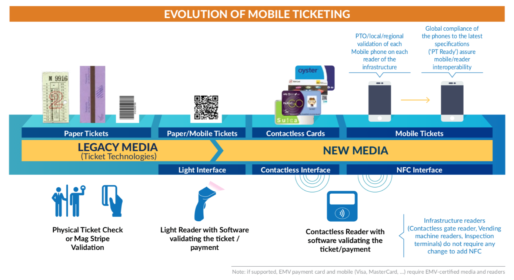

# Multimodal integrated system {#multimodal}

## First-last mile solutions

## Distance or time-based fares

## Mobility as a service

## Park and ride

## Contantless public transport cards

### Synonyms {-}
*Contactless smart card, smart card ticketing*

### Definition {-}
Smart card ticketing means, that the passenger's entitlement to travel is stored electronically on a chip that is usually embedded in a plastic card and validated when the card is presented to a smart reader (Turner & Wilson, 2010). On the contrary to contact smart cards, which have to be inserted into a smart card reader, contactless smart cards must only be near to the readers (about 10 cm) to exchange data (Mezghani, 2008). There are three types of standards used, called Type A, Type B (both complying with ISO 14443 standard) and FeliCa, while FeliCa provides faster transmission and is mainly used in Asian countries (Kurauchi & Schmöcker, 2017). <br/><br/>
Smart and integrated ticketing systems are expected to deliver greater flexibility and simplicity for passengers, by offering increased speed, convenience and security against loss and theft (Turner & Wilson, 2010). Economic and societal benefits from smart cards ticketing include the reduction in costs as a result of fewer paper tickets being sold, reduced queuing time, faster throughput of passengers at ticket gates, reduced boarding time for buses and reduced loss of revenue through fraud (Turner & Wilson, 2010). <br/><br/>
England’s Department of Transport has planned a strategy, to introduce integrated and smart ticketing to the majority of the UK by 2020. Their research suggests that net annual benefits of over £1 billion per year to passengers, operators and local authorities can be the result (Turner & Wilson, 2010). 
Another advantage of using smart cards ticketing, is the large amount of data on passengers’ behaviour, which can be collected with lower cost (Kurauchi & Schmöcker, 2017). In Austria smart cards have not been implemented on a large scale. Only the City of Wales has smart cards for the public transport in use (Wels Linien). ÖBB (ÖBB, 2021) and Wiener Linien (Wiener Linien, 2021) don’t have smart cards in use, but online tickets for smart phones, using QR Codes. Wiener Linien are currently researching on a more efficient solution for the usage of digital tickets, since they developed, that ticket controls of digital tickets take longer than for paper tickets (Wiener Linien, 2021b). 

### Key stakeholders {-}

- **Affected**: Public transport users, ticket inspectors 
- **Responsible**: Public transport operators, public transport associations, public transport authorities, smart card producers, Industry suppliers

### Current state of art in research {-}
The latest research goes in the direction of using smart phones or other mobile devices for smart ticketing.  An initiative, led by NFC Forum and GSMA achieved in 2015 together with global public transport representatives, the Smart Ticketing Alliance and the JR East as well as standards bodies, including CEN and ISO, harmonizing the specifications of mobile device NFC interfaces and public transport readers and cards. Together they established standards for testing mobile devices and public transport equipment (NFC Forum, 2016). 

```{r, echo=FALSE, , out.width="150%", fig.cap="The evolution of mobile ticketing (NFC Forum, 2016)"}

```

Furthermore current research addresses the issues of big data and how collected data through contactless smart cards can be best analysed (see Kurauchi & Schmöcker, 2017).

### Current state of art in practice {-}
Many countries, regions or cities, have smart card ticketing systems in use, like the whole of Netherlands, Helsinki Region, Minsk, Berlin, Auckland, Sydney and many more (see Wikipedia contributors, 2021). The systems itself differ and depend on the local ticketing and fare systems. While London, for instance, is using an access control system, Helsinki's system is trust based. Furthermore, a distinction can be made between pre-paid (debit) and post-paid (credit) systems (Kurauchi & Schmöcker, 2017). 

### Relevant initiatives in Austria {-}

- [taikai.network](https://taikai.network/en/wiener-linien/challenges/tickethon ) 
- [variuscard](https://www.variuscard.com/) 
- [austriacard](https://www.austriacard.com/)

### Impacts with respect to Sustainable Development Goals (SDGs) {-}

```{r table13, echo=FALSE, results='asis'}
cat('| Impact level| Indicator|Impact direction| Goal description and number|Source|
|:------------:|:-----------:|:------------:|:------------:|:------------:|
|Individual|Personal, travel expenditure reduced|**+**|Sustainable economic development (*8,11*)|Turner & Wilson, 2010|
|Individual|Access to digitalised transport|**+**|Innovation & Infrastructure (*9*)|Turner & Wilson, 2010|
|Systemic|Public transport capacity increases|**+**|Sustainable economic development (*8,11*)|Turner & Wilson, 2010|
|Systemic| Facilitates integration of the fare systems of several operators within a city |          **+**|Partnership & collaborations (*17*)|Kurauchi & Schmöcker, 2017|')
```

### Technology and societal readiness level {-}

```{r table14, echo=FALSE, results='asis'}
cat('|TRL| SRL|
|:----:|:----:|
|7-9|7-9|')
```

### Open questions {-}

1. How can the large amount of provided data be best used? 
2. What advantages and disadvantages would an implementation in the main cities of Austria have? 


### Further links {-}

-	[itso](https://www.itso.org.uk/ ) 

### References {-}
- Kurauchi, F., & Schmöcker, J. D. (Eds.). (2017). Public transport planning with smart card data. CRC Press.
- Mezghani, M. (2008). Study on electronic ticketing in public transport. European Metropolitan Transport Authorities (EMTA), 56, 38.
- NFC Forum. (2016). NFC-enabled e-Ticketing in Public Transport : Clearing the Route to Interoperability. December. https://nfc-forum.org/wp-content/uploads/2016/12/NFC_enabled_eTicketing_in_Public_Transport_White_Paper.pdf
- ÖBB. Ihr Weg zum Ticket. Retrieved 13th January 2021, from https://www.oebb.at/de/tickets-kundenkarten/weg-zum-ticket 
- Turner, M., & Wilson, R. (2010). Smart and integrated ticketing in the UK: Piecing together the jigsaw. Computer Law & Security Review, 26(2), 170-177.
- Wels Linien. Tarife. Retrieved 13th January 2021, from https://www.welslinien.at/tarife/ 
- Wiener Linien. (2021a). Der richtige Fahrschein,
der passende Tarif. Retrieved 13th January 2021, from https://www.wienerlinien.at/eportal3/ep/channelView.do/pageTypeId/66526/channelId/-46648 
- Wiener Linien. (2021b). Digital-Wettbewerb "Vienna Tickethon" gestartet. Retrieved 13th January 2021, from https://www.wienerlinien.at/eportal3/ep/contentView.do/pageTypeId/66526/programId/74577/contentTypeId/1001/channelId/-47186/contentId/5002360#:~:text=Im%20Rahmen%20eines%20internationalen%20Hackathon,Wettbewerb%20l%C3%A4uft%20bis%20Anfang%20M%C3%A4rz 
- Wikipedia contributors. (2021, January 8). List of smart cards. In Wikipedia, The Free Encyclopedia. Retrieved 15:30, January 13, 2021, from https://en.wikipedia.org/w/index.php?title=List_of_smart_cards&oldid=999040130


## Information and assistance for people with special needs

## Mobility/Freight hubs