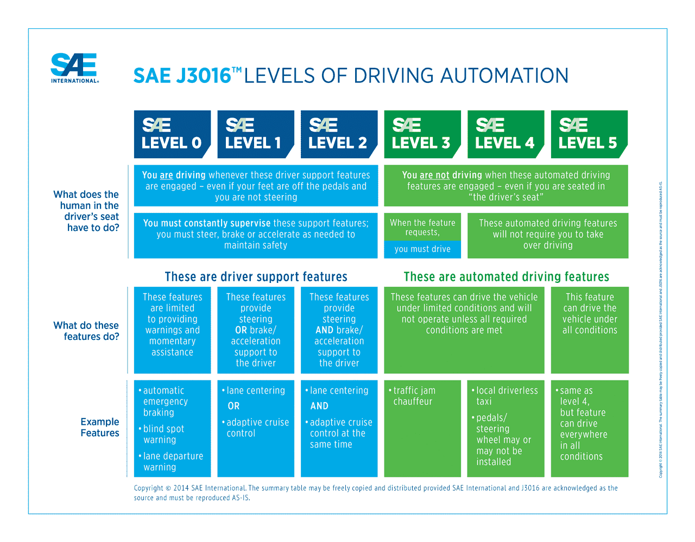

# On-board technology for connected and automated vehicles {#onboard}

## Advanced driver assistance system (ADAS) {#adas}

### Synonyms 

*Fahrerassistenzsystem, Adas*

### Definition {-}

Advanced driver assistance system is a broad spectrum of technologies that enhance the safety of vehicle and comfort of driving by helping driver prevent or avoid accidents (samsara.com, 2020). They can be divided into four categories depending on their functions:

- **Adaptive**: adaptive systems are focused on making small adjustments while driving, to make it safer, based on the inputs from the surrounding environment. The examples of adaptive systems are lane keep assist and lane departure warning (which are described in more detail [here](#lane_keeping)), adaptive cruise control (ACC) which adjusts the speed of the vehicle depending on the behaviour of the vehicle ahead to maintain optimal distance, adaptive light control (ALC) that adjusts the illumination of road depending on weather and road conditions, crosswind stabilisation, intelligent speed adaptation (ISA) or electronic stability control.
- **Automated**: automated systems take over the control of the vehicle in cases of imminent collision such as an emergency braking (AEB) when obstacle is detected. The other automatic functions include automatic parking, cruise control or collision avoidance system. 
- **Monitoring**: monitoring systems provide a continuous assessment of driving and road conditions. They might be, for instance, back up camera, blind spot monitor, traffic sign recognition, driver drowsiness detection, intersection assistant, tire pressure control etc.
- **Warning**: warning systems support the driver in anticipating potential hazards. These include, for example, wrong way driving warning, forward collision warning or lane departure warning.
Importantly, there are different level of ADAS support depending on the level of automation of the vehicle. Currently, the [Society of Automotive Engineers (SAE)](sae.org) distinguishes 5 levels of driving automation which together with ADAS functions have been depicted in Figure 9.1.

```{r, echo=FALSE, , out.width="90%", fig.cap="Levels of driving automation (Shuttleworth, 2019)"}

```

### Key stakeholders {-}
- **Affected**: Car Drivers, Traffic participants, Insurers
- **Responsible**: Car manufacturers

### Current state of art in research {-}
Important strands of research regarding ADAS include *(1)* technical improvement of efficiency, reliability and functionality of the system (eg. Storsæter et al., 2021; Capodieci et al., 2021; Tsai et al., 2021; Tian e al., 2021) and *(2)* human aspect of the system use which looks at *(a)* how to convey information about the capabilities as well as limitations of ADAS in order not to offset the advantages stemming from its employment in the vehicles and *(b)* how the performance of the system in a specific context influences the driver’s perception of the system. <br/>

This human-centred research focuses mainly on exploration of the awareness of drivers and vehicle buyers to encourage safe use of ADAS. It is crucial because a study by Harms et al. (2020) showed that many business drivers were unaware of which ADAS their car was equipped with and the reported ownership of ADAS (as measured in self-reported questionnaire) did not match the actual ownership of ADAS, demonstrating the lack of knowledge among drivers. This, in turn, may result in low social acceptance and useability of these safety systems in practice. Further, a Dutch study showed that sellers and consumers lack centralised database of ADAS functions. Consequently, many consumers do not receive information about ADAS and/or cannot try them out at the sale point. It was also showed that independent car dealers struggle to obtain information about ADAS (Boelhouwer et al., 2020). <br/>

Moreover, with respect to impact of context on driver’s perception of ADAS, the study by Orlovska (2020) showed that the driving context strongly influences ADAS usage based on its performance which consequently may have impact on driver’s trust and propensity to use the system in the long-run. Furthermore, it was showed that decisions of the driver regarding the engagement of ADAS while driving are affected by current driving conditions at the time when the decision is made. These results show an interconnection between the context, driver and the ADAS system usage. Beyond, the main findings of literature on driver distraction and behavioural adaptation in the context of ADAS are that *(1)* drivers increase their engagement in secondary tasks (as well as their performance in these tasks) when driving with ADAS, *(2)* drivers’ situational awareness is lower when using ADAS *(3)* the use of ADAS results in longer reaction times, more lane keeping variability and decrease in mental workload. Moreover, it is claimed that when drivers are exposed to automation systems which exceed their expectations, they tend to trust the systems and may not be aware of its limitations. The over-confidence in ADAS, in turn, increases the risk of collision (Hungund et al., 2021). <br/>

Beyond, a particular case of ADAS research focuses on older drivers (Chalkiadakis et al., 2020) and looks at the potential of ADAS in alleviating typical impairments such as reduced peripheral vision, night-time visual problems, longer reaction times, misjudgements of distance and speed and selective attention. As a result, the following functionalities are relevant:

-	Blind spot detection
-	Obstacle detection system
-	Collision warning system
-	Navigation/Route guidance
-	Lane-keeping system
-	Night vision system
-	In-vehicle signage system
-	Driver condition monitoring system
-	Congestion and weather warning

Furthermore, study by Zahabi et al. (2021) showed that demonstration-based training for ADAS is more effective for older male while video-based one for older female. 


### Current state of art in practice {-}
It is generally claimed that, in practice, we have currently reached level 2 automation (in SAE classification, see table above) where vehicle can steer and accelerate, however it still does not drive itself and the driver is fully responsible for the car. A recent survey conducted by [Roland Berger]( https://www.rolandberger.com/en/Insights/Publications/Advanced-Driver-Assistance-Systems-A-ubiquitous-technology-for-the-future-of.html) on 80 global producers, automotive experts, industry suppliers and three thousand drivers shows that 85% of vehicles produced globally in 2025 will be equipped with at least level 1 driving automation features. At the same time, it is not anticipated that level 4 or 5 automation will be present in more than 1% of the vehicles by then (Shirokinskiy et al., 2021). <br/>

Moreover, current pandemic has been showed to slow down the overall development in ADAS systems, reaching in some cases -17% (Shirokinskiy et al., 2021). Further challenge faced by the industry is lack of standardized nomenclature for ADAS features which, on one hand makes the tracking of these features difficult, on the other hand, it creates barriers for understanding of functionalities among drivers. For example, the adaptive cruise control (ACC) feature is known as Adaptive Cruise Control in Fiat, Ford, Volkswagen and Peugeot vehicles, as Intelligent Cruise Control in Citroen and BMW and DISTRONIC in Mercedes (Helman & Carsten, 2019). In May 2020, SAE issued a [generic ADAS terminology recommendations]( https://www.repairerdrivennews.com/2020/05/15/sae-international-endorses-generic-adas-terminology-recommendations/) to tackle standardization issues (Huetter, 2020).  

### Relevant initiatives in Austria {-}

- [Alp-lab](https://www.alp-lab.at/)
- [Smartmicro.com](https://www.smartmicro.com/press-media/detail/smartmicro-sensors-deployed-in-austria)

### Impacts with respect to Sustainable Development Goals (SDGs) {-}

```{r table108, echo=FALSE, results='asis'}
cat('| Impact level| Indicator|Impact direction| Goal description and number|Source|
|:------------:|:-----------:|:------------:|:------------:|:------------:|
|Individual|ADAS alleviates impact of aging-related impairments|**+**|Health & Wellbeing (*3*)|Chalkiadakis et al., 2020|
|Individual|Facilitates mobility for elderly drivers|**+**|Equality (*5,10*)|Chalkiadakis et al., 2020|
|Systemic|Increases driving comfort but scarce unambiguous evidence of impact on safety|**~**|Health & Wellbeing (*3*)|Sullivan et al., 2016|
|Systemic|Global trends in ADAS R&D|          **+**|Innovation & Infrastructure  (*9*)|Yochman, 2020|')
```

### Technology and societal readiness level {-}

```{r table109, echo=FALSE, results='asis'}
cat('|TRL| SRL|
|:----:|:----:|
|7-9|6-8|')
```

### Open questions {-}
1. How can ADAS nomenclature standardization be encouraged and achieved?
2. How to incorporate the impact of behavioural adaptation into ADAS design to a larger degree?

### Further links

- [ec.europa.eu](https://ec.europa.eu/transport/road_safety/sites/default/files/pdf/ersosynthesis2018-adas.pdf)
- [aaafoundation.org](https://aaafoundation.org/wp-content/uploads/2017/12/BehavioralAdaptationADAS.pdf) 


### References {-}
-	Boelhouwer, A., Van den Beukel, A. P., Van der Voort, M. C., Hottentot, C., De Wit, R. Q., & Martens, M. H. (2020). How are car buyers and car sellers currently informed about ADAS? An investigation among drivers and car sellers in the Netherlands. Transportation Research Interdisciplinary Perspectives, 4, 100103.
-	Capodieci, N., Cavicchioli, R., Muzzini, F., & Montagna, L. (2021). Improving emergency response in the era of ADAS vehicles in the Smart City. ICT Express.
-	Chalkiadakis, C., Mitsakis, E., & Tzanis, D. (2020, September). Requirements for the development and implementation of ADAS and C-ITS services for older drivers. In 2020 IEEE 23rd International Conference on Intelligent Transportation Systems (ITSC) (pp. 1-6). IEEE.
-	Harms, I. M., Bingen, L., & Steffens, J. (2020). Addressing the awareness gap: A combined survey and vehicle registration analysis to assess car owners’ usage of ADAS in fleets. Transportation Research Part A: Policy and Practice, 134, 65-77.
-	Helman, S. & Carsten, O. (2019) What does my car do? Available at: <https://www.pacts.org.uk/wp-content/uploads/What-does-my-car-do-2.1_.pdf> Accessed: 31/05/2021
-	Huetter, J. (2020) SAE International endorses generic ADAS terminology recommendations. Available at < https://www.repairerdrivennews.com/2020/05/15/sae-international-endorses-generic-adas-terminology-recommendations/> Accessed: 31/05/2021
-	Hungund, A. P., Pai, G., & Pradhan, A. K. (2021). Systematic Review of Research on Driver Distraction in the Context of Advanced Driver Assistance Systems. Transportation Research Record, 03611981211004129.
-	Orlovska, J., Novakazi, F., Lars-Ola, B., Karlsson, M., Wickman, C., & Söderberg, R. (2020). Effects of the driving context on the usage of Automated Driver Assistance Systems (ADAS)-Naturalistic Driving Study for ADAS evaluation. Transportation research interdisciplinary perspectives, 4, 100093.
-	Samsara.com (2020). Advanced Driver Assistance Systems (ADAS) for Commercial Fleets. Available at:< https://www.samsara.com/guides/adas> Accessed: 28/04/2021 
-	Shirokinskiy, K., Bernhart, W. and Keese, S., 2021. Advanced Driver-Assistance Systems: A ubiquitous technology for the future of vehicles. [online] Roland Berger. Available at: <https://www.rolandberger.com/en/Insights/Publications/Advanced-Driver-Assistance-Systems-A-ubiquitous-technology-for-the-future-of.html> [Accessed 31 May 2021].
-	Shuttleworth, J. (2019). SAE Standards News: J3016 automated-driving graphic update. Available at: <https://www.sae.org/news/2019/01/sae-updates-j3016-automated-driving-graphic> Accessed: 28/04/2021
-	Storsæter, A. D., Pitera, K., & McCormack, E. (2021). Using ADAS to Future-Proof Roads—Comparison of Fog Line Detection from an In-Vehicle Camera and Mobile Retroreflectometer. Sensors, 21(5), 1737.
-	Sullivan, J. M., Flannagan, M. J., Pradhan, A. K., & Bao, S. (2016). Literature review of behavioral adaptations to advanced driver assistance systems.
-	Tian, J., Liu, S., Zhong, X., & Zeng, J. (2021). LSD-based adaptive lane detection and tracking for ADAS in structured road environment. Soft Computing, 25(7), 5709-5722.
-	Tsai, W. C., Lai, J. S., Chen, K. C., M Shivanna, V., & Guo, J. I. (2021). A lightweight motional object behavior prediction system harnessing deep learning technology for embedded adas applications. Electronics, 10(6), 692.
-	Yochman, F. (2020) Top automakers with highest ADAS and autonomous vehicles R&D spending. Available at: < https://m14intelligence.com/public/index.php/blog/34> Accessed: 31/04/2021.
-	Zahabi, M., Razak, A. M. A., Mehta, R. K., & Manser, M. (2021). Effect of advanced driver-assistance system trainings on driver workload, knowledge, and trust. Transportation research part F: traffic psychology and behaviour, 76, 309-320.


## Parking assistance system {#parking_assistance}

### Definition {-}
Nowadays, parking a car becomes an increasingly mundane task due to the growing size of the vehicles which consequently reduces visibility to the rear and front. Moreover, the number of vehicles on the road continues to increase which makes finding parking spaces more difficult. To overcome this challenge, efficient and advanced parking techniques are needed, such as finding the right parking space and parking cars efficiently (Khalid et al., 2021). <br/><br/>
While in the 1990s parking assistance systems were not considered necessary, systems that support the parking process are now standard in new vehicles and have a high acceptance rate. While parking assistance systems of the first generations were mainly informative systems, today these systems help to find a suitable parking space and support the steering during the parking manoeuvre. Future systems will become even more autonomous, up to a point where they will find their parking space without human intervention (Valet Parking) (Gotzig, 2016). <br/><br/>
With respect to safety issues, parking assistance systems can reduce insurance claims that occur during parking manoeuvres by 30% (ADAC, 2020). They also provide a useful application in the form of emergency brake assistant that prevents accidents with other road users when reversing (ADAC, 2019). <br/><br/>
Modern Parking assistants work with two sensor concepts: ultrasonic sensors for the close range at the rear (often already installed as "parking beepers") and radar sensors with a longer range at the side in the bumper (ADAC, 2019). Additionally, there are also new releases with 360° view around the car (Land Rover, no date; Mercedes-Benz, no date). However, there are no tests for this at the moment.

### Key stakeholders {-}
- **Affected**: Car Drivers, Traffic participants, Insurers
- **Responsible**: Car manufacturers

### Current state of art in research {-}
The research on on-board parking features is almost entirely owned by the car manufacturers. Research tends to focus on larger-scale issues such as car parking location tracking, space booking systems using IoT and congestion caused by *parking cruises*.<br/> <br/>
Additionally, tests are carried out on the merger between emergency brake assistant and parking assistant to overcome the difficulties with obstacles detection and reduce the collision rates in this specific situation. The ADAC tested the AEB (Autonomous Emergency Braking) systems from Mercedes, Volvo, BMW, Seat and Skoda in three test scenarios: *(1)* a pedestrian dummy stands behind a car or walks past, *(2)* a car parks in the direction of travel and *(3)* cyclists as well as cars drive past crosswise. <br/> <br/>
BMW was the best at reacting to all situations with radar and ultrasound - with some drop-outs, especially with moving pedestrians or cross-traffic. The Mercedes, on the other hand, only used its side radar sensors for reverse braking and thus did not recognise stationary vehicles at all. The VW system from Skoda and Seat had radar and ultrasound, but moving pedestrians were only detected randomly or not at all.<br/><br/> 
Overall, these tests showed that the automatic braking parking assistants have a lot of potential, but are far from optimal. Even the system of the front-runner does not yet work 100% reliably. Even the low-cost ultrasonic sensors, however, can be very effective and even prevent pedestrian collisions, as the BMW showed in the test. Therefore, it is crucial that manufacturers equip their vehicles with an effective AEB system as a standard. The necessary technology is already available in most passenger cars where the rear ultrasonic sensors would need to be linked to the braking function (ADAC, 2019).
The greatest difficulties are encountered in pedestrian detection, in the scenarios in which the risk of personal injury is potentially the highest. Some of the tested vehicles recognised the dangerous situation too late or not at all.

### Current state of art in practice {-}
Nearly 50% of the cars in Germany are now equipped with parking assistance. Nonetheless, the results of a study by HUK-Coburg, Germany's largest motor insurer with eleven million insured cars, show that the number of fender-benders has not decreased and the damage costs have even risen slightly. The reason for this is the damage to the expensive Park Distance Control (PDC) sensor embedded in the bumper when vehicle collides with an obstacle while parking (Focus Online, 2017).<br/> <br/>
In 2017, 570 accidents with personal injury occurred in Austria when reversing with passenger cars. There were no fatalities, but around 290 people were injured, 60 of them seriously. In addition, there is a large amount of property damage due to obstacles being overlooked (ÖAMTC, 2019).<br/> <br/>
According to different sources, between 23% and 46% of the cars in Germany are equipped with an on-board parking assistant (Focus Online, 2017). In contrast, only 13% of the vehicles are equipped with an emergency brake assistant that automatically brakes in the event of an imminent collision with the vehicle in front or even detects pedestrians and cyclists. Further, a survey conducted on 1000 respondents by German Road Safety Council showed that 85% of the sample found the emergency brake assistant as highly useful and 65% considered parking assistant highly beneficial (Handelsblatt, 2016).<br/> <br/>
Currently, the most advanced technology with respect to parking assistance is offered by Tesla S, where the system is fully autonomous and allows the car to drive itself out of a tight space without the driver’s intervention. But it is expected that the technology will be available from other manufacturers too and will improve rapidly in the coming years. One reason for this is that parking assistants with brake intervention will become part of the European vehicle test programme *Euro NCAP* from 2020. In the past, it has been shown that the inclusion of active and passive passenger car safety systems in this programme quickly increases the rate at which vehicles are equipped (ÖAMTC, 2019).

 
### Relevant initiatives in Austria {-}

- [oeamtc.at](https://www.oeamtc.at/tests/assistenzsystemtest/fuenf-parkassistenten-mit-notbremssystem-im-test-31717317) 


### Impacts with respect to Sustainable Development Goals (SDGs) {-}

```{r table56, echo=FALSE, results='asis'}
cat('| Impact level| Indicator|Impact direction| Goal description and number|Source|
|:------------:|:-----------:|:------------:|:------------:|:------------:|
|Individual|Road accidents when parking reduced|**+**|Health & Wellbeing (*3*)|ADAC, 2019|
|Individual|Higher costs in case of collision|**-**|Sustainable economic development (*8,11*)|Focus Online, 2017|
|Systemic|New designs tested |          **+**|Innovation & Infrastructure  (*9*)|Euro NCAP, 2021|')
```

### Technology and societal readiness level {-}

```{r table57, echo=FALSE, results='asis'}
cat('|TRL| SRL|
|:----:|:----:|
|8-9|8-9|')
```

### Open questions {-}
1. How can acceptance and usability rates be increased in drivers especially in elderly group?
2. What are the legal implications for the use of assisted parking for both drivers and car manufacturers?

### References {-}
- ADAC. (2019, May 14). Parkassistenten im Test: Noch nicht gut genug. https://presse.adac.de/meldungen/adac-ev/tests/parkassistent.html
- ADAC. (2020, January 9). Fahrerassistenzsysteme im Überblick | ADAC. https://www.adac.de/rund-ums-fahrzeug/ausstattung-technik-zubehoer/assistenzsysteme/fahrerassistenzsysteme/
- Euro NCAP. (2021). http://www.euroncap.com (Accessed: 26 February 2021)
- Focus Online. (2017, April 27). Einparkhilfen bringen nichts - sondern verursachen mehr Schaden - FOCUS Online. https://www.focus.de/auto/news/untersuchung-der-huk-coburg-studie-einparkhilfe-hilft-nicht-sie-versucht-eher-mehr-schaden_id_7035248.html
- Gotzig, H. (2016). Parking Assistance. In H. Winner, S. Hakuli, F. Lotz, & C. Singer (Eds.), Handbook of Driver Assistance Systems: Basic Information, Components and Systems for Active Safety and Comfort (pp. 1077–1092). Springer International Publishing. https://doi.org/10.1007/978-3-319-12352-3_45
- Handelsblatt. (2016, April 8). Umfrage zu Assistenzsystemen : Einparkassistent nützlich, Notbremsassistent nützlicher. https://www.handelsblatt.com/auto/nachrichten/umfrage-zu-assistenzsystemen-einparkassistent-nuetzlich-notbremsassistent-nuetzlicher/13404708.html?ticket=ST-4955434-naHBLAxI66h66nbvrBXF-ap1
- Khalid, M., Wang, K., Aslam, N., Cao, Y., Ahmad, N., & Khan, M. K. (2021). From smart parking towards autonomous valet parking: A survey, challenges and future Works. Journal of Network and Computer Applications, 175, 102935. https://doi.org/https://doi.org/10.1016/j.jnca.2020.102935
- Land Rover. (n.d.). Parking Assistance | InControl | Land Rover UK. Retrieved 25 February 2021, from https://www.landrover.co.uk/incontrol/driver-safety-and-assistance/parking-assistance.html
- Margreiter, M., Mayer, P., Alpas, M., & Vlahogianni, E. (2017). Driver’s Willingness to Use Parking Assistance Tools and their Expectations: A Case Study for the Cities of Munich and Athens. In 8th International Congress on Transportation Research.
- Mercedes-Benz. (n.d.). Mercedes-Benz X-Klasse: Park-Paket mit 360°-Kamera. Retrieved 25 February 2021, from https://www.mercedes-benz.at/passengercars/mercedes-benz-cars/models/x-class/x-class-pickup/facts-and-lines/equipment-packages/360-camera.html
- Tsugawa, S. (2006). Trends and issues in safe driver assistance systems: Driver acceptance and assistance for elderly drivers. IATSS research, 30(2), 6-18.
- ÖAMTC. (2019, May 14). ÖAMTC: Fünf Parkassistenten mit Notbremssystem im Test (+ Fotos, + Grafik) | ÖAMTC, 14.05.2019. https://www.ots.at/presseaussendung/OTS_20190514_OTS0021/oeamtc-fuenf-parkassistenten-mit-notbremssystem-im-test-fotos-grafik

## Lane keeping {#lane_keeping}

### Synonyms {-}
*Lane Keeping Assist System (LKAS), Lane Keeping Assist (LKA)*

### Definition {-}
Lane keeping assist monitors road markings, typically using a camera located behind the windscreen to keep the car within its driving lane and as a result reduce the burden of the driver. There are different systems currently available and they are not the same (Autonationdrive, 2019): 

- **Lane Departure Warning (LDW)**: Audible or visual warnings signal to the driver that their vehicle is approaching or may be crossing the lane markings.
- **Road Departure Assist (RDA)**: An automatic steering system, which may also include an automatic braking system, keeps the vehicle on the roadway itself.
- **Lane Keeping Assist (LKA)**: An automatic steering system, which may also include an automatic braking system, keeps the vehicle within its lane.
- **Lane Centering Assist (LCA)**: An automatic steering system, which may also include an automatic braking system, to keep the vehicle in the center of the lane.

The main difference betwenn them is that LDW informs the driver in case of crossing the road marking through different sensory cues such as tactile, visual or audio, the LKAS helps the driver to stay within the lane through the adjustments to steering wheel movements depending on the distance from the lane marking on either side. The systems can use reactive or proactive process, where the vehicle is reactively put back on track while it begins to leave the lane or proactively kept in the centre of the lane, respectively. It is usually activated by the driver and works at speed between 65 km/h and 180 km/h and radius of 230 m. Hence, it is the most suitable for highways and motorways but less so for urban or country roads. Even though the LKAS is activated, the driver remains responsible for controlling the vehicle. Consequently, LKAS continuously checks the steering movements applied by the driver and if he has his/her hands on the steering wheel. In case, the system detects that driver is not actively steering, it produces the waring and deactivates. This is to ensure that the driver remains in control throughout. Moreover, the driver can overrule the LKAS at any time. For example, LKAS deactivates automatically when braking and deliberate lane charge activated via the use of indicators (blinkers) (VDA, 2021). 


### Key stakeholders {-}
- **Affected**: General public, Drivers, Road infrastructure companies, Insurers
- **Responsible**: Car manufacturers, Transport agencies, National governments and International bodies (eg. EU or [UNECE](https://unece.org/fileadmin/DAM/trans/main/wp29/wp29regs/2018/R079r4e.pdf))

### Current state of art in research {-}
Current research explores new approaches to the development of lane keeping assistance such as the use of Global Navigation Satellite System (Tominaga et al., 2020), deep learning (Wang et al., 2020) or neural network techniques (Yusuf et al., 2020). Beyond, it aims at the validation and improvement of LKAS by looking at the impact of system design (Lee et al., 2018) and different road conditions on the overall quality performance of lane keeping assistance (Romano et al., 2020). Further, a number of studies explored the potential of including driver’s characteristics to develop of personalised lane keeping assist.
Further, study by Weaver & Gonzalez (2020) focused on the influence of LKAS on drivers’ behaviour and acceptance level of LKAS technology. It not only confirmed existing findings that more experience and familiarity with the system increases acceptance rate and trust, but it also showed a positive response from individuals who had no previous experience in using LKAS. 

### Current state of art in practice {-}
In Europe the main existing legal basis for lane keeping systems that regulate its use is [Regulation (EU) 2019/2144]( https://op.europa.eu/en/publication-detail/-/publication/bfd5eba8-2058-11ea-95ab-01aa75ed71a1/language-en). Hence, many car manufacturers nowadays offer cars featured with lane keeping assist which together with other system such as automatic cruise control or [distance keeping](#distance_keeping) already provide a high level of automation. Some of many producers offering LKAS are [BOSCH]( https://www.bosch-mobility-solutions.com/en/products-and-services/passenger-cars-and-light-commercial-vehicles/driver-assistance-systems/lane-keeping-assist/), [Honda](https://www.hondainfocenter.com/2021/CR-V/Feature-Guide/Interior-Features/Lane-Keeping-Assist-System-LKAS/), [Tesla]( https://www.tesla.com/de_DE/blog/more-advanced-safety-tesla-owners?redirect=no) or [Ford](https://owner.ford.com/support/how-tos/safety/driver-assist-technology/driving/how-to-use-lane-keeping-system.html). <br/>

In terms of the accident prevention, lane keeping assist has a huge potential to increase road safety where National Highway Traffic Safety Administration (NHTSA) data from 2011 show that 53% of road fatalities result from a roadway departure (Automotive World, 2013). In fact, real world data from Sweden shows that crashes involving out-of-lane drift were reduced by 40% for cars with Electonic Stability Control (ESC) as opposed to 29% for cars without it (Sternlung, 2018). <br/>

The major disadvantage of lane keeping systems is the fact that it relies on a visual detection of painted road marking in order to work effectively therefore any condition deterioration such as nighttime or rain have a significant impact on the system performance (Tchir, 2019). 
 
 
### Relevant initiatives in Austria {-}

- [ertrac.org](https://www.ertrac.org/uploads/images/ERTRAC2019-Connected-Automated-Driving-Roadmap%20-2019-04-04.pdf)
 

### Impacts with respect to Sustainable Development Goals (SDGs) {-}

```{r table86, echo=FALSE, results='asis'}
cat('| Impact level| Indicator|Impact direction| Goal description and number|Source|
|:------------:|:-----------:|:------------:|:------------:|:------------:|
|Individual|Accident risk reduced; low performance in suboptimal road conditions|**~**|Health & Wellbeing (*3*)|Sterlund, 2018; Tchir, 2019|
|Systemic|Systems are continuously improved|**+**|Innovation & Infrastructure (*9*) | Lawrence & Kareta, 2020|')
```

### Technology and societal readiness level {-}

```{r table87, echo=FALSE, results='asis'}
cat('|TRL| SRL|
|:----:|:----:|
|5-7|5-7|')
```

### Open questions {-}

1. What are the implication of lane keeping systems for physical infrastructure (such as contrast and colour of painted lanes) and how these can be improved to enhance the effectiveness of lane keeping systems?
2. Cross-national standardisation of road markings is required to ensure equal safety levels.

### Further links {-}

- [mes-insights.com](https://www.mes-insights.com/automated-lane-keeping-systems-pave-the-autonomous-car-future-a-965712/)


### References {-}
-	Automotive World (2013) Latest Lane Keeping Assist technology from TRW goes into production. Available at: <https://www.automotiveworld.com/news-releases/latest-lane-keeping-assist-technology-from-trw-goes-into-production/> [Accessed 7 April 2021].
-	Autonationdrive (2019). Best Cars with Lane Assist. Available at: https://www.autonationdrive.com/research/best-cars-with-lane-assist.htm [Accessed: 7 April 2021]
-	Lawrence, C. & Kareta, N. (2020). Automated Lane Keeping Systems pave the autonomous car future. Available at: < https://www.mes-insights.com/automated-lane-keeping-systems-pave-the-autonomous-car-future-a-965712/> [Accessed: 7 April 2020]
-	Romano, R., Maggi, D., Hirose, T., Broadhead, Z., & Carsten, O. (2020). Impact of lane keeping assist system camera misalignment on driver behavior. Journal of Intelligent Transportation Systems, 1-13.
-	Sternlund, S. (2018). The Safety Potential and Effectiveness of Lane Departure Warning Systems in Passenger Cars. Chalmers Tekniska Hogskola (Sweden).
-	Tchir, J. (2019). The limitations of lane-keeping assist. Available at: https://www.theglobeandmail.com/drive/mobility/article-the-limitations-of-lane-keeping-assist/ [Accessed: 7 April 2021]
-	Vda.de. 2021. VDA. [online] Available at: <https://www.vda.de/en/topics/safety-and-standards/lkas/lane-keeping-assist-systems.html> [Accessed 30 March 2021].
-	Wang, Q., Zhuang, W., Wang, L., & Ju, F. (2020). Lane Keeping Assist for an Autonomous Vehicle Based on Deep Reinforcement Learning (No. 2020-01-0728). SAE Technical Paper.
-	Weaver, S., & Gonzalez, T. (2020). To Alert or Assist: Comparing Effects of Different Lateral Support Systems on Lane-Keeping (No. FHWA-HRT-20-068).
-	Yusuf, M. M., Karim, T., & Saif, A. S. (2020, January). A robust method for lane detection under adverse weather and illumination conditions using convolutional neural network. In Proceedings of the International Conference on Computing Advancements (pp. 1-8).

## Digital maps {#digital_maps} 

### Synonyms {-}
*High definition maps (HD maps), High precision maps*

### Definition {-}
Digital Maps are electronic maps that gather and integrate data from Global Positioning System (GPS), Light Detection and Ranging System (LiDAR), radars and vehicle sensor in order to increase safety of autonomous and driverless cars, through the implementation of Artificial Intelligence (AI) and Internet of Things (IoT) (Kulkarni, 2021). They are highly precise and detailed lane-level maps which have an ultimate goal to provide virtual assistance on the extreme high safety standards while traveling in AVs (Zang et al., 2018). In particular, they increase vehicle’s sensors information for contextual environment analysis to help performing maneuvers beyond vehicle's sensing range by providing very accurate vehicle positioning and orientation in map coordinates. The digital maps used in AVs are frequently called High Definition (HD) maps, which have extremely high (centimeter-level) accuracy and are designed to tackle one of the biggest problems of autonomous driving, the determination of the exact position of a vehicle in real-time (Haydin, 2020). Currently, the global digital map market is estimated to reach around 12.7% of Compound Annual Growth Rate (CAGR) in 2023, following the increase in demand for autonomous vehicles (Kulkarni, 2021). Consequently, global development of driverless cars and digital maps brings the potential for further implementation and development of smart solutions in cities infrastructure. 


### Key stakeholders {-}
- **Affected**: Users of AVs, Drivers of conventional vehciles, Pedestrians, Cyclists
- **Responsible**: National and local governments, Private developers of digital mapping systems, Automotive companies, Car manufacturers

### Current state of art in research {-}
The main trend in research regarding digital maps for AV purposes includes the improvement in their accuracy (espacially in dense urban areas) and development of approaches to update the changes in physical environment on the road.<br/>

For example, the research conducted by Jo et al. (2018) proposes two methods of updating HD maps with recent changes in the physical features of the real world. The first option relies on implementing ground-mapping technology, which assesses all the roads in the database in terms of feature changes and then detects them. However, this technology is not only expensive but also it works on a limited area. Second method makes use of perception and localization functions of driverless vehicles, through the created algorithm called Simultaneous Localization and Map Change Update (SLAMCU). Consequently, the update of data can be performed in many vehciles at the same time, which is a considerable advantage of this method. Additionally, there is no extra software, which makes this method much cheaper in comparison to the first one.<br/>

Further, Hartmann et al. (2018) focuses on the improvement of the accuracy of digital maps, if they were to be used more broadly.  The online verification approach is proposed, which detects changes in front of the car, based on the large databases and sensors. The database collects information about the road geometry and speed limits in the standard interface Advanced Driver Assistance Systems Interface Specifications (ADASIS). This approach provides higher accuracy (96.64%) in comparison to the other systems and concluded that there is needed further research to fully examine possibilities and function of this system. 


### Current state of art in practice {-}
Currently, there are number of navigation technology companies on the market that produce the HD maps for the purpose of automated driving such as [TomTom](https://www.tomtom.com/blog/automated-driving/how-we-make-our-hd-maps/), [Nvidia](https://www.nvidia.com/en-us/self-driving-cars/hd-mapping/), [DeepMap](https://www.deepmap.ai/), [Navinfo](https://www.navinfo.com/en), [Sanbord](https://www.sanborn.com/highly-automated-driving-maps-for-autonomous-vehicles/) and others. 

Nonetheless, they still face certain challenges, these include (Haydin, 2020):

- **Loss of data quality**:  Geospatial data often has proprietary formats, therefore it is challenging for automobile companies to collect it in its original format without quality loss.
- **Legal constraints**: The uniform, international approach to data collection, storage, sharing and safeguarding is lacking, which undermines possibilities to disseminate and use the data more widely.
- **Data streaming issue**: The advantage of HD maps is based on the provision of the latest available information, where the lag between dynamic road changes and the time they appear on the map should be minimal. Therefore, they require high-speed bandwidth and support for high vehicle density, which is beyond the capabilities of current [V2X](#v2x). The [5G technology](#wireless_com) is expected to address this issue.
- **Lack of standarisation**: Car manufacturers (eg. [BMW](https://www.bmw.com/en/automotive-life/autonomous-driving.html) or [Ford](https://www.cnet.com/roadshow/news/argo-ai-argoverse-hd-maps-data-free-research/)) and navigation technology companies produce their own maps with their own data formats which hinders significantly popularisation of HD maps.
- **High costs of mapping**: Nowadays, car manufacturers face a very high costs when producing HD maps, mainly due to machine power and labour cost. They are particularly difficult to reduce without the loss in technology quality and efficiency. 
 
### Relevant initiatives in Austria {-}

- [zf.com](https://www.zf.com/austria/de/home/home.html)


### Impacts with respect to Sustainable Development Goals (SDGs) {-}

```{r , echo=FALSE, results='asis'}
cat('| Impact level| Indicator|Impact direction| Goal description and number|Source|
|:------------:|:-----------:|:------------:|:------------:|:------------:|
|Individual|Increase in road safety of AVs|**+**|Health & Wellbeing (*3*)|Infosysbpm.com, 2020|
|Systemic|Contributes to the development and implementation of smart solutions|**+**|Innovation & Infrastructure (*9*) | Kulkarni, 2021|')
```

### Technology and societal readiness level {-}

```{r , echo=FALSE, results='asis'}
cat('|TRL| SRL|
|:----:|:----:|
|5-7|5-7|')
```

### Open questions {-}
1. How can HD mapping in automated cars influence smart infrastructure in cities?
2. How and when could HD mapping be implemented into public transportation accessible for a wider range of inhabitants?  
3. How to encourage standardisation of HD maps and data formats across car manufacturers and navigation technology companies?

### Further links {-}

- [Infosys](https://www.infosysbpm.com/offerings/functions/digital-business-services/insights/documents/mapping-autonomous-driving-future.pdf)
- [Atlatec.de](https://atlatec.de/en/)


### References {-}
- Hartmann, O., Gabb, M., Schweiger, R., & Dietmayer, K. (2014, June). Towards autonomous self-assessment of digital maps. In 2014 IEEE Intelligent Vehicles Symposium Proceedings (pp. 89-95). IEEE.
- Haydin, V. (2020). Solving the Challenges of HD Mapping for Smart Navigation in Autonomous Cars. [online] Available at: <https://www.intellias.com/solving-the-challenges-of-hd-mapping-for-smart-navigation-in-autonomous-cars/> [Accessed 24 June 2021].
- Infosysbpm.com (2020). Mapping the autonomous future. [pdf] Available at: <https://www.infosysbpm.com/offerings/functions/digital-business-services/insights/documents/mapping-autonomous-driving-future.pdf> [Accessed 7 June 2021].
- Jo, K., Kim, C., & Sunwoo, M. (2018). Simultaneous localization and map change update for the high definition map-based autonomous driving car. Sensors, 18(9), 3145.
- Kulkarni, S., (2021). Digital Maps to hold the future of smart cities, autonomous cars, and much more. [online] Geospatial World. Available at: <https://www.geospatialworld.net/blogs/digital-maps-to-hold-the-future-of-smart-cities-autonomous-cars-and-much-more/> [Accessed 7 July 2021].
- Zang, A., Chen, X., & Trajcevski, G. (2018). High definition maps in urban context. Sigspatial Special, 10(1), 15-20.


## Electronic horizon {#ehorizon}

### Synonyms {-}
*Connected horizon, e-horizon, EH*

### Definition {-}
Modern vehicles are currently equipped with different sensors to increase the safety and comfort of driving. Nonetheless, these built-in sensors can usually operate for a short distance of a few hundred meters. On the other hand, digital maps within the system provide information about the road such as its geometry, number of lanes, speed limits or traffic signals. Therefore, the merger between the functions of the sensors and the data provided by the map gives rise to so-called *Electronic Horizon* applications, that are able to provide information from the sensors within an extended range and allow for earlier preparation for a situation ahead (Ress et al., 2008).<br/>

The benefits of the e-horizon include increased comfort due to partially automated functions, reduced accident risk thanks to increased information about road situations ahead, lower fuel consumption through predictive driving and longer driving ranges in the case of electric and hybrid vehicles due to optimized energy management (Bosch-mobility-solutions.com, 2021). Nonetheless, the e-horizon still faces certain challenges such as (Grewe et al., 2017):

-	*Speed of data*: in the high-speed mobility data or service request may not be answered or provided fast enough before the vehicle reconnects to another network entry point;
-	*Amount of data*: fully automated driving is predicted to produce 4 TB of data daily (Nelson, 2016);
-	*Scalability*: the system design is relatively simple for small number of participating cars but it may experience difficulties as soon as number of vehicles and/or applications rise; 
-	*Security and privacy issues*: as with other connected systems, the issue with data protection arises to ensure security and quality for customers.
 
### Key stakeholders {-}
- **Affected**: Car drivers, Traffic participants, Insurers
- **Responsible**: Car manufacturers

### Current state of art in research {-}
Profound test of software and hardware are performed under various condition such as different speed and journey breaks to gather data on the entire information chain from GPS positioning to e-Horizon generation. Based on the collected information the engineers optimize the workflow before moving to real test drive. In real test drives, the performance of the applications is frequently checked in the borderline scenarios or with deliberate errors (Ludwig, 2013). Moreover, driving simulation is used to test the effects of sensors failures (Elgharbawy et al., 2019)

### Current state of art in practice {-}
Electronic horizon is relatively well-established technology in terms of both, passenger and commercial vehicles and it is offered by several manufacturers including [BOSCH](https://www.bosch-mobility-solutions.com/en/products-and-services/passenger-cars-and-light-commercial-vehicles/connectivity-solutions/connected-horizon/), [TomTom]( https://www.tomtom.com/products/autostream/) in cooperation with [Electrobit]( https://www.elektrobit.com/products/automated-driving/eb-robinos/predictor/) and [Continental](https://www.continental.com/en/press/press-releases/continental-ehorizon-and-previewesc-systems-180356) working together with data technology company [IBM]( https://www.continental.com/en/press/press-releases/continental-and-ibm-enter-connected-vehicle-collaboration-8438) and [HERE]( https://360.here.com/2017/01/04/introducing-here-electronic-horizon/), pioneering company in location technology (Continental, 2019). 
 
### Relevant initiatives in Austria {-}

- [gsv.co.at](https://gsv.co.at/wp-content/uploads/2015_05_06_Foersterling.pdf) 
 

### Impacts with respect to Sustainable Development Goals (SDGs) {-}

```{r table63, echo=FALSE, results='asis'}
cat('| Impact level| Indicator|Impact direction| Goal description and number|Source|
|:------------:|:-----------:|:------------:|:------------:|:------------:|
|Individual|Accident risk reduced|**+**|Health & Wellbeing (*3*)|Bosch-mobility-solutions.com, 2021; Continental, 2019|
|Individual|Lower fuel consumption|**+**|Sustainable economic development (*7,12-13,15*)|Continental, 2019|
|Systemic|Increased driving range for hybrid and electric vehicles|**+**|Sustainable economic development (*7,12-13,15*)|Bosch-mobility-solutions.com, 2021|
|Systemic|Innovative research towards full automation|**+**|Innovation & Infrastructure (*9*) |Foersterling, 2015|
|Systemic|Collaborations between automotive and technology companies|**+**|Partnership & collaborations (*17*)|Continental, 2019; Foersterling, 2015|')
```

### Technology and societal readiness level {-}

```{r table64, echo=FALSE, results='asis'}
cat('|TRL| SRL|
|:----:|:----:|
|8-9|7-9|')
```

### Open questions {-}

1. How to handle massive mobility of vehicles?
2. How do current approaches scale when the number of participants and services within this system rise?
3. How to fulfill application- or user-specific quality requirements?
4. How to ensure availability of services and data when these are deployed outside of the vehicle? (Grewe et al., 2017)


### Further links {-}

- [autotechreview.com](https://autotechreview.com/media/attachments/Technology_1_1.pdf)
- [here.com](https://www.here.com/sites/g/files/odxslz166/files/2018-11/HERE_Electronic_Horizon_one_pager.pdf)
- [scitepress.org](https://www.scitepress.org/Papers/2008/15080/15080.pdf)
- [bosch-mobility-solutions.com](https://www.bosch-mobility-solutions.com/en/products-and-services/passenger-cars-and-light-commercial-vehicles/connectivity-solutions/connected-horizon/)
- [elektrobit.com](https://www.elektrobit.com/newsroom/tomtom-elektrobit-join-forces-electronic-horizon-automated-driving/)
- [itsinternational.com](https://www.itsinternational.com/its10/products/continental-debuts-electronic-horizon)
- [strategic-partnering.net](http://strategic-partnering.net/continental-ibm-enter-connected-vehicle-collaboration/)


### References {-}
- Bosch-mobility-solutions.com. (2021). Connected Horizon. [online] Available at: <https://www.bosch-mobility-solutions.com/en/products-and-services/passenger-cars-and-light-commercial-vehicles/connectivity-solutions/connected-horizon/> [Accessed 1 March 2021].
- Continental. (2019). Increased Safety Thanks to Anticipatory Technology: The Continental eHorizon and PreviewESC Systems. [online] Available at: <https://www.continental.com/en/press/press-releases/continental-ehorizon-and-previewesc-systems-180356> [Accessed 1 March 2021].
- Elgharbawy, M., Schwarzhaupt, A., Arenskrieger, R., Elsayed, H., Frey, M., & Gauterin, F. (2019). A testing framework for predictive driving features with an electronic Horizon. Transportation research part F: traffic psychology and behaviour, 61, 291-304.
- Försterling, F. (2015) Electronic Horizon How the Cloud improves the connected vehicle. [online] Available at: https://gsv.co.at/wp-content/uploads/2015_05_06_Foersterling.pdf [Accessed 1 March 2021].
- Grewe, D., Wagner, M., Arumaithurai, M., Psaras, I., & Kutscher, D. (2017, August). Information-centric mobile edge computing for connected vehicle environments: Challenges and research directions. In Proceedings of the Workshop on Mobile Edge Communications (pp. 7-12).
- Ludwig, J. (2013). Electronic Horizon—Forward-Looking Safety Systems. Auto Tech Review, 2(6), 44-48.
- Nelson, P. (2016). Just one autonomous car will use 4,000 GB of data/day. (December 2016). http://www.networkworld.com/article/3147892/internet/ one-autonomous-car-will-use-4000-gb-of-dataday.html
- Ress, C., Etemad, A., Kuck, D., & Requejo, J. (2008). Electronic horizon-providing digital map data for ADAS applications. In Proceedings of the 2nd International Workshop on Intelligent Vehicle Control Systems (IVCS) (pp. 40-49).

## Emergency call {#ecall}

### Synonyms {-}
*Public-Safety Answering-Point (PSAP), E-call*

### Definition {-}
The E-Call is a system that provides an automated message to the emergency services following a road crash which includes the precise crash location. The in-vehicle e-Call is an emergency call generated either manually by the vehicle occupants or automatically via activation of in-vehicle sensors after a crash. The aim of this system is to reduce the time between the accident and the provision of medical services.As soon as the in-vehicle eCall device is activated, it establishes an emergency call carrying both voice and data directly to the nearest emergency services (normally the nearest 112 Public Safety Answering Point, PSAP). The voice call enables vehicle occupants to communicate with the trained eCall operator. At the same time, a minimum set of data is sent to the eCall operator receiving the voice call (European Commission, 2020a). <br/>
The minimum data provided during an E-call are (Kroher, 2020):

-	time of accident
-	the exact coordinates of the accident location 
-	direction of travel (important on motorways and in tunnels) 
-	the last two vehicle positions
-	vehicle ID and vehicle class
-	type of drive (e.g. petrol, electric)
-	service provider ID
-	number of occupants (based on seat belts worn) 
-	whether the emergency call was triggered automatically or manually 

### Key stakeholders {-}
- **Affected**: Car Drivers, Emergency Services
- **Responsible**: Road Infrastructure Agencies, Local and National Governments, Automotive Companies, Policy Makers

### Current state of art in research {-}
The research on the emergency calls looks at its efficiency in fatalities reduction as a consequence of road accidents. For example, a Swedish study concluded that 49% of those who died in fatal road accidents could have survived. In particular, 5% of them would have survived if they had been located more quickly, 12% if they had been transported to hospital more quickly and 32% if they had been taken to an advanced trauma centre more quickly (Henriksson et al., 2001). Therefore, the evidence shows that the potential of e-calls in saving lives is significant. Moreover, a study by Virtanen et al. (2006) estimated that the use of an e-Call could reduce between 4-8% of road fatalities and 5-10% of motor vehicle occupant deaths in Finland. In other European countries, these estimates fluctuate between 2%-7%, whereas the estimate for whole EU area with 25 member states reaches up to 15% in fatalities reduction. The European Commission estimates that a pan-European eCall system has the potential to prevent up to 2500 deaths per year in the EU-25 if fully implemented (European Commission, 2020a). 
Another strand of research focuses on the testing of different designs of e-Call systems and aims at its standardisation across European Union member countries. Uniform legislation concerns in particular, the communication protocol and the amount of data that is provided by an e-call, as well as its content and format (European Commission, 2020a).

### Current state of art in practice {-}
Since the end of March 2018, manufacturers in the EU have to include E-Call in all new models of passenger cars and light commercial vehicles (Bundesministerium für Verkehr, no date). However, even if the vehicles have an e-Call system installed, some car producers additionally install their own emergency call systems. The use of manufacturer-specific e-call system rather than a standardised one, gives car manufacturers an advantage and creates an opportunity to trade the data to external ‘accident related’ providers such as towing, or offer services in terms of post-accident customer care such as vehicle reparation or car replacement.<br/><br/>
Regardless of the benefits for the car producers the results of the crash tests carried out by the European new car assessment programme *Euro NCAP* at the *ADAC Technik Zentrum* are alarming. According to the tests, manufacturer emergency calls were sometimes answered by the call centre only 58 seconds after the airbags had been deployed. This shows that the use of manufacturer-specific e-call, in fact, delays the medical service provision (relative to 112 e-Call), where the position of the car must first be determined from the transmitted location data in order to then forward it to the actual responsible rescue control centre on site. After that, only the rescue centre sends out the ambulance. In the event of an accident, the valuable time would be lost due to this indirect procedure.<br/><br/>
Nevertheless, many vehicles still use this manufacturer-specific e-call, permitted by the EU, which  first informs the car manufacturer's control centre or its service provider, and not 112, directly. According to an ADAC survey, mainly the German manufacturers prefer to use a manufacturer-specific emergency call instead of 112 e-Call, while other car producers that participated in the survey relied only on 112 e-Call.<br/><br/>
On the other hand, due to data protection concerns, the system is viewed sceptically by many car drivers. However, in the view of the ADAC, there is no reason for this. 112 e-Call only logs into the mobile network after a serious accident and then sends data to the rescue coordination centre, not to the manufacturer. The 112 e-Call also does not record any data in the car. According to the ADAC, there are now the following steps for legislators and manufacturers to take (Kroher, 2020):

-	112-eCall should be mandatory for all new vehicles, not only for new type approvals.
-	The manufacturer-specific emergency call already installed in many models should be convertible to 112-eCall without major effort.
-	In order to better inform the driver about the differences between 112-eCall and the manufacturer's emergency call, a detailed description of the function including the content of the MSD (Minimum Set of Data, the transmitted data) should be available in the on-board manual and also in the display of the vehicle.
-	If 112-eCall and manufacturer emergency call are available in parallel in the vehicle, the driver should have the right to choose his preferred service provider. As many consumers are uncertain about this, it would be advisable to pre-set 112-eCall in the car by default.
-	When using the manufacturer's emergency call, there should be no delay in reporting the accident to the rescue coordination centre in order to enable the fastest possible assistance.
-	The data set (MSD) transmitted in the 112-eCall should be expanded to include information (e.g. acceleration values) that enable rescue control centres to automatically predict the type and severity of injuries and thus adequately alert rescue resources.
-	In order to be able to use an eCall technology installed in the vehicle fleet over the lifetime of the vehicles in an emergency, it is necessary to maintain the 2G/3G networks.
 
### Relevant initiatives in Austria {-}
In Austria, the handling of emergency calls falls under the responsibility of the Ministry of the Interior.
In the project *E-Call Austria*, the E-Call system is to be implemented in Austria. The measures include the testing, implementation and certification of the emergency call answering points in Austria. The new Public-Safety Answering Points (PSAP) in all nine federal states will then be in line with the requirements of EU regulations (Regulation (EU) No 305/2013; provision of an EU-wide e-call service).

- [bmi.gv.at](https://www.bmi.gv.at/209/start.aspx) 
- [oeamtc.at](https://www.oeamtc.at/thema/ecall/) 
- [austriatech.at](https://austriatech.at/de/wenn-es-schnell-gehen-muss-ecall-macht-die-strasse-sicherer/) 
- [oe1.orf.at](https://oe1.orf.at/artikel/644731/eCall-der-automatische-Autonotruf-und-seine-Nachteile) 

### Impacts with respect to Sustainable Development Goals (SDGs) {-}

```{r table34, echo=FALSE, results='asis'}
cat('| Impact level| Indicator|Impact direction| Goal description and number|Source|
|:------------:|:-----------:|:------------:|:------------:|:------------:|
|Individual|Road fatalities reduced|**+**|Health & Wellbeing (*3*)|European Commission, 2020a|
|Systemic|         Disporportionally high fitting costs of e-Call|          **-**|Sustainable economic development (*8,11*)|European Commission, 2020a|
|Systemic|Universal emergency number in EU (112) |          **+**|Partnership & collaborations (*17*)|European Commission, 2020b|')
```

### Technology and societal readiness level {-}

```{r table35, echo=FALSE, results='asis'}
cat('|TRL| SRL|
|:----:|:----:|
|7-9|6-9|')
```

### Open questions {-}
1. What is the current state of implementation in individual EU member states?
2. Are car buyers sufficiently informed about the difference between manufacturer-specific emergency call and 112 e-Call? And if not, how to tackle this?
3. What is the time horizon to see a full impact of an e-Call, given the proportion of 'older' cars on the roads which do not have e-call fitted?

### Further links {-}

- [ec.europa.eu](https://ec.europa.eu/transport/road_safety/specialist/knowledge/esave/esafety_measures_unknown_safety_effects/ecall_en) 

### References {-}
-	Bundesministerium für Verkehr, I. und T. (BMVIT). (n.d.). eCall Austria. Retrieved 10 February 2021, from https://www.bmi.gv.at/209/start.aspx
-	European Commission. (2020a). Air | Mobility and Transport. European Commission. https://ec.europa.eu/transport/road_safety/specialist/knowledge/esave/esafety_measures_unknown_safety_effects/ecall_en
-	European Commission. (2020b, October 29). eCall – Kraftfahrzeugassistenzsystem für Notrufe an die europäische Notrufnummer 112 - Your Europe. https://europa.eu/youreurope/citizens/travel/security-and-emergencies/emergency-assistance-vehicles-ecall/index_de.htm
- Henriksson, E. M., Oström, M., & Eriksson, A. (2001). Preventability of vehicle-related fatalities. Accident Analysis and Prevention, 467-475
-	Kroher, T. (2020, November 25). eCall: Probleme beim automatischen Notrufsystem | ADAC. https://www.adac.de/rund-ums-fahrzeug/unfall-schaden-panne/unfall/ecall-herstellernotruf/
- Virtanen, N., Schirokoff, A., Luoma, J., & Kulmala, R. (2006). Impacts of an automatic emergency call system on accident consequences, Ministry of Transport and Communications Finland Finnish R&D Programme on Real-Time Transport Information AINO


