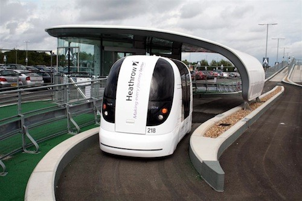

# Collective mobility vehicles {#collective}

## Demand responsive transit {#drt}

**Updated: 27th October 2022**

### Synonyms {-}
*Micro-public transport, Sustainable Urban Mobility Plans (SUMP), European Structural and Investment Funds (ESIF), Information and communications technology (ICT)*

### Definition {-}
Demand-responsive transit (DRT) systems provide transport services in response to a passenger's request. Modern telecommunication technologies are used to receive requests (via websites, SMS, mobile apps, and less frequently phone calls). These systems are a middle ground between routing systems and taxi services and hardly differ from them in extreme implementations. DRT systems offer flexibility in transport services provided according to demand by using different technologies and organisational principles (Gorev et al., 2020).
DRT has been seen primarily as a solution for people with reduced mobility, but targeting new user groups and combining it with new ICT systems and traffic management tools is an innovative and effective approach. This new form of mobility can bring many benefits to European regions, such as cost savings, less congestion on the roads and emission reductions, while improving the quality of life of citizens. DRT systems are adaptable to almost any region, with numerous parameters that can be changed to suit different regional scenarios (Hunkin & Krell, 2018):

-	DRT systems usually need to be initiated by a public authority. By their very nature, potential user groups are often scattered and fragmented, making them difficult for private operators to identify. Regions should take stock of the performance of their transport systems and consider where public transport is used and at what cost to see where it might be cheaper and more environmentally friendly to use a DRT system.
-	Sustainable Urban Mobility Plans should be developed or modified to include DRT, considering linkages with other transport modes. The process should be overseen by a single transport authority that sets clear low-carbon transport targets to show the long-term direction of travel.
-	The lead partner of DRT initiatives must bring together all stakeholders and manage the process of collaboration. It is the role of the authority to consider the long-term goals and set targets to achieve broader public policy objectives.
-	DRT needs to be made attractive and convenient if it is to have a broad impact. Communication should focus on the multiple benefits of DRT, and ICT should be used as much as possible to effectively integrate services into public transport information systems.
-	The integration of [smart cards](#contactless_cards) and electronic payments can help improve the convenience of the DRT solution. However, app-only or cell phone services should be avoided so that users who do not have access to these technologies are not disadvantaged.
-	Systems should aim to provide both instant and pre-order services for maximum convenience.
-	There is support for the development and implementation of DRT systems such as ESIFs (European Structural and Investment Funds).

### Key stakeholders {-}

- **Affected**: Public transport users 
- **Responsible**: National governments, Local government, Public transport authorities

### Current state of art in research {-}
There are many variables that have a direct or indirect influence on the performance of DRT services. These factors can be divided into three groups: *Network*, *Operations* and *Demand Characteristics*. Most research uses different approaches to study the impact of these factors on the performance of the service. These approaches can be broadly categorised into two groups: simulations and approximate mathematical methods (Amirgholy & Gonzales, 2016). <br/><br/>
A study on the impact of pricing and service area design on modal shift towards demand responsive transport has shown that a small service area and too low prices can lead to an undesirable shift effect from walking and cycling to DRT. In order to design a DRT concept that leads to a reduction of car trips, the service area should not be limited to the city centre but cover a typical commuter area. Furthermore, the pricing system should have a relatively high minimum charge to make DRT less attractive for short-distance travellers who can also walk or cycle. The simulation experiments have also shown that even with a city-wide DRT coverage area and a minimum charge of 3.00 EUR, without car toll only 11% of DRT users are shifted from car to DRT. With car tolls, the simulation experiments result in a larger share of users shifting from car to DRT. Similar to Kaddoura et al., (2020a) this shows the importance of combining "*pull*" measures (introducing the DRT as a new mode of transport) with "*push*" measures, such as introducing road pricing, increasing parking fees or banning private cars in certain areas. Several simulation experiments show that even with a city-wide DRT and a minimum charge, a significant proportion of DRT users come from public transport. From a user perspective, this is a positive effect as users who switch from public transport to DRT benefit from, for instance, a shorter travel time (Kaddoura et al., 2020b).
Demand responsive transport (DRT) services appear to be more effective in minimising emissions than scheduled services when demand density is not excessive and good service levels are targeted. In particular, demand responsive services perform better in a ring network and the possibility to use smaller vehicles makes them perform better than scheduled services in almost all scenarios studied (Amirgholy & Gonzales, 2016). <br/><br/>
The analysis on the introduction of flexible modes of public transport services recommends the following order of measures for the implementation of the DRT system: 

-	the analysis of the service area in terms of demand for public passenger transport services (population and job density, transport accessibility, condition of the road network, age structure of the population, income level, motorisation level); 
-	the forecast of passenger transport intensity and identification of areas with low demand; 
-	the analysis of the demand structure, identification of factors that negatively affect the DRT system, such as time-dependent demand (seasonal demand, etc.); 
-	the development of an organisational plan and DRT technology, selection of the service type; 
-	the analysis of the possibility to combine the service with social services for people with reduced mobility; 
-	the calculation of costs;
-	the determination of the possibility to receive subsidies from local authorities; 
-	the development of a detailed service plan, including a business plan and a marketing policy. 

As the DRT system needs significant subsidies from local authorities to cover the significant difference between the costs and the revenues of the transport operator, it is advisable to use combined solutions for existing routes that provide for the use of DRT at certain intervals, which can be beneficial for all entities (transport operators, local authorities, passengers) (Gorev et al., 2020). Finally, the productivity and costs of DRT services of two management practices (time window size setting and a centralised vs. decentralised strategy) is investigated by Quadrifoglio et al., (2008).<br/>

Currently the research focuses on software and algorithms trying to optimize DRT. Optimization models can help minimizing the total travel time and thereby the total fleet size. Consequently, DRTs can be adapted to different situations and preference of the decision makers. Moreover, novel algorithms are developed to design an eco-oriented DRT system. Algorithms in this field often involve mixed-integer programs for the optimization of energy efficiency by saving fuel an reducing emissions by, for example,  using a customized DP-based hybrid heuristic algorithm (Jing et al., 2021; Xin, 2022).

### Current state of art in practice {-}
In the last decades, several companies have launched app-based on-demand mobility services (e.g. [UBER](https://www.uber.com/at/en/), [Lyft]( https://www.lyft.com/), [BerlKönig]( https://www.berlkoenig.de/), [CleverShuttle]( https://www.clevershuttle.de/en), [MOIA]( https://www.moia.io/en)). Most of these services combine ride requests of several passengers who then share a ride (pooling, ridesharing). These services form a new category within public transport and are often referred to as Demand Responsive Transit (DRT) or ride-hailing. Most of the existing services are still based on conventional driver-controlled vehicles; only a few services are experimenting with autonomous vehicles (Harris, 2015; Hsu, 2016). A broad market introduction of (shared) autonomous vehicles is expected to reduce operating costs. Lower estimates are in the range of 0.30 to 0.38 EUR per passenger-km (Bösch et al., 2018). Lower operating costs can translate into lower user prices, which can boost demand for such innovative on-demand mobility services (Kaddoura et al., 2020).
The global Demand-Responsive Transit market can be segmented on the basis of transport service, transit service type, booking type and region. In terms of transit service, the Demand-Responsive Transit market can be segmented into bus and taxi. DRT service is generally served by buses. The demand for DRT service for various applications such as school buses, para-transit, medical rides and more is increasing. <br/><br/>
Based on booking type, the Demand-responsive Transit market can be segmented into online booking and offline booking. DRT service offers multiple booking modes such as offline and online booking. Majority of consumers use online booking as it offers higher level of flexibility and real-time information. The online segment is expected to grow rapidly.
In terms of regions, the global demand responsive transit market can be segmented into North America, Europe, Asia Pacific, and Middle East and Africa. Demand-responsive transit in Europe has largely catered to the needs of mobility-impaired passengers since 1997. Europe is likely to dominate the global Demand-Responsive Transit market for the next few years.<br/>

DRT adoption is being driven by smart city initiatives, government and mobility policies, reduced car ownership and a shift towards multimodal and intermodal transport.
Much of this growth will take place in Europe, currently the largest market for shared mobility, and China. Asia-Pacific, where shuttles are already replacing public transport, is one of the largest DRT markets and will be responsible for over 60% of fleet size growth. The US is also experimenting with different models and it is expected to see strong growth in the medium to long term. However, in other regions such as Latin America, shuttles compete with existing shuttle buses and the potential market in Africa is still very small. 
DRT shuttles combine the affordability of public transport with the convenience of single rides. Accessible transport promotes social inclusion as citizens of all income levels are able to commute to work in a reasonable time.<br/><br/>
The ITF Forum proposes to replace all car trips with demand responsive shuttles.
As DRT shuttles generally complement public transport, Frost & Sullivan recommend public-private partnerships to expand the market and deploy resources effectively. They suggest that asset-intensive services could be operated in collaboration between different service providers or through specially developed technology platforms (Martret, 2019).
The degree of cost recovery from ticket sales of flexible public transport services varies, according to an evaluation of different mobility services in Germany, between 6% and 41% (BMVBS & BBSR, 2009). In rural areas in Austria, the degree of cost recovery is about 15% due to low utilisation rate (VCÖ, 2011). This circumstance requires increased subsidies, which cannot be provided without restrictions due to the need to save money in the public sector (Sammer & Klementschitz, 2010).<br/>

Current ‘mobility talks’ are continuously focusing on DRT. Most talks develop around innovative companies and new technologies with an aim to  reduce car dependency and lower mobility costs for people living in remote areas (trying to solve rebound effects of the urban sprawl). One such collaboration involves the App [Nemi](http://www.nemi.mobi) and Evergreen, focusing on the exploration of best practices for planning and deploying DRT services (especially on aspects of operational deployment and user engagement) (Evergreen, 2022). Failing to address user needs and challenges is, according to Cameras (2022), one out of his eight reasons DRT systems fail nowadays. Other stated reasons involve Value, Complexity, Communication, Compliance, Funding, or the Provider.

### Relevant initiatives in Austria {-}
The term micro-public transport is currently not found in any legal documents in Austria. In the „Kraftfahrliniengesetz“ (KflG), the term Anrufsammeltaxis (§ 38 para. 3 Z 2 KflG) is explained in more detail and many micro-public transport services correspond to this legal definition. In addition, the commercial operation of passenger transport requires a licence under the “Gelegenheitsverkehrsgesetz” (§ 3 para. 1 Z 3 GelverkG). Nevertheless, there are micro public transport services, which cannot be assigned to the KflG nor the GelverkG. For the future development, with regard to legal certainty, more in-depth research work is recommended (Brandl, 2020).

- [bedarfsverkehr.at](https://www.bedarfsverkehr.at/content/Literatur)
- [repositum.tuwien.at](https://repositum.tuwien.at/handle/20.500.12708/1312)
- [projekte.ffg.at](https://projekte.ffg.at/projekt/2929323)


### Impacts with respect to Sustainable Development Goals (SDGs) {-}

```{r table80, echo=FALSE, results='asis'}
cat('| Impact level| Indicator|Impact direction| Goal description and number|Source|
|:------------:|:-----------:|:------------:|:------------:|:------------:|
|Individual|Increases affordability, social inclusion and accessibility of transport.|**+**|Equality (*5,10*)|Martret, 2019|
|Systemic|Potential for cost savings, congestion and emissions reductions|**+**|Health & Wellbeing (*3*)|Hunkin and Krell, 2018|
|Systemic|Only 11% of car users are predicted to shift to DRT|**~**|Environmental sustainability (*7,12,13,15*)|Kaddoura et al., 2020b|
|Systemic|Predicted market growth worldwide; low utilisation rate in Austrain rural areas|**~**|Sustainable economic development (*8,11*))|VCOE, 2011; Martret, 2019|')
```

### Technology and societal readiness level {-}

```{r table81, echo=FALSE, results='asis'}
cat('|TRL| SRL|
|:----:|:----:|
|7-9|6-8|')
```

### Open questions {-}
1. Which service concepts lead to which modal shift effect?
2. How to deal with volunteering in the context of micro-public (demand responsive) transport ? What framework conditions (legal basis) need to be created?
3. Can DRT be included in the Climate ticket in Austria, and how to operationalise it?

### Further links {-}

- [maas-alliance.eu](https://maas-alliance.eu/)
- [Interreg Europe](https://www.interregeurope.eu/sites/default/files/2021-12/Policy%20brief%20on%20demand%20responsive%20transport.pdf)

### References {-}
- Amirgholy, M., & Gonzales, E. J. (2016). Demand responsive transit systems with time-dependent demand: User equilibrium, system optimum, and management strategy. Transportation Research Part B: Methodological, 92, 234–252. https://doi.org/10.1016/j.trb.2015.11.006
-	BMVBS, & BBSR. (2009). Mobilitätskonzepte zur Sicherung der Daseinsvorsorge in nachfrageschwachen Räumen - Evaluationsreport. BBSR-Online-Publikation, 10, 47. http://www.bbsr.bund.de/BBSR/DE/Veroeffentlichungen/BBSROnline/2009/DL_ON102009.pdf?__blob=publicationFile&v=2
-	Bösch, P. M., Becker, F., Becker, H., & Axhausen, K. W. (2018). Cost-based analysis of autonomous mobility services. Transport Policy, 64(August 2017), 76–91. https://doi.org/10.1016/j.tranpol.2017.09.005
-	Brandl, H. (2020). Mobilität – Daseinsgrundfunktion in ländlichen Räumen? Erfolgsfaktoren für den idealtypischen Prozess zur Planung und Implementierung von Mikro-ÖV Angeboten.
- Cumeras, R. (2022). 8 reasons demand-responsive transport systems fail. Shotl. Available at: https://shotl.com/news/8-reasons-demand-responsive-transport-systems-fail [Accessed: 28 September 2022]
- Evergreen (September 2022). Evergreen “on-demand transport” about to entering the next level?. Mobility Innovation Marketplace. Urban Mobility. Available at: https://marketplace.eiturbanmobility.eu/insights/evergreen-on-demand-transport-about-to-entering-the-next-level [Accessed: 29 September 2022]
-	Gorev, A., Popova, O., & Solodkij, A. (2020). Demand-responsive transit systems in areas with low transport demand of “smart city”. Transportation Research Procedia, 50(2019), 160–166. https://doi.org/10.1016/j.trpro.2020.10.020
-	Harris, M. (2015, September 14). Uber Could Be First to Test Completely Driverless Cars in Public - IEEE Spectrum. https://spectrum.ieee.org/cars-that-think/transportation/self-driving/uber-could-be-first-to-test-completely-driverless-cars-in-public
-	Hsu, J. (2016, January 4). GM and Lyft Team Up for Robot Taxi Service - IEEE Spectrum. https://spectrum.ieee.org/cars-that-think/transportation/self-driving/gm-and-lyft-team-up-for-robot-taxi-service
-	Hunkin, S., & Krell, K. (2018). Demand responsive transportation. Interreg Europe Policy Learning Platform on Low-Carbon Economy. https://doi.org/10.4324/9781315118321
- Jing Zhao, Sicheng Sun & Oded Cats (2021). Joint optimisation of regular and demand-responsive transit services. Transportmetrica A: Transport Science, DOI: 10.1080/23249935.2021.1987580
-	Kaddoura, I., Bischoff, J., & Nagel, K. (2020a). Towards welfare optimal operation of innovative mobility concepts: External cost pricing in a world of shared autonomous vehicles. Transportation Research Part A: Policy and Practice, 136(February), 48–63. https://doi.org/10.1016/j.tra.2020.03.032
-	Kaddoura, I., Leich, G., & Nagel, K. (2020b). The impact of pricing and service area design on the modal shift towards demand responsive transit. Procedia Computer Science, 170, 807–812. https://doi.org/10.1016/j.procs.2020.03.152
- Laa, B., Shibayama, T., Brezina, T., Schönfelder, S., Damjanovic, D., Szalay, E., Hammel, M. (2022). A nationwide mobility service guarantee for Austria: possible design scenarios and implications. Eur. Transp. Res. Rev. 14, 25 . https://doi.org/10.1186/s12544-022-00550-5
-	Martret, O. (2019, March 25). Demand-Responsive Transit Is the Future of the Mobility Market. https://shotl.com/news/responsive-transit-is-the-future-of-the-mobility-market
-	Quadrifoglio, L., Dessouky, M. M., & Ordóñez, F. (2008). A simulation study of demand responsive transit system design. Transportation Research Part A: Policy and Practice, 42(4), 718–737. https://doi.org/10.1016/j.tra.2008.01.018
-	Sammer, G., & Klementschitz, R. (2010). Finanzierung des öffentlichen Personennahverkehrs in Österreich. ÖGZ - Österreichische Gemeindezeitung, 26 – 28.
-	VCÖ. (2011). Erfolgreicher Öffentlicher Verkehr. In VCÖ Schriftenreihe ‘Mobilität mit Zukunft’ (Issue 4).
- Xin, L, Tianqi, W., Weihan, X., Huaiyue, L., Yun, Y. (2022). A novel model and algorithm for designing an eco-oriented demand responsive transit (DRT) system. Transportation Research Part E: Logistics and Transportation Review. Volume 157. 102556. ISSN 1366-5545. https://doi.org/10.1016/j.tre.2021.102556.

## Personal rapid transit {#prt}

**Updated: 30th September 2022**

### Synonyms {-}
*Automated Transit Networks, ATN, PRT, Podcars*

### Definition {-}
Personal rapid transit is a public transportation option in urban areas where fully automated vehicles provide on-demand, origin-to-destination service over an area network. PRT belongs to a larger family of automated guideway transit (AGT). It is a unique mode of transport that has the following features (Furman et al., 2014; Juster & Schonfeld, 2013): 

-	Direct service from origin to destination
-	Small vehicles that can be used exclusively by an individual or a small group
-	Service based on the needs of the user (on demand rather than fixed schedules)
-	Travelling speed up to 30 mph (48 km/h)
-	Fully automated vehicles
-	Vehicles restricted to a route reserved for their exclusive use, along the guideways
-	Small driveways that are usually elevated at or near ground level 

The components of the personal rapid transit system are:

-	**Software**: integrates all elements of the systems and ensures its flawless functioning 
-	**Hardware**: includes electric and electronic components along the rails and at the stations
-	**Vehicles**: are crucial for passenger experience. In some countries, e.g. the USA, PRT vehicles must be suitable for use by disabled people
-	**Stations and guideways**: are the most important elements from the perspective of planners because they influence the urban architecture and invade significantly in the aesthetic of the urban environment. Guideways are physical structures that support and guide an AGT vehicle, consisting of rails and columns. This is the most expensive element of the PRT system
-	**Power sources**: all PRT are powered electrically
-	**Operations and maintenance facilities**: are necessary for control centre, vehicle and equipment storage and maintenance areas

PRT can be considered a more environmentally friendly, lighter and quieter alternative to [light rail transport](#lrt) (LRT) or [bus rapid transport](#brt) (BRT). It also travels slower than typical LRT or BRT, however, it compensates the time by only stopping at the requested stations. This, in turn, saves significant amount of deceleration and acceleration time. The capacity of PRL reaches 10 000 passenger per hour per direction, which is slightly lower compared to LRT and BRT. 

### Key stakeholders {-}

- **Affected**: Citizen, Airport Passengers
- **Responsible**: City government, Private Companies, Transport Planners

### Current state of art in research {-}
Recent research on PRT is scarce, where the majority of studies have been conducted around 2010. They mainly focused on the cost-benefit analysis and comparisons to LRT and BRT (Juster & Schonfeld, 2013). Furthermore, they considered the potential of different integration designs such as construction of guideways above the pavement with and without trees, above the parking lane, in the middle of the road, adjacent to building or integrated into the buildings or tunnels. Special considerations are required due to grade separation which can interfere with trees or cause obstruction at the pavements (Furman et al., 2014). An important aspect is also the aesthetic side of PRT which intrudes significantly into the urban landscape due to elevated rails. Therefore, concerns arise about social acceptability of PRT, where it is expected to affect adversely land use, property values, obstruct light and air as well as create unused spaces underneath the guideways (Staniscia, 2018). The most recent studies focus on the PRT in the context of airport shuttles where this concept has already been proven functional. For example, study by Mobolaji et al., (2021) explored the potential of extension of PRT to connect parking facilities and terminal at Budapest Airport, taking into account user expectations and system architecture. <br/>

Current research focuses on detailed micro-simulation studies, techno-economic analyses of energy supply or stochastic optimization for PRT (Elkamel et al., 2021). The findings regarding energy supply and efficiency of typical urban PRT show that battery and third rail energy supply PRT are both competitive with private EV (Mittelman et al., 2022). Etgar et al. (2022) conducted a detailed micro-simulation study on the PRT capacity for inner-city by using a general simulation software rather than a transportation-oriented tool due to PRT’s complex operation and structure. Results show that capacity is not sensitive to pod velocity, but rather to the number of pods which suggest finding an optimal pod quantity.

### Current state of art in practice {-}
The concept of PRT is more than 50 years old, nevertheless, they are only available in few places around the world. About 30% of the PRT are located at the airports, 30% in the institutional context such as university campus and the final 30% is a mass transit. The examples of existing PRTs are (Furman et al., 2014, p.12):

-	The Morgantown PRT at West Virginia University
-	The Parkshuttle Rivium metro-feeder outside Rotterdam 
-	The Terminal 5 shuttle at London Heathrow Airport 
-	The nature park shuttle in Suncheon Bay, South Korea 
-	The Masdar City PRT in Abu Dhabi 

```{r, echo = FALSE, out.width="40%", fig.cap = "London Heathrow Airport Shuttle (Kraft, 2012)"}

```

The reasons for such a limited appearance are scare technical capabilities and scalability of PRT systems along with high capital and operating costs (Furman et al., 2014, p. 36). 


### Relevant initiatives in Austria {-}

Buschbacher (2018) proposed a 2 wheeled personal rapid transit for maximum sustainability. He described a functioning principle, characteristics of vehicles and route network as well as possible effects on cross-modal competition and intermodal travel chains. Beyond, he designed a street network in which only fully automated vehicles are allowed to enable actionable implementation of automated vehicles that are, also built with less weight and materials.

- [17th International Conference on Personal Rapid Transit and System Design in 2023](https://waset.org/personal-rapid-transit-and-system-design-conference-in-june-2023-in-vienna) 
- [2wheelPRT](https://buschbacher.at/2wPRTde.html)

### Impacts with respect to Sustainable Development Goals (SDGs) {-}

```{r table67, echo=FALSE, results='asis'}
cat('| Impact level| Indicator|Impact direction| Goal description and number|Source|
|:------------:|:-----------:|:------------:|:------------:|:------------:|
|Individual|Adverse impact on visual aspect of urban spaces|**-**|Health & Wellbeing (*3*)|Staniscia, 2018|
|Systemic|Grade separation increases safety|**+**|Health & Wellbeing (*3*)|Juster & Schonfeld, 2013; Furman et al., 2014|
|Systemic|Electric power used|**+**|Environmental sustainability (*7,12,13,15*)|Juster & Schonfeld, 2013|
|Systemic|Limited adoption worldwide|**-**|Innovation & Infrastructure (*9*)|Furman et al., 2014|')
```

### Technology and societal readiness level {-}

```{r table68, echo=FALSE, results='asis'}
cat('|TRL| SRL|
|:----:|:----:|
|5-8|5-7|')
```

### Open questions {-}
1. More research is needed on actual analysis of costs and benefits associated with the construction of PRT.
2. Can PRT infrastructure be considered and used as a attractive urban furniture? How can art community be engaged in its development?
3. What are the major barriers for more widespread adoption of PRT?

### Further links {-}

- [MIT Report](https://transweb.sjsu.edu/sites/default/files/1227-automated-transit-networks.pdf)

### References {-}
- Buschbacher, H. (2018). 2-wheel personal rapid transit: Self driving vehicles for maximum sustainability. TRA Vienna 2018. Available at: https://buschbacher.at/TRA_2wPRT.pdf [Accessed: 30 September 2022]
-	Elkamel, M., Ahmadian, A., Diabat, A., Zheng, Q. P. (2021). Stochastic optimization for price-based unit commitment in renewable energy-based personal rapid transit systems in sustainable smart cities. Sustainable Cities and Society. Volume 65, 102618. ISSN 2210-6707. https://doi.org/10.1016/j.scs.2020.102618.
-	Etgar, R., Avineri, E., Cohen, Y. (2022). Personal rapid transit capacity evaluation for inner-city: A detailed micro-simulation study. International Journal of Transportation Science and Technology. ISSN 2046-0430. https://doi.org/10.1016/j.ijtst.2021.12.002.
- Furman, B., Fabian, L., Ellis, S., Muller, P., & Swenson, R. (2014). Automated transit networks (ATN): A review of the state of the industry and prospects for the future.
- Juster, R., & Schonfeld, P. (2013). Comparative analysis of personal rapid transit as an urban transportation mode. Transportation research record, 2350(1), 128-135.
- Kraft, A. (2012). The beginning of personal rapid transit. Available at: https://www.zdnet.com/article/the-beginning-of-personal-rapid-transit/ [Accessed: 21 Oct 2021]
- Mittelman, G., Kariv, Y., Cohen, Y., Avineri, E. Techno-economic analysis of energy supply to personal rapid transit (PRT) systems. Applied Energy. Volume 306, Part B, 118006. ISSN 0306-2619. https://doi.org/10.1016/j.apenergy.2021.118006.
- Mobolaji, K., Földes, D., & Csiszár, C. (2021). Concept of Advanced Personal Rapid Transit at Airports. Periodica Polytechnica Civil Engineering, 65(1), 320-334.
- Staniscia, S. (2018). Aesthetic appreciation of Personal Rapid Transit: A new viewpoint. Cities, 79, 169-177.
- 	VCÖ (2019). 2 wheel personal rapid transit. Available at: https://mobilitaetsprojekte.vcoe.at/-wheel-personal-rapid-transit-2019 [Accessed: 30 September 2022]


## Bus rapid transit {#brt}

**Updated: 2nd October 2022**

### Synonyms {-}
*High-level bus transport (HLBT)*

### Definition {-}
Cities worldwide are looking for expanding the capacity of their public transport system while considering budget limitations (Ishaq & Cats, 2020). Bus Rapid Transit (BRT) systems are increasingly being considered as alternatives for designing mass public transport in medium-sized cities in developed countries to reduce traffic congestion with its harmful effects on public health, the economy and the environment. Bus Rapid Transit (BRT) systems are high-quality bus-based transport systems that provide fast and efficient service (Abbasi et al., 2020). This is achieved by providing dedicated lanes, with busways and stations typically aligned with the centre of the street, off-board fare collection, and fast and frequent operations. Because BRT has similar features to a [light rail]( #lrt) or metro system, it is much more reliable, convenient and faster than a regular bus service. With the right features, BRT is able to avoid the causes of delays that typically slow down regular bus services, such as being caught in traffic and waiting in line to pay on board (ITDP, 2021b).<br/>

The term Bus Rapid Transit (BRT) originated in North America and is increasingly used elsewhere. The same concept is expressed by different names in different places (Deng & Nelson, 2010):

-	High-capacity bus systems
-	High value bus systems
-	Metro bus
-	Surface metro
-	Rapid bus systems
-	Busway systems
-	High-level bus transport

BRT systems offer a high-capacity alternative to rail-based systems, which require significantly higher investment and a longer implementation time (Deng & Nelson, 2010; Fageda, 2021). In large cities in emerging economies, particularly in Latin America and South Asia, BRT is an integral part of, or forms the main part of, the mass public transport network. In contrast, BRT implementation in developed economies is mainly limited to medium-sized cities where demand levels do not justify large investments in urban rail infrastructure. In the European context, these projects are sometimes referred to as high service buses (BHLS) (Ishaq & Cats, 2020).

**BRT basics**<br/>
There are five essential features that define BRT. These features primarily result in a faster journey for passengers and make local travel more reliable and convenient (ITDP, 2021b). They are:

-  Dedicated right-of-way: Bus-only dedicated lanes provide a faster journey and ensure that buses are not delayed due to congestion in a mixed traffic.
-	Bus lane alignment: The centre of the lane or bus-only corridor keeps buses away from busy kerbs where cars park, stand and turn.
-	Fare collection: Paying the fare at the bus stop, rather than on the bus, eliminates the delay caused by passengers waiting on board.
-	Treatment of intersections: Prohibiting traffic from turning across the bus lane reduces bus delays caused by turning traffic. Prohibiting such turns is the most important measure to move buses through intersections - even more important than [signal priority](#public_trans_priority).
-	Platform level boarding: The bus stop should be level with the bus for quick and easy boarding. This makes it accessible to wheelchairs, disabled passengers, prams and walkers with minimal delays.

To be considered a BRT, a corridor must (ITDP, 2021b, 2021a):

-	Be at least 3 km long;
-	Score 4 or more points in the dedicated right-of-way element;
    -	8 points: Physically separated, dedicated lanes (e.g. fences, curbs, bus stations)	
    -	6 points: Colour-differentiated, dedicated lanes with no physical separation 
    -	4 points: Dedicated lanes separated by a painted line 
    -	0 points: No dedicated lanes 
-	Score 4 or more points in the bus alignment element;
    -	8 points: Two-way bus lane with median in the middle strip of a two-way road 
    -	8 points: Bus-only corridor in which there is a fully exclusive right-of-way and no parallel mixed traffic or converted corridor
    -	8 points: Busway that runs along a boundary condition such as a boardwalk or park where there are few intersections that cause conflicts
-	Score 20 or more points in all five basic BRT elements
    -	Dedicated right of way (up to 8 points)
        -	Best practice: The Rainbow BRT Sangamwadi-Vishrantwadi corridor (Pune/Pimpri-Chinchwad, India), which uses fencing to create dedicated, physically separated bus lanes.
    -	Busway alignment (up to 8 points)
        -	Best practice: The Metrobus Green Line (Lahore, Pakistan), which includes a two-way median-aligned busway in the median of an roadway.
    -	Off-board fare collection (up to 8 points)
        -	Best practice: The TransJakarta Koridor 1 (Jakarta, Indonesia) offers off-board ticketing with turnstile-controlled access to stations
    -	Intersection treatments (up to 7 points)
        -	Best practice: Corredor Metropolitano ABD (São Paulo, Brazil) that prioritizes pedestrians and bans left-turns at intersections.
    -	Boarding at platform level (up to 7 points)
        -	Best practice: Ahmedabad BRTS (Ahmedabad, India) that, through well-designed infrastructure and driver training, has been able to reduce the boarding distance to less than 10 centimetres.

For more information on scoring system see [scorecard](https://www.itdp.org/library/standards-and-guides/the-bus-rapid-transit-standard/the-scorecard/).

**Open vs. closed**<br/>
BRT combines stations, vehicles and technology into a high-quality, rail-like and can help improve urban mobility. The resurgence of bus-based transport in recent years has attracted great interest from transport and urban planners as it offers flexible, high-quality services at a lower cost than a rail-based transport system. With many successful systems around the world, investment in BRT has skyrocketed. One of the advantages of BRT is the flexibility of system design of corridors and stations. BRT can use buses operating in a variety of traffic conditions, such as mixed traffic, dedicated lanes on rural roads, and busways (highways or lanes of a highway reserved for the exclusive use of BRT). In North America, most BRT systems use separate or segregated lanes, while in South America BRT systems use the centre lanes. Another advantage of BRT is the operational flexibility to integrate with existing conventional bus services. <br/>

BRT can operate as either an open or closed system. A closed system means that BRT buses can only operate on the BRT corridor and non-BRT buses cannot operate on the BRT corridor (Zhang et al., 2020b). Users typically view a closed BRT system as a frequent and on-time rail-like service that eliminates most of the typical causes of delay that occur with conventional bus services (Zhang et al., 2020a). Some newer BRT systems (Seoul in South Korea, Guangzhou in China and Sydney, Adelaide and Brisbane in Australia) have adopted an open system approach where conventional buses enter and exit the BRT corridor. These open BRT services allow passengers to reach the BRT corridor without changing buses. In an open BRT system, they can effectively improve BRT accessibility for passengers away from the BRT corridor by eliminating the disadvantages associated with transferring, as well as additional walking and waiting time (Yen et al., 2018). However, local traffic may affect these feeder services that use the BRT corridor for part of their routes, reducing the overall performance of the BRT service. On the other hand, since bus-based systems are flexible, sometimes a hybrid mode of operation could also be suitable. Transport planners can review bus routes to identify high ridership routes and operate an open BRT for these routes and add additional services operating as a closed system for other low ridership routes and design a network of feeder buses for these services. This concept can be applied to different times of the day, with the BRT corridor being an open system during off-peak hours to allow for single occupancy trips and closed during peak hours to relieve overcrowding and congestion (Zhang et al., 2020b).

### Key stakeholders {-}

- **Affected**: Mobile citizen, Public transport users
- **Responsible**: National governments, City government,  Private Companies, Transport agencies, Infrastructure providers, Bus manufacturers

### Current state of art in research {-}
Many researchers focus on local BRT systems with different emphases such as Malik et al. (2021) investigates user travel behaviour in Lahore, Kiani. Mavi et al. (2018) evaluates and optimises a BRT line in Tehran (Iran) using a simulation and multi-criteria decision-making approach. Ishaq & Cats (2020) report empirical findings from the implementation of a BRT system in Haifa (Israel). Finally,  Mallqui & Pojani (2017) compares Bus Rapid Transit (BRT) issues in Brisbane (Australia) with Lima (Peru). Citizen participation has taken place in both cities. Regardless of competition from other modes of transport, both BRT systems have been positively received by the local population. In particular, people who live close to the stations and can use the BRTs for their commute to work are very positive about this mode of transport. <br/>
Schwanen & Ferbrache (2017) from the Transport Studies Unit at the University of Oxford have compiled a list of literature on the wider economic and social impacts of Bus Rapid Transit (BRT). The following topics are covered by the literature:

-	BRT impact studies, which examine wider economic and social impacts of BRT. 
-	Land development, land use change and/or transport-oriented development. 
-	change in land/property values 
-	new economic development 
-	accessibility of jobs/workplaces 
-	improvement of the urban environment 
-	prestige/reputation of the city 
-	physical displacement of poorer households

Several researchers have investigated the effect of Bus Rapid Transit (BRT) on property values (Zhang et al., 2020a; Zhang & Yen, 2020)). Zhang & Yen (2020) compared 23 other studies on this topic and the two main conclusions are:

-	The estimated increase in value for land is much higher than for real estate (i.e. 27.5% higher).
-	In general, land and real estate within 50 m of a BRT station have a price premium of 13.0% compared to land and real estate 1,2 km away.

These results can help to better understand the accessibility benefits of BRT systems, especially where empirical evidence is lacking. However, evidence from European BRT systems is lacking and few studies have examined how BRT systems affect land and property values over time.<br/>

Basso et al. (2019) proposed a dynamic congestion approach that endogenously models queues both on the road and at BRT stations. Some of the key findings are:

-	The optimal BRT is efficient in terms of total cost, and even with imperfectly divisible capacity, BRT is still the better choice for many demand levels (starting with demands between 8000 and 8500 commuters).
-	Without BRT, there is a large demand cut interval where it is optimal to offer no public transport (up to 10,000 commuters). However, if part of the road capacity were dedicated exclusively to buses, then optimally buses would have to run very frequently. Urban planners should, therefore, plan BRT systems from the outset, rather than gradually integrating public transport until demand becomes so high that traffic congestion occurs. Thus, bus frequencies will become more frequent and dedicated bus lanes will become "necessary".
-	The operating times of buses and cars are much shorter with BRT than under mixed traffic conditions. Therefore, although BRT takes capacity away from car traffic, it will reduce the peak time of car traffic.

Abbasi et al. (2020) studied different aspects of BRT in Tehran (Iran). In their simulations, exclusive bus lanes had good effects on reducing pollutant emissions and fuel consumption. On average, the exclusive bus lanes scenarios would reduce CO emissions from buses by 40.6% and increase CO emissions from cars by 3.1%, NOx (buses reduced by 15.1%; cars increased by 6.7%), PM (buses reduced by 6.7%; cars increased by 4.4%) and fuel consumption (buses reduced by 5.6%; cars increased by 3.2%). In the scenarios of efficient use and standardisation of the number of stations, not only the pollutant emissions of the buses are reduced, but also those of the passenger cars. One possible reason for this is the reduction of conflicts between buses and cars on shared lanes. In the scenario of implementing switched traffic lights and bus priority, pollutant emissions and fuel consumption of buses decrease by 10.2% on average, while they increase by 1.3% for passenger cars. From an economic point of view, the full exclusive bus lane had the highest reduction in annual costs.<br/>

Combined bus rapid transit and buses in a dedicated bus lane (CBBD) is a measure which BRT operators implement to reduce overlapping routes. Hoonsiri et al. (2021) researched this measure to enhance urban transport sustainability and recommend a CBBD reform to improve travel time and promote environmental sustainability for public transport systems in urban cities. A 12-month-study on impacts of replacing a traditional bus service with bus rapid transit on physical activity showed no noticeable immediate impact on physical activity levels (McCormack et al., 2021).<br/>

Latest local BRT studies focus on understanding user needs in Multan (Nadeem et al., 2021) or travelers’ willingness to adopt BRT if private car travel is still persistent in Karachi (Soomro et al., 2022), both cities in Pakistan. Others try new optimizations, using stochastic models when scheduling with uncertainty which reflects the complexity of the BRT scheduling problem. Study by Filabadi et al. (2022) is the first one to present and solve a mixed-integer nonlinear programming model for BRT scheduling. Further research focuses on emission characterization and co-benefits of BRT in Hanoi, Vietnam and shows significant positive changes in GHG and pollutant emissions as well as health benefits compared to the current regular busses (Nguyen et al., 2021).


### Current state of art in practice {-}
BRT systems initially thrived in Latin American cities (Dario Hidalgo & Graftieaux, 2008), before spreading to South and East Asia and then across the world (Darío Hidalgo & Gutiérrez, 2013). However, although the number of BRT systems is increasing worldwide, only ~10% of BRT systems are currently located in low- and middle-income countries (Malik et al., 2021). <br/>

According to (Global BRTData, 2021), the distribution of BRT systems worldwide (as of 2021) in terms of number of passengers (worldwide daily 33,684,575) is divided into Africa with 491,578 passengers (1.45%), Asia 9,238,060 (27.42%), Europe 1,613,580 (4.79%), Latin America 20,916,474 (62.09%), Northern America 988,683 (2.93%) and Oceania 436,200 (1.29%). <br/>

Three new BRT systems established in Australia (Busway in Adelaide, Brisbane and Sydney) are open systems. This could be due to the characteristics of Australian urban areas, which tend to have low population density and high car use. Since passengers have to transfer, it is more difficult for a closed system to take advantage of the network effect, and an open BRT system might be more attractive in this car-dominated environment. However, Brisbane is considering switching to a closed BRT operating system due to serious congestion issues, particularly during peak hours (Zhang et al., 2020b).<br/>

Daimler says that more and more Europeans are recognising the advantages of effective and attractive urban bus transport systems. France is cited as a pioneer, where the government is supporting the expansion of BRT systems with large sums of money (Daimler (EvoBus GmbH), n.d.). This is implemented by the world's first hydrogen-powered express bus system that has gone into operation under the name Fébus in the French city of Pau. Eight ExquiCity18 Fuel Cell van-hool buses in tram design are used. The 18-metre-long articulated buses offer space for 125 passengers and can cover more than 300 kilometres per hydrogen filling (Schaal, 2019). <br/>

Further, two BRT lines were introduced in the public transport system in Florence. The two lines complete the network of public transport on the road to relieve the buses that currently operate on these routes. This innovation was made possible by the Metrocittà Sustainable Mobility Plan (autobusweb.com, 2021).<br/>

In Istanbul, the BRT network already stretches over a total of 52 kilometres and transports 750,000 passengers daily. Cities like Amsterdam, Strasbourg and Paris already operate their own BRT system. In Germany, BRT has not yet been implemented, as rail is still the first resort. According to Richard Mejía (head of the BRT team at Daimler Buses), the investment and operating costs are lower compared to rail systems. About the future development of BRT, it is mentioned that the previous concept is constantly being developed and adapted to new technologies or current urban planning. The course is currently being set for emission-free driving with electric mobility. Also, partially autonomous driving of buses (for example, the Future Bus from Mercedes-Benz, which was presented in mid-2016) could reduce fuel consumption through constant acceleration and braking behaviour. Extended and intelligent networking, for example between vehicles, signalling systems and the roadway, will also make BRT systems even more attractive in the future (Daimler AG, n.d.).

### Relevant initiatives in Austria {-}
Carinthia could get a rapid bus system for local transport, although further plannings have not been made to the current date.

- [Kaernten.orf.at](https://kaernten.orf.at/stories/3029225/)

Currently, eleven rapid bus transit lines, so-called *Schnellbussystem* (without dedicated lines), connect the centres of the 3 surrounding districts with the provincial capital of St. Pölten. The fleet consists of 47 vehicles in four different sizes in the uniform Wiesel design, which together offer a seating capacity for 2,449 passengers. Since 2021 seven new “Wiesel” buses in the design of a double decker were added to the fleet that offer even more traveling comfort and tie to the current public transport network (ÖBB, 2021).

- [Meinbezirk.at](https://www.meinbezirk.at/st-poelten/c-lokales/wieselbus-erfolgsstory-feiert-20-jahre_a1863287)


### Impacts with respect to Sustainable Development Goals (SDGs) {-}

```{r, echo=FALSE, results='asis'}
cat('| Impact level| Indicator|Impact direction| Goal description and number|Source|
|:------------:|:-----------:|:------------:|:------------:|:------------:|
|Systemic|Reduction in pollutant emissions and fuel consumption|**+**|Environmental sustainability (*7,12,13,15*)|Abbasi et al., 2020|
|Systemic|BRT requires significantly shorter investments and implementation time| **+**|Innovation & Infrastructure (*9*)|Deng & Nelson, 2010; Fageda, 2021|')
```

### Technology and societal readiness level {-}

```{r , echo=FALSE, results='asis'}
cat('|TRL| SRL|
|:----:|:----:|
|7-9|7-9|')
```

### Open questions {-}
1. How can development of BRT systems be supported in a better way through national policies?

### Further links

- [BRT data](http://brtdata.org/)
- [What is BRT?](https://www.itdp.org/library/standards-and-guides/the-bus-rapid-transit-standard/what-is-brt/)
- [Scorecard](https://www.itdp.org/library/standards-and-guides/the-bus-rapid-transit-standard/the-scorecard/)
- [BRT issues](https://www.transit.dot.gov/sites/fta.dot.gov/files/issues.pdf)

### References {-}
-	Abbasi, M. H., Hadji Hosseinlou, M., & JafarzadehFadaki, S. M. (2020). An investigation of Bus Rapid Transit System (BRT) based on economic and air pollution analysis (Tehran, Iran). Case Studies on Transport Policy, 8(2), 553–563. https://doi.org/10.1016/j.cstp.2019.11.008
-	autobusweb.com. (2021, March 2). Trasporto pubblico Firenze, in arrivo due linee Bus Rapid Transit. https://www.autobusweb.com/tpl-firenze-in-arrivo-due-linee-bus-rapid-transit/
-	Basso, L. J., Feres, F., & Silva, H. E. (2019). The efficiency of bus rapid transit (BRT) systems: A dynamic congestion approach. Transportation Research Part B: Methodological, 127, 47–71. https://doi.org/10.1016/j.trb.2019.06.012
-	Daimler (EvoBus GmbH). (n.d.). Bus Rapid Transit (BRT) in Europe – Impressions of a sustainable mobility concept in Strasbourg - EvoBus GmbH. Available at:  https://www.evobus.com/de-en/layer/bus-rapid-transit-brt-in-europe-impressions-of-a-sustainable-mobility-concept-in-strasbourg/ [Accessed: 24 June 2021]
-	Daimler AG. (n.d.). Bus Rapid Transit – Neue Unabhängigkeit im Stadtverkehr | Daimler. Available at: https://www.daimler.com/nachhaltigkeit/staedte/bus-rapid-transit.html [Accessed: 24 June 2021]
-	Deng, T., & Nelson, J. D. (2010). Transport Reviews Recent Developments in Bus Rapid Transit: A Review of the Literature. https://doi.org/10.1080/01441647.2010.492455
-	Fageda, X. (2021). Do light rail systems reduce traffic externalities? Empirical evidence from mid-size european cities. Transportation Research Part D: Transport and Environment, 92, 102731. https://doi.org/10.1016/j.trd.2021.102731
- Filabadi, M.D., Asadi, A., Giahi, R., Ardakani, A.T., Azadeh, A. (2022). A New Stochastic Model for Bus Rapid Transit Scheduling with Uncertainty. Future Transp., 2, 165-183. https://doi.org/10.3390/futuretransp2010009
-	Global BRTData. (2021). Global BRTData. Brtdata.Org. http://brtdata.org/
-	Hidalgo, Dario, & Graftieaux, P. (2008). Bus Rapid Transit Systems in Latin America and Asia: Results and Difficulties in 11 Cities. Transportation Research Record, 2072(1), 77–88. https://doi.org/10.3141/2072-09
-	Hidalgo, Darío, & Gutiérrez, L. (2013). BRT and BHLS around the world: Explosive growth, large positive impacts and many issues outstanding. Research in Transportation Economics, 39(1), 8–13. https://doi.org/10.1016/j.retrec.2012.05.018
- Hoonsiri, C., Chiarakorn, S., Kiattikomol, V. (2021). Using Combined Bus Rapid Transit and Buses in a Dedicated Bus Lane to Enhance Urban Transportation Sustainability. Sustainability, 13, 3052. https://doi.org/10.3390/su13063052
-	Ishaq, R., & Cats, O. (2020). Designing bus rapid transit systems: Lessons on service reliability and operations. Case Studies on Transport Policy, 8(3), 946–953. https://doi.org/10.1016/j.cstp.2020.05.001
-	ITDP. (2021a). The Scorecard - Institute for Transportation and Development Policy. https://www.itdp.org/library/standards-and-guides/the-bus-rapid-transit-standard/the-scorecard/
-	ITDP. (2021b). What is BRT? - Institute for Transportation and Development Policy. https://www.itdp.org/library/standards-and-guides/the-bus-rapid-transit-standard/what-is-brt/
-	Kiani Mavi, R., Zarbakhshnia, N., & Khazraei, A. (2018). Bus rapid transit (BRT): A simulation and multi criteria decision making (MCDM) approach. Transport Policy, 72, 187–197. https://doi.org/10.1016/j.tranpol.2018.03.010
-	Malik, B. Z., Rehman, Z. ur, Khan, A. H., & Akram, W. (2021). Investigating users’ travel behaviours and perceptions of single-corridor BRT: Lessons from Lahore. Journal of Transport Geography, 91, 102942. https://doi.org/10.1016/j.jtrangeo.2020.102942
-	Mallqui, Y. Y. C., & Pojani, D. (2017). Barriers to successful Bus Rapid Transit expansion: Developed cities versus developing megacities. Case Studies on Transport Policy, 5(2), 254–266. https://doi.org/10.1016/j.cstp.2017.01.004
- McCormack, G. R., Ghoneim, D., Frehlich, L., Blackstaffe, A., Turley, L., Bracic, B. (2021). A 12-month natural experiment investigating the impacts of replacing a traditional bus service with bus rapid transit on physical activity. Journal of Transport & Health. Volume 22, 101239. ISSN 2214-1405. https://doi.org/10.1016/j.jth.2021.101239.
-	Nadeem, M., Azam, M., Asim, M., Al-Rashid, M.A., Puan, O.C., Campisi, T. (2021). Does Bus Rapid Transit System (BRTS) Meet the Citizens’ Mobility Needs? Evaluating Performance for the Case of Multan, Pakistan. Sustainability, 13, 7314. https://doi.org/10.3390/su13137314
-	ÖBB (2021). POSTBUS: Modernste Doppelstockbusse nehmen für Wieselvusverkehre Betrieb auf. Presseinformation. Available at: https://www.postbus.at/de/news/neue-wieselbusse [Accessed: 2 October 2022]
-	Schaal, S. (2019, December 18). Fébus: Erstes H2-Schnellbussystem in Betrieb - electrive.net. https://www.electrive.net/2019/12/18/febus-erstes-h2-schnellbussystem-in-betrieb/
- Schuch, J. C., Nilsson, I. (2022). Rail Transit, for Who? perceptions and factors influencing light rail ridership in Charlotte, NC. Travel Behaviour and Society. Volume 27, Pages 38-46. ISSN 2214-367X. https://doi.org/10.1016/j.tbs.2021.06.001.
-	Schwanen, T., & Ferbrache, F. (2017). Bibliography of Research on Bus Rapid Transit. 1068. https://www.tsu.ox.ac.uk/pubs/1068-schwanen-ferbrache.pdf
- Soomro, R., Memon, I.A., Pathan, A.F.H., Mahar, W.A., Sahito, N., Lashari, Z.A. (2022). Factors That Influence Travelers’ Willingness to Adopt Bus Rapid Transit (Green Line) Service in Karachi. Sustainability, 14, 10184. https://doi.org/10.3390/su141610184
-	Yen, B. T. H., Mulley, C., Tseng, W. C., & Chiou, Y. C. (2018). Assessing interchange effects in public transport: A case study of South East Queensland, Australia. Case Studies on Transport Policy, 6(3), 364–375. https://doi.org/10.1016/j.cstp.2018.01.005
-	Zhang, M., & Yen, B. T. H. (2020). The impact of Bus Rapid Transit (BRT) on land and property values: A meta-analysis. Land Use Policy, 96, 104684. https://doi.org/10.1016/j.landusepol.2020.104684
-	Zhang, M., Yen, B. T. H., Mulley, C., & Sipe, N. (2020a). An investigation of the open-system Bus Rapid Transit (BRT) network and property values: The case of Brisbane, Australia. Transportation Research Part A: Policy and Practice, 134, 16–34. https://doi.org/10.1016/j.tra.2020.01.021
-	Zhang, M., Yen, B. T. H., Mulley, C., & Sipe, N. (2020b). How does an open system bus rapid transit (BRT) facilitate inter and intra-modal mobility? A visual analytic analysis of Brisbane, Australia. Research in Transportation Economics, 83, 100906. https://doi.org/10.1016/j.retrec.2020.100906


## Light rail transit {#lrt}

**Updated: 14th November 2022**

### Synonyms {-}
*Light Rail Transit (LRT), Heavy Rail Transit (HRT)*

### Definition {-}
Light rail (also referred to as tram) has become a popular measure among urban planners to address the social and economic complexities associated with urban growth (Baker & Lee, 2019). Light rail developments go beyond improving access to public transport to surrounding neighbourhoods. Impacts can also address property values, neighbourhood demographics, employment opportunities and access to services (Hess, 2020). <br/>

Proponents argue that the establishment of new LRT lines can promote environmental sustainability by reducing private car use and improve public health by increasing neighbourhood walkability and air quality (D. Knowles & Ferbrache, 2016). Other arguments are that LRTs address income inequality positively by encouraging business development and providing direct access to employment centres in a city or suburb (Hess, 2020). <br/>

Many of these impacts have implications for the health and well-being of residents. These are assessed through the social determinants of health (SDOH). The World Health Organization (WHO) defines the social determinants of health (SDOH) as the "*conditions under which people are born, grow up, live, work and age*" (e.g. income, housing, employment) and "*the underlying drivers of these conditions*" (e.g. economic and social policies and political systems) (Braveman & Gottlieb, 2014). The SDOH framework asserts that the way political, social and economic resources are distributed within communities can have an impact on health and well-being (Solar & Irwin, 2010). <br/>

LRT has become a popular form of transit due to low construction costs compared to underground systems and large perceived economic benefits. LRT systems are typically built along existing streets, eliminating the need for expensive tunnel or elevated rail infrastructure. While LRT shares road space with vehicles and pedestrians, portions of the routes are used with priority, allowing for higher speeds and fewer delays than buses. Unlike bus transit, the need for rails, an above-ground power source and platforms ensure that LRT is a long-term local investment (Tyndall, 2021). <br/>

Laird (2019) defines the differences between light rail systems and commuter rail systems. They function differently, have different requirements and use different systems for operation:

**Commuter rail systems**<br/>
Commuter rail systems are passenger trains that run on diesel-electric or electrically powered engines. They operate on existing railway tracks on the same routes used by intercity goods trains. They are operated by state authorities or private companies on their own or third-party tracks. They typically have speeds of 80 to 130 km/h, shorter routes and are usually only found in larger conurbations. Commuter rail systems have fewer stops than light rail and typically run through suburbs and central cities. Because commuter rail systems are designed for commuters, the schedule frequency may be different than light rail and run less frequently throughout the day. Commuter rail systems often run most frequently during standard commuting hours for the average workday. 

**Light rail systems**<br/>
Light rail systems are passenger trains powered by overhead electric wires. They have lighter frames and smaller bodies than other trains due to the turning radius required. Because light rail systems operate in city streets and urban corridors with frequent stops, they have a smaller turning radius to weave in and out of busy areas and can accelerate and decelerate faster than commuter rail. While commuter rail systems can run over existing goods train tracks, light rail systems generally require their own tracks.

### Key stakeholders {-}

- **Affected**: Pedestrians, Public transport users, Local residents, Drivers
- **Responsible**: City governments, Private Transport Companies, Transport Authorities

### Current state of art in research {-}
Research mainly examines the social impacts (Baker & Kim, 2020; Baker & Lee, 2019; Deyas & Woldeamanuel, 2020; Hess, 2020; Tyndall, 2021) and the economic impacts (D. Knowles & Ferbrache, 2016) of light rail transit. <br/>

Knowles & Ferbrache (2016) assess the wider economic impacts of light rail investment on cities. They focused on evidence from UK, European and North American case studies, as there is still a lack of light rail research from less developed cities around the world. They found that investments in light rail systems can have positive economic impacts on cities. However, similar light rail investments in different locations do not necessarily have the same impact, therefore the geography matters. Like other forms of transport infrastructure, light rail investments alone are unlikely to be a sufficient catalyst for economic change without additional supporting measures. <br/>

Light rail can spur economic growth by improving accessibility to previously inaccessible areas, encouraging foreign investment, triggering new growth, expanding labour market catchment areas and influencing property prices. However, while many areas experience price increases following the construction of light rail, these are often not absorbed and the capital to fund the infrastructure has to be raised elsewhere. Therefore, as with other forms of public transport, the economic impact of light rail is enhanced when land use and transport planning policies are coordinated, and this is highly dependent on other contextual factors. <br/>

Tyndall (2021) notes that LRT effectively increases overall public transport use because it attracts higher-skilled workers who would be unlikely to use other forms of public transport, while low-skilled workers continue to use public transport. <br/>

Several studies conducted for the city of Addis Ababa (Ethiopia) dealt with regenerative braking recovery (Kebede and Worku, 2021) and assessed contributions of urban LRT for sustainable development (Sekasi and Martens, 2021) and passengers’ perceptions towards socioeconomic benefits (Woldemanuel et al., 2022). They showed potential for LRT in African cities to improve social and environmental sustainability through further research (especially in socioeconomic benefits and perceptions of passengers) and implementations of LRT.<br/>

A case study on perceptions and factors influencing ridership in Charlotte, NC in LRT shows that car access, gender, age and proximity to downtown, as well as access to stations (sidewalks, and bus connectivity) are the key drivers for passengers, which are, similar to most public transport modes (Schuch and Nilsson, 2022).

**Automation of LRT**

-  Level 2 automation refers to a system where trains run automatically from station to station, but there is a driver in the cab who is responsible for closing the doors, detecting obstacles on the track in front of the train and handling emergency situations. 
- In automation level 3, trains run automatically from station to station, but there is always a staff member on the train who is responsible for handling emergency situations. 
- In automation level 4, trains can always run automatically, including door closure, obstacle detection and emergency situations. On-board staff may be provided for other purposes, such as customer service, but are not required for safe operation. Controls are often provided to manually operate the train in the event of a computer failure. Examples so far are only Metros in Paris, Barcelona, Sydney and Copenhagen (UITP, n.d.). Trams have only been tested for autonomous driving since 2018.

### Current state of art in practice {-}

Trams and light rail systems exist in 389 cities worldwide, more than half (204) of them in Europe. Between 2015 and 2018, the light rail infrastructure in Europe grew by 3.9% from 8943 km to 9296 km, and passenger numbers increased by 6.9% from 9740 million to 10,422 million passengers. Light rail transit systems now carry as many passengers as metros and regional/suburban rail lines and ten times more passengers than air travel in Europe. 
The average light rail journey in Europe is 3.27 km. The busiest light rail network in Europe is in Budapest, Hungary, with 411 million passengers, while Berlin has the longest light rail network in Europe with 193 km. Passenger growth varies from region to region, ranging from 17.5% in the British Isles to 1.5% in Poland. <br/>

While the average European line is 7.3 km long, they tend to be longer on average in countries with newer systems and a limited number of lines, while older, more complex systems have a lower average line length. Europe's fleet consists of 20,750 trams and light rail vehicles, with 51% of this fleet consisting of partial or full low-floor vehicles, ranging from countries with almost 100% such as France, Spain, Ireland, the UK and Norway to countries with much lower proportions. The average annual mileage per vehicle in Europe is 52,000 km, ranging from 38,700 km to 77,500 km (this value is theoretical and based on the assumption that all vehicles are used equally). According to UITP, light rail will continue to receive support from decision-makers and the travelling public in Europe, given the ongoing pressure to reduce congestion, tackle poor air quality in cities and reduce greenhouse gas emissions contributing to climate change. However, much attention and resources will go into maintaining, upgrading and replacing facilities to keep ageing systems attractive and operational. For this reason, the growth of greenfield projects in Europe will continue to slow down (Burroughs, 2020; UITP, 2019).

**Examples of recent investments**

- The Jerusalem tram project which involves building 27 km of new tram lines, 53 stations and several depots (Railway-News, 2019).

- Lisbon public transport company, and CAF signed a contract for a new LRT line. The low-floor tram will have a length of 28.5 metres and will be able to run at a speed of 70 km/h (Railwaypro, 2021b).

-	Paris opens the new T9 LRT line between Paris and the city of Orly. The 40 km line has 19 stations and is expected to carry 70,000 to 80,000 passengers per day. The light rail vehicles have eight double doors per side and wider gangways to improve passenger flow and reduce boarding times (Burroughs, 2021).
European cities will continue to invest in cleaner transport and logistics, including a boost for rail travel and clean mobility in cities and regions (European Commission, 2020). Also the World Bank, 2020 states that investing in reliable mass transit systems such as metro, LRT and Bus Rapid Transit can help keep cities moving while reducing the carbon footprint of urban transport. <br/>

- US cities also have made significant investments in Light Rail Transit (LRT) in recent years. A common justification for LRT is that transit infrastructure improves urban commuter networks by creating spatial connections between workers and jobs. Between 2000 and 2015, the number of LRT stations in four metropolitan regions in the US grew by 56% (Tyndall, 2021). <br/>

- Moscow announced that the tram network will be managed by the Moscow Metro. It is expected that the centralised management and consistent modernisation will increase tram speeds, improve track maintenance, halve the number of repairs and reduce maintenance costs. In 2019, the tram network carried 212 million passengers, which is 12 times more than the population of Moscow. By 2023, Moscow plans to replace its entire existing old tram fleet with low-floor trams. It is expected that by 2024 only low-floor trams will operate on all Moscow routes (Railwaypro, 2021a). <br/>

Furthermore, the investments are also being made in tram-trains. A combination of Light rail and train. While as a train it has the travel advantages of a railway in the surrounding areas, such as speeds, safety standards, ride comfort, sanitary facilities and in the city centre it functions as a tram. These multi-system vehicles, with their equipment and operating characteristics, are ideally suited to the needs of passengers who travel longer distances by train, as well as for passengers who make only a few stops in the city centre. Above all, the tram-train vehicles also enable direct connections from surrounding areas to the city without changing trains. From the region to the city limits, passengers, thus, have the advantage of fast travel times and high passenger comfort (Seyringer, 2020). In Karlsruhe there are some examples of tram trains existing since 1992 (Stadtwiki Karlsruhe, 2016). They already have continuous rail connections between the inner cities and the regions (Stadtwiki Karlsruhe, 2020). Further, the Badner Bahn is also a well-known tram-train example. The 30.4 km long Badner Bahn tram system runs between Vienna and Baden. Every year, Wiener Lokalbahnen transports around 12 million passengers between Vienna and Baden. Commuters from the south of Vienna are particularly prone to use the Badner Bahn every day (RailwayPro, 2020). <br/>

**Automation**

For several decades now, the tram has been experiencing a renaissance worldwide. Cars and buses are becoming increasingly intelligent and independent thanks to advanced sensor and automation technology. If the tram wants to keep up and secure its attractiveness and competitiveness in the long term, it must evolve into a smart and autonomous means of transport. The automation technology works by using lidar, radar and cameras (Siemens Mobility, 2019):

*Lidar (Light detection and ranging)*

-	Enables 3D environmental detection and positioning
-	Scans objects vertically and horizontally with laser beams and horizontally; uses the reflected waves to perceive the surroundings
-	Enables the tram to "see" at an angle of up to 270&deg;

*Radar (Radio Detection and Ranging)*

-	Measures distance and speed with high accuracy - especially of metallic objects
-	Emits radio waves and uses the reflected waves to locate objects
-	Covers a large area in front of the tram 

*Cameras*

-	Are trained in intelligent object and signal recognition
-	Can detect and classify objects in thousands of contours and positions - e.g. as people, signals or infrastructure elements
-	Cover a large optical area around the vehicle

A few years before 2020, Siemens Mobility launched the driver assistance system "*Siemens Tram Assistant*" - a collision warning and protection system to support the driver. The system is already being used successfully in Siemens trams in Den Haag (Netherlands) and Ulm (Germany). The next commercially viable step planned is depot automation based on an autonomous tram. This will make it possible to automate time-consuming shunting operations in the depot, such as service runs through a car wash to a siding. The extensive isolation from public traffic simplifies technical control and approval (Hofmann, 2020; Zasiadko, 2019b).<br/>

The three leading countries in the development of autonomous trams are Germany, Russia and China (Intelligent Transport, 2019). Siemens Mobility is testing the first autonomous tram in an automated depot in Germany since 2018 (Hofmann, 2020) and is planning to launch its autonomous tram in depot technology in 2026 (Clinnick, 2021). PC Transport Systems and Cognitive Technologies have announced a joint project that will develop a fully autonomous tram for the Russian and foreign markets by 2022 (Intelligent Transport, 2019; Zasiadko, 2019a) but further updates to this matter have not been posted yet. Following the successful tests of the autonomous tram in Moscow, the Russian company Cognitive Technologies is planning to develop an AI-based computer vision system for the Chinese market together with Fuxin Intelligent Transportation Solutions (FITSCO), one of the largest suppliers of signalling and communication solutions in China. This is needed for the testing and introduction of the self-driving trams in Shanghai (Zasiadko, 2020). In 2022 the first automated and driverless high passenger density metro line (Line 14) entered revenue service with the TSTCBTC 2.0 signalling system (Thales, 2022). For more details on automatic trains, go to chapter [8.4](#automatic_train).<br/>

Unlike similar solutions for self-driving cars, the system for rail has a number of simplifications that will allow trams to run on public roads sooner. But despite these simplifications, there are only a few countries in the world that are ready for the real deployment of autonomous trams. The developed autonomous driving system recognises vehicles and other trams, traffic lights, pedestrians, tram and bus stops, railway switches and various obstacles. The tram is also able to stop in front of the obstacles, maintain a safe distance from the vehicles ahead, accelerate and stop (Intelligent Transport, 2019).

### Relevant initiatives in Austria {-}
Vienna has a few expansion plans for the tram network planned for the coming decade, including connecting the Lower Austrian surrounding area with three lines (Wiener Linien, 2020).). Plans for the first route between Simmering and Schwechat have been fixed this spring 2022 and are planned for implementation in 2025 (Kurier, 2022).

- [Tram network extension plans](https://wien.orf.at/stories/3068577/)

"*In addition to the 1-2-3-Klimaticket itself, Upper Austrians will also get an improved, innovative public transport infrastructure with the Linz-Gallneukirchen-Pregarten regional light rail system in the coming years and thus further incentives for commuters to travel to Linz by 'tram-train' instead of standing in traffic jams on the S10 and A7*" explains Weratschnig (Transport spokesman of the Green Party) (Grüner Klub im Parlament, 2021). Further, Badner Bahn will receive new trams (RailwayPro, 2020). Trams have been tested by the Alstom company, that will equip lower Austria with 18 new trams until beginning of 2023 (NÖN, 2022).

- [Badner Bahn](https://www.noen.at/baden/verkehr-neue-zuege-fuer-die-badner-bahn-baden-badner-bahn-ludwig-schleritzko-peter-hanke-verkehr-print-332663665)

Tram-Trains for Linz (Upper Austria) are expected in July 2026. The vehicles will have regional train seats, seating groups and luggage storage facilities in the middle section, while multi-purpose compartments for wheelchair, pram and bicycle transport are planned for the front and rear sections. The vehicles intended for use on the longer light rail routes will be equipped with toilets (Seyringer, 2020). In Salzburg, too, at least 20 new tram-trains are planned for Salzburg until 2026 (SALZBURG24, 2020). 

- [Salzburg tram](https://www.salzburg24.at/news/salzburg/salzburger-lokalbahn-bekommt-neue-tram-trains-91192069)
- [Linz tramtrain](https://www.ots.at/presseaussendung/OTS_20210312_OTS0128/grueneweratschnig-vom-muehlkreis-aus-bald-per-tram-train-nach-linz-statt-im-stau-auf-der-a7)
- [Tramtrain in Austria](https://kommunal.at/eisenbahn-und-stadtbahn-einem)

### Impacts with respect to Sustainable Development Goals (SDGs) {-}

```{r table104, echo=FALSE, results='asis'}
cat('| Impact level| Indicator|Impact direction| Goal description and number|Source|
|:------------:|:-----------:|:------------:|:------------:|:------------:|
|Systemic|Increase in neighbourhood walkability and air quality|**+**|Health & Wellbeing  (*3*)|D. Knowles & Ferbrache, 2016|
|Systemic|Encouraged business development and provision of direct access to employment centres |**+**|Equality  (*5,10*)|Hess, 2020|
|Systemic|Reduced car use|**+**|Environmental sustainability (*7,12,13,15*)|D. Knowles & Ferbrache, 2016|
|Systemic|Low construction costs compared to underground systems and large perceived economic benefits|**+**|Sustainable economic development  (*8,11*)|Tyndall, 2021|
|Systemic|Support from decision-makers in Europe but still a lack of significant LRT efforts in less developed cities around the world| **~**|Partnership & collaborations (*17*)|Burroughs, 2020; D. Knowles & Ferbrache, 2016; UITP, 2019|')
```

### Technology and societal readiness level {-}

```{r table105, echo=FALSE, results='asis'}
cat('|TRL| SRL|
|:----:|:----:|
|8-9|6-9|')
```

### Open questions {-}
1. What is the social impact of light rail transit?
2. What is the potential of LRT to influence residential choices?

### Further links

- [railjournal.com](https://www.railjournal.com/category/passenger/light-rail/)
- [uitp.org](https://www.uitp.org/topics/light-rail/)
- [railwaypro.com](https://www.railwaypro.com/wp/)
- [railway-news.com](https://railway-news.com/)
- [CO~2~-emmisions](https://ourworldindata.org/CO~2~-emissions-from-transport)
- [lrta.org](http://www.lrta.org/) 
- [mobility.siemens.com](https://www.mobility.siemens.com/global/en/portfolio/rail/rolling-stock/trams-and-light-rail/autonomous-tram.html)
- [metroautomation.org](https://metroautomation.org/what-makes-automation-possible/)


### References {-}

- Baker, D. M., & Kim, S. (2020). What remains? The influence of light rail transit on discretionary income. Journal of Transport Geography, 85, 102709. https://doi.org/10.1016/j.jtrangeo.2020.102709
-	Baker, D. M., & Lee, B. (2019). How Does Light Rail Transit (LRT) Impact Gentrification? Evidence from Fourteen US Urbanized Areas. Journal of Planning Education and Research, 39(1), 35–49. https://doi.org/10.1177/0739456X17713619
-	Braveman, P., & Gottlieb, L. (2014). The social determinants of health: It’s time to consider the causes of the causes. Public Health Reports, 129(SUPPL. 2), 19–31. https://doi.org/10.1177/00333549141291s206
-	Burroughs, D. (2020, January 16). Light rail growth strong in Europe, UITP says | International Railway Journal. Railjournal. https://www.railjournal.com/passenger/light-rail/light-rail-sees-strong-growth-in-europe-uitp-says/
-	Burroughs, D. (2021, April 24). Paris T9 light rail line opens | International Railway Journal. https://www.railjournal.com/passenger/light-rail/paris-t9-light-rail-line-opens/
- Clinnick, R. (2021). Siemens Mobility Targets 2026 launch for Autonomous Tram in Depot Technology. IRJ: International Railway Journal. Available at: https://www.railjournal.com/technology/siemens-mobility-targets-2026-launch-for-autonomous-tram-in-depot-technology/ [Accessed: 9 October 2022]
-	D. Knowles, R., & Ferbrache, F. (2016). Evaluation of wider economic impacts of light rail investment on cities. Journal of Transport Geography, 54, 430–439. https://doi.org/10.1016/j.jtrangeo.2015.09.002
-	Deyas, G. T., & Woldeamanuel, M. G. (2020). Social and economic impacts of public transportation on adjacent communities: The case of the Addis Ababa light rail transit. Research in Transportation Economics, 84, 100970. https://doi.org/10.1016/j.retrec.2020.100970
-	European Commission. (2020, May 26). Europe’s moment: Repair and prepare for the next generation. https://ec.europa.eu/commission/presscorner/detail/en/ip_20_940
-	Grüner Klub im Parlament. (2021, March 12). Grüne/Weratschnig: Vom Mühlkreis aus bald per Tram-Train nach Linz, statt im Stau auf der A7 | Grüner Klub im Parlament, 12.03.2021. https://www.ots.at/presseaussendung/OTS_20210312_OTS0128/grueneweratschnig-vom-muehlkreis-aus-bald-per-tram-train-nach-linz-statt-im-stau-auf-der-a7
-	Hess, C. L. (2020). Light-Rail Investment in Seattle: Gentrification Pressures and Trends in Neighborhood Ethnoracial Composition. In Urban Affairs Review (Vol. 56, Issue 1). https://doi.org/10.1177/1078087418758959
-	Hofmann, M. (2020). Siemens Mobility und VIP Potsdam auf dem Weg zur autonomen Tram. „bahn Manager Magazin“, Edition 02/2020.
-	Intelligent Transport. (2019, February 13). Russia’s first autonomous tram will be launched in Moscow. https://www.intelligenttransport.com/transport-news/75915/autonomous-tram-development-russia/
- Kebede, A.B. and Worku, G. B. (2021). A research on regenerative braking energy recovery: A case of Addis Ababa light rail transit. Transportation. Volume 8, 100117, ISSN 2590-1168. https://doi.org/10.1016/j.etran.2021.100117.
-	Kurier (2022). Bim zwischen Wien und Schwechat: Strecke fixiert, Finanzierung offen. Available at: https://kurier.at/chronik/oesterreich/linie-72-strassenbahn-zwischen-wien-und-niederoesterreich-kommt/401942152 [Accessed: 8 October 2022]
-	Laird, K. (2019, August 28). Spot the Difference: Commuter vs. Light Rail. https://hoponboardblog.com/2019/08/spot-the-difference-commuter-vs-light-rail/
- NÖN (2022). Neue Züge für die Badner Bahn. Available at: https://www.noen.at/baden/verkehr-neue-zuege-fuer-die-badner-bahn-baden-badner-bahn-ludwig-schleritzko-peter-hanke-verkehr-print-332663665 
-	Railway-News. (2019, August 9). CAF Group Consortium Wins Jerusalem Tram Contract | Railway-News. https://railway-news.com/caf-group-consortium-wins-jerusalem-tram-contract/
-	Railwaypro. (2021a, April 8). Additional Vityaz-M trams expected to enter operation in Moscow. https://www.railwaypro.com/wp/moscow-to-receive-100-low-floor-trams/
-	Railwaypro. (2021b, April 22). Urbos tram contract signed by Lisbon transport company. https://www.railwaypro.com/wp/lisbon-signs-tram-contract/
-	RailwayPro. (2020, May 20). The new trams for Badner Bahn have a comfort-oriented design. https://www.railwaypro.com/wp/interior-design-for-wiener-lokalbahnen-new-tram-unveiled/
-	SALZBURG24. (2020, August 7). Salzburger Lokalbahn bekommt neue Tram-Trains - SALZBURG24. https://www.salzburg24.at/news/salzburg/salzburger-lokalbahn-bekommt-neue-tram-trains-91192069
- Sekasi, J. and Martens, M.L. (2021). Assessing the Contributions of Urban Light Rail Transit to the Sustainable Development of Addis Ababa. Sustainability, 13, 5667. https://doi.org/10.3390/su13105667
-	Seyringer, K. (2020, August 12). Das ist ein nie dagewesenes Projekt, von dem wir sehr profitieren werden. https://www.tips.at/nachrichten/linz/wirtschaft-politik/513716-das-ist-ein-nie-dagewesenes-projekt-von-dem-wir-sehr-profitieren-werden
-	Siemens Mobility. (2019). Teaching trams to drive . Der Trend : Städte fahren autonom.
-	Solar, O., & Irwin, A. (2010). A conceptual framework for action on the social determinants of health. 79. http://www.who.int/sdhconference/resources/ConceptualframeworkforactiononSDH_eng.pdf
-	Stadtwiki Karlsruhe. (2016). Karlsruher Modell – Stadtwiki Karlsruhe. https://ka.stadtwiki.net/Karlsruher_Modell
-	Stadtwiki Karlsruhe. (2020, December 21). Stadtbahn – Stadtwiki Karlsruhe. https://ka.stadtwiki.net/Stadtbahn
- Thales (2022). The first high passenger density line in China-Shanghai Line 14 goes fully automated and driverless thanks to TST. Available at: https://www.thalesgroup.com/en/worldwide/transport/news/first-high-passenger-density-line-china-shanghai-line-14-goes-fully-0 [Accessed: 8 October 2022]
-	The World Bank. (2020, April 23). Earth Day 2020: Could COVID-19 Be the Tipping Point for Transport Emissions? https://www.worldbank.org/en/news/feature/2020/04/22/earth-day-2020-could-covid-19-be-the-tipping-point-for-transport-emissions
-	Tyndall, J. (2021). The local labour market effects of light rail transit. Journal of Urban Economics, 124, 103350. https://doi.org/10.1016/j.jue.2021.103350
-	UITP. (n.d.). Automation Essentials | Automated Metros Observatory. Available at: https://metroautomation.org/automation-essentials/ [Accessed: 3 May 2021]
-	UITP. (2019). Light Rail and Tram : the European Outlook. Available at:  https://www.uitp.org/publications/light-rail-and-tram-the-european-outlook/ [Accessed: 3 May 2021]
-	Wiener Linien. (2020, September 25). Pläne für Straßenbahn nach Niederösterreich - wien.ORF.at. https://wien.orf.at/stories/3068577/
- Woldeamanuel, M., Obsie, A., Woldetensae, B. (2022). Passengers’ perception towards socioeconomic benefits of Addis Ababa light rail transit. Case Studies on Transport Policy. Volume 10, Issue 1, Pages 198-207. ISSN 2213-624X. https://doi.org/10.1016/j.cstp.2021.12.002.
-	Zasiadko, M. (2019a, February 13). Russia tests its first self-driving tram | RailTech.com. RailTech.Com. https://www.railtech.com/digitalisation/2019/02/13/russia-tests-its-first-self-driving-tram/
-	Zasiadko, M. (2019b, October 9). Germany will test first autonomous tram in automated depot | RailTech.com. RailTech.Com. https://www.railtech.com/rolling-stock/2019/10/09/germany-will-test-first-autonomous-tram-in-automated-depot/
-	Zasiadko, M. (2020, April 23). Computer vision for self-driving trams in Shanghai | RailTech.com. RailTech.Com. https://www.railtech.com/digitalisation/2020/04/23/computer-vision-for-self-driving-trams-in-shanghai/


