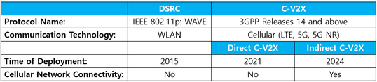

# Big data {#big}

## Wireless communication systems {#wireless_com}

### Synonyms {-}
*Floating Car Data (FCD), Dedicated Short-Range Communications (DSRC/ITS-G5 in Europe), Vehicle-to-x (car and infrastructure) (C2x/V2x), Cellular-V2X technology (C-V2X), Vehicular ad hoc network (VANET)*

### Definition {-}
From 1G to 5G, the meaning of the mobile radio standards (year of introduction, bandwith download) (Techbook, 2020):

-	1G: Mobile telephony in the first generation still worked with analogue voice transmission.
-	2G (up to 14.4 kbit/s): Digital voice transmission in the D-network (1992) with the GSM standard.
-	2.5G, GPRS (2001, up to 55 kbit/s): Digital data transmission.
-	2.75G, EDGE (2006, up to 150 kbit/s.): Further development of GSM by using a more efficient modulation method. The first iPhone used EDGE.
-	3G, UMTS (2004, up to 384 kbit/s): This mobile radio standard enables the simultaneous transmission and reception of several data streams by means of a new radio access technology.
-	3.5G, HSPA (2006, up to 42 Mbit/s): Extension of UMTS.
-	LTE (2010, up to 50 Mbit/s): Standard based on the UMTS infrastructure. 
-	4G, LTE Advanced (2014, up to 300 to 400 Mbit/s): Latency times have been reduced and radio capacities increased. 
-	5G (2020, up to 100 Gbit/s, but the fastest speed measured so far is 1.8 Gbit/s): The latest mobile radio standard with very low latency for real-time responses. But 5G is not so easy to retrofit to existing cell towers, as the waves are very compressed and are between 1 and 10 millimetres long (previous cellular waves are several centimetres long). Frequencies between 6 and 300 gigahertz (GHz) are used to relieve the current network. By comparison, today's mobile phone network operates in the spectrum between 0.8 and 2.6 GHz. However, the higher frequencies and shorter waves have the disadvantage that walls and obstacles can no longer be penetrated as easily. The radio cells must therefore be arranged more closely meshed. For fast response times of less than a millisecond, more antennas per cell than subscribers are needed. In some countries, including Germany, coverage with 5G has already begun. Critics, however, fear higher radiation exposure from 5G and thus health effects that are not yet calculable.

Two major standards for vehicular communications, in the allocated 5.9 GHz frequency band, have developed in recent years (Figure 12.1). One is the Dedicated Short-Range Communications (DSRC) protocol developed in the USA, and another one is the Intelligent Transportation System (ITS) G5 protocol developed by the European Telecommunications Standards Institute (ETSI). These standards are based on the IEEE 802.11p access layer, which was developed for vehicular networks (Mannoni et al., 2019). DSCR (IEEE 802.11p) is referred to as ITS-G5 in Europe, which has been well researched for 20 years and has reached sufficient technical maturity for current use. Despite the 2011 recommendation to use the IEEE 802.11p protocol as the standard for vehicular communications (IEEE, 2014), in recent years many researchers and industrial companies have considered the use of the LTE cellular network as an alternative solution for vehicular networking applications, especially for the transport of Floating Car Data FCD message streams (Salvo et al., 2017). But even though Cellular vehicle to everything (C-V2X) is a rather new technology, it is based on the 3rd Generation Partnership Project (3GPP) family of standards that are successfully deployed in almost all parts of the world (Sattiraju et al., 2020) (first trials in late 2017 (Fillenberg, 2017)).

```{r, echo=FALSE, out.width="60%", fig.cap="DSRC and C-V2X (Autocrypt, 2021)"}

```

The term "*cellular*" in C-V2X can cause some confusion. "*Cellular*" in this context does not refer to the use of cellular networks, but to the use of the underlying electronics in cellular radios that are adapted to communicate directly from one radio to another. According to (Gettman, 2020), the following are the main similarities and differences between DSRC and C-V2X technology:

**Similarities**

-	Both DSRC and C-V2X use the 5.9Ghz band to communicate directly from one radio to another.
-	Both technologies use the same message sets (SAE J2735 and J2945) and use cases.
-	Both technologies use digital signatures to ensure security and trust in message providers.
-	In both cases, there is no link between radios. Each radio broadcasts the vehicle's location, speed, acceleration and other status elements while listening to other radios.

**Differences**

-	DSRC uses a radio standard called WAVE, while C-V2X uses Long-Term Evolution (LTE) - the chip technology that almost all mobile phones use. A DSRC radio cannot talk to a C-V2X radio, and vice versa.
-	The range of DSRC is typically 300 m, and many installations have shown that a much higher range is possible. Initial tests of C-V2X show that the range is 20-30% greater than DSRC and that performance in obstacles can be significantly improved. While C-V2X appears to have better performance initially, the range and reliability of DSRC is more than sufficient for the most important security applications.

Also relevant for wireless communications in the transport sector is VANET, a vehicular ad hoc network. It is a subclass of mobile ad hoc networks (MANETs), whereby it is developed by moving vehicles. VANET is increasingly known in the management of rush hour traffic congestion. The biggest challenge in VANET is the cooperation between nodes. In fact, even the best steering convention would not be beneficial if the hubs do not participate in sending the information (Rath et al., 2019).

### Key stakeholders {-}
- **Affected**: Passenger vehicles drivers, Commercial vehicles drivers, Insurers
- **Responsible**: National Governments, Technology companies, Car manufacturers, Infrastructure manufacturers

### Current state of art in research {-}
Long before the creation of 5G, V2X communication was studied. Many analysts and people in the industry expect 5G to be the future technology for V2X communication due to the new speeds and other technical advances in 5G. Consequently, the security of 5G and how it can be integrated into the current ITS model needs to be studied extensively (Annu et al., 2021).<br/>

Some research investigates different materials and their properties for wireless communication (Nitika et al., 2021). There is also already some research being done on 6G antenna specifications for the next generation. The terahertz (THz) frequency band (0.1-10 THz) will be used in the 6G wireless communications system to support user demand for higher data rates and ultra-high-speed communications for many future applications (Hajiyat et al., 2021). Further, Zhao et al. (2019) are testing a DSRC-based collision warning system because the accuracy of GPS is slightly affected by the driving environment, especially when shielded. Multi-sensor fusion positioning technology is a promising method to improve the accuracy of safety distance calculation and achieve lane-accurate positioning.<br/>

Mannoni et al. (2019) compared TS-G5 and C-V2X for the V2X Communication Systems. C-V2X was showed to have better flexibility and performance than ITS-G5 at the same data rate. Based on the performance of the physical layer, the behaviour of both standards was evaluated in a network without mobile coverage and with multiple vehicles. Simulations showed that C-V2X performs better than ITS-G5 when the density of user is low. However, the performance of C-V2X deteriorates more than that of ITS-G5 when the level of congestion increases. The comparison of resource access time (latency) shows an advantage for ITS-G5, but the overall latency is not clearly better as it strongly depends on user density and coverage.<br/>

Findings of Sattiraju et al. (2020) also show that C-V2X outperforms IEEE 802.11p DSRC (ITS-G5) technology for almost all of the channel models considered, with a gain of 0-5 dB. Furthermore, the results show that C-V2X performs better at higher vehicular speeds. This better performance of C-V2X can be attributed to the use of the turbo encoder and the better channel estimation mechanism that uses a higher number of DMRS symbols.<br/>

Salvo et al. (2017) research on Heterogeneous cellular and DSRC networking for Floating Car Data collection in urban areas showed that it is reasonable to rely on direct V2V communication links (ITS-5G) before sending data over LTE channels (C-V2X). Their proposed solution fully adapts to the available penetration rate of VANET equipment; it automatically falls back to LTE-only FCD collection if VANET equipment is unavailable or too sparse. The achievable throughput of FCD collection is a key issue given the enormous amount of sensor data that can potentially be obtained from moving vehicles, e.g. up to 100 Mbit/s can be transmitted on a vehicle's CAN bus (Kang et al., 2016). This extreme real-time and high-resolution Big Data requires new ideas for distributed processing and networking to pave the way for smart applications - a trend that has been little explored (Salvo et al., 2017).

### Current state of art in practice {-}
In Europe DSRC is the main technology currently in use. For example, in 2019, VW launched its Golf 8 with DSRC-based V2X. It made Europe's most popular car the first mass-market vehicle with V2X.  In other parts of the world, after some large-scale field testing, DSRC-based V2X went into production in selected vehicle models in Japan in 2015 and in the US in 2017. While DSRC-based V2X is deployed in Europe and Japan, C-V2X is gaining momentum in other regions. China, for example, is driving the adoption of C-V2X. In early 2020, Autotalk's chipset was selected for a mass production C-V2X programme in China (Autotalks Ltd., n.d.). <br/>

DSRC and C-V2X run on different communication technologies and the access layer is not interoperable. This leaves car manufacturers and infrastructure developers with the difficult decision of whether to favour one technology or the other. However, many chip manufacturers are working on producing dual-mode chipsets that are compatible with both standards, making the switch easier for car manufacturers. As for infrastructure developers, many of them are working with existing DSRC infrastructures to add cellular network connectivity by combining them with indirect C-V2X. Regardless of the communication technologies used, cyber security is an integral part of V2X. AutoCrypt V2X is a security solution that embeds itself into V2X chipsets and protects the V2X system with both authentication and data encryption technologies (Autocrypt, 2021). <br/>

According to Erhart (2019) mobile radio (3G/4G, in future 5G) will be used in the long-distance sector. The C-ROADS initiative, in which 18 EU member states are working together on the subject of C-ITS, is endeavouring not only to harmonise and further develop C-ITS throughout Europe, but also to define the necessary interfaces and data formats for this long-distance solution in the mobile radio sector. ASFINAG is a leading member of the C-ROADS initiative in these areas and will take both types of communication into account in the implementation. <br/>

The next generation of the communication technology could be initiated by companies such as Starlink or Kuiper if they are successful in deploying LEO constellations (Techbook, 2020). Starlink is a sub-company of Spacex and is trying to build an interconnected Internet network with thousands of satellites to deliver high-speed internet around the world (Sheetz, 2021). Starlink satellites are more than 60 times closer to Earth than conventional satellites, resulting in lower latency. Starlink is ideally suited for areas of the world where connectivity is normally a challenge (Starlink, n.d.). However, densely populated urban areas pose a problem (Holland, 2021). There are currently 1100 SpaceX satellites in space to build the global Internet service. Several thousand more satellites are to be added in the coming years. As "*Golem*" reports, there are to be 12000 satellites in the full expansion stage (finanzen.net, 2021). Starlink has already received more than 500000 orders for its satellite Internet service. While competitors like OneWeb or Amazon's Project Kuiper are lagging behind, SpaceX is creating more and more facts with Starlink (Holland, 2021). However, satellite Internet is intended for aircraft, ships, large trucks and motor homes. They are not yet suitable for passenger cars, as they are simply far too large for this (Musk, 2021). <br/>

Further, researchers warn of some consequences for astronomy due to this satellite system. The disadvantages include shorter effective working time of telescopes, higher potential for collision with research infrastructure, production of debris in orbit, increased need for costly evasive manoeuvres of spaceships during space missions (Traxler & Rennert, 2020).

 
### Relevant initiatives in Austria {-}
DSRC modules are already used for truck toll billing in Austria. Around 152000 vehicles generated around 190 million euros in toll revenue in Austria via the Toll Collect OBU in 2018. The DSRC module works on a microwave basis and triggers a toll transaction when the vehicle passes through a toll collection station on Austrian motorways and motorways, which is then transmitted from the toll collection station to ASFINAG's data centre for billing. The Toll Collect On-Board Unit, which is permanently installed in the truck, is characterised by high availability and stability. In Germany, the OBU continues to collect tolls via satellite.<br/>

- [Toll-collect.de](https://www.toll-collect.de/de/toll_collect/unternehmen/presse/pressemitteilungen/detailseite_press_6241.html)

Another current application of DSRC is the remote retrieval of tachograph data by control authorities. Since 15 June 2019, it has been mandatory to equip new trucks and buses over 3.5t hzGG with a "smart tacho" that enables this (WKÖ, 2019). There are currently two C-ITS test environments: one around Vienna and one near Graz. The plan is to expand from 2020 onwards. The first area to be covered will be the Salzburg - Vienna corridor, the A2 around Graz and selected border areas.<br/>

At the European level, a community of road operators, vehicle and agricultural machinery manufacturers, cities, as well as industrial and telecom companies have come together to form an interest group called the "*C-ITS Deployment Group*". The members of this group are committed to a coordinated C-ITS deployment in Europe, that is, C-ITS services should look the same across Europe and be understood by all vehicles (Erhart, 2019).

- [Asfinag.at](https://blog.asfinag.at/technik-innovation/c-its-vernetzte-autos-intelligenter-verkehr/)

### Impacts with respect to Sustainable Development Goals (SDGs) {-}

```{r table106, echo=FALSE, results='asis'}
cat('| Impact level| Indicator|Impact direction| Goal description and number|Source|
|:------------:|:-----------:|:------------:|:------------:|:------------:|
|Systemic|Continuous evelopment of communication technologies|**+**|Innovation & Infrastructure (*9*) |Techbook, 2020; Autotalks Ltd., n.d.; Salvo et al., 2017|
|Systemic|New initiatives and interest groups are created|**+**|Partnership & collaborations (*17*)|Erhart, 2019|')
```

### Technology and societal readiness level {-}

```{r table107, echo=FALSE, results='asis'}
cat('|TRL| SRL|
|:----:|:----:|
|5-8|6-8|')
```

### Open questions {-}

1.What are the alternative solutions for joining DSRC and C-V2X so that they are compatible with one another?

### Further links {-}

- [C-its-korridor.de](https://c-its-korridor.de/?menuId=1&sp=en)
- [Asfinag.at](https://www.asfinag.at/ueber-uns/newsroom/pressemeldungen/2020/wlan-ausbau-cooperative-intelligent-transport-systems/)
- [Autocrypt.io](https://www.autocrypt.io/blog-post/dsrc-vs-c-v2x-detailed-comparison)
- [Kimley-horn.com](https://www.kimley-horn.com/news-insights/dsrc-cv2x-comparison-future-connected-vehicles/)

### References {-}

-	Annu, Kaushik, D., & Gupta, A. (2021). Ultra-secure transmissions for 5G-V2X communications. Materials Today: Proceedings. https://doi.org/10.1016/j.matpr.2020.12.130
-	Autocrypt. (2021). AUTOCRYPT - DSRC vs. C-V2X: A Detailed Comparison of the 2 Types of V2X Technologies. https://www.autocrypt.io/blog-post/dsrc-vs-c-v2x-detailed-comparison
-	Autotalks Ltd. (n.d.). C-V2X vs DSRC | Get Your Facts Straight on Cellular V2X, LTE-V and LTE-V2X Autotalks. Retrieved May 4, 2021, from https://www.auto-talks.com/technology/dsrc-vs-c-v2x-2/
-	Erhart, J. (2019, November 28). Vernetzte Autos, intelligenter Verkehr: Was C-ITS ist, was es kann und wem es nutzt. https://blog.asfinag.at/technik-innovation/c-its-vernetzte-autos-intelligenter-verkehr/
-	Fillenberg, S. (2017, December 18). Cellular V2X: Continental Successfully Conducts Field Trials in China. Continental Press Release. https://www.continental.com/en/press/press-releases/2017-12-18-cellular-v2x-116994
-	finanzen.net. (2021, May 5). Internet aus dem All: Internetsparte von SpaceX: Starlink bald in Wohnmobilen, Schiffen und Flugzeugen? | Nachricht | finanzen.net. https://www.finanzen.net/nachricht/geld-karriere-lifestyle/internet-aus-dem-all-internetsparte-von-spacex-starlink-bald-in-wohnmobilen-schiffen-und-flugzeugen-9905140
-	Gettman, D. (2020, June 3). DSRC and C-V2X: The Future of Connected Vehicles | Kimley-Horn. https://www.kimley-horn.com/news-insights/dsrc-cv2x-comparison-future-connected-vehicles/
-	Hajiyat, Z. R. M., Ismail, A., Sali, A., & Hamidon, M. N. (2021). Antenna in 6G wireless communication system: Specifications, challenges, and research directions. Optik, 231(February), 166415. https://doi.org/10.1016/j.ijleo.2021.166415
-	Holland, M. (2021, May 5). Starlink: Schon 500.000 Vorbestellungen für Satelliten-Internet von SpaceX | heise online. https://www.heise.de/news/Starlink-Schon-500-000-Vorbestellungen-fuer-Satelliten-Internet-von-SpaceX-6036732.html
-	IEEE. (2014). IEEE Guide for Wireless Access in Vehicular Environments (WAVE) - Architecture. IEEE Std 1609.0-2013, 1–78. https://doi.org/10.1109/IEEESTD.2014.6755433
-	Kang, S., Han, S., Cho, S., Jang, D., Choi, H., & Choi, J.-W. (2016). High speed CAN transmission scheme supporting data rate of over 100 Mb/s. IEEE Communications Magazine, 54(6), 128–135. https://doi.org/10.1109/MCOM.2016.7498099
-	Mannoni, V., Berg, V., Sesia, S., & Perraud, E. (2019). A comparison of the V2X communication systems: ITS-G5 and C-V2X. IEEE Vehicular Technology Conference, 2019-April. https://doi.org/10.1109/VTCSpring.2019.8746562
-	Musk, E. (2021, March 7). Elon Musk auf Twitter. https://twitter.com/elonmusk/status/1369051431903268865?ref_src=twsrc%5Etfw%7Ctwcamp%5Etweetembed%7Ctwterm%5E1369051431903268865%7Ctwgr%5E%7Ctwcon%5Es1
-	Nitika, Rana, A., Kumar, V., & Awasthi, A. M. (2021). Effect of dopant concentration and annealing temperature on electric and magnetic properties of lanthanum substituted CoFe2O4 nanoparticles for potential use in 5G wireless communication systems. Ceramics International. https://doi.org/10.1016/j.ceramint.2021.04.077
-	Rath, M., Pati, B., & Pattanayak, B. K. (2019). An Overview on Social Networking: Design, Issues, Emerging Trends, and Security. In Social Network Analytics (pp. 21–47). Elsevier. https://doi.org/10.1016/b978-0-12-815458-8.00002-5
-	Salvo, P., Turcanu, I., Cuomo, F., Baiocchi, A., & Rubin, I. (2017). Heterogeneous cellular and DSRC networking for Floating Car Data collection in urban areas. Vehicular Communications, 8, 21–34. https://doi.org/10.1016/j.vehcom.2016.11.004
-	Sattiraju, R., Wang, D., Weinand, A., & Schotten, H. D. (2020). Link level performance comparison of C-V2X and ITS-G5 for vehicular channel models. ArXiv, March.
-	Sheetz, M. (2021, May 4). SpaceX: Over 500,000 orders for Starlink satellite internet service. https://www.cnbc.com/2021/05/04/spacex-over-500000-orders-for-starlink-satellite-internet-service.html
-	Starlink. (n.d.). Starlink. Retrieved May 6, 2021, from https://www.starlink.com/
-	Techbook. (2020, November 16). LTE, 4G und 5G: Die Unterschiede zwischen den Mobilfunkstandards. https://www.techbook.de/mobile/lte-4g-unterschied-mobil-smartphone
-	Traxler, T., & Rennert, D. (2020, February 17). Starlink: Elon Musks Satellitenflotte in der Kritik - Raum - derStandard.at › Wissenschaft. https://www.derstandard.at/story/2000114681438/starlink-elon-musks-satellitenflotte-in-der-kritik
-	WKÖ. (2019). Ausrüstungspflicht von neuen lkw und omnibussen mit einem „smart tacho“ ab 15. Juni 2019. https://www.google.com/url?sa=t&rct=j&q=&esrc=s&source=web&cd=&ved=2ahUKEwiyka_Xs7XwAhXytYsKHTq_AJ0QFjADegQIBBAD&url=https%3A%2F%2Fwww.wko.at%2Fbranchen%2Ftransport-verkehr%2Fausruestungspflicht-smart-tacho.pdf&usg=AOvVaw12-xLPvw33KN9gvYKy51tn
-	Zhao, X., Jing, S., Hui, F., Liu, R., & Khattak, A. J. (2019). DSRC-based rear-end collision warning system – An error-component safety distance model and field test. Transportation Research Part C: Emerging Technologies, 107, 92–104. https://doi.org/10.1016/j.trc.2019.08.002


## Big data lifecycle {#bd_life}

## Big data tools for maping and forecasting travel behaviour {#bd_tool_maping}