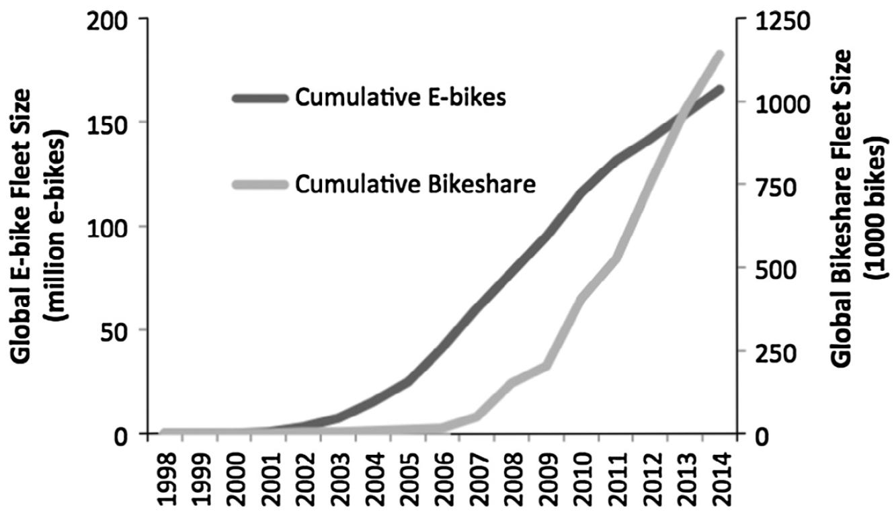

# Shared mobility {#shared}

## Car sharing {#car_sharing}

### Synonyms {-}
*Car-Sharing scheme, CSS*

### Definition {-}
In recent years, the growth of car sharing services as a new and more sustainable way of travelling has led to a shift in private mobility from ownership to use of services. The basic idea of car sharing is quite simple: the sharing of a fleet of vehicles by members to make trips on a per-trip basis. Although, the first car sharing scheme for economic reasons dates back to 1948 in the city of Zurich, Switzerland, other attempts at public car sharing schemes in the following years were not successful. Several successful car sharing schemes were launched in the 1980s, with a consolidation in the early 1990s, thanks to an increasing awareness of citizens and a real boom due to a greater diffusion of ICT and mobile services in the 2000s. Car sharing increases the mobility of community members to reach destinations otherwise inaccessible by public transport, walking or cycling, while raising citizens' awareness of the social and environmental impacts of using private cars. It encourages and supports multimodal communities by providing an additional transport option. From the point of view of building a sustainable city, the vehicles used in car sharing are usually fuel efficient and lead to positive effects in reducing urban emissions and urban congestion (Martin & Shaheen, 2011). <br/>

Nowadays, there are different variants of car sharing available on the market. These include (Bundesverband CarSharing e.V., 2020):

- Station based

In station-based CarSharing, the cars are parked in fixed parking spaces as close to home as possible. Customers pick up the car there and return it after the journey. Only with this variant, the reservations are possible several days or weeks in advance, but the end time of the booking must also usually be planned in advance. This ensures a high degree of predictability in vehicle availability. Station-based CarSharing is also the cheapest CarSharing variant. The largest providers in Germany (by fleet size) are *stadtmobil, cambio, teilAuto* and *book-n-drive*.<br/>

- Free-floating

With free-floating CarSharing, the cars are randomly distributed within a defined business area. Users locate and book them via smartphone. The booking is only possible shortly before the start of the journey and until booking, availability and exact location of the vehicle are uncertain. After the journey, the cars can be parked within the business area. All bookings are open-ended. With this variant, reservations in advance are not possible. Both the availability and the location of the vehicle are therefore difficult to predict. Free-floating, however, allows one-way journeys within the business area. Prices are higher than those of station-based CarSharing. The largest providers in Germany are *ShareNow*, *Sixt share* and *We share*.<br/>

- Combined sharing

Since 2011, combined CarSharing offers were established that offer station-based and free-floating vehicles from a single source. Combined offers in Germany are available, for example, from *stadtmobil, book-n-drive, teilAuto* and *cambio*. The prices are usually based on the lower prices of station-based CarSharing.
Free-floating users, on the other hand, largely keep their car. Their motorisation at the time of the study was 485 private cars per 1,000 users (Bundesverband CarSharing e.V., 2020).

### Key stakeholders {-}

- **Affected**: Citizens
- **Responsible**: Authorities, Municipalities, International lobbyists, Private Companies 

### Current state of art in research {-}
The CarSharing variants have different traffic-reducing effects. The EU research project STARS investigated the traffic-relieving effect of different CarSharing variants under uniform framework conditions. The study shows that many users of station-based and combined CarSharing get rid of private cars shortly before or during CarSharing participation. At the time of the study, the households, therefore, only had a motorisation rate of 108 and 104 cars per 1,000 people in the surveyed households. These values are already below the target of 150 cars per 1,000 people recommended by the Federal Environment Agency Germany for climate and environmentally friendly urban transport in the future.<br/>

The replacement rates in different CarSharing studies from Germany vary. On the one hand, this is due to different survey methods. Only in the studies since 2018 have used a largely uniform survey method in Germany. On the other hand, the latest research has shown that the replacement rate depends strongly on the CarSharing variant studied. For station-based CarSharing and combined CarSharing, there are exclusively positive replacement rates. For pure free-floating CarSharing, both positive and negative replacement rates can be observed. In some cases, fewer private cars were removed by free-floating CarSharing than were put on the road by the CarSharing service. <br/>

According to calculations made by Finanztip together with the ADAC, car sharing is already profitable if the number of kilometres driven per year is less than 10,000, or less than 800 kilometres per month. The costs for a private vehicle with 10,000 annual kilometres driven are identical to the costs that would be incurred for car sharing. Other studies see the limit only at 11,250 kilometres (Hoyer, 2013) or 15,600 kilometres (Seipp, 2014). At 5,000 kilometres per year with one's own medium-sized vehicle, one would save on average between 900 and 1,500 euros per year with a car-sharing provider.
In summary, accrding to Evers (2018) car sharing is profitable, if one: <br/>

-	does not depend on a car every day
-	does not regularly drive longer distances over 100 kilometres
-	drives a total of less than 10,000 kilometres a year

### Current state of art in practice {-}

Europe is currently the most important market for car sharing providers. In 2016, 5.8 million people used the 68,000 carsharing vehicles here. Recently, car manufacturers also started to enter the market directly, such as Daimler, BMW and the FCA Group, which are directly involved in car sharing activities, in order to find new channels to market the cars they produce. The market is growing fast and with this increasing demand comes the need for better understanding and control of the system. In fact, car sharing is not just a matter of business or fleet optimisation, but forms a complex system consisting of different actors, including citizens, authorities and municipalities, businesses. The system becomes complex because of the strong links between the actors as well as the impact on the governance of a city when a large car sharing service is introduced, such as the integration with the existing public transport network and the policies that allow different companies to compete in the same urban area (Ferrero et al., 2018).


### Relevant initiatives in Austria {-}

- [VCÖ](https://www.vcoe.at/presse/presseaussendungen/detail/carsharing-haushalte-potential-2018)
- [ÖBB](https://www.carsharing-wien.com/anbieter/oebb-rail-and-drive)

### Impacts with respect to Sustainable Development Goals (SDGs) {-}

```{r table9, echo=FALSE, results='asis'}
cat('| Impact level| Indicator|Impact direction| Goal description and number|Source|
|:------------:|:-----------:|:------------:|:------------:|:------------:|
|Individual|Uniform access to car in the population|**+**|Equality (*5,10*)|VCOE - Mobilitaet mit Zukunft, 2018|
|Individual|Cost reduced (for less than 10.000 km p.a. driven)|**+**|Sustainable economic development (*8,11*)|Evers, 2018|
|Systemic|Reduced traffic and improved air quality|**+**|Health & Wellbeing (*3*)|Martin & Shaheen, 2011|
|Systemic|Car-free households are no longer disadvantaged|         **+**|Equality (*5,10*)|VCOE - Mobiliteat mit Zukunft, 2018|
|Systemic|Reduced emissions|          **+**|Environmental sustainability (*7,12,13,15*)|Martin & Shaheen, 2011|
|Systemic|Car sharing fleet grows steadily|    **+** |Innovation & Infrastructure (*9*)|Stadt Wien, n.d.|')
```

### Technology and societal readiness level {-}

```{r table10, echo=FALSE, results='asis'}
cat('|TRL| SRL|
|:----:|:----:|
|7-9|5-7|')
```

### Open questions {-}
1. What is the role of policymakers and municipalities in supporting car sharing in addressing challenges associated with long-term strategic decisions such as operation area, parking locations or size and type of the fleet, considering specific characteristics of a given city?

### Further links {-}

- [Share-now](https://www.share-now.com/at/en/faq/)

### References {-}
-	Bundesverband CarSharing. (2020). CarSharing in Deutschland 2020.
-	Bundesverband CarSharing e.V. (2020). Verkehrsentlastung durch CarSharing - Factsheet.
-	Evers, H. (2018, March 20). Carsharing günstiger als eigenes Auto? Available at: https://www.computerbild.de/artikel/cb-Tipps-Connected-Car-Kostenvergleich-Ab-wann-lohnt-sich-Carsharing-20041131.html [Accessed: 17 January 2021]
-	Ferrero, F., Perboli, G., Rosano, M., & Vesco, A. (2018). Car-sharing services: An annotated review. Sustainable Cities and Society, 37, 501–518. https://doi.org/https://doi.org/10.1016/j.scs.2017.09.020
-	Hoyer, N. (2013, August 29). Mobilität: Lohnt sich Ihr Auto? Available at: https://www.wiwo.de/technologie/mobilitaet/mobilitaet-lohnt-sich-ihr-auto/8681062-all.html [Accessed: 17 January 2021]
-	Martin, E. W., & Shaheen, S. A. (2011). Greenhouse Gas Emission Impacts of Carsharing in North America. IEEE Transactions on Intelligent Transportation Systems, 12(4), 1074–1086. https://doi.org/10.1109/TITS.2011.2158539
-	ÖBB Rail & Drive. (n.d.). ÖBB Rail & Drive - Tarife, Vor- und Nachteile, die erste Fahrt. Available at: https://www.carsharing-wien.com/anbieter/oebb-rail-and-drive [Accessed: 17 January 2021]
-	Seipp, B. (2014, May 22). Carsharing: Für wen sich das geteilte Auto wirklich lohnt - WELT. Available at: https://www.welt.de/motor/article128304929/Fuer-wen-sich-das-geteilte-Auto-wirklich-lohnt.html [Accessed: 17 January 2021]
-	Stadt Wien | Straßenverwaltung und Straßenbau. (n.d.). Carsharing in Wien: Nutzung nimmt zu. Available at: https://www.wien.gv.at/verkehr/kfz/carsharing/evaluierung.html [Accessed: 17 January 2021]
-	VCÖ - Mobilität mit Zukunft. (2018). Mehr als 100.000 Carsharing-Haushalte in Österreich – Potenzial um ein Vielfaches höher - Mobilität mit Zukunft. Available at:  https://www.vcoe.at/presse/presseaussendungen/detail/carsharing-haushalte-potential-2018 [Accessed: 17 January 2021]


## Bicycle and e-bicycle sharing {#bike_sharing}

### Synonyms {-}
*bike-sharing schemes (BSS), station-based bike-sharing schemes (SBBSS), free-floating bike-sharing schemes (FFBSS)*

### Definition {-}
Bike-sharing schemes have become a key component of urban transport policy over the past decade, as shown by the increase in the number of bicycles recently seen in major cities around the world. The concept of bike-sharing is a service for individuals to get around comfortably by bike without owning one. The bicycle is an energy-efficient, safe, CO~2~-neutral and space-saving means of transport. It has a low environmental footprint (when used). In urban areas it is a good alternative to the car for short journeys. For longer journeys or for getting to work in an urban environment, it is an excellent complement to public transport. Although at the beginning of the 21st century most BSSs were docked, today's BSSs consist of both docked and dockless BSSs, which have recently emerged in several cities such as London, New York, San Francisco, Beijing and many others (El Arbi and Stephane, 2020).<br/><br/>
Modern urban short-term bicycle rental systems or public BSSs offer 24-hour access to bicycles, can be picked up and returned at self-service docking stations, and are distributed throughout the city (Midgley, 2011). As technology advances, global positioning systems (GPS) allow operators to track the bikes and reposition them if necessary, while user registration and credit card identification reduce anonymity and theft.<br/><br/>
The development of, mainly European, BSSs has typically been categorized into four different generations, which in some properties merge into each other. The use of the 1965 "White Bikes" in Amsterdam was possible without personal registration and the bikes could be found all over the city without fixed stations. The model collapsed within a few days due to vandalism and theft. The second generation used locks and heavy bikes. Vandalism rates decreased, but bikes were still stolen because of the anonymity of the customers (DeMaio, 2009). The third generation became smarter and more attractive through technological improvements such as automated smart cards, electronic bike locks and payment systems. Users received a code via SMS to unlock the bikes. 
The current fourth generation, could include movable solar-powered docking stations, GPS-based real-time availability apps on mobile phones and more electric bikes (Zademach and Musch, 2018).

### Key stakeholders {-}

- **Affected**: Mobile citizen, pedestrians, 
- **Responsible**: National Governments, International lobbyists, (Public) Transport Agency, Non-Profit-Organizations, Private For-Profit Companies, Private Companies (e. g. outdoor advertising companies)

### Current state of art in research {-}
Research mostly focuses on customer behaviour such as trip length or travel time and behavioural influences on the use of bike-sharing systems, for example, road density, traffic density or bicycle infrastructure.

For example, study by Ma et al. (2020) shows that suburban commuters are very likely to use SBBSS to travel to the nearest public transport hub quickly while avoiding long walks or waiting for buses. Moreover, the study by Li et al., (2019) demonstrated that introduction of bikes for hire near points of interest and tourists attractions can significantly increase their use in urban areas while discouraging in suburban locations. Further, it was showed that discount programs such as discounts for regular users, compensation incentives or discounted prices for the elderly increase the attractiveness of this form of transport among different population segments.

In terms of general system functioning, a study by Fishman et al., (2014) shows that one of the major inconvenience of bike-sharing systems are fixed, docked stations. Therefore, to improve the flexibility, attempts are made to introduce shared bikes with locks. Furthermore, the maintenance of the dock-less system is also problematic, where on one hand, the high maintenance cost reduced the profit margin of the companies while on the other hand, defective bikes can reduce the satisfaction of the customers and decrease the uptake (Zhang et al., 2019). Therefore, current research focuses on the development of the mechanisms to monitor the condition of the bicycles while maintaining cost efficiency. 

### Current state of art in practice {-}
Public bike-share systems are one of the world's fastest growing public transport modes, with an average annual growth of 37% since 2009. The fastest increase takes place in China, a country that is experiencing a rapid uptake of electric bicycles (e-bikes). Sales of e-bikes are outpacing all other motorized modes. The figure 14.1 shows the rapid growth of the two emerging technologies, e-bikes and bike-share systems (Campbell et al., 2016).
 
```{r, echo=FALSE, , out.width="60%", fig.cap="Growth in personal e-bike and public bikeshare systems (Campbell et al., 2016)"}

```

Private BSS operators from China (*Mobike, Ofo*) and Shanghai (*oBike*) are currently introducing large fleets of station-less rental bikes in cities worldwide. The roll-out, especially in European cities, has encountered problems as city governments have not been able to coordinate the introduction (Zademach and Musch, 2018). Many bikes have been found abandoned around the cities. In addition, there are fears in some cases that the private companies introduced the BSS with the sole reason of tapping into private user data (Schöffel et al., 2017).<br/><br/>
Furthermore, the company Montreal introduced "BIXI", fixed, portable, solar-powered and modular stations. They are self-contained and the stations can be placed, moved and relocated to desired locations within 20 minutes. "Mega" docking stations are available for special events (Midgley, 2011).
The number of BSSs has grown to over 800 units worldwide (Fishman, 2016). The public-private partnership model has been the most widespread, and the implementation of BSSs has been possible in cities with limited public funds (Zademach and Musch, 2018).<br/><br/>
In Austria, there are multiple companies currently offering bicycle or e-bicycle sharing services such as *Citybike, Ofo or oBike*. Nevertheless, about a year after their launch, the Asian providers of station-less rental bikes in Vienna (start-ups *Ofo* and *oBike*) have been in retreat from the federal capital (Rachbauer, 2018b). This has been a result of strict rules with respect to station-less rental bikes in Vienna announced on 1st August 2018. A failure to comply with the rules resulted in the bikes being removed for a fee. Previously, the traffic road act (*StVO*) allowed the placement of rental bikes in public spaces and the city lacked the means of action against the providers. With the help of a so-called local police ordinance, the city hall required that the bike-sharing companies pick up objectionable bikes on weekdays within four hours and at night and on weekends within twelve hours after notification. If they did not comply, the bikes were removed for a fee. In addition, administrative fines of up to 700 euros were possible. Moreover, a limit of maximum 1500 bicycles per provider was also set. Now, the bikes are given a number and each one has to be registered with the city. According to Blum, setting up several companies to circumvent the upper limit is not allowed. The rental companies themselves also have to meet certain criteria, for instance, there must be a company headquarters in Vienna and a service hotline. *Ofo* and *oBike* already meet these requirements (Rachbauer, 2018d). <br/><br/>
Across Austria the situation with rental bikes differs significantly, for example in Innsbruck, rental bikes were first introduced in 2014 and are successfully operating. Meanwhile, in Linz rental bike system has been approved in 2017 and the docking stations are currently under construction. Further, in Salzburg the S-Bike rental system is operating and linked to federal funding (Affenzeller, 2020, Citybike Salzburg, n.d. a). There is no bicycle rental system in Graz. Instead, stores and hotels offer rentals (Rachbauer, 2016).

### Relevant initiatives in Austria {-}

- [firmenradl.at](https://firmenradl.at/cms/)
- [citybikewien](https://www.citybikewien.at/de)
- [citybikesalzburg](http://www.citybikesalzburg.at/)
- [nextbike](https://www.nextbike.at/de/niederoesterreich/)
- [tpis.at](https://www.tips.at/nachrichten/linz/land-leute/523512-linzer-radverleih-startet-im-fruehjahr-an-40-standorten)

### Impacts with respect to Sustainable Development Goals (SDGs) {-}
```{r table23, echo=FALSE, results='asis'}
cat('| Impact level| Indicator|Impact direction| Goal description and number|Source|
|:------------:|:-----------:|:------------:|:------------:|:------------:|
|Individual|Increased physical activity and improved health |**+**|Health & wellbeing (*3*)|Andersen et al., 2009|
|Individual|Often first 30-60 minutes free of charge|**+**|Equality (*5,10*)|Citybike Salzburg, n.d. b; Citybike Wien, n.d.; Nextbike Niederoesterreich, n.d.|
|Individual|Continuous advancement in bike features|**+**|Innovation & Infrastructure (*9*)|Zademach & Musch, 2018 |
|Systemic|Wider access to this cheap or free mobility service|**+**|Equality (*5,10*) |El Arbi & Stephane, 2020|
|Systemic|Air pollution, noise pollution and congestion reduced|**+**|Environmental sustainability (*7,12,13,15*)|El Arbi & Stephane, 2020|
|Systemic|Investment in bike sharing infrastructure|**+**|Innovation & Infrastructure (*9*)|der Grazer, 2019; Hillebrand, 2019; Affenzeller, 2020; Tech & Nature, 2020|
|Systemic|48% of all systems are operated as public-private partnerships|**+**|Partnership & collaborations (*17*)|Midgley, 2011|')
```

### Technology and societal readiness level {-}

```{r table24, echo=FALSE, results='asis'}
cat('|TRL| SRL|
|:----:|:----:|
|7-9|5-7|')
```


### Open questions {-}
1.	What measures can be implemented to tackle the vandalism of the bikes?
2.	Which bike system (docked vs. free-floating) is more sustainable in the long-term?

### Further links {-}
- [cyclocity.com](http://en.cyclocity.com/)

### References {-}
-	Affenzeller, J. (2020, December 17). Linzer Radverleih startet im Frühjahr an 40 Standorten. https://www.tips.at/nachrichten/linz/land-leute/523512-linzer-radverleih-startet-im-fruehjahr-an-40-standorten
- Andersen, L. B., Lawlor, D. A., Cooper, A. R., Froberg, K., and Anderssen, S. A. (2009). Physical fitness in relation to transport to school in adolescents: the Danish youth and sports study. Scandinavian Journal of Medicine & Science in Sports, 19(3):406-411.
-	Campbell, A. A., Cherry, C. R., Ryerson, M. S., & Yang, X. (2016). Factors influencing the choice of shared bicycles and shared electric bikes in Beijing. Transportation Research Part C: Emerging Technologies, 67, 399–414. https://doi.org/10.1016/j.trc.2016.03.004
-	Cheng, L., Yang, J., Chen, X., Cao, M., Zhou, H., & Sun, Y. (2020). How could the station-based bike sharing system and the free-floating bike sharing system be coordinated? Journal of Transport Geography, 89(March 2019), 102896. https://doi.org/10.1016/j.jtrangeo.2020.102896
-	Cheng, X., & Gao, Y. (2018). The Optimal Monthly Strategy Pricing of Free-Floating Bike Sharing Platform. Modern Economy, 09(02), 318–338. https://doi.org/10.4236/me.2018.92021
-	Citybike Salzburg. (n.d.-a). Citybike Salzburg. Available at: http://www.citybikesalzburg.at/hanuschplatz.php [Accessed: 12 January 2021]
-	Citybike Salzburg. (n.d.-b). Citybike Salzburg - Tarife. Available at: http://www.citybikesalzburg.at/tarife.php [Accessed: 18 January 2021]
-	Citybike Wien. (n.d.). Tarife - Citybike Wien. Available at: https://www.citybikewien.at/de/tarife [Accessed: 18 January 2021]
-	Citybike Wien. (2019). 10 Millionen Fahrten bei Citybike Wien! Available at: https://www.citybikewien.at/de/news/595-neuer-meilenstein-bei-citybike-wien-erreicht [Accessed: 17 January 2021]
-	DeMaio, P. (2009). Bike-sharing: History, Impacts, Models of Provision, and Future. Journal of Public Transportation, 12(4), 41–56. https://doi.org/10.5038/2375-0901.12.4.3
-	der Grazer. (2019, October 21). 100 Millionen Euro für Fahrrad-Offensive im Großraum Graz – Der Grazer. Available at: https://grazer.at/de/uHAnk5t2/100-millionen-euro-fuer-fahrrad-offensive-im-graz/ [Accessed: 17 January 2021]
-	Eillie, A. (2016). Oxford Test Drives Peer-to-Peer Bike Sharing. https://www.bloomberg.com/news/articles/2016-09-13/cycle-land-is-a-new-peer-to-peer-bike-sharing-platform
-	El Arbi, A. A., & Stephane, C. K. T. (2020). Intelligent Management of Bike Sharing in Smart Cities using Machine Learning and Internet of Things. Sustainable Cities and Society, 135907. https://doi.org/10.1016/j.scs.2020.102702
-	Fishman, E. (2016). Bikeshare: A Review of Recent Literature. Transport Reviews, 36(1), 92–113. https://doi.org/10.1080/01441647.2015.1033036
-	Fishman, E., Washington, S., Haworth, N., & Mazzei, A. (2014). Barriers to bikesharing: An analysis from Melbourne and Brisbane. Journal of Transport Geography, 41, 325–337. https://doi.org/10.1016/j.jtrangeo.2014.08.005
-	Gu, T., Kim, I., & Currie, G. (2019). To be or not to be dockless: Empirical analysis of dockless bikeshare development in China. Transportation Research Part A: Policy and Practice, 119, 122–147. https://doi.org/10.1016/j.tra.2018.11.007
-	Hillebrand, T. (2019). Mietradsystem ‘Stadtrad Innsbruck’ - VCÖ Vorbildhafte Mobilitätsprojekte. Available at: https://mobilitaetsprojekte.vcoe.at/mietradsystem-stadtrad-innsbruck-2019 [Accessed: 17 January 2021]
-	Li, H., Zhang, Y., Ding, H., & Ren, G. (2019). Effects of dockless bike-sharing systems on the usage of the London Cycle Hire. Transportation Research Part A: Policy and Practice, 130, 398–411. https://doi.org/10.1016/j.tra.2019.09.050
-	Ma, X., Ji, Y., Yuan, Y., Van Oort, N., Jin, Y., & Hoogendoorn, S. (2020). A comparison in travel patterns and determinants of user demand between docked and dockless bike-sharing systems using multi-sourced data. Transportation Research Part A: Policy and Practice, 139(June), 148–173. https://doi.org/10.1016/j.tra.2020.06.022
-	Midgley, P. (2011). Bicycle-Sharing Schemes: Enhancing Sustainable Mobility in Urban Areas. Commission on Sustainable Development, Nine teent(8), 24. http://www.un.org/esa/dsd/resources/res_pdfs/csd-19/Background-Paper8-P.Midgley-Bicycle.pdf
-	Nextbike Niederösterreich. (n.d.). Nextbike Niederösterreich - Tarife. Available at: https://www.nextbike.at/de/niederoesterreich/preise/ [Accessed: 18 January 2021]
-	Rachbauer, S. (2016, July). Bikesharing in Österreich: Leihräder auf der Überholspur | kurier.at. https://kurier.at/chronik/oesterreich/bikesharing-in-oesterreich-leihraeder-auf-der-ueberholspur/400067369
-	Rachbauer, S. (2018a). Bikesharing in Österreich: Leihräder auf der Überholspur. https://kurier.at/chronik/oesterreich/bikesharing-in-oesterreich-leihraeder-auf-der-ueberholspur/400067369
-	Rachbauer, S. (2018b). Leihräder: Wiener wollen es aufgeräumt. https://kurier.at/chronik/wien/leihraeder-wiener-wollen-es-aufgeraeumt/400067357
-	Rachbauer, S. (2018c, March). Wien führt strenge Regeln für stationslose Leihräder ein. https://kurier.at/chronik/wien/wien-fuehrt-strenge-regeln-fuer-stationslose-leihraeder-ein/312.944.617
-	Rachbauer, S. (2018d, July 17). Leihräder: Wiener wollen es aufgeräumt. https://kurier.at/chronik/wien/leihraeder-wiener-wollen-es-aufgeraeumt/400067357
-	Schöffel, R., Zierer, M., & Kühne, S. (2017). Nutzerdaten offen im Netz: BR deckt Datenleck beim Fahrradverleiher Obike auf. https://www.br.de/nachricht/datenleck-obike-100.html
-	Sun, S., & Ertz, M. (2021). Contribution of bike-sharing to urban resource conservation: The case of free-floating bike-sharing. Journal of Cleaner Production, 280, 124416. https://doi.org/10.1016/j.jclepro.2020.124416
-	Tech & Nature. (2020, April 28). Niederösterreich modernisiert Sharing-Bike-Flotte ‘nextbike’ - Tech & Nature. https://www.techandnature.com/niederosterreich-modernisiert-sharing-bike-flotte-nextbike/
-	Zademach, H. M., & Musch, A. K. (2018). Bicycle-sharing systems in an alternative/diverse economy perspective: a sympathetic critique. Local Environment, 23(7), 734–746. https://doi.org/10.1080/13549839.2018.1434494
-	Zhang, Y., Lin, D., & Mi, Z. (2019). Electric fence planning for dockless bike-sharing services. Journal of Cleaner Production, 206, 383–393. https://doi.org/10.1016/j.jclepro.2018.09.215

## E-scooters sharing {#scooters}

### Synonyms {-}
*electric scooter*

### Definition {-}
E-kick scooters are electrically powered scooters that, after an initial push-off with a push lever, accelerate and then move at a speed similar to bicycles. They are one of micro-mobility solutions which is growing trend in urban mobility. It encompasses all human-powered micro-vehicles, such as bicycles and scooters, but also new micro-vehicles such as e-scooters, e-bikes and some other small, electrically powered vehicles (Oeschger, Carroll and Caulfield, 2020). Most of the modern vehicles of this type are available for both shared and private use and are gaining wide acceptance. 
E-scooters have promised a solution to the last mile problem since their introduction in 2017 (Siegfried et al, 2021). They are seen as alternatives to cars and provide potential for reducing traffic congestion, noise and pollution. Initial results suggest that e-scooters are mainly used for distances between 1 and 6 km. Empirical evidence shows that e-scooters can substitute walking rather than driving for these short distances (James et al., 2019; Portland Bureau of Transportation, 2019). In addition to the potential positive environmental impact of e-scooters on the transportation system, some safety concerns have been raised. Most e-scooter users who had an accident have ridden without a helmet (Liew et al, 2020). In general, e-scooters are almost exclusively issued without protective equipment (Allem and Majmundar, 2019). The safety issues do not only affect the riders themselves, but also have an impact on other road users, especially pedestrians (Sikka et al., 2019). It has even been criticised that technology follows the idea of "sell first, safety later" (Choron and Sakran, 2019).

### Key stakeholders {-}

- **Affected**: Mobile citizens, pedestrians, insurers
- **Responsible**: National governments, city government,  private Companies

### Current state of art in research {-}
Since e-scooters are already well-established technology, most research focuses on safety and accidents, user behaviour and potential environmental impact of uptake of this micro-mobility option. Some studies advocate e-scooters as an environmentally friendly solution for crowded cities, others report contradictory results and point to safety issues.
Moreover, research also explores whether the presence of e-scooters reduces bicycle thefts (Gössling, 2020). In Gothenburg, Sweden, the police reported that the number of bicycle thefts halved after the introduction of e-scooters and rental bikes (Sydsvenskan, 2019).

### Current state of art in practice {-}
E-scooter providers such as *Lime* and *Bird*, which launched operations in California in 2017, can now be found in over 100 cities worldwide and have since recorded millions of rides. E-scooter provider *VOI* has experienced similar growth in Europe and entered the market in 10 countries in just one year after launching in Sweden and has recorded over 16 million rides (Oeschger et al., 2020). The results of a survey indicate that e-scooters are primarily seen as entertainment and not as a means of transport (Siegfried et al., 2021). <br/><br/>
Maximum speed limits are an important issue and internationally there are different approaches. Los Angeles and Dallas, for example, have no speed limit, as far as can be deduced from the news; while the limit in Vienna is 25 km/h (Schwarz, 2019). Paris is discussing reducing the speed limit to 20 km/h on cycle paths and 8 km/h in parks and pedestrian areas (Négroni, 2019). One problem with the maximum speeds is that some of the e-scooter models can go much faster than 25 km/h (Le Figaro, 2018). To counteract the negative consequences of the introduction of e-scooters, cities have evaluated and implemented various rules and guidelines. Media analysis suggests that the city councils should introduce the following rules as a minimal requirement: speed limits, restrictions on the exclusive use of bicycle infrastructure and a designation of parking spaces for rental and return. Behavioural campaigns and fines, are needed to limit negative consequences of e-scooter use (Gössling, 2020). <br/><br/>
In Vienna, only very few e-scooters are used on bicycle paths (between 4.9% and 7.1% compared to other bicycle path users). Given the modal split of Vienna (7% cycling), it can be concluded that e-scooters do not yet have a significant role in Vienna's transport system (Laa and Leth, 2020).

### Relevant initiatives in Austria {-}
- [autorevue.at](https://autorevue.at/ratgeber/e-scooter-wien-vergleich)
- [stadt-wien.at](https://www.stadt-wien.at/wien/news/e-scooter-sharing-system-in-wien.html)
- [wien.gv.at](https://www.wien.gv.at/verkehr/scooter-roller/index.html)
- [oeamtc.at](https://www.oeamtc.at/thema/fahrrad/e-kleintretroller-e-scooter-in-oesterreich-31721872)
- [oesterreich.gv.at](https://www.oesterreich.gv.at/themen/freizeit_und_strassenverkehr/Elektro-Scooter,-Quads-und-Co/Seite.610110.html)

### Impacts with respect to Sustainable Development Goals (SDGs) {-}

```{r table15, echo=FALSE, results='asis'}
cat('| Impact level| Indicator|Impact direction| Goal description and number|Source|
|:------------:|:-----------:|:------------:|:------------:|:------------:|
|Individual|E-scooter trips replace mainly walking trips|**-**|Health & Wellbeing (*3*)|Laa & Leth, 2020|
|Individual|More expensive compared to public transport|**-**|Sustainable economic development (*8,11*)|Widholm, 2021; Wiener Linien, 2021|
|Individual|Increase in participants on existing cycling infrastructure|**~**|Innovation & Infrastructure (*9*)|Laa & Leth, 2020|
|Systemic|Highest user share among young males|**-**|Equality (*5,10*)|Laa & Leth, 2020|
|Systemic|E-scooter trips replace more sustainable transport modes|**-**|Environmental sustainability (*7,12,13,15*)|Laa & Leth, 2020|
|Systemic|Growth in micromobility sector |**+**|Sustainable economic development (*8,11*)|Goessling, 2020|')
```

### Technology and societal readiness level {-}

  ```{r table16, echo=FALSE, results='asis'}
cat('|TRL| SRL|
|:----:|:----:|
|7-9|7-9|')
```

### Open questions {-}

1. Will an increasing presence of e-scooters on the bicycle infrastructure or in pedestrian zones require separate solution in urban road infrastructure?

### References {-}
-	Allem, J. P., & Majmundar, A. (2019). Are electric scooters promoted on social media with safety in mind? A case study on Bird’s Instagram. In Preventive Medicine Reports (Vol. 13, pp. 62–63). Elsevier Inc. https://doi.org/10.1016/j.pmedr.2018.11.013
-	Choron, R. L., & Sakran, J. V. (2019). The Integration of Electric Scooters: Useful Technology or Public Health Problem? American Journal of Public Health, 109(4), 555–556. https://doi.org/10.2105/AJPH.2019.304955
-	Gössling, S. (2020). Integrating e-scooters in urban transportation: Problems, policies, and the prospect of system change. Transportation Research Part D: Transport and Environment, 79(January), 102230. https://doi.org/10.1016/j.trd.2020.102230
-	James, O., Swiderski, J., Hicks, J., Teoman, D., & Buehler, R. (2019). Pedestrians and E-Scooters: An Initial Look at E-Scooter Parking and Perceptions by Riders and Non-Riders. Sustainability, 11(20), 5591. https://doi.org/10.3390/su11205591
-	Laa, B., & Leth, U. (2020). Survey of E-scooter users in Vienna: Who they are and how they ride. Journal of Transport Geography, 89(October), 102874. https://doi.org/10.1016/j.jtrangeo.2020.102874
-	Le Figaro. (2018, September 9). Trottinettes: la mairie de Paris veut une réglementation nationale. https://www.lefigaro.fr/flash-eco/2018/09/09/97002-20180909FILWWW00064-trottinettes-la-mairie-de-paris-veut-une-reglementation-nationale.php
-	Liew, Y. K., Wee, C. P. J., & Pek, J. H. (2020). New peril on our roads: A retrospective study of electric scooter-related injuries. Singapore Medical Journal, 61(2), 92–95. https://doi.org/10.11622/smedj.2019083
-	Négroni, A. (2019, June 6). Paris: Hidalgo prend des mesures contre les trottinettes électriques. https://www.lefigaro.fr/actualite-france/trottinettes-paris-prend-des-mesures-20190606
-	OECD/ITF. (2020). Safe Micromobility. 98. https://www.itf-oecd.org/safe-micromobility
-	Oeschger, G., Carroll, P., & Caulfield, B. (2020). Micromobility and public transport integration: The current state of knowledge. Transportation Research Part D: Transport and Environment, 89, 102628. https://doi.org/10.1016/j.trd.2020.102628
-	Portland Bureau of Transportation. (2019). 2018 E-Scooter Findings Report. https://www.portlandoregon.gov/transportation/article/709719%0Ahttps://trid.trb.org/view/1607260
-	Schwarz, R. (2019, July 27). E-Bikes und E-Scooter sind viel zu schnell! - Ideen-Blog - derStandard.at › Diskurs. https://www.derstandard.at/story/2000106514149/e-bikes-und-e-scooter-sind-viel-zu-schnell
-	Siegfried, C., Martin, B., & Reichenberger, Y. (2021). Consumer acceptance of shared e-scooters for urban and short-distance mobility. Transportation Research Part D, 91(January), 102680. https://doi.org/10.1016/j.trd.2020.102680
-	Sikka, N., Vila, C., Stratton, M., Ghassemi, M., & Pourmand, A. (2019). Sharing the sidewalk: A case of E-scooter related pedestrian injury. American Journal of Emergency Medicine, 37(9), 1807.e5-1807.e7. https://doi.org/10.1016/j.ajem.2019.06.017
-	Sydsvenskan. (2019, August 30). Elsparkcyklarna minskar cykelstölderna - Sydsvenskan. Available at: https://www.sydsvenskan.se/2019-08-30/elsparkcyklarna-minskar-cykelstolderna [Accessed: 20 January 2021]
-	Widholm, K. (n.d.). E-Scooter Sharing-System: Roller von Lime, Tier, Bird und Co. Available at: https://www.stadt-wien.at/wien/news/e-scooter-sharing-system-in-wien.html [Accessed: 20 January 2021]
-	Wiener Linien. (n.d.). Übersicht Tickets | Tickets | Fahrgastinfo | Wiener Linien. Available at: https://www.wienerlinien.at/eportal3/ep/channelView.do/pageTypeId/66526/channelId/-46648 [Accessed: 20 January 2021]
-	Zagorskas, J., & Burinskiene, M. (2020). Challenges caused by increased use of E-powered personal mobility vehicles in European cities. Sustainability (Switzerland), 12(1), 273. https://doi.org/10.3390/su12010273

## Ride hailing and ride sharing {#ride_hailing}

### Synonyms {-}

- Ride hailing: *Ridesourcing, app-based ride services, ride-booking, on-demand ride services, Transportation Network Companies (TNCs), mobility service providers (MSPs)*
- Ride sharing: *car-pooling*

### Definition {-}
Ride sharing and ride hailing both emerged from the "shared economy" or "collaborative economy", which aims to share underutilized resources to increase efficiency, protect the environment and promote economic growth (Tirachini, 2019). <br/>

Ride hailing (RH) enables booking a journey via an online platform – usually an app. The platforms match travellers who want to book a specific ride with a personal driver who is willing to take that ride in their private car, based on their location. Ride-hailing platforms mostly eliminate the exchange of cash and apply basic economic principles to match supply and demand through dynamic price adjustments. However, this original model is not allowed in all countries. In Austria, for example, it is not allowed to offer ride hailing with one's private car, only with rental cars. Since 2021, drivers are also required to have a Viennese taxi driver's license (Uber Technologies Inc., n.d.).<br/>

Ride sharing, by contrast, describes the process in which a rider shares a vehicle with multiple other riders, who want to go in the same direction. Some Transportation Network Companies who offer ride hailing are also offering ride sharing services, like *UberPool* or *Lyft Shared* which are usually cheaper and also more environmentally friendly due to the higher occupancy rate (Herzog, 2018). Dynamic ride sharing systems use algorithms to match riders, who want to go in a similar direction and form a shared ride (Lokhandwala & Cai, 2018).  


### Key stakeholders {-}

- **Affected**: Mobile Citizen, Taxi Drivers 
- **Responsible**: National Governments, City government, Private Companies, Transportation Network Companies, Software providers 

### Current state of art in research {-}
Even though ride hailing emerged from the sharing economy, it is controversial whether it has ultimately had a positive effect on the environment (Herzog, 2018).<br/>

Jan et al. (2018) argue that ride hailing has a positive impact on economic efficiency. As it both complements and competes with public transport, its impact on congestion near city centres is still unclear. In terms of equity, ride hailing reinforces the problem of the digital gap and raises concerns about discrimination, privacy and security. It is also controversial whether prosumers (producers/consumers) are exploited by sharing economy platforms, whether ride hailing drivers are adequately compensated and how the rights of on-demand workers can be better protected. Even though ride hailing likes to present itself with a green image, the actual environmental impacts have not yet been thoroughly investigated. Further, Jin et al. (2018) pointed out the danger of conceptual confusion in ride hailing research. Based on evidences reported in the literature, they argue, that it is unlikely, that people stop owning cars due to ride hailing. <br/>

Regarding ride sharing, Alisoltani et al. (2012) argue, that it can reduce traffic congestion, but only if the trip density is high, which is usually the case in large-scale networks. In smaller cities, with a small- or medium-scale network, the trip density is not high enough. Importantly, trip density is defined as the total number of trips ends (origins and destinations) within 24 h within a given area (Miller & Soberman, 2003).<br/>

Lokhandwala & Cai (2018) compared in a case study in New York City shared autonomous vehicles (SAVs) to traditional taxis and found out that SAVs have the potential to reduce the fleet size in NYC by more than 50% and reduce daily greenhouse gas emissions by up to 866 MT of CO~2~ eq.<br/>

The study by Martin et al. (2021) provides a recent review of studies on ridesharing optimization. They compare different analytical approaches in this research area and discuss the emerging concept of "agile" algorithms that could help to cope with the demands of large-scale and dynamic optimization problems for ridesharing.<br/>

The NGO Mothers Against Drunk Driving (MADD) and Uber – one of the most known ride hailing platforms – published a report in 2015, in which they argue, based on studies in California, that the presence of uber services in a city can lower the amount of drunk driving crashes involving younger populations. Based on a study of Seattle's data, they argue that Uber's entry into the Seattle market was associated with a 10% drop in drunk driving arrests.  

### Current state of art in practice {-}
The two most known companies offering ride hailing in the US are *Uber* and *Lyft*. Uber, for instance, again offers various services, such as:
 
-	UberX - affordable rides, door to door, all to yourself
-	UberPool - shared rides, door to door or with a short walk
-	UberGreen - sustainable rides in electric vehicles - or many more. 

Due to regulations and uprisings of local cab companies, Uber had to adapt its business model for European cities. Other ride hailing platforms operating in Western and Central Europe are *Gett, Bolt, Hailo* or *Taxilo*. They all have small differences and vary based on the drivers' commission fee to the particular platform (Khatri, 2020a). <br/>

Before the Covid-19 pandemic, the ride hailing marked had been growing fast. Like other industries, the ride hailing market dropped in 2020 globally, due to the crisis and related measures, such as lockdowns, social distancing, etc. To survive, some of the bigger companies, like Uber e.g., started to foray into on-demand food delivery and parcel delivery. The industry is expected to recover depending on how quickly the general economy recovers from the crisis. Nevertheless, there will be differences in speed between countries, regions and social groups. Looking to the post-Covid era, ride hailing drivers will have to implement various safety measures, like e.g. frequent sanitation, wearing masks, guarantee tracing, to win back the trust of customers. Mushahid Khatri (2021), a Chief Executive Officer of [Yelowsoft]( https://www.yelowsoft.com/) expects "that ride-hailing companies will move towards transit authorities for providing on-demand shuttle & bus services". Secondly, he thinks that ride hailing companies should make sure they are part of MaaS (see section on [MaaS](#maas)) and use Artificial Intelligence (AI) to improve their services (Khatri, 2020b).<br/>

The world's largest long-distance ride-sharing app, which has 90 million members, is *BlaBlaCar*. Every quarter, 25 million global travellers use BlaBlaCar to organize their car trip and thus share the cost of travel (BlaBlaCar, 2021). Similar to other platforms based on the sharing economy, safety is ensured through a rating system where riders can rate other passengers and vice versa. <br/>

The Austrian platforms *GREENDRIVE* and *Carployee* both connect drivers who work for the same companies or institutions with the goal of saving company parking spaces through shared rides and protecting the environment at the same time (GREENDRIVE MOBILITY GMBH, 2020; Carployee, 2020). 


### Relevant initiatives in Austria {-}
-	[ots.at](https://www.ots.at/presseaussendung/OTS_20210113_OTS0026/free-now-will-als-erste-mobilitaetsplattform-in-europa-bis-2030-null-emissionen-erreichen)
-	[umweltberatung.a](https://www.umweltberatung.at/carsharing-mitfahrboersen) 
-	[greendrive.a](https://greendrive.at/premium/#benefits) 
-	[carployee.com](https://www.carployee.com/#start-section) 
-	[ummadum.com](https://ummadum.com/) 


### Impacts with respect to Sustainable Development Goals (SDGs) {-}

```{r table88, echo=FALSE, results='asis'}
cat('| Impact level| Indicator|Impact direction| Goal description and number|Source|
|:------------:|:-----------:|:------------:|:------------:|:------------:|
|Individual|Increased accessibility|**+**|Equality (*5,10*)|Abdelwahab, 2020; Tirachini, 2019|
|Systemic|Reduced accidents by drunk drivers |**+**|Health & Wellbeing (*3*)|Uber & MADD, 2015|
|Systemic|Decreased emissions per capita|**+**|Environmental sustainability (*7,12,13,15*)|Tirachini, 2019|
|Systemic|Increased motorized traffic and congestion; positive impact on economic efficiency |**~**|Sustainable economic development (*8,11*)|Tirachini, 2019; Jin et al., 2018 |')
```

### Technology and societal readiness level {-}

  ```{r table89, echo=FALSE, results='asis'}
cat('|TRL| SRL|
|:----:|:----:|
|7-9|6-9|')
```

### Open questions {-}

1. How to overcome the rising concerns over discrimination and data privacy and security?
2. Which impacts of ride-hailing on traffic congestion outweigh the others?
3. How can the environmental impacts of ride hailing be reliably and holistically analysed?
4. How can ride-hailing and ride-sharing discourage private car ownership?

### Further links {-}
-	[ots.at](https://www.ots.at/presseaussendung/OTS_20210113_OTS0026/free-now-will-als-erste-mobilitaetsplattform-in-europa-bis-2030-null-emissionen-erreichen)
-	[umweltberatung.at](https://www.umweltberatung.at/carsharing-mitfahrboersen) 
-	[greendrive](https://greendrive.at/premium/#benefits)
-	[carployee](https://www.carployee.com/#start-section)
-	[ummadum.com](https://ummadum.com/) 
-	[blablacar](https://www.blablacar.de/)
-	[uber](https://www.uber.com/at/de/) 


### References {-}

-	Abdelwahab, B. (2020). Ridesharing and Social Inclusion: The Role of Ridesharing in Improving Job Access for Disadvantaged Populations (Doctoral dissertation). 
-	Alisoltani, N., Leclercq, L., & Zargayouna, M. (2021). Can dynamic ride-sharing reduce traffic congestion?. Transportation research part B: methodological, 145, 212-246.
-	BlaBlaCar. (2021). Über uns - BlaBlaCar. https://blog.blablacar.de/about-us 
-	Carployee. (2020). Carployee | Für Unternehmen. https://www.carployee.com/
-	GREENDRIVE MOBILITY GMBH. (2020). Greendrive - Premiumpaket für Firmen - Fahrgemeinschaften und Mitfahrgelegenheiten. https://greendrive.at/premium/
-	Herzog, W. (2018, October 18). Ecolane Blog: Ride-hailing vs. ride-sharing: The key difference and why it matters. https://www.ecolane.com/blog/ride-hailing-vs.-ride-sharing-the-key-difference-and-why-it-matters
-	Jin, S. T., Kong, H., Wu, R., & Sui, D. Z. (2018). Ridesourcing, the sharing economy, and the future of cities. Cities, 76, 96-104.
-	Khatri, M. (2020a). A closer look at the ride-hailing landscape of the Western and Central Europe. https://www.yelowsoft.com/blog/ride-hailing-landscape-of-western-and-central-europe/
-	Khatri, M. (2020b). Ride-hailing in 2021: A glimpse into the future. Available at: https://www.yelowsoft.com/blog/ride-hailing-a-glimpse-into-the-future/ [Accessed: 30 March 2021]
-	Lokhandwala, M., & Cai, H. (2018). Dynamic ride sharing using traditional taxis and shared autonomous taxis: A case study of NYC. Transportation Research Part C: Emerging Technologies, 97, 45-60.
-	Martins, L. D. C., de la Torre, R., Corlu, C. G., Juan, A. A., & Masmoudi, M. A. (2021). Optimizing ride-sharing operations in smart sustainable cities: Challenges and the need for agile algorithms. Computers & Industrial Engineering, 153, 107080.
-	Miller, E., & Soberman, R. (2003). Travel Demand.
-	Tirachini, A. (2019). Ride-hailing, travel behaviour and sustainable mobility: an international review. Transportation, 1-37.
-	Uber Technologies Inc. (n.d.). Erhalte eine Konzession in Österreich. Available at: https://www.uber.com/at/de/drive/requirements/get-a-license/ [Accessed: 30 March 2021]
-	Uber, & Mothers Against Drunk Driving (MADD). (2015). MORE OPTIONS. SHIFTING MINDSETS. DRIVING BETTER CHOICES. #ThinkandRide.


## Passenger drones {#passenger_drones}

### Synonyms {-}
*urban air mobility (UAM), vertical take-off and landing (VTOL), unmanned aerial vehicles (UAVs)*

### Definition {-}
Drones or unmanned aerial vehicles (UAVs) could become the most iconic technology of the 21st century. Drones combine three key principles of technological modernity - computing, automatisation and limitless mobility. Capabilities that until now could only be used by the military are becoming accessible to most of the population. Potential use cases for drones range from surveillance and reconnaissance missions to novel forms of logistics and personal transport. The commercial use of drones is associated with enormous economic opportunities. However, even though drones are already common as surveillance/sensing devices in security services, geodesy or agriculture, their use as a means of transport is still at the beginning (Kellermann et al., 2020). <br/><br/>
Delivery drones are currently able to lift weights of up to 2-3 kg and carry out flight missions in an urban space (Kellermann et al., 2020). However, passenger drones have also already demonstrated the technical ability to transport passengers within or between cities (LeBeau, 2016; Holt, 2018; Hawkins, 2018). It is not only a historic turning point in aviation, but the beginning of a new era in which flat airspace could become the "third dimension" of transport (Kellermann et al., 2020).<br/><br/>
The name of the new type of vehicle is still far from being agreed internationally. There are several names to choose from, such as passenger drone, manned multicopter, Passenger Air Vehicle (PAV), Electric Vertical Take-off and Landing Aircraft (EVTOL), autonomous air taxis, unmanned aerial taxis, flying cars or even a new term (Pramer & Sommavilla, 2020). <br/><br/>
The autonomous air taxis will be a mixture of helicopter and drone. But this also means that they will be vertical take-off and landing (VTOL) vehicles.
There are several reasons why drone-related industries are being supported significantly. One of the reasons is that the airspace is still fairly free of traffic. The risk of collisions is (relatively) low and autopilots for aircraft have long been established. Industry experts therefore suspect that we could see self-flying air taxis even before self-driving cars. Being able to do without pilots would make an air taxi service even cheaper and make it possible for more people to afford it (UNIQA, 2019).<br/><br/>
The European Commission estimates the economic impact at €10 billion annually until 2035 and foresees the creation of more than 100,000 direct jobs. Taking into account indirect macroeconomic effects in drone-related industries, the Commission even projects 250,000 to 400,000 additional jobs (SESAR, 2016).

### Key stakeholders {-}

- **Affected**: Citizen, Insurers
- **Responsible**: National Governments, City government, Private Companies

### Current state of art in research {-}
Since all prototypes are owned by private companies and the technology is not really shared due to competition, there are few technical research papers.
The media analysis about drones for parcel and passenger transportation shows that currently the research is focused in the following areas (see table below):  

```{r table17, echo=FALSE, results='asis'}
cat('| Topics| Percentage|Number of studies|
|:------------:|:-----------:|:------------:|
|General Surveys    |   18.9%  |  21   |
|Logistics (general)  |  18.0%   |  20   |
|Attitude and Acceptance Research    | 13.5%    |  15   |
|Law and Regulations    | 11.7%    |   13  |
|Ethics and Technology Assessment    | 10.8%    |  12   |
|Sustainability Assessment    | 8.1%    |  9   |
|Urban and Transportation Planning    |  7.2%   |  8   |
|Political agenda/strategies    |  6.3%   |   7  |
|Passenger Transportation   |  2.7%   |  3   |
|Humanitarian Logistics    |2.7%     |   3  |') 
```

And although there are currently no autonomous air taxis, there is an initial research examining the factors of consumer willingness to fly in autonomous air taxis. This study identified four factors that turned out to be significantly positive: Familiarity, Value, Fun Factor, Sense of Happiness and two as significantly negative: Aversion to New Technology and Fear (Winter et al., 2020). <br/><br/>
When comparing the GHG emissions of conventional cars with VTOL passenger drones, the passenger drone actually performs a little better than the ordinary car from 35 km onwards. The reasons for this break-even point are, on the one hand, the energy-intensive take-off and landing hover mode and, on the other hand, the enormous efficiency of flying from point A to point B. Given the expected significant time savings over driving, passengers may have an incentive to share VTOL trips. Therefore, it seems likely that the average occupancy of VTOLs will be greater than that of conventional passenger cars (Kasliwal et al., 2019).

### Current state of art in practice {-}
There are quite a few providers working to develop the unmanned aerial taxis. Munich-based start-up *Lilium* successfully launched a one-and-a-half-ton prototype vertically into the air and hovered in place in early May 2019. It sounds like a helicopter, but it doesn't look like one: The Lilium Jet has wings and 36 all-electric jet motors. That makes it quieter and more energy efficient (and makes it look more futuristic) than a helicopter. Lilium expects to be able to start commercial everyday operation not before 2025.<br/><br/>
But *Lilium* is far from the only manufacturer. *Joby Aviation, Volocopter, AeroMobil, Kittyhawk* and *Zee.Aero* are just a few of the companies hoping to place the most successful model on the market. Already established companies are also taking the concept very seriously. Mobility company *Uber*, aircraft manufacturers *Airbus* and *Boeing*, and car companies such as *Daimler* and *Porsche* are in the race (UNIQA, 2019).
Some manufacturers such as Boeing (LeBeau, 2016), Airbus (Hawkins, 2018) and Volocopter (Holt, 2018) have already conducted the first flight tests of their prototypes.<br/><br/>
The European Union proposes that support services such as flight planning, flight permits and clearances, and dynamic airspace information will be available for drone flight from 2022. From 2027, services such as collision avoidance and capacity management in congested areas will follow. From 2035, according to the European Commission's timetable, the full integration of unmanned aerial vehicles into controlled airspace with manned aviation should be completed (Wiener Zeitung, 2019).<br/><br/>
The air cab will not be shuttling crowds of tourists for the next decade, but thanks to the decreasing noise level of the rotors, which are no longer perceptible in "normal city noise" as Volocopter claims, they will be used more and more often in one metropolis or another with millions of inhabitants (Pramer & Sommavilla, 2020).

The first approved test track in Austria for an unmanned aerial taxi is located in Linz. There is already a functioning prototype in Austria that was developed by *Ehang* in China and built by *FACC* in Innviertel. The aircraft costs around 300,000 euros, weighs 360 kilos, is equipped with 16 electric motors and 16 rotors and is designed to autonomously transport two people. The batteries of the eight-armed drone are sufficient for about 50 kilometres. In its own production line in Ried, 300 units are to be delivered by the end of next year. In order for them to be able to take off in Europe and also for Linz AG, they are working with Austro Control on the "approval regulations", explains FACC board member Robert Machtlinger. 
In Linz it was once again said that this type of passenger transport is seen as a supplement to bus and train. The air enables the fastest connection from A to B in urban areas. However, before the first test route is set up in the Upper Austrian capital for this autonomous transport, 5G mobile radio must first be installed, which was planned for spring 2020 (DerStandard, 2019).

### Relevant initiatives in Austria {-}

- [derbrutkasten.com](https://www.derbrutkasten.com/autonome-lufttaxis-linz-ag-facc-ehang/) 
- [derstandard.at-1](https://www.derstandard.at/story/2000103120464/erste-teststrecke-fuer-e-lufttaxis-2020-in-linz) 
- [derstandard.at-2](https://www.derstandard.at/story/2000122402408/flugtaxis-wann-kommt-der-tesla-der-luefte) 

### Impacts with respect to Sustainable Development Goals (SDGs) {-}

```{r table18, echo=FALSE, results='asis'}
cat('| Impact level| Indicator|Impact direction| Goal description and number|Source|
|:------------:|:-----------:|:------------:|:------------:|:------------:|
|Individual|Significant time savings|**+**|Health & Wellbeing  (*3*)|Kasliwal et al., 2019|
|Individual|It is expected to be too costly for general use|**-**|Equality (*5,10*)|Pramer & Sommavilla, 2020|
|Individual|The flight price is expected to settle in the range of a very expensive taxi|          **-**|Sustainable economic development (*8,11*)|Pramer & Sommavilla, 2020|
|Systemic|Slightly reduced GHG emissions compared to conventional cars from 35 km onwards|**~**|Environmental sustainability (*7,12,13,15*)|Kasliwal et al., 2019|
|Systemic|Increased investment until 2035 and creation of job opportunities|          **+**|Sustainable economic development (*8,11*)|SESAR, 2016|
|Systemic|Stationary areas for safety checks|          **~**|Innovation & Infrastructure (*9*)|Pramer & Sommavilla, 2020|')
```

### Technology and societal readiness level {-}

```{r table19, echo=FALSE, results='asis'}
cat('|TRL| SRL|
|:----:|:----:|
|5-6|1-3|')
```

### Open questions {-}

1. Who will develop the regulations for passenger drones?
2. How much space is needed for take-off and landing, and will this differ between the various providers?
3. What types of routes will be replaced with flying taxis?
4. Will some companies work together and share their technologies?
5. What other areas of application will there be?
6. What will be the thematic priorities for development in the coming years?
7. What name will be agreed internationally for this type of vehicles?


### References {-}
-	DerStandard. (2019, May 14). Teststrecke: Erstes unbemanntes Lufttaxi hebt 2020 in Linz ab - Unternehmen - derStandard.at › Wirtschaft. https://www.derstandard.at/story/2000103120464/erste-teststrecke-fuer-e-lufttaxis-2020-in-linz
-	Holt, K. (2018, October 24). Volocopter will test its autonomous air taxis in Singapore next year | Engadget. https://www.engadget.com/2018-10-24-volocopter-air-taxi-test-singapore-autonomous-drone-helicopter.html
-	J. Hawkins, A. (2018, February 1). Airbus’ autonomous ‘air taxi’ Vahana completes its first test flight - The Verge. https://www.theverge.com/2018/2/1/16961688/airbus-vahana-evtol-first-test-flight
-	Kasliwal, A., Furbush, N. J., Gawron, J. H., McBride, J. R., Wallington, T. J., De Kleine, R. D., Kim, H. C., & Keoleian, G. A. (2019). Role of flying cars in sustainable mobility. Nature Communications, 10(1). https://doi.org/10.1038/s41467-019-09426-0
-	Kellermann, R., Biehle, T., & Fischer, L. (2020). Drones for parcel and passenger transportation: A literature review. Transportation Research Interdisciplinary Perspectives, 4, 100088. https://doi.org/10.1016/j.trip.2019.100088
-	LeBeau, P. (2016, January 23). Boeing’s first test flight of air taxi a success as it works on Uber Air. https://www.cnbc.com/2019/01/23/boeing-takes-step-in-developing-uber-air--with-successful-test-flight.html
-	Pramer, P., & Sommavilla, F. (2020, December 11). Flugtaxis: Wann kommt der Tesla der Lüfte? - PodcastEditionZukunft - derStandard.at › EditionZukunft. https://www.derstandard.at/story/2000122402408/flugtaxis-wann-kommt-der-tesla-der-luefte
-	SESAR. (2016). European Drones Outlook Study. In Single European Sky ATM Research (Issue November). https://doi.org/10.2829/219851
-	UNIQA. (2019, October 24). Lufttaxis: Die Überflieger im Verkehr | UNIQA Österreich | UNIQA Österreich. https://www.uniqa.at/versicherung/mobilitaet/lufttaxis.html
-	Wiener Zeitung. (2019, September 20). Regelwerk für autonome Lufttaxis noch offen - Wiener Zeitung Online. https://www.wienerzeitung.at/nachrichten/wirtschaft/oesterreich/2030182-Fliegen-statt-fahren.html
-	Winter, S. R., Rice, S., & Lamb, T. L. (2020). A prediction model of Consumer’s willingness to fly in autonomous air taxis. Journal of Air Transport Management, 89(August), 101926. https://doi.org/10.1016/j.jairtraman.2020.101926
