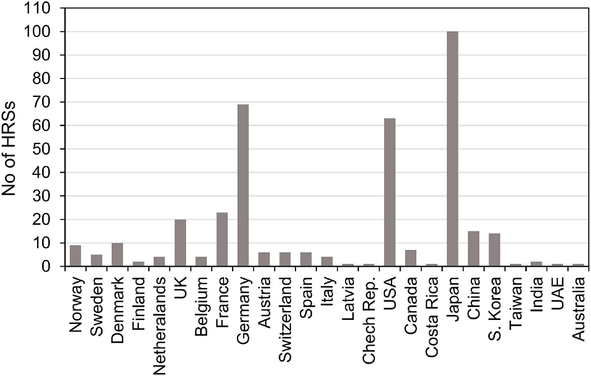

# Alternative power sources {#alternative}

## Hydrogen fuel cell

### Definition {-}

Hydrogen Fuel Cells are systems that use hydrogen as fuel to generate electrical energy in a Fuel Cell and drive the vehicle with electrical structure. In a technical manner, they show similarities with electric vehicles. The advantages of Fuel Cell Electrical Vehicles (FCEV) are emission-free (water only), fast refuelling, noiseless driving, more economical fuel consumption and efficiency, easy maintenance. Regardless of these benefits, FCEV has some disadvantages, such as limited range, lack of hydrogen refuelling stations, safety problems, low profitability for car manufacturers, high prices and lower awareness and acceptance (Tanç et al., 2019; Borgstedt et al., 2017; Iribarren et al., 2016). Moreover, FCEVs have higher energy density than electric batteries which enables them to drive further with heavier loads. At the same time, it raises constraints on weight and size of the energy storage in the vehicles. Consequently, FCEVs are more suitable for freight transport, commercial vehicles, buses, trains, ships and aircrafts, where the performance requirements are higher. Prototypes of all the examples mentioned already exist (Eichlseder et al, 2018). In terms of private cars, the FCEVs are likely to provide advantage for long-distance travelling (Roadmap Europe, 2019).

### Key stakeholders {-}

- **Affected**: Conventional Cars’ Drivers, Citizen
- **Responsible**: National Governments, Car Manufacturers, International lobbyists, Private Companies

### Current state of art in research {-}
The goal of alternative propulsion systems is to minimize or eliminate completely the climate-damaging CO~2~ emissions, consequently the European Community Research Program proposes electromobility as a priority research area. In particular, the most substantial research is carried out on methods of hydrogen production using biological and photochemical processes because 95% of hydrogen currently produced on an industrial scale comes from fossil hydrocarbons and only 5% from water by electrolysis. Where the only emission-free production process of hydrogen is the electrochemical water splitting in electrolysis, when the required electricity is generated from wind-, water or solar energy. This process results in high degrees of purity and usually achieves efficiencies of up to 85% (Eichlseder et al., 2018). Moreover, the electric vehicle policy aims at technology optimization, market development, durability and capacity of the batteries and charging stations (Alvarez-Meaza et al., 2020). 

### Current state of art in practice {-}
Hydrogen in transport is only at the beginning of its development (in 2013 the first light FCEVs were introduced for leasing only). Compared to other alternative propulsion systems such as battery electric vehicles (BEVs), which were introduced to the vehicle market earlier, FCEVs show a similar upward trend. At the end of 2017, the total number of FCEVs in Europe reached 799 vehicles, of which 602 were passenger cars and 197 light commercial vehicles, while the total number of BEVs reached 447,150 vehicles. At the end of 2018, the number of FCEVs in Europe rose to about 1,110 (Apostolou and Xydis, 2019).
At the end of October 2019, 41 fuel cell passenger cars were registered in Austria. Worldwide, about 12,900 fuel cell vehicles were in operation at the end of 2018, 11,200 of them passenger cars. 46 percent of the vehicles are on the road in the USA, 43 percent in Asia and 11 percent in the EU (1,110 cars). In terms of commercial vehicles, China dominates with over 400 buses, followed by the USA with 55 and the EU with around 80 (Eichlseder et al., 2018).
In terms of the number of hydrogen refuelling stations (HRS) worldwide, just about 375 stations are in operation today, compared to 320 in 2017. Most of these are publicly available, the rest are demonstration/research projects and are used to supply hydrogen to private fleets. At the end of 2018, Europe was the region with the most HRS in operation with more than 170 HRS, while Asia (mainly Japan) was second with about 130 HRS and America (mainly the US) third with more than 70 stations installed. Figure below shows the number of HRS by country at the end of 2018 (Apostolou and Xydis, 2019):

```{r ,echo=FALSE, out.width="200%", fig.cap="Number of hydrogen refuelling stations worldwide (Apostolou and Xydis, 2019)"}

```
The European Strategic Energy Technology Plan proposes hydrogen and fuel-cell technologies as crucial for obtaining green-house gases reduction goals by 2050 (Roadmap Europe H. 2019, Alvarez-Meaza et al., 2020). 

### Relevant initiatives in Austria {-}

- [hydrogen train](https://fuelcellsworks.com/news/alstoms-hydrogen-train-successfully-completes-three-months-of-testing-in-austria/#:~:text=Alstom's%20Hydrogen%20Train%20Successfully%20Completes%20Three%20Months%20of%20Testing%20in%20Austria,-By%20FuelCellsWorksDecember&text=Alstom's%20Coradia%20iLint%2C%20the%20world's,Austrian%20Federal%20Railways)%20regional%20lines) 

### Impacts with respect to Sustainable Development Goals (SDGs) {-}

```{r table7, echo=FALSE, results='asis'}
cat('| Impact level| Indicator|Impact direction| Goal description and number|Source|
|:------------:|:-----------:|:------------:|:------------:|:------------:|
|Individual|Improved air quality|**+**|Health & Wellbeing (*3*)|Colella, Jacobson and Golden, 2005|
|Individual|High prices of hydrogen cars and hydrogen fuel|**-**|Equality (*5,10*)|Kanna and Paturu, 2020|
|Individual|Cost for individuals|**~**|Sustainable economic development (*8,11*)|Apostolou and Xydis, 2019|
|Systemic|Emissions reduced, improved air quality|**+**|Health & Wellbeing (*3*)|Colella, Jacobson and Golden, 2005|
|Systemic|Distribution and allocation of goods worsens|**-**|Equality (*5,10*)|Kanna and Paturu, 2020|
|Systemic|Reduced emissions, replacement of fossil fuels, energy transition|**+**|Environmental sustainability (*7,12-13,15*)|Colella, Jacobson and Golden, 2005|
|Systemic|Not yet profitable for manufacturers|**+**|Sustainable economic development (*8,11*)|Roadmap Europe, 2019|
|Systemic|Number of hydrogen refuelling stations increases|**+**|Innovation & Infrastructure (*9*)|Apostolou and Xydis, 2019|
|Systemic|Sharing technologies internationally|**+**|Partnership & collaborations (*17*)|International Partnership for Hydrogen and Fuel Cells in the Economy, no date|')
```

### Technology and societal readiness level {-}

```{r table8, echo=FALSE, results='asis'}
cat('|TRL| SRL|
|:----:|:----:|
|7-8|6-8|')
```

### Open questions {-}

1.	Who will drive the progress of hydrogen technology in heavy duty mobility in the future? 
2.	How to store large amounts of energy at low weight and in a restricted space within the vehicle? (Roadmap Europe, 2019)

### Further links {-}

-	[europarlament](https://www.europarl.europa.eu/news/nl/press-room/20180911IPR13114/more-electric-cars-on-eu-roads-by-2030) 
-	[ec.europa](https://ec.europa.eu/transport/themes/urban/vehicles/road/hydrogen_en) 
-	[fch.europa](https://www.fch.europa.eu/news/hydrogen-roadmap-europe-sustainable-pathway-european-energy-transition) 

### References {-}

- Alvarez-Meaza, I., Zarrabeitia-Bilbao, E., Rio-Belver, R. M., & Garechana-Anacabe, G. (2020). Fuel-Cell Electric Vehicles: Plotting a Scientific and Technological Knowledge Map. Sustainability, 12(6), 2334.
- Apostolou, D. and Xydis, G. (2019) ‘A literature review on hydrogen refuelling stations and infrastructure. Current status and future prospects’, Renewable and Sustainable Energy Reviews. Elsevier Ltd, 113(May), p. 109292. doi: 10.1016/j.rser.2019.109292.
- Borgstedt, P., Neyer, B., & Schewe, G. (2017). Paving the road to electric vehicles–A patent analysis of the automotive supply industry. Journal of cleaner production, 167, 75-87.
- Colella, W. G., Jacobson, M. Z. and Golden, D. M. (2005) ‘Switching to a U.S. hydrogen fuel cell vehicle fleet: The resultant change in emissions, energy use, and greenhouse gases’, Journal of Power Sources, 150, pp. 150–181. doi: https://doi.org/10.1016/j.jpowsour.2005.05.092.
- Doppelbauer, M. (2020) Grundlagen der Elektromobilität, Grundlagen der Elektromobilität. doi: 10.1007/978-3-658-29730-5.
- Eichlseder, H., Klell, M. and Trattner, A. (2018) Wasserstoff in der Fahrzeugtechnik, Wasserstoff in der Fahrzeugtechnik. doi: 10.1007/978-3-8348-9674-2.
International Partnership for Hydrogen and Fuel Cells in the Economy (no date) No Title. Available at: https://www.iphe.net/.
- Iribarren, D., Martín-Gamboa, M., Manzano, J., & Dufour, J. (2016). Assessing the social acceptance of hydrogen for transportation in Spain: an unintentional focus on target population for a potential hydrogen economy. International journal of hydrogen energy, 41(10), 5203-5208.
- Kanna, I. V. and Paturu, P. (2020) ‘A study of hydrogen as an alternative fuel’, International Journal of Ambient Energy. Taylor & Francis, 41(12), pp. 1433–1436. doi: 10.1080/01430750.2018.1484803.
- Lehmann, J. and Luschtinetz, T. (2014) Wasserstoff und Brennstoffzellen.
- Pötscher, F. et al. (2014) Ökobilanz alternativer Antriebe – Elektrofahrzeuge im Vergleich.
- Roadmap Europe (2019). A sustainable pathway for the European energy transition. Luxembourg: Publications Office of the European Union.
- Schabbach, T. and Wesselak, V. (2020) Energie - Den Erneuerbaren gehört die Zukunft.
- Tanç, B. et al. (2019) ‘Overview of the next quarter century vision of hydrogen fuel cell electric vehicles’, in International Journal of Hydrogen Energy, Volume 44, Issue 20, pp. 10120–10128.
- Töpler, J. and Lehmann, J. (2017) Wasserstoff und Brennstoffzelle - Technologien und Marktkonzepte, Springer Vieweg.


## Battery electric

## Plugin hybrid vehicles

