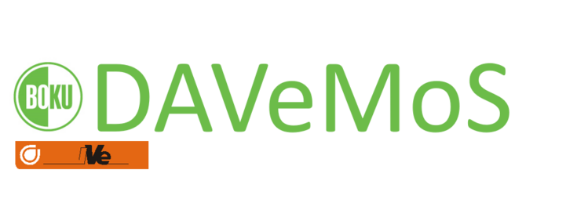
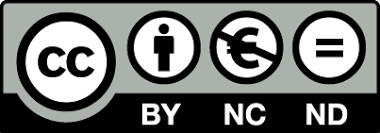

# Welcome {-}

```{r, echo=FALSE, out.width="25%"}

```

Knowledge pool is a continuously developing database, which is a part of the [DAVeMoS](https://www.davemos.online/){target="_blank"} project. It aims at gathering concepts and evidence of the systemic impact of transport digitalisation and automation. It is a collaborative effort of DAVeMoS team members who contributed with their expertise, ideas and improvement suggestions regarding the content and design:

- Dr. Martyna Fidler
- B.Sc. Gregor Husner
- B.Sc. Veronika Hebenstreit
- B.Sc. Eva-Maria Unger
- Univ. Prof. Dr. Yusak Susilo


The authors welcome any feedback, questions and contributions that the readers may have. For further inputs please contact the corresponding author Martyna Fidler on the following email address: davemos.library@boku.ac.at. <br/>

**Legal disclaimers**

```{r, echo=FALSE, , out.width="10%"}

```

This work is licensed under a Creative Commons Attribution-NonCommercial-NoDerivatives 4.0 International License. <br/>


The authors assume no responsibility or liability for any errors or omissions in the content of this work. The information contained in the knowledge pool is for general information purposes only.<br/>

The knowledge pool was last compiled on:

```{r, echo=FALSE}
format(Sys.time(),'%d %B %Y')
```

**Table of content**

1. [Introduction to the knowledge pool](#intro)
2. [Physical road infrastructure](#infrastructure)
    - [Dedicated lanes for connected and automated vehicles (CAV)](#dedicated_lanes)  
    - [Operational design domains](#ODD)  
    - [Rail crossing information system](#rail_crossing_info_system)  
    - [Electric road system](#ers)  
    - [High occupancy vehicle and toll lanes](#high_occupancy)  
    - [Public transport priority systems](#public_trans_priority)  
    - [Transformation of public space and digital solutions](#transformation_public_space)  
3. [Highway infrastructure management](#highway)
    - [Unmanned aerial vehicles for infrastructure maintenance](#uav)  
    - [Electric charging stations](#charging_station)  
4. [Traffic management](#traffic)
    - [Congestion charging](#congestion_charging)  
    - [Platooning](#platooning)  
    - [Real-time traffic information and monitoring](#traffic_info_monitoring)  
    - [Cooperative - intelligent transport system](#cits)  
    - [Dynamic route guidance](#dynamic_route)  
    - [Variable speed limits and dynamic signage system](#variable_speed)  
    - [Smart traffic signal control](#adaptive_traffic_control)  
    - [Passengers and goods fleet management](#p_g_fleet_management)  
    - [Urban access management](#urban_access)  
5. [Digital road infrastructure and connectivity](#digital)
    - [Vehicle to everything communication](#v2x)  
    - [Infrastructure support levels for automated driving](#infrast_support_level)  
6. [Passenger information system](#passenger)
    - [Digital journey planner](#djp)  
    - [Multimodal information and route planning](#info_and_route_planning)  
7. [Multimodal integrated system](#multimodal)
    - [First-last mile solutions](#flms)  
    - [Transit fares](#dist_time_fares)  
    - [Mobility as a service (MaaS)](#maas)  
    - [Park and ride](#p_r)  
    - [Contactless public transport cards](#contactless_cards)  
    - [Information and assistance for people with special needs](#special_needs)  
    - [Mobility hubs](#mobility_hubs)  
    - [Rail telematics for passengers and freight](#rail_telematics)  
8. [Automated driving](#connected)
    - [Automated passenger cars](#av) 
    - [Parking infrastructure for automated vehicles](#parking_av)
    - [Automated road freight](#automated_road_freight)
    - [Automatic train operations](#automatic_train)  
9. [On-board technology for connected and automated vehicles](#onboard)
    - [Advanced driver assistance system (ADAS)](#adas)  
    - [Parking assistance system](#parking_assistance)  
    - [Lane keeping assist system ](#lane_keeping)  
    - [Digital maps](#digital_maps)  
    - [Electronic horizon](#ehorizon)  
    - [Emergency call](#ecall)  
10. [Freight and commercial transport](#freight)
    - [Tracking and tracing of goods](#dangerous_goods)  
    - [Intermodal Freight](#intermodal_freight)  
    - [Urban deliveries](#urban_delivery)  
    - [Intelligent truck parking](#intelligent_truck_park)  
    - [Smart delivery space booking](#space_book)  
    - [Delivery drones](#delivery_drone)  
    - [Electric vehicle delivery fleets](#electric_delivery_fleets)  
    - [Multimodal transport management systems](#mtms)  
    - [Freight hubs](#freight_hubs)  
11. [Collective mobility vehicles](#collective)
    - [Demand responsive transit](#drt)  
    - [Personal rapid transit](#prt)  
    - [Bus rapid transit](#brt)  
    - [Light rail transit](#lrt)  
12. [Big data](#big)
    - [Wireless communication systems in transport](#wireless_com)  
    - [Big data lifecycle](#bd_life)
    - [Big data tools for mapping and forecasting travel behaviour](#bd_tool_maping)  
13. [Shared mobility](#shared)
    - [Car sharing](#car_sharing)  
    - [Bicycle and e-bicycle sharing](#bike_sharing)  
    - [E-scooters sharing](#scooters)  
    - [Ride hailing and ride sharing](#ride_hailing)  
    - [Passenger drones](#passenger_drones)
14. [Alternative power sources](#alternative)
    - [Hydrogen fuel cell](#FCEV)  
    - [Battery electric](#bev)  
    - [Plugin hybrid vehicles](#plugin_hybrid)  
15. [References](#reference)

# Table of content {-}

1. [Introduction to the knowledge pool](#intro)
2. [Physical road infrastructure](#infrastructure)
    - [Dedicated lanes for connected and automated vehicles (CAV)](#dedicated_lanes)  
    - [Operational design domains](#ODD)  
    - [Rail crossing information system](#rail_crossing_info_system)  
    - [Electric road system](#ers)  
    - [High occupancy vehicle and toll lanes](#high_occupancy)  
    - [Public transport priority systems](#public_trans_priority)  
    - [Transformation of public space and digital solutions](#transformation_public_space)  
3. [Highway infrastructure management](#highway)
    - [Unmanned aerial vehicles for infrastructure maintenance](#uav)  
    - [Electric charging stations](#charging_station)  
4. [Traffic management](#traffic)
    - [Congestion charging](#congestion_charging)  
    - [Platooning](#platooning)  
    - [Real-time traffic information and monitoring](#traffic_info_monitoring)  
    - [Cooperative - intelligent transport system](#cits)  
    - [Dynamic route guidance](#dynamic_route)  
    - [Variable speed limits and dynamic signage system](#variable_speed)  
    - [Smart traffic signal control](#adaptive_traffic_control)  
    - [Passengers and goods fleet management](#p_g_fleet_management)  
    - [Urban access management](#urban_access)  
5. [Digital road infrastructure and connectivity](#digital)
    - [Vehicle to everything communication](#v2x)  
    - [Infrastructure support levels for automated driving](#infrast_support_level)  
6. [Passenger information system](#passenger)
    - [Digital journey planner](#djp)  
    - [Multimodal information and route planning](#info_and_route_planning)  
7. [Multimodal integrated system](#multimodal)
    - [First-last mile solutions](#flms)  
    - [Transit fares](#dist_time_fares)
    - [Mobility as a service (MaaS)](#maas)  
    - [Park and ride](#p_r)  
    - [Contactless public transport cards](#contactless_cards)  
    - [Information and assistance for people with special needs](#special_needs)  
    - [Mobility hubs](#mobility_hubs)  
    - [Rail telematics for passengers and freight](#rail_telematics)  
8. [Automated driving](#connected)
    - [Automated passenger cars](#av)
    - [Parking infrastructure for automated vehicles](#parking_av)
    - [Automated road freight](#automated_road_freight)  
    - [Automatic train operations](#automatic_train)  
9. [On-board technology for connected and automated vehicles](#onboard)
    - [Advanced driver assistance system (ADAS)](#adas)  
    - [Parking assistance system](#parking_assistance)  
    - [Lane keeping assist system](#lane_keeping)  
    - [Digital maps](#digital_maps)  
    - [Electronic horizon](#ehorizon)  
    - [Emergency call](#ecall)  
10. [Freight and commercial transport](#freight)
    - [Tracking and tracing of goods](#dangerous_goods)  
    - [Intermodal Freight](#intermodal_freight)  
    - [Urban deliveries](#urban_delivery)  
    - [Intelligent truck parking](#intelligent_truck_park)  
    - [Smart delivery space booking](#space_book)  
    - [Delivery drones](#delivery_drone)  
    - [Electric vehicle delivery fleets](#electric_delivery_fleets)  
    - [Multimodal transport management systems](#mtms)  
    - [Freight hubs](#freight_hubs)  
11. [Collective mobility vehicles](#collective)
    - [Demand responsive transit](#drt)  
    - [Personal rapid transit](#prt)  
    - [Bus rapid transit](#brt)  
    - [Light rail transit](#lrt)  
12. [Big data](#big)
    - [Wireless communication systems in transport](#wireless_com)  
    - [Big data lifecycle](#bd_life)
    - [Big data tools for mapping and forecasting travel behaviour](#bd_tool_maping)  
13. [Shared mobility](#shared)
    - [Car sharing](#car_sharing)  
    - [Bicycle and e-bicycle sharing](#bike_sharing)  
    - [E-scooters sharing](#scooters)  
    - [Ride hailing and ride sharing](#ride_hailing)
    - [Passenger drones](#passenger_drones)  
14. [Alternative power sources](#alternative)
    - [Hydrogen fuel cell](#FCEV)  
    - [Battery electric](#bev)  
    - [Plugin hybrid vehicles](#plugin_hybrid) 
15. [References](#reference)


